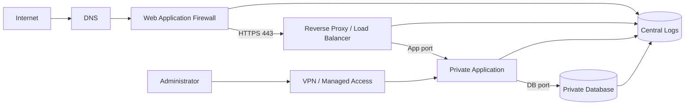
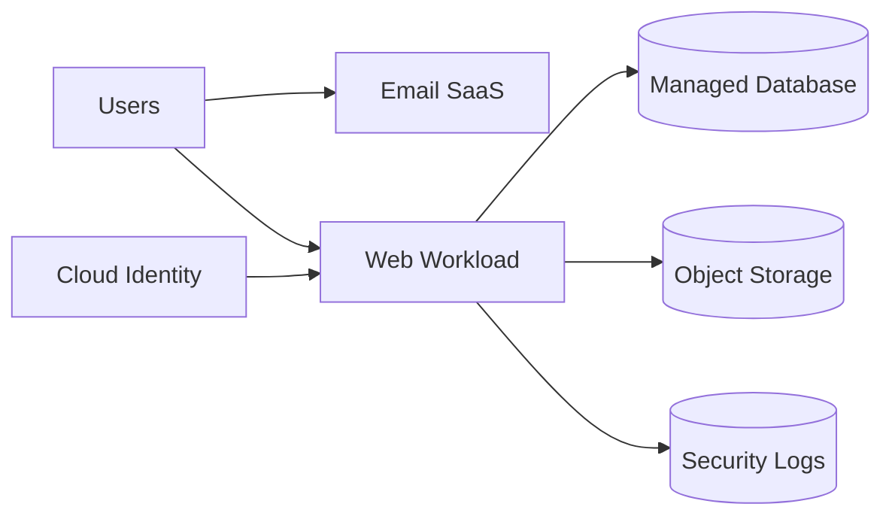
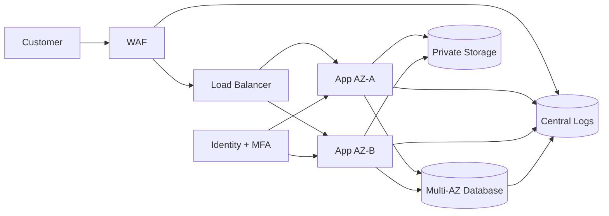
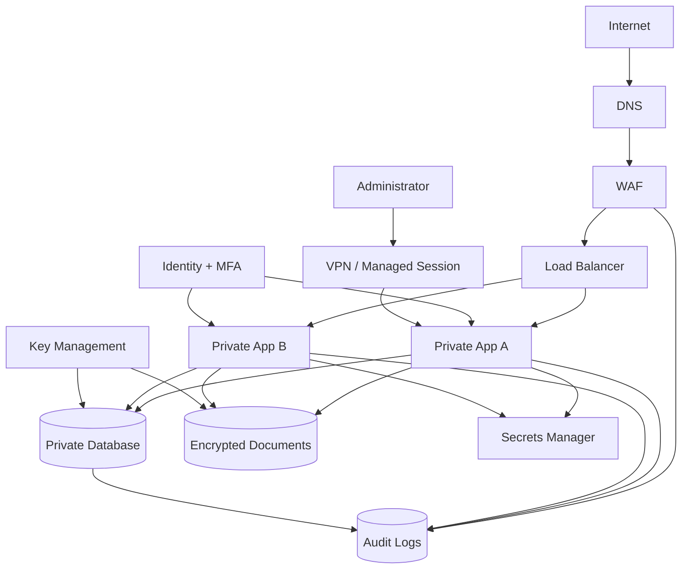
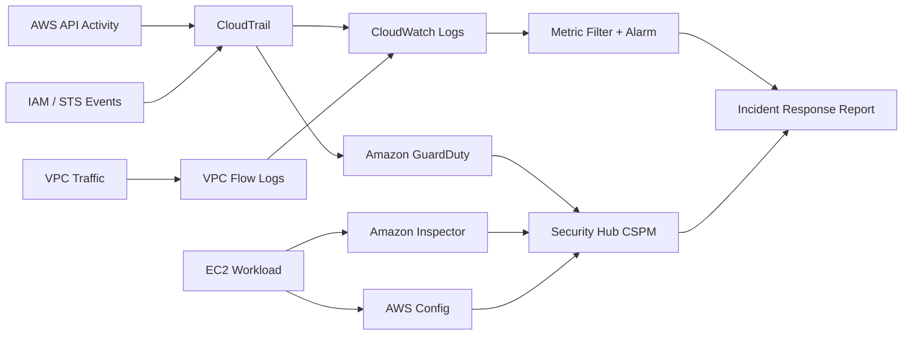
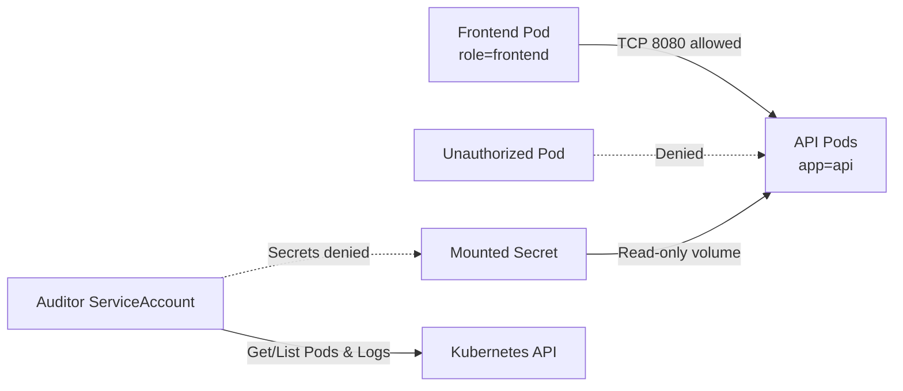
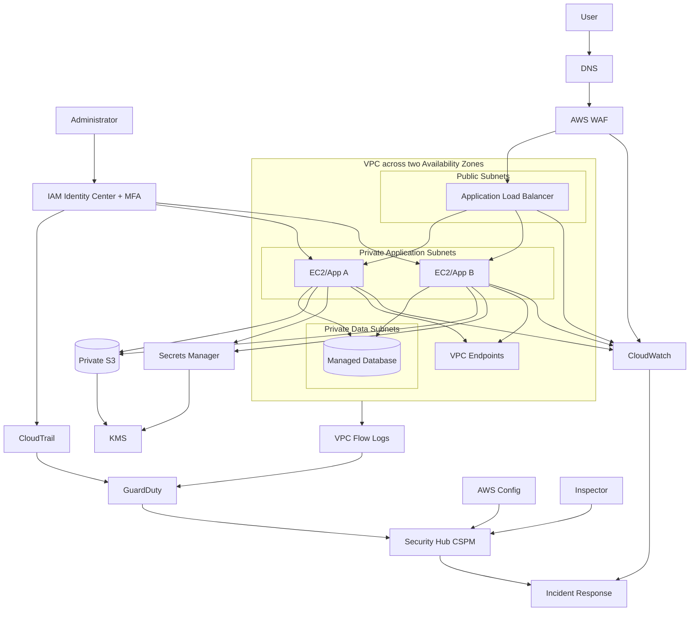

# 30-Day Cloud Security Engineer Roadmap
## Day 1–10: Cybersecurity, Linux, Networking, Cloud Fundamentals and AWS IAM

**Level:** Beginner  
**Daily study time:** 2–3 hours  
**Environment:** Windows 10/11, WSL2 Ubuntu, AWS Management Console, AWS CloudShell  
**Language:** বাংলা explanations; English technical terms and commands  
**Lab scope:** নিজের device, নিজের AWS training account অথবা authorized sandbox  
**Reviewed:** 19 July 2026

> **Legal and ethical rule:** শুধু নিজের system, নিজের cloud account অথবা লিখিতভাবে authorized lab-এ কাজ করুন। Permission ছাড়া কোনো server, account, IP, website বা network test করবেন না।

> **AWS cost warning:** AWS account pay-as-you-go হতে পারে। Root MFA, IAM এবং most local labs cost-free হলেও cloud resources ও data transfer cost তৈরি করতে পারে। Day 9-এ budget alerts configure করুন এবং প্রতিটি future lab শেষে cleanup করুন।

> **Credential rule:** Root user daily administration-এর জন্য নয়। Root access keys তৈরি করবেন না। Human access-এর জন্য federation/IAM Identity Center ও temporary credentials preferred। Dedicated single-account beginner lab-এ temporary fallback IAM administrator ব্যবহার করলে MFA enable করুন এবং course শেষে remove করুন।

---

# Day 1 — Cloud Security Career, Cybersecurity Fundamentals and WSL2 Setup

## 1. Learning Objectives

দিন শেষে আপনি:

1. Cloud Security Engineer-এর প্রধান দায়িত্ব ব্যাখ্যা করতে পারবেন
2. Asset, threat, vulnerability, risk এবং control আলাদা করতে পারবেন
3. CIA Triad ব্যবহার করে security objective identify করতে পারবেন
4. Authentication এবং authorization আলাদা করতে পারবেন
5. Windows-এ WSL2 Ubuntu setup করতে পারবেন
6. একটি Git-based learning repository তৈরি করতে পারবেন

---

## 2. Theory

## Cloud Security Engineer কী করেন?

Cloud Security Engineer cloud environment-এর identities, networks, data, workloads, configurations এবং logs secure করেন।

Typical responsibilities:

- Identity and Access Management
- Network segmentation
- Encryption and key management
- Secure storage
- Cloud configuration review
- Logging and monitoring
- Threat detection
- Incident response
- Infrastructure as Code review
- Vulnerability remediation
- Security documentation
- Cost and resource hygiene

### Real-World Example

একটি online store cloud-এ চলছে।

Cloud Security Engineer verify করবেন:

- Administrator account-এ MFA আছে?
- Database internet থেকে reachable?
- Storage public?
- Application secrets source code-এ আছে?
- Logs centrally stored?
- Unauthorized action হলে alert হবে?
- Backup restore করা যায়?
- Resources অপ্রয়োজনীয়ভাবে cost তৈরি করছে?

---

## Cybersecurity Fundamentals

### Asset

যা protect করতে হবে।

Examples:

- Customer data
- Cloud account
- Server
- Source code
- Password
- Logs

### Threat

Asset-এর ক্ষতি করতে পারে এমন ব্যক্তি, ঘটনা বা condition।

Examples:

- Attacker
- Malware
- Insider
- Hardware failure
- Accidental deletion

### Vulnerability

Weakness যা threat exploit করতে পারে।

Examples:

- Weak password
- Public database
- Unpatched software
- Overly broad IAM policy

### Risk

Threat vulnerability exploit করলে সম্ভাব্য impact।

Simple model:

```text
Risk = Likelihood × Impact
```

### Control

Risk কমানোর safeguard।

Examples:

- MFA
- Firewall
- Encryption
- Backup
- Logging
- Least privilege

---

## CIA Triad

### Confidentiality

Unauthorized person data দেখতে পারবে না।

Controls:

- Encryption
- IAM
- MFA
- Network restriction
- Data classification

### Integrity

Data unauthorizedভাবে change হয়নি।

Controls:

- Hash
- Digital signature
- Versioning
- Audit logs
- Change control

### Availability

প্রয়োজনের সময় system usable।

Controls:

- Backup
- Redundancy
- Multi-AZ
- Monitoring
- DDoS protection

---

## Authentication vs Authorization

### Authentication

আপনি কে?

Examples:

- Password
- MFA
- Certificate
- Security key

### Authorization

আপনি কী করতে পারবেন?

Examples:

- Read file
- Create user
- Delete bucket
- View logs

```text
Authentication → Identity verified
Authorization  → Permission evaluated
```

---

## Defense in Depth

একটি control fail করলেও অন্য control protect করবে।

```text
MFA
+ Least Privilege
+ Network Segmentation
+ Encryption
+ Logging
+ Backup
```

---

## 3. Important Terms

| Term | Definition |
|---|---|
| Asset | মূল্যবান system, data বা capability |
| Threat | ক্ষতির সম্ভাব্য source |
| Vulnerability | Exploitable weakness |
| Risk | Threat exploitation-এর সম্ভাবনা ও impact |
| Control | Risk কমানোর safeguard |
| Confidentiality | Unauthorized disclosure prevent |
| Integrity | Unauthorized change prevent/detect |
| Availability | Required সময়ে system accessible |
| Authentication | Identity verification |
| Authorization | Permission determination |
| Least Privilege | Minimum required access |
| Defense in Depth | Multiple protection layers |
| Attack Surface | Attacker যে entry points target করতে পারে |
| Incident | Confirmed বা suspected security event |

---

## 4. Tools and Services

- Windows PowerShell
- WSL2
- Ubuntu
- Windows Terminal
- Bash
- Git
- VS Code
- Markdown
- GitHub—optional

---

## 5. Hands-on Practical Lab

## Lab A — Windows Readiness

### Step 1: Windows Version Check

PowerShell:

```powershell
winver
```

অথবা:

```powershell
Get-ComputerInfo |
  Select-Object WindowsProductName, WindowsVersion, OsBuildNumber
```

**কেন:** WSL2 support এবং troubleshooting context।

**Expected result:** Windows 10/11 build information।

---

### Step 2: Virtualization Check

```powershell
systeminfo.exe |
  Select-String "Virtualization"
```

Task Manager:

```text
Task Manager
→ Performance
→ CPU
→ Virtualization: Enabled
```

Disabled হলে BIOS/UEFI virtualization enable করতে হতে পারে।

---

## Lab B — WSL2 Install

Administrator PowerShell:

```powershell
wsl --install -d Ubuntu
```

Restart required হলে restart করুন।

List:

```powershell
wsl --list --verbose
```

Expected:

```text
NAME      STATE    VERSION
Ubuntu    Stopped  2
```

Version 1 হলে:

```powershell
wsl --set-version Ubuntu 2
```

Default:

```powershell
wsl --set-default-version 2
```

---

### Step 3: Ubuntu User Create

Ubuntu first launch-এ:

```text
Enter new UNIX username:
New password:
Retype new password:
```

Password typing screen-এ characters দেখা যায় না—এটি normal।

Verify:

```bash
whoami
id
pwd
```

Expected:

- Non-root username
- User/group IDs
- `/home/USERNAME`

---

### Step 4: Update Packages

```bash
sudo apt update
sudo apt upgrade -y
```

**কেন:** Package metadata এবং security updates।

Verify:

```bash
apt list --upgradable
```

---

### Step 5: Essential Tools

```bash
sudo apt install -y \
  git \
  curl \
  wget \
  jq \
  tree \
  unzip \
  zip \
  openssl \
  net-tools \
  iproute2 \
  dnsutils \
  traceroute \
  tcpdump \
  ca-certificates \
  python3 \
  python3-pip \
  python3-venv
```

Verify:

```bash
git --version
curl --version
jq --version
openssl version
python3 --version
```

---

## Lab C — Learning Repository

```bash
mkdir -p \
  ~/cloud-security-30-days/{notes,labs,scripts,reports,architecture,screenshots,projects}

cd ~/cloud-security-30-days

git init
```

Create README:

```bash
cat > README.md <<'EOF'
# Cloud Security Engineer — 30 Day Journey

## Goal

Build a practical foundation in:

- Linux
- Networking
- Cloud security
- AWS
- Infrastructure as Code
- Containers and Kubernetes
- Logging and incident response

## Ethical Scope

All labs are performed only on systems and cloud accounts I own or am authorized to use.
EOF
```

Create `.gitignore`:

```bash
cat > .gitignore <<'EOF'
# Secrets
.env
.env.*
*.key
*.pem
*.p12
*.pfx
credentials
.aws/

# Terraform
.terraform/
*.tfstate
*.tfstate.*
*.tfplan

# Temporary files
*.tmp
*.log
__pycache__/
EOF
```

Git identity:

```bash
git config --global user.name "YOUR NAME"
git config --global user.email "YOUR_EMAIL"
```

First commit:

```bash
git add README.md .gitignore
git commit -m "Initialize cloud security learning repository"
```

Verify:

```bash
git status
git log --oneline
```

---

## Common Errors and Troubleshooting

### `wsl` command not found

- Windows Update
- Windows Features
- Administrator PowerShell
- Microsoft Store WSL update

Check:

```powershell
wsl --status
```

### `0x80370102`

Virtualization disabled হতে পারে।

- BIOS/UEFI virtualization enable
- Virtual Machine Platform enable
- Restart

### `sudo: command not found`

Incorrect/minimal distribution বা root shell হতে পারে। Standard Ubuntu reinstall করুন।

### Git commit identity error

```bash
git config --global user.name "YOUR NAME"
git config --global user.email "YOUR_EMAIL"
```

---

## 6. Commands Summary

```powershell
wsl --install -d Ubuntu
```

Ubuntu WSL distribution install করে।

```powershell
wsl --list --verbose
```

Installed distributions এবং WSL version দেখায়।

```bash
sudo apt update
sudo apt upgrade -y
```

Package metadata refresh এবং updates install।

```bash
git init
git add .
git commit -m "MESSAGE"
```

Repository initialize এবং snapshot commit।

---

## 7. Security Checklist

- [ ] Windows updated
- [ ] Virtualization enabled
- [ ] WSL2—not WSL1
- [ ] Ubuntu non-root user
- [ ] Strong local password
- [ ] Packages updated
- [ ] Essential tools installed
- [ ] Git identity configured
- [ ] `.gitignore` includes secret patterns
- [ ] Ethical scope documented
- [ ] No real credentials stored
- [ ] First commit complete

---

## 8. Daily Challenge

একটি `notes/day-01-security-foundation.md` file তৈরি করুন:

- Cloud Security Engineer-এর 10 responsibilities
- CIA Triad-এর একটি real example
- Authentication এবং authorization-এর তিনটি example
- আপনার lab-এর ethical boundary
- আপনার top five learning goals

Commit:

```bash
git add notes/day-01-security-foundation.md
git commit -m "Document Day 1 security foundations"
```

---

## 9. Interview Questions

### 1. Cloud Security Engineer কী করেন?

Cloud identity, network, data, workloads, configuration, monitoring এবং incident response secure করেন।

### 2. Threat এবং vulnerability-এর পার্থক্য কী?

Threat ক্ষতির source; vulnerability exploitable weakness।

### 3. CIA Triad কী?

Confidentiality, Integrity এবং Availability।

### 4. Authentication এবং authorization কীভাবে আলাদা?

Authentication identity verify করে; authorization permission determine করে।

### 5. Least privilege কী?

শুধু কাজের জন্য প্রয়োজনীয় minimum permission দেওয়া।

### 6. Defense in depth কী?

একাধিক security layer ব্যবহার করা যাতে একটি fail করলেও অন্যগুলো protect করে।

---

## 10. Daily Notes

সংরক্ষণ করুন:

- Windows version screenshot
- WSL list output
- `whoami`, `id`, `pwd`
- Installed tools versions
- Repository structure
- First Git commit
- CIA diagram
- Learning goals

---

## 11. Time Breakdown

| Activity | Time |
|---|---:|
| Theory | 35 minutes |
| WSL setup | 45 minutes |
| Tools and Git | 35 minutes |
| Challenge | 25 minutes |
| Notes/revision | 20 minutes |
| **Total** | **160 minutes** |

---

# Day 2 — Linux Filesystem, Users, Groups and Permissions

## 1. Learning Objectives

1. Linux filesystem hierarchy navigate করতে পারবেন
2. Files/directories create, copy, move and delete করতে পারবেন
3. Users, groups এবং ownership বুঝতে পারবেন
4. Symbolic এবং numeric permissions ব্যবহার করতে পারবেন
5. `sudo`, `umask`, SUID, SGID এবং sticky bit-এর foundation বুঝতে পারবেন
6. Least-privilege shared directory তৈরি করতে পারবেন

---

## 2. Theory

## Linux Filesystem

| Path | Purpose |
|---|---|
| `/` | Root of filesystem |
| `/home` | Normal user home directories |
| `/root` | Root user home |
| `/etc` | System configuration |
| `/var` | Variable data, logs, cache |
| `/var/log` | Logs |
| `/tmp` | Temporary shared files |
| `/usr` | Applications and libraries |
| `/bin`, `/sbin` | Essential commands |
| `/opt` | Optional software |
| `/dev` | Device files |
| `/proc` | Process/kernel virtual filesystem |

## Ownership

প্রতিটি file সাধারণত:

- User owner
- Group owner
- Other users

## Permission Bits

```text
r = read    = 4
w = write   = 2
x = execute = 1
```

Example:

```text
-rwxr-x---
```

Meaning:

- Owner: `rwx`
- Group: `r-x`
- Other: none

Numeric:

```text
750
```

## Directory Permissions

Directory-এর ক্ষেত্রে:

- `r`: contents list
- `w`: create/delete names
- `x`: enter/traverse

## `sudo`

Authorized user temporary elevated command চালাতে পারে। Root login-এর চেয়ে accountable।

## `umask`

New file/directory থেকে permissions remove করে।

Common secure value:

```text
027
```

## Special Bits

- SUID: executable owner privilege context
- SGID: executable group context বা directory group inheritance
- Sticky bit: shared directory-এ user শুধু নিজের file delete করতে পারে

---

## 3. Important Terms

| Term | Definition |
|---|---|
| Absolute Path | `/` থেকে complete path |
| Relative Path | Current directory-based path |
| Inode | File metadata structure |
| Owner | File-এর user owner |
| Group | File-এর group owner |
| Permission | Read/write/execute access |
| `chmod` | Permission change |
| `chown` | Owner/group change |
| `umask` | Default permission mask |
| SUID | Execute as file owner |
| SGID | Group inheritance/execute as group |
| Sticky Bit | Shared directory delete protection |
| `sudo` | Authorized elevated command |
| Least Privilege | Minimum access |

---

## 4. Tools

- Bash
- `pwd`, `ls`, `cd`
- `mkdir`, `touch`
- `cp`, `mv`, `rm`
- `cat`, `less`, `head`, `tail`
- `find`
- `useradd`/`adduser`
- `groupadd`
- `usermod`
- `chmod`
- `chown`
- `stat`
- `umask`
- `sudo`

---

## 5. Hands-on Practical Lab

### Step 1 — Filesystem Navigation

```bash
pwd
ls -la
cd /
ls
cd /etc
pwd
cd ~
```

Tree:

```bash
tree -L 1 /
```

Expected major system directories।

---

### Step 2 — File Operations

```bash
mkdir -p \
  ~/cloud-security-30-days/labs/day-02-linux/{confidential,shared,archive}

cd \
  ~/cloud-security-30-days/labs/day-02-linux

touch confidential/report.txt
echo "Internal security report" \
  > confidential/report.txt

cp confidential/report.txt \
  archive/report-backup.txt

mv archive/report-backup.txt \
  archive/report-v1.txt
```

Verify:

```bash
find . \
  -maxdepth 3 \
  -type f \
  -printf '%M %u %g %p\n'
```

---

### Step 3 — Test Users and Group

```bash
sudo groupadd \
  cloudsec-lab
```

Users:

```bash
sudo useradd \
  --create-home \
  --shell /bin/bash \
  analyst01

sudo useradd \
  --create-home \
  --shell /bin/bash \
  auditor01
```

Add group:

```bash
sudo usermod \
  --append \
  --groups cloudsec-lab \
  analyst01

sudo usermod \
  --append \
  --groups cloudsec-lab \
  auditor01
```

Verify:

```bash
getent group \
  cloudsec-lab

id analyst01
id auditor01
```

> Test users-এর password দরকার নেই; `sudo -u` দিয়ে lab করবেন।

---

### Step 4 — Shared Directory

```bash
sudo mkdir -p \
  /srv/cloudsec/shared

sudo chown \
  root:cloudsec-lab \
  /srv/cloudsec/shared

sudo chmod \
  2770 \
  /srv/cloudsec/shared
```

Why `2`?

SGID bit new files-এর group inheritance নিশ্চিত করে।

Verify:

```bash
stat \
  /srv/cloudsec/shared

ls -ld \
  /srv/cloudsec/shared
```

Expected:

```text
drwxrws---
```

---

### Step 5 — Group Collaboration

Create as analyst:

```bash
sudo -u analyst01 \
  bash -c \
  'echo "Analyst note" > /srv/cloudsec/shared/analyst-note.txt'
```

Verify:

```bash
ls -l \
  /srv/cloudsec/shared
```

Auditor read:

```bash
sudo -u auditor01 \
  cat \
  /srv/cloudsec/shared/analyst-note.txt
```

Auditor create:

```bash
sudo -u auditor01 \
  bash -c \
  'echo "Auditor note" > /srv/cloudsec/shared/auditor-note.txt'
```

---

### Step 6 — Private Directory

```bash
chmod 700 \
  confidential

chmod 600 \
  confidential/report.txt
```

Verify:

```bash
ls -ld confidential
ls -l confidential/report.txt
```

Other test user denied:

```bash
set +e

sudo -u auditor01 \
  cat \
  "$HOME/cloud-security-30-days/labs/day-02-linux/confidential/report.txt"

echo "Exit code: $?"
set -e
```

Expected permission denied।

---

### Step 7 — Symbolic Permissions

```bash
chmod u+x \
  scripts-demo.sh \
  2>/dev/null || true
```

Create demo:

```bash
cat > permission-demo.sh <<'EOF'
#!/usr/bin/env bash
echo "Permission lab"
EOF

chmod u+x \
  permission-demo.sh

chmod g-rwx,o-rwx \
  permission-demo.sh

ls -l \
  permission-demo.sh
```

Expected owner execute only।

---

### Step 8 — `umask`

Current:

```bash
umask
```

Secure session mask:

```bash
umask 027

touch umask-file.txt
mkdir umask-directory

ls -ld \
  umask-file.txt \
  umask-directory
```

Expected:

- File roughly `640`
- Directory roughly `750`

---

### Step 9 — Sticky Bit Demo

```bash
sudo mkdir -p \
  /srv/cloudsec/dropbox

sudo chmod \
  1777 \
  /srv/cloudsec/dropbox
```

Create:

```bash
sudo -u analyst01 \
  touch \
  /srv/cloudsec/dropbox/analyst-file

set +e

sudo -u auditor01 \
  rm \
  /srv/cloudsec/dropbox/analyst-file

echo "Delete exit: $?"
set -e
```

Expected auditor cannot delete analyst file।

---

## Common Errors

### `groupadd: group already exists`

```bash
getent group cloudsec-lab
```

Existing group reuse।

### `Permission denied` in shared directory

Check:

```bash
id analyst01
ls -ld /srv/cloudsec/shared
namei -l /srv/cloudsec/shared
```

### Group membership not effective

New login session may be required। `sudo -u USER` should use current group database।

### `Operation not permitted`

WSL mounted Windows filesystem under `/mnt/c` permission behaviour differs। Linux permission lab `/home` বা `/srv`-এ করুন।

---

## 6. Commands Summary

```bash
chmod 750 FILE
```

Owner full, group read/execute, other none।

```bash
chown USER:GROUP FILE
```

Ownership change।

```bash
chmod 2770 DIRECTORY
```

Group-shared SGID directory।

```bash
chmod 1777 DIRECTORY
```

Sticky shared directory।

```bash
find PATH -printf
```

File metadata inventory।

---

## 7. Security Checklist

- [ ] Lab Linux filesystem-এ
- [ ] Test accounts only
- [ ] Private file `600`
- [ ] Private directory `700`
- [ ] Shared directory group-owned
- [ ] Shared directory SGID
- [ ] Other access removed
- [ ] Sticky directory tested
- [ ] `umask 027` understood
- [ ] No unnecessary SUID change
- [ ] Ownership verified
- [ ] Cleanup documented

---

## 8. Daily Challenge

Create:

```text
/srv/cloudsec-project/
├── admins/
├── auditors/
└── dropbox/
```

Requirements:

- `admins`: admin group only
- `auditors`: read-only auditor access
- `dropbox`: anyone can create; only owner can delete
- New files inherit correct group
- Verification commands and access tests

---

## 9. Interview Questions

### 1. `chmod 750` কী?

Owner `rwx`, group `r-x`, others none।

### 2. Directory execute permission কী করে?

Directory traverse/access names করতে দেয়।

### 3. SGID directory benefit?

New files parent directory group inherit করে।

### 4. Sticky bit purpose?

Shared directory-এ অন্য user-এর file delete prevent করে।

### 5. `sudo` এবং root login difference?

`sudo` controlled/auditable command elevation; root login broad persistent session।

### 6. `umask 027` কী করে?

New objects থেকে group write এবং all other permissions remove করে।

---

## 10. Daily Notes

Save:

- Filesystem tree
- `id` outputs
- Shared directory permissions
- Access allowed/denied evidence
- Sticky bit result
- `umask` result
- Challenge permission matrix
- Cleanup commands

---

## 11. Cleanup

```bash
sudo rm -rf \
  /srv/cloudsec

sudo userdel \
  --remove \
  analyst01

sudo userdel \
  --remove \
  auditor01

sudo groupdel \
  cloudsec-lab
```

Verify:

```bash
getent passwd analyst01
getent group cloudsec-lab
```

---

## 12. Time Breakdown

| Activity | Time |
|---|---:|
| Theory | 35 minutes |
| Filesystem lab | 30 minutes |
| Users/groups | 35 minutes |
| Permissions challenge | 35 minutes |
| Notes/cleanup | 20 minutes |
| **Total** | **155 minutes** |

---

# Day 3 — Processes, Services, Logs and SSH Security

## 1. Learning Objectives

1. Linux processes inspect এবং terminate করতে পারবেন
2. `systemd` services manage করতে পারবেন
3. `journalctl` এবং log files ব্যবহার করতে পারবেন
4. SSH server local-onlyভাবে configure করতে পারবেন
5. SSH key pair তৈরি এবং verify করতে পারবেন
6. Password/root SSH login disable করতে পারবেন
7. Authentication failure investigate করতে পারবেন

---

## 2. Theory

## Process

Running program instance।

Important fields:

- PID
- Parent PID
- User
- CPU
- Memory
- State
- Command

## Service

Background application managed by init system—Ubuntu সাধারণত `systemd`।

Service states:

- active
- inactive
- failed
- enabled
- disabled

## Logs

Security investigation-এর evidence।

Common:

| Log | Purpose |
|---|---|
| `journalctl` | systemd journal |
| `/var/log/auth.log` | Authentication/sudo/SSH on Ubuntu |
| `/var/log/syslog` | General system messages |
| `dmesg` | Kernel messages |
| Application logs | Service-specific events |

## SSH

Secure remote shell protocol।

Threats:

- Password brute force
- Root login
- Weak private-key permissions
- Exposed port
- Old algorithms
- Unrestricted users
- Unmonitored logins

Secure pattern:

```text
Key authentication
+ Root login disabled
+ Password login disabled
+ Limited users
+ Firewall/source restriction
+ Logging
```

---

## 3. Important Terms

| Term | Definition |
|---|---|
| Process | Running program |
| PID | Process identifier |
| Daemon | Background service process |
| Signal | Process control message |
| `systemd` | Service manager |
| Unit | systemd-managed object |
| Journal | systemd structured logs |
| SSH | Secure remote shell protocol |
| Public Key | Shareable authentication key |
| Private Key | Secret authentication key |
| `authorized_keys` | Allowed SSH public keys |
| Brute Force | Repeated credential attempts |
| Fail2ban | Log-based temporary blocking tool |
| Least Functionality | Disable unnecessary services |

---

## 4. Tools

- `ps`
- `top`
- `pgrep`
- `kill`
- `systemctl`
- `journalctl`
- `tail`
- `grep`
- OpenSSH server/client
- `ssh-keygen`
- `ss`
- `ufw`
- Fail2ban—optional

---

## 5. Hands-on Practical Lab

## Lab A — Processes

```bash
sleep 600 &
SLEEP_PID=$!

echo "$SLEEP_PID"
```

Inspect:

```bash
ps \
  -p "$SLEEP_PID" \
  -o pid,ppid,user,state,etime,cmd

pgrep \
  -a sleep
```

Terminate gracefully:

```bash
kill \
  "$SLEEP_PID"
```

Verify:

```bash
ps \
  -p "$SLEEP_PID"
```

Force only if necessary:

```bash
kill -9 \
  PID
```

`SIGKILL` cleanup opportunity দেয় না।

---

## Lab B — Services

Check:

```bash
systemctl \
  --type=service \
  --state=running \
  --no-pager \
  | head
```

Cron:

```bash
systemctl status \
  cron \
  --no-pager
```

Restart lab-safe service:

```bash
sudo systemctl restart \
  cron

systemctl is-active \
  cron

systemctl is-enabled \
  cron
```

Failed units:

```bash
systemctl \
  --failed \
  --no-pager
```

---

## Lab C — Logs

Recent journal:

```bash
journalctl \
  -n 50 \
  --no-pager
```

Current boot:

```bash
journalctl \
  -b \
  --no-pager \
  | tail -n 50
```

Service logs:

```bash
journalctl \
  -u cron \
  --since "1 hour ago" \
  --no-pager
```

Authentication:

```bash
sudo tail -n 50 \
  /var/log/auth.log
```

Sudo events:

```bash
sudo grep -i \
  'sudo' \
  /var/log/auth.log \
  | tail
```

---

## Lab D — SSH Local Lab

### Step 1: Install

```bash
sudo apt update
sudo apt install -y \
  openssh-server
```

Enable/start:

```bash
sudo systemctl enable \
  --now ssh
```

Verify:

```bash
systemctl status \
  ssh \
  --no-pager

ss -lntp \
  | grep ':22'
```

---

### Step 2: Generate Key

```bash
mkdir -p \
  ~/.ssh

chmod 700 \
  ~/.ssh

ssh-keygen \
  -t ed25519 \
  -a 100 \
  -f ~/.ssh/cloudsec_day03 \
  -C "day03-local-lab"
```

Use a passphrase।

Permissions:

```bash
chmod 600 \
  ~/.ssh/cloudsec_day03

chmod 644 \
  ~/.ssh/cloudsec_day03.pub
```

Fingerprint:

```bash
ssh-keygen \
  -lf ~/.ssh/cloudsec_day03.pub
```

Never share private key।

---

### Step 3: Authorize Key

```bash
cat \
  ~/.ssh/cloudsec_day03.pub \
  >> ~/.ssh/authorized_keys

chmod 600 \
  ~/.ssh/authorized_keys
```

Test localhost:

```bash
ssh \
  -i ~/.ssh/cloudsec_day03 \
  localhost
```

First connection host key verify করুন, তারপর exit:

```bash
exit
```

---

### Step 4: Harden sshd

Backup:

```bash
sudo cp \
  /etc/ssh/sshd_config \
  /etc/ssh/sshd_config.day03.bak
```

Create drop-in:

```bash
sudo mkdir -p \
  /etc/ssh/sshd_config.d

sudo tee \
  /etc/ssh/sshd_config.d/99-cloudsec-lab.conf \
  > /dev/null <<EOF
PermitRootLogin no
PasswordAuthentication no
KbdInteractiveAuthentication no
PubkeyAuthentication yes
X11Forwarding no
AllowUsers $(whoami)
MaxAuthTries 3
LoginGraceTime 30
EOF
```

Validate before restart:

```bash
sudo sshd \
  -t
```

Expected no output।

Reload:

```bash
sudo systemctl reload \
  ssh
```

Open a second terminal and test before closing current session:

```bash
ssh \
  -i ~/.ssh/cloudsec_day03 \
  localhost
```

---

### Step 5: Password Login Failure Test

```bash
set +e

ssh \
  -o PubkeyAuthentication=no \
  -o PreferredAuthentications=password \
  localhost

echo "Exit code: $?"
set -e
```

Expected permission denied।

---

### Step 6: SSH Logs

```bash
sudo journalctl \
  -u ssh \
  --since "30 minutes ago" \
  --no-pager

sudo grep -iE \
  'accepted|failed|invalid|disconnect' \
  /var/log/auth.log \
  | tail -n 30
```

Identify:

- Timestamp
- User
- Source
- Method
- Result

---

### Step 7: Firewall Concept

WSL networking differs from full VM/server। Local lab-এ firewall rule না বদলালেও concept review করুন।

Ubuntu server example:

```bash
sudo ufw status
```

Production pattern:

```text
Allow SSH only from trusted admin IP/VPN
Deny public SSH when Session Manager/bastion alternative exists
```

---

## Common Errors

### `System has not been booted with systemd`

WSL `/etc/wsl.conf`:

```ini
[boot]
systemd=true
```

PowerShell:

```powershell
wsl --shutdown
```

Restart Ubuntu।

### `Connection refused`

```bash
systemctl status ssh
ss -lntp | grep ':22'
```

### `Permission denied (publickey)`

```bash
ls -ld ~/.ssh
ls -l ~/.ssh
ssh -vvv -i ~/.ssh/cloudsec_day03 localhost
```

### SSH locked out

Use WSL local terminal, restore:

```bash
sudo cp \
  /etc/ssh/sshd_config.day03.bak \
  /etc/ssh/sshd_config

sudo rm -f \
  /etc/ssh/sshd_config.d/99-cloudsec-lab.conf

sudo sshd -t
sudo systemctl restart ssh
```

---

## 6. Commands Summary

```bash
ps -p PID -o ...
```

Process details।

```bash
systemctl status SERVICE
```

Service state।

```bash
journalctl -u SERVICE
```

Service logs।

```bash
ssh-keygen -t ed25519
```

Modern SSH key pair।

```bash
sshd -t
```

SSH configuration syntax validate।

```bash
ssh -vvv
```

Verbose SSH troubleshooting।

---

## 7. Security Checklist

- [ ] Processes tied to users
- [ ] Failed services reviewed
- [ ] Auth logs readable
- [ ] SSH key passphrase
- [ ] Private key mode `600`
- [ ] `.ssh` mode `700`
- [ ] Root login disabled
- [ ] Password login disabled
- [ ] Only lab user allowed
- [ ] `sshd -t` successful
- [ ] Key login tested in second terminal
- [ ] SSH logs reviewed
- [ ] Backup config available

---

## 8. Daily Challenge

Create `scripts/ssh-audit.sh` that reports:

- SSH service active?
- Listening address/port
- Root login setting
- Password auth setting
- Public-key setting
- Allowed users
- Private key files with insecure permissions
- Last 10 authentication failures

Do not print private key contents।

---

## 9. Interview Questions

### 1. `SIGTERM` এবং `SIGKILL` difference?

SIGTERM graceful termination request; SIGKILL immediate forced stop।

### 2. `systemctl enable` এবং `start` difference?

Enable boot-time start; start current session।

### 3. SSH private key permissions কেন restrictive?

Other users read করতে পারলে identity compromise হতে পারে।

### 4. Password SSH disable কেন?

Brute-force/password theft risk কমায়।

### 5. `sshd -t` কেন restart-এর আগে?

Invalid config দিয়ে service failure/lockout prevent করতে।

### 6. Authentication investigation-এ কী fields দেখবেন?

Time, username, source IP, method, result and related session events।

---

## 10. Daily Notes

Save:

- Process inspection
- Running/failed services
- SSH key fingerprint—not private key
- sshd hardening file
- Syntax validation
- Successful key login
- Failed password login
- Authentication logs
- Audit script output
- Recovery steps

---

## 11. Cleanup

Restore optional:

```bash
sudo rm -f \
  /etc/ssh/sshd_config.d/99-cloudsec-lab.conf

sudo cp \
  /etc/ssh/sshd_config.day03.bak \
  /etc/ssh/sshd_config

sudo sshd -t
sudo systemctl restart ssh
```

Remove lab key:

```bash
grep -v \
  'day03-local-lab' \
  ~/.ssh/authorized_keys \
  > ~/.ssh/authorized_keys.tmp

mv \
  ~/.ssh/authorized_keys.tmp \
  ~/.ssh/authorized_keys

chmod 600 \
  ~/.ssh/authorized_keys

rm -f \
  ~/.ssh/cloudsec_day03 \
  ~/.ssh/cloudsec_day03.pub
```

---

## 12. Time Breakdown

| Activity | Time |
|---|---:|
| Theory | 30 minutes |
| Process/service lab | 30 minutes |
| Logs | 25 minutes |
| SSH lab | 55 minutes |
| Challenge/notes | 25 minutes |
| **Total** | **165 minutes** |

---

# Day 4 — Networking Fundamentals: IP, CIDR, DNS, DHCP, NAT, TCP and UDP

## 1. Learning Objectives

1. IPv4 address, subnet mask এবং CIDR বুঝতে পারবেন
2. Private/public/loopback/link-local addresses identify করতে পারবেন
3. Subnet network, broadcast এবং usable range calculate করতে পারবেন
4. DNS resolution এবং DHCP purpose বুঝতে পারবেন
5. NAT কীভাবে কাজ করে বুঝতে পারবেন
6. TCP এবং UDP compare করতে পারবেন
7. Linux networking commands দিয়ে troubleshoot করতে পারবেন

---

## 2. Theory

## IPv4

IPv4 = 32 bits।

Example:

```text
192.168.10.25
```

CIDR:

```text
192.168.10.0/24
```

`/24` means first 24 bits network।

Common private ranges:

```text
10.0.0.0/8
172.16.0.0/12
192.168.0.0/16
```

Loopback:

```text
127.0.0.0/8
```

Common:

```text
127.0.0.1
```

Link-local:

```text
169.254.0.0/16
```

## Subnet Example

```text
Network:   192.168.10.0/24
Broadcast: 192.168.10.255
Hosts:     192.168.10.1–192.168.10.254
```

Cloud providers reserve additional subnet addresses; provider documentation check করতে হয়।

## DNS

Name to IP resolution।

```text
www.example.com
→ DNS resolver
→ IP address
```

Records:

- A
- AAAA
- CNAME
- MX
- TXT
- NS
- PTR

## DHCP

Automatically supplies:

- IP
- Subnet
- Gateway
- DNS
- Lease time

## NAT

Private address and public address translation।

Use cases:

- Private hosts internet access
- Public IPv4 conservation
- Hide internal addressing

NAT security boundary alone নয়। Firewall rules still needed।

## TCP

- Connection-oriented
- Reliable
- Ordered
- Retransmission
- Three-way handshake

## UDP

- Connectionless
- Lower overhead
- No delivery guarantee
- Useful for DNS, streaming, real-time traffic

---

## 3. Important Terms

| Term | Definition |
|---|---|
| IP Address | Network interface identifier |
| Subnet | Logical IP range |
| CIDR | Prefix-length notation |
| Network Address | Subnet identifier |
| Broadcast | IPv4 subnet all-host address |
| Gateway | Route to other networks |
| Route | Destination path |
| DNS | Name resolution |
| DHCP | Automatic network configuration |
| NAT | Address translation |
| TCP | Reliable connection-oriented transport |
| UDP | Connectionless transport |
| Port | Application endpoint number |
| Socket | IP + port + protocol endpoint |
| MTU | Maximum packet size |

---

## 4. Tools

- `ip`
- `ss`
- `ping`
- `traceroute`
- `tracepath`
- `dig`
- `nslookup`
- `getent`
- `curl`
- `nc`
- `tcpdump`
- Python `ipaddress`

---

## 5. Hands-on Practical Lab

### Step 1 — Interface and Address

```bash
ip addr show
```

Short:

```bash
ip -brief address
```

Routes:

```bash
ip route
```

Expected:

- WSL interface
- Local subnet
- Default route

---

### Step 2 — DNS Configuration

```bash
cat /etc/resolv.conf
```

Resolve:

```bash
getent hosts example.com
dig example.com
dig +short example.com
```

Record types:

```bash
dig A example.com
dig AAAA example.com
dig MX example.com
dig TXT example.com
```

---

### Step 3 — Connectivity Layers

Loopback:

```bash
ping -c 3 \
  127.0.0.1
```

Gateway:

```bash
DEFAULT_GATEWAY=$(
  ip route \
  | awk '/default/ {print $3; exit}'
)

ping -c 3 \
  "$DEFAULT_GATEWAY"
```

DNS name:

```bash
ping -c 3 \
  example.com
```

HTTPS:

```bash
curl -I \
  https://example.com
```

Interpret:

- IP works, DNS fails → DNS issue
- DNS resolves, HTTPS fails → routing/firewall/TLS/service
- Loopback fails → local stack issue

---

### Step 4 — CIDR Calculation

```bash
python3 - <<'PY'
import ipaddress

networks = [
    "192.168.10.0/24",
    "10.0.0.0/26",
    "172.16.10.128/27",
]

for cidr in networks:
    network = ipaddress.ip_network(cidr)

    hosts = list(network.hosts())

    print(f"CIDR: {network}")
    print(f"Netmask: {network.netmask}")
    print(f"Network: {network.network_address}")
    print(f"Broadcast: {network.broadcast_address}")
    print(f"Total addresses: {network.num_addresses}")
    print(f"First host: {hosts[0]}")
    print(f"Last host: {hosts[-1]}")
    print("-" * 40)
PY
```

---

### Step 5 — Subnet a `/24`

Goal: four `/26` subnets।

```bash
python3 - <<'PY'
import ipaddress

network = ipaddress.ip_network("10.20.0.0/24")

for subnet in network.subnets(new_prefix=26):
    print(subnet)
PY
```

Expected:

```text
10.20.0.0/26
10.20.0.64/26
10.20.0.128/26
10.20.0.192/26
```

---

### Step 6 — TCP Local Service

Terminal 1:

```bash
python3 -m http.server \
  8080 \
  --bind 127.0.0.1
```

Terminal 2:

```bash
ss -lntp \
  | grep ':8080'

curl -v \
  http://127.0.0.1:8080
```

`nc`:

```bash
nc -vz \
  127.0.0.1 \
  8080
```

---

### Step 7 — UDP Local Test

Terminal 1:

```bash
nc -u -l \
  127.0.0.1 \
  9999
```

Terminal 2:

```bash
echo "udp-test" \
  | nc -u \
      127.0.0.1 \
      9999
```

Observe message।

---

### Step 8 — Packet Capture

HTTP local traffic only:

```bash
sudo tcpdump \
  -i lo \
  -nn \
  'tcp port 8080'
```

Generate:

```bash
curl \
  http://127.0.0.1:8080
```

Observe:

- SYN
- SYN-ACK
- ACK
- HTTP packets
- FIN/ACK

Stop `Ctrl+C`।

DNS capture:

```bash
sudo tcpdump \
  -i any \
  -nn \
  'port 53'
```

Generate:

```bash
dig example.com
```

---

### Step 9 — Route Trace

```bash
tracepath \
  example.com
```

অথবা:

```bash
traceroute \
  example.com
```

Cloud/ISP may block intermediate ICMP responses; `*` always failure নয়।

---

## Common Errors

### `ping: command not found`

```bash
sudo apt install -y iputils-ping
```

### DNS fails in WSL

```powershell
wsl --shutdown
```

Restart. Check `/etc/resolv.conf`, VPN/proxy।

### `tcpdump: permission denied`

Use `sudo`।

### Port already in use

```bash
ss -lntp | grep ':8080'
```

Use another port or stop process।

### UDP test no output

Netcat variants differ। Check:

```bash
nc -h
```

Use two terminals and localhost।

---

## 6. Commands Summary

```bash
ip -brief address
ip route
```

Address এবং routing table।

```bash
dig +short NAME
```

DNS answer।

```bash
ss -lntup
```

Listening TCP/UDP sockets।

```bash
nc -vz HOST PORT
```

TCP connection test।

```bash
tcpdump -i INTERFACE FILTER
```

Authorized packet capture।

---

## 7. Security Checklist

- [ ] Interface addresses identified
- [ ] Default route identified
- [ ] Private/public ranges understood
- [ ] CIDR calculations verified
- [ ] DNS resolver identified
- [ ] TCP listener localhost-only
- [ ] UDP test localhost-only
- [ ] Packet capture own traffic only
- [ ] No external scanning
- [ ] Captures not publicly shared
- [ ] Service stopped after lab

---

## 8. Daily Challenge

Design:

```text
VPC: 10.50.0.0/16

Need:
- 2 public subnets
- 2 private app subnets
- 2 private database subnets
- 2 Availability Zones
```

Choose `/24` CIDRs and verify no overlap with Python।

---

## 9. Interview Questions

### 1. `/24` কী?

24 network bits, 8 host bits; 256 IPv4 addresses।

### 2. Private IPv4 ranges কী?

`10/8`, `172.16/12`, `192.168/16`।

### 3. DNS এবং DHCP difference?

DNS name resolution; DHCP network settings assignment।

### 4. TCP and UDP difference?

TCP reliable/connection-oriented; UDP connectionless/low overhead।

### 5. NAT firewall-এর replacement?

না। NAT address translation; access control separately required।

### 6. `0.0.0.0/0` কী?

All IPv4 addresses/default route।

---

## 10. Daily Notes

Save:

- `ip -brief address`
- Route table
- DNS configuration
- CIDR calculation
- Subnet challenge
- TCP listener
- Handshake packet capture screenshot
- DNS capture
- Troubleshooting decision tree

---

## 11. Time Breakdown

| Activity | Time |
|---|---:|
| Theory | 40 minutes |
| Address/CIDR | 35 minutes |
| DNS/connectivity | 25 minutes |
| TCP/UDP/capture | 40 minutes |
| Challenge/notes | 25 minutes |
| **Total** | **165 minutes** |

---

# Day 5 — Firewalls, HTTP/HTTPS, TLS, VPN, Proxy, Bastion and Network Design

## 1. Learning Objectives

1. Common ports and protocols identify করতে পারবেন
2. Firewall allow/deny logic বুঝতে পারবেন
3. HTTP request/response inspect করতে পারবেন
4. HTTPS/TLS certificate and handshake basics বুঝতে পারবেন
5. Encoding, hashing and encryption আলাদা করতে পারবেন
6. VPN, proxy and bastion host compare করতে পারবেন
7. Public/private subnet architecture design করতে পারবেন

---

## 2. Theory

## Common Ports

| Port | Protocol | Use |
|---:|---|---|
| 22 | SSH | Secure shell |
| 25 | SMTP | Mail transfer |
| 53 | DNS | Name resolution |
| 67/68 | DHCP | Address assignment |
| 80 | HTTP | Web |
| 123 | NTP | Time |
| 443 | HTTPS | TLS web |
| 445 | SMB | File sharing |
| 3306 | MySQL | Database |
| 3389 | RDP | Windows remote desktop |
| 5432 | PostgreSQL | Database |
| 6379 | Redis | Cache |
| 8080 | HTTP-alt | Application |

## Firewall

Firewall evaluates:

- Source
- Destination
- Protocol
- Port
- Direction
- State
- Action

Default deny:

```text
Anything not explicitly allowed → denied
```

## HTTP

Request:

```text
GET / HTTP/1.1
Host: example.com
User-Agent: ...
```

Response:

```text
HTTP/1.1 200 OK
Content-Type: text/html
```

## HTTPS and TLS

TLS provides:

- Encryption
- Integrity
- Server authentication
- Optional client authentication

Certificate includes:

- Subject/SAN
- Issuer
- Validity
- Public key
- Signature

## Encoding vs Hashing vs Encryption

### Encoding

Representation change; no secret key।

Example:

```text
Base64
```

### Hashing

One-way digest।

Use:

- Integrity
- Password verification with proper KDF/salt
- Evidence hashes

### Encryption

Reversible with key।

Use:

- Data confidentiality
- At rest/in transit

## VPN

Encrypted/private network connectivity।

## Proxy

Client or server intermediary।

- Forward proxy: client side
- Reverse proxy: server/application side

## Bastion Host

Controlled jump host for private systems। Requires hardening, patching, MFA/VPN, logs and restricted sources।

Preferred cloud alternative where possible:

- Managed session service
- Private endpoint
- Zero-trust access

---

## 3. Important Terms

| Term | Definition |
|---|---|
| Firewall | Network traffic access control |
| Stateful | Tracks connection state |
| Stateless | Evaluates packets independently |
| HTTP | Web application protocol |
| HTTPS | HTTP over TLS |
| TLS | Secure transport protocol |
| Certificate Authority | Certificate signer/trust provider |
| SAN | Certificate valid names |
| Hash | Fixed-length one-way digest |
| Encoding | Data representation conversion |
| Encryption | Key-based reversible protection |
| VPN | Protected network connection |
| Proxy | Traffic intermediary |
| Reverse Proxy | Server-side entry point |
| Bastion | Controlled administrative jump host |

---

## 4. Tools

- `curl`
- `openssl`
- `sha256sum`
- `base64`
- Python
- `ss`
- `tcpdump`
- `ufw`
- Mermaid/diagrams.net
- Browser developer tools

---

## 5. Hands-on Practical Lab

## Lab A — Encoding, Hashing and Encryption

### Base64 Encoding

```bash
printf 'cloud-security' \
  | base64
```

Decode:

```bash
printf 'Y2xvdWQtc2VjdXJpdHk=' \
  | base64 --decode
```

Security lesson: Anyone can decode।

---

### Hashing

```bash
echo "security-report-v1" \
  > report.txt

sha256sum \
  report.txt \
  > report.txt.sha256

sha256sum \
  --check \
  report.txt.sha256
```

Modify:

```bash
echo "changed" \
  >> report.txt

sha256sum \
  --check \
  report.txt.sha256
```

Expected failure।

---

### Symmetric Encryption

Use lab text only:

```bash
cat > confidential.txt <<'EOF'
This is lab-only confidential text.
EOF
```

Encrypt:

```bash
openssl enc \
  -aes-256-cbc \
  -salt \
  -pbkdf2 \
  -in confidential.txt \
  -out confidential.txt.enc
```

Decrypt:

```bash
openssl enc \
  -d \
  -aes-256-cbc \
  -pbkdf2 \
  -in confidential.txt.enc \
  -out confidential-restored.txt
```

Verify:

```bash
diff \
  confidential.txt \
  confidential-restored.txt
```

Do not commit password or plaintext secrets।

---

## Lab B — HTTP Inspection

```bash
curl -v \
  http://example.com
```

Headers only:

```bash
curl -I \
  https://example.com
```

Follow redirects:

```bash
curl -IL \
  http://example.com
```

Observe:

- Status
- Redirect
- Server headers
- Content type
- TLS connection

---

## Lab C — TLS Certificate

```bash
echo \
  | openssl s_client \
      -connect example.com:443 \
      -servername example.com \
      2>/dev/null \
  | openssl x509 \
      -noout \
      -subject \
      -issuer \
      -dates \
      -serial \
      -fingerprint \
      -sha256
```

Verify hostname:

```bash
echo \
  | openssl s_client \
      -connect example.com:443 \
      -servername example.com \
      -verify_hostname example.com \
      2>/dev/null \
  | grep \
      'Verify return code'
```

Expected `0 (ok)`।

---

## Lab D — Local Firewall Design

List listening services:

```bash
ss -lntup
```

UFW:

```bash
sudo ufw status verbose
```

WSL firewall behaviour depends on Windows/WSL networking। Do not enable/change blindly if remote access depends on it।

Create a written policy:

```text
Inbound:
- 22 only from VPN/admin subnet
- 443 from internet to reverse proxy
- Database only from application tier
- All other inbound denied

Outbound:
- HTTPS to approved services
- DNS to resolver
- Database only from app tier
- Log delivery to monitoring
```

---

## Lab E — Local HTTP Packet Comparison

HTTP capture:

```bash
sudo tcpdump \
  -i any \
  -A \
  -s 0 \
  'tcp port 80 and host example.com'
```

Another terminal:

```bash
curl \
  http://example.com
```

Observe HTTP text may be visible।

HTTPS capture:

```bash
sudo tcpdump \
  -i any \
  -nn \
  'tcp port 443 and host example.com'
```

```bash
curl \
  https://example.com
```

Observe encrypted payload—not readable HTTP content।

---

## Lab F — Secure Architecture Diagram



Trust boundaries mark করুন।

---

## Common Errors

### OpenSSL certificate command hangs

Ensure:

- Hostname and port correct
- `-servername` included
- Network/proxy allows connection

### Wrong hash after restore

File line endings/extra newline check:

```bash
xxd report.txt | head
```

### UFW enable causes concern

Do not enable until current access path and allow rules understood। Cloud firewall and host firewall both consider করুন।

### Certificate valid but browser warning

Possible:

- Hostname mismatch
- Untrusted issuer
- Expired certificate
- Local time wrong
- Intercepting proxy

---

## 6. Commands Summary

```bash
base64
```

Encoding—not encryption।

```bash
sha256sum
```

Integrity digest।

```bash
openssl enc -aes-256-cbc -pbkdf2
```

Lab symmetric encryption।

```bash
curl -v
```

HTTP/TLS connection details।

```bash
openssl s_client
```

TLS connection/certificate inspection।

---

## 7. Security Checklist

- [ ] Encoding not treated as encryption
- [ ] Hash change detected
- [ ] Encryption password not stored
- [ ] Plaintext removed after lab if sensitive
- [ ] HTTP and HTTPS difference understood
- [ ] Certificate hostname verified
- [ ] Expiry checked
- [ ] Firewall default-deny design
- [ ] Public DB prohibited
- [ ] Admin access restricted
- [ ] Logs in architecture
- [ ] Packet captures own traffic only

---

## 8. Daily Challenge

Create a firewall matrix for:

- Public reverse proxy
- Private app
- Private PostgreSQL
- Central logging
- Admin VPN

Include:

- Source
- Destination
- Port
- Direction
- Allow/deny
- Reason
- Logging requirement

---

## 9. Interview Questions

### 1. Hash এবং encryption difference?

Hash one-way digest; encryption key দিয়ে reversible confidentiality।

### 2. Base64 secure encryption?

না। It is reversible encoding।

### 3. TLS কী protect করে?

Data in transit confidentiality, integrity and authentication।

### 4. Reverse proxy কী?

Client request receive করে backend servers-এ forward করা server-side intermediary।

### 5. Bastion host risk?

Public administrative attack surface, patch/key/logging burden।

### 6. Stateful firewall কী?

Connection state track করে, return traffic automatically recognize করতে পারে।

---

## 10. Daily Notes

Save:

- Base64 example
- Hash success/failure
- Encryption/decryption verification
- HTTP headers
- TLS certificate summary
- Firewall matrix
- Architecture diagram
- Trust boundaries
- Week 1 project evidence

---

## 11. Time Breakdown

| Activity | Time |
|---|---:|
| Theory | 35 minutes |
| Crypto lab | 35 minutes |
| HTTP/TLS lab | 35 minutes |
| Firewall/architecture | 35 minutes |
| Challenge/notes | 25 minutes |
| **Total** | **165 minutes** |

---

# Week 1 Assessment — Day 1–5

## Section A — 15 MCQ

1. CIA Triad-এর `I` কী?
   - A. Identity
   - B. Integrity
   - C. Internet
   - D. Inspection

2. Authorization কী নির্ধারণ করে?
   - A. User কে
   - B. User কী করতে পারে
   - C. IP address
   - D. Hash

3. Linux private file-এর appropriate permission?
   - A. 777
   - B. 666
   - C. 600
   - D. 755

4. SGID directory benefit?
   - A. Public access
   - B. Group inheritance
   - C. Root login
   - D. Encryption

5. SSH password authentication disable করলে preferred alternative?
   - A. Telnet
   - B. Public-key authentication
   - C. Anonymous access
   - D. FTP

6. `journalctl -u ssh` কী দেখায়?
   - A. DNS
   - B. SSH service journal
   - C. Files
   - D. Subnets

7. `/24` IPv4 total addresses?
   - A. 24
   - B. 128
   - C. 256
   - D. 512

8. DNS purpose?
   - A. Name resolution
   - B. Disk encryption
   - C. User creation
   - D. Process control

9. TCP characteristic?
   - A. Connectionless
   - B. Reliable and ordered
   - C. No ports
   - D. Encryption always

10. `0.0.0.0/0` means?
    - A. Localhost
    - B. All IPv4
    - C. Private range
    - D. DNS only

11. Base64 কী?
    - A. Encryption
    - B. Encoding
    - C. Hash
    - D. Firewall

12. SHA-256 primary use?
    - A. Reversible encryption
    - B. Integrity digest
    - C. Routing
    - D. DHCP

13. HTTPS uses?
    - A. TLS
    - B. DHCP
    - C. SSH
    - D. ICMP

14. Bastion host কী?
    - A. Public database
    - B. Controlled admin jump host
    - C. Hash algorithm
    - D. DNS server

15. Least privilege means?
    - A. Everyone admin
    - B. Minimum required access
    - C. No logs
    - D. Public access

## Section B — 5 Short Questions

1. Asset, threat, vulnerability, risk and control-এর relationship লিখুন।
2. Linux file এবং directory permissions explain করুন।
3. Secure SSH baseline লিখুন।
4. TCP এবং UDP compare করুন।
5. Encoding, hashing and encryption compare করুন।

## Section C — 3 Scenarios

### Scenario 1 — Shared Directory

Team directory `777`।

- Risk
- Correct owner/group
- Permission
- SGID/sticky decision
- Verification

### Scenario 2 — SSH Brute Force

Logs-এ repeated failed password login।

- Immediate actions
- Key authentication
- Root/password disable
- Source restriction
- Log review
- Monitoring

### Scenario 3 — Public Database

PostgreSQL port internet-facing।

- Risk
- Firewall remediation
- Private subnet
- Authentication
- Encryption
- Logging

## Practical Lab

Build:

- Group-shared directory
- Private report
- SSH key login
- Password login disabled
- Local HTTP service
- Network commands
- TLS certificate inspection
- Firewall matrix
- Git evidence

## Answer Key

| MCQ | Answer |
|---:|---|
| 1 | B |
| 2 | B |
| 3 | C |
| 4 | B |
| 5 | B |
| 6 | B |
| 7 | C |
| 8 | A |
| 9 | B |
| 10 | B |
| 11 | B |
| 12 | B |
| 13 | A |
| 14 | B |
| 15 | B |

Passing score:

```text
75/100
```

---

# Day 6 — Cloud Computing Fundamentals

## 1. Learning Objectives

1. Cloud computing-এর characteristics ব্যাখ্যা করতে পারবেন
2. IaaS, PaaS এবং SaaS আলাদা করতে পারবেন
3. Public, private, hybrid and multi-cloud বুঝতে পারবেন
4. Scalability এবং elasticity আলাদা করতে পারবেন
5. Region and Availability Zone concepts বুঝতে পারবেন
6. Workload-এর service model select করতে পারবেন

---

## 2. Theory

Cloud computing internet/private connectivity দিয়ে on-demand computing resources দেয়:

- Compute
- Storage
- Database
- Networking
- Identity
- Monitoring
- Security services

Characteristics:

- On-demand self-service
- Resource pooling
- Broad network access
- Rapid elasticity
- Measured service

## Service Models

| Layer | IaaS | PaaS | SaaS |
|---|---|---|---|
| Physical infrastructure | Provider | Provider | Provider |
| Hypervisor | Provider | Provider | Provider |
| Guest OS | Customer | Provider | Provider |
| Runtime | Customer | Provider | Provider |
| Application | Customer | Customer | Provider |
| Data/access configuration | Customer | Customer | Customer |

Examples:

- IaaS: EC2, Azure VM, Compute Engine
- PaaS: Managed databases, application platforms
- SaaS: Microsoft 365, Gmail, Salesforce

## Deployment Models

- Public cloud
- Private cloud
- Hybrid cloud
- Multi-cloud

## Scalability vs Elasticity

Scalability = capacity change capability।  
Elasticity = demand অনুযায়ী rapid/automatic change।

---

## 3. Important Terms

| Term | Definition |
|---|---|
| Cloud Computing | On-demand resource delivery |
| IaaS | Infrastructure service model |
| PaaS | Managed platform model |
| SaaS | Complete software service |
| Region | Geographic cloud area |
| Availability Zone | Isolated location within Region |
| Scalability | Capacity change ability |
| Elasticity | Demand-driven resource adjustment |
| Multi-Tenancy | Shared infrastructure with isolation |
| CapEx | Upfront capital expense |
| OpEx | Operational usage expense |
| Multi-Cloud | Multiple cloud providers |

---

## 4. Tools

- Markdown
- CSV
- Mermaid
- Git
- Python
- AWS/Azure/GCP service catalog comparison

---

## 5. Hands-on Practical Lab

Create:

```bash
cd ~/cloud-security-30-days

mkdir -p \
  labs/day-06-cloud-fundamentals

cd \
  labs/day-06-cloud-fundamentals
```

Workload inventory:

```bash
cat > workload-inventory.csv <<'EOF'
Workload,Classification,Availability,Model,Reason
Company Email,Confidential,High,SaaS,Provider-managed collaboration
Customer Web Server,Public,High,IaaS,Custom OS and application control
Managed PostgreSQL,Restricted,High,PaaS,Reduce database platform management
File Backup,Confidential,Medium,PaaS,Object storage service
Employee Identity,Restricted,High,SaaS,Central identity service
Security Logs,Restricted,High,PaaS,Managed logging platform
Analytics Dashboard,Confidential,Medium,SaaS,Managed business reporting
EOF
```

Display:

```bash
column \
  -s, \
  -t \
  workload-inventory.csv
```

Responsibility notes:

```bash
cat > responsibility-notes.md <<'EOF'
# Cloud Service Responsibility Notes

## IaaS Web Server

Customer:
- Guest OS patching
- Host hardening
- Application security
- Firewall configuration
- Logs and backup
- Secrets

Provider:
- Physical facilities
- Hardware
- Hypervisor
- Foundational network

## Managed Database

Customer:
- Database users
- Network exposure
- Encryption settings
- Data
- Backup retention
- Application query security

Provider:
- Physical platform
- Managed database infrastructure
- Service availability features
EOF
```

Architecture:



Risk table:

| Model | Risk | Control |
|---|---|---|
| IaaS | Unpatched OS | Automated patching |
| PaaS | Public database | Private connectivity |
| SaaS | Excessive sharing | Sharing governance |
| Multi-cloud | IAM inconsistency | Central governance |
| Hybrid | Weak connection | VPN/private link |

---

## 6. Commands Summary

```bash
column -s, -t FILE.csv
```

CSV readable table।

```bash
git add labs/day-06-cloud-fundamentals
git commit -m "Complete Day 6 cloud fundamentals"
```

Evidence commit।

---

## 7. Security Checklist

- [ ] Workloads inventoried
- [ ] Data classification
- [ ] Availability requirement
- [ ] Service model reason
- [ ] Customer duties documented
- [ ] Identity ownership
- [ ] Encryption requirement
- [ ] Logging requirement
- [ ] Public exposure decision
- [ ] Cost owner
- [ ] Architecture diagram

---

## 8. Daily Challenge

Classify:

- Custom firewall appliance
- CRM
- Python API without OS management
- Legacy Windows server
- Managed PostgreSQL

For each list:

- Model
- Provider manages
- Customer manages
- Risk
- Control

---

## 9. Interview Questions

### 1. IaaS and PaaS difference?

IaaS-এ customer OS/runtime manage করে; PaaS-এ provider platform manage করে।

### 2. SaaS customer responsibility?

Users, MFA, sharing, data, retention and endpoint access।

### 3. Elasticity কী?

Demand অনুযায়ী rapid/automatic scale।

### 4. Hybrid cloud কেন?

On-prem/private and public cloud combination।

### 5. Managed database fully provider responsibility?

না। Customer data, users, network and configuration manage করে।

---

## 10. Daily Notes

Save:

- Workload inventory
- Responsibility matrix
- Model comparison
- Architecture
- Risks
- Challenge
- Git commit

---

## 11. Time Breakdown

| Activity | Time |
|---|---:|
| Theory | 40 minutes |
| Classification | 35 minutes |
| Responsibility analysis | 30 minutes |
| Architecture | 30 minutes |
| Challenge/notes | 25 minutes |
| **Total** | **160 minutes** |

---

# Day 7 — Shared Responsibility, Availability, Disaster Recovery and Threat Modelling

## 1. Learning Objectives

1. Security of the Cloud and Security in the Cloud explain করতে পারবেন
2. Service অনুযায়ী responsibility change বুঝতে পারবেন
3. High Availability and Disaster Recovery compare করতে পারবেন
4. RTO and RPO define করতে পারবেন
5. Cloud threat model তৈরি করতে পারবেন
6. Multi-AZ failure scenario design করতে পারবেন

---

## 2. Theory

Provider commonly secures:

- Physical facilities
- Hardware
- Foundational network
- Hypervisor
- Managed service infrastructure

Customer commonly secures:

- Data
- IAM
- MFA
- Network rules
- Application
- Secrets
- Guest OS for IaaS
- Logging configuration
- Backup and recovery settings

## High Availability

Failure হলেও service downtime minimize।

Examples:

- Multiple instances
- Multiple AZs
- Load balancer
- Health checks
- Failover

## Disaster Recovery

Major outage পরে restore।

Strategies:

- Backup and restore
- Pilot light
- Warm standby
- Multi-site

## RTO

Maximum target service restoration time।

## RPO

Maximum acceptable data-loss window।

---

## 3. Important Terms

| Term | Definition |
|---|---|
| Shared Responsibility | Provider/customer security split |
| Security of Cloud | Provider infrastructure security |
| Security in Cloud | Customer workload/config security |
| High Availability | Minimize downtime |
| Fault Tolerance | Continue despite component failure |
| Disaster Recovery | Restore after major failure |
| RTO | Recovery time target |
| RPO | Acceptable data-loss period |
| Backup | Independent recovery copy |
| Replication | Data copy to another location |
| Threat Model | Assets, threats and controls analysis |
| Trust Boundary | Change in trust/access zone |

---

## 4. Tools

- Mermaid
- Markdown
- CSV
- Risk register
- Python
- Git

---

## 5. Hands-on Practical Lab

```bash
mkdir -p \
  ~/cloud-security-30-days/labs/day-07-shared-responsibility

cd \
  ~/cloud-security-30-days/labs/day-07-shared-responsibility
```

Responsibility matrix:

```bash
cat > responsibility-matrix.csv <<'EOF'
Component,Provider,Customer
Physical Data Center,Facilities and physical security,None
Cloud Hardware,Hardware lifecycle,None
Hypervisor,Virtualization layer,None
Virtual Machine,Underlying host,Guest OS and software
Managed Database,Database platform,Users network data and settings
Object Storage,Storage infrastructure,Policies encryption and data
Identity Service,Identity platform,Users MFA roles and lifecycle
Application,Underlying services,Code secrets dependencies
Logs,Logging service,Enable retain monitor and respond
EOF
```

Threat model:

```bash
cat > threat-model.md <<'EOF'
# Online Store Threat Model

| Asset | Threat | Vulnerability | Impact | Control |
|---|---|---|---|---|
| Customer DB | Data theft | Public network | Critical | Private access |
| Admin account | Takeover | No MFA | Critical | MFA/federation |
| Object storage | Exposure | Public policy | High | Public-access block |
| Application | Code execution | Vulnerable dependency | Critical | Scanning/patching |
| Secrets | Credential theft | Hardcoded secret | Critical | Secrets manager |
| Logs | Evidence deletion | Local logs only | High | Central immutable logs |
| Backup | Recovery failure | Untested restore | Critical | Restore test |
EOF
```

Diagram:



RTO/RPO:

| Workload | RTO | RPO |
|---|---:|---:|
| Website | 30 min | 15 min |
| API | 30 min | 15 min |
| Database | 1 hour | 5 min |
| Images | 4 hours | 24 hours |
| Security Logs | 2 hours | Near-zero |
| Admin Portal | 4 hours | 1 hour |

Failure questions:

- How detected?
- Where traffic goes?
- Database available?
- Logs preserved?
- Alert recipient?
- Recovery validation?

---

## 6. Commands Summary

```bash
column -s, -t responsibility-matrix.csv
```

Matrix display।

```bash
git add labs/day-07-shared-responsibility
git commit -m "Complete Day 7 threat model and recovery plan"
```

---

## 7. Security Checklist

- [ ] Provider/customer duties
- [ ] Public components identified
- [ ] Private components identified
- [ ] Trust boundaries
- [ ] MFA
- [ ] Database not public
- [ ] Central logs
- [ ] Backup separate from replication
- [ ] RTO/RPO
- [ ] Multi-AZ failure flow
- [ ] Restore test requirement

---

## 8. Daily Challenge

Managed database-এর responsibility matrix:

- Provider duties
- Customer duties
- 5 misconfigurations
- Preventive controls
- Detective controls
- Recovery controls

---

## 9. Interview Questions

### 1. Shared Responsibility Model কী?

Provider infrastructure; customer data, identity, workloads and settings secure করে।

### 2. EC2 guest OS patch কার?

Customer।

### 3. Availability Zone কেন?

Independent failure domains across a Region।

### 4. RTO and RPO difference?

RTO restore time; RPO acceptable data loss।

### 5. Replication backup replacement?

না। Corruption/deletion replicate হতে পারে।

---

## 10. Daily Notes

Save:

- Responsibility matrix
- Threat model
- Data flow
- RTO/RPO
- Failure response
- Challenge
- Git commit

---

## 11. Time Breakdown

| Activity | Time |
|---|---:|
| Theory | 35 minutes |
| Matrix | 25 minutes |
| Threat model | 40 minutes |
| RTO/RPO | 25 minutes |
| Architecture/challenge | 35 minutes |
| **Total** | **160 minutes** |

---

# Day 8 — Cloud Identity, Networking, Compute, Storage and Security Architecture

## 1. Learning Objectives

1. Human and workload identities বুঝতে পারবেন
2. Federation and temporary credentials explain করতে পারবেন
3. Virtual network, subnet, route and firewall concepts map করতে পারবেন
4. Object/block/file storage compare করতে পারবেন
5. VM, container and serverless compare করতে পারবেন
6. AWS/Azure/GCP core services map করতে পারবেন
7. Secure multi-tier architecture design করতে পারবেন

---

## 2. Theory

## Identity

Human identity:

- Employee
- Administrator
- Contractor

Workload identity:

- VM role
- Managed identity
- Service account
- Kubernetes workload identity

Preferred:

```text
Identity Provider
→ MFA
→ Temporary Role
→ Cloud Resource
```

Avoid:

```text
Long-lived static key
→ Source code
```

## Networking

- Virtual network
- CIDR
- Subnet
- Route table
- Internet gateway
- NAT
- Firewall/security group
- Load balancer
- Private endpoint
- VPN
- DNS

## Compute

- VM: OS control
- Container: packaged process/dependencies
- Serverless: provider-managed execution/scaling

## Storage

- Object: files/logs/backups
- Block: VM disk
- File: shared filesystem

## Database

- Relational: tables/SQL
- NoSQL: key-value/document/wide column

---

## 3. Important Terms

| Term | Definition |
|---|---|
| Human Identity | Person's cloud identity |
| Workload Identity | Application/service identity |
| Federation | External identity provider access |
| Temporary Credential | Limited-lifetime credential |
| Virtual Network | Isolated logical network |
| Private Endpoint | Private access to managed service |
| Object Storage | Object/metadata storage |
| Block Storage | Disk-like storage |
| File Storage | Shared hierarchical storage |
| Virtual Machine | Virtual server |
| Container | Isolated packaged process |
| Serverless | Provider-managed execution model |
| Relational DB | SQL/table database |
| NoSQL | Non-relational database |

---

## 4. Tools

- Mermaid
- Python `ipaddress`
- YAML
- Git
- AWS/Azure/GCP comparison
- Risk matrix

---

## 5. Hands-on Practical Lab

Scenario: Healthcare appointment application।

Requirements:

- Public HTTPS entry
- Private app
- Private database
- Patient document storage
- Identity and MFA
- Secrets manager
- Encryption
- Audit logs
- Two AZs
- Backup
- No direct public admin access

CIDR:

```text
VPC: 10.30.0.0/16

Public A: 10.30.1.0/24
Public B: 10.30.2.0/24

App A: 10.30.11.0/24
App B: 10.30.12.0/24

DB A: 10.30.21.0/24
DB B: 10.30.22.0/24
```

Validate:

```bash
python3 - <<'PY'
import ipaddress

vpc = ipaddress.ip_network("10.30.0.0/16")
subnets = [
    ipaddress.ip_network("10.30.1.0/24"),
    ipaddress.ip_network("10.30.2.0/24"),
    ipaddress.ip_network("10.30.11.0/24"),
    ipaddress.ip_network("10.30.12.0/24"),
    ipaddress.ip_network("10.30.21.0/24"),
    ipaddress.ip_network("10.30.22.0/24"),
]

for subnet in subnets:
    print(subnet, subnet.subnet_of(vpc))

for index, first in enumerate(subnets):
    for second in subnets[index + 1:]:
        if first.overlaps(second):
            print("OVERLAP:", first, second)
PY
```

Diagram:



Traffic matrix:

| Source | Destination | Port |
|---|---|---:|
| Internet | Load balancer | 443 |
| Load balancer | App | 8443/8080 |
| App | PostgreSQL | 5432 |
| App | Storage/Secrets | 443 |
| Admin | Managed session/VPN | Controlled |
| Internet | Database | Deny |

Multi-cloud mapping:

| Capability | AWS | Azure | Google Cloud |
|---|---|---|---|
| Identity | IAM/IAM Identity Center | Entra ID/Azure RBAC | Cloud IAM |
| VM | EC2 | Azure VM | Compute Engine |
| VNet | VPC | Virtual Network | VPC |
| Object storage | S3 | Blob Storage | Cloud Storage |
| Serverless | Lambda | Functions | Cloud Run functions |
| Relational DB | RDS/Aurora | Azure SQL/managed DB | Cloud SQL |
| Key management | KMS | Key Vault | Cloud KMS |
| Secrets | Secrets Manager | Key Vault | Secret Manager |
| Logs | CloudWatch/CloudTrail | Azure Monitor | Cloud Logging/Audit Logs |
| Threat detection | GuardDuty | Defender for Cloud | Security Command Center |

---

## 6. Commands Summary

```bash
python3 -c 'import ipaddress'
```

CIDR validation।

```bash
git add architecture labs
git commit -m "Complete Day 8 secure cloud architecture"
```

---

## 7. Security Checklist

- [ ] Public entry limited
- [ ] App private
- [ ] DB private
- [ ] No direct DB internet
- [ ] MFA
- [ ] Workload identity
- [ ] No static credentials
- [ ] Encryption at rest/in transit
- [ ] Secrets manager
- [ ] Central logs
- [ ] Multi-AZ
- [ ] Backup/restore
- [ ] CIDR no overlap
- [ ] Admin private access

---

## 8. Daily Challenge

Same architecture AWS, Azure and GCP services দিয়ে map করুন:

- Identity
- Network
- Load balancer
- App compute
- DB
- Storage
- KMS
- Secrets
- Logging
- Threat detection

---

## 9. Interview Questions

### 1. Human and workload identity difference?

Person vs application/service identity।

### 2. App private subnet benefit?

Direct internet exposure কমে।

### 3. Object and block storage difference?

Object API/metadata; block disk-like volume।

### 4. Serverless means no servers?

না। Provider manages servers।

### 5. Private endpoint কেন?

Public internet এড়িয়ে managed service access।

---

## 10. Daily Notes

Save:

- CIDR plan
- Validation
- Architecture
- Traffic matrix
- Data classification
- Multi-cloud mapping
- Challenge
- Git commit

---

## 11. Time Breakdown

| Activity | Time |
|---|---:|
| Theory | 40 minutes |
| CIDR | 25 minutes |
| Architecture | 40 minutes |
| Security matrix | 30 minutes |
| Challenge/notes | 25 minutes |
| **Total** | **160 minutes** |

---

# Day 9 — AWS Account Security, Root Protection, MFA and Cost Controls

## 1. Learning Objectives

1. AWS root user risk বুঝতে পারবেন
2. Root MFA enable এবং verify করতে পারবেন
3. Root access keys absence verify করতে পারবেন
4. AWS Budget and alerts configure করতে পারবেন
5. Separate administrative identity তৈরি করতে পারবেন
6. AWS CLI install করতে পারবেন
7. AWS account security baseline document করতে পারবেন

---

## 2. Theory

## Root User

AWS account root user highest privilege identity।

Use only for root-required account tasks।

Do not use for:

- Daily administration
- CLI
- Application
- Shared team access

Controls:

- Strong unique password
- MFA
- Protected email
- Recovery information
- No root access keys
- Alert/review root activity
- Separate administrator

## Human Access

Preferred:

```text
IAM Identity Center / Federation
→ MFA
→ Temporary credentials
```

Standalone training account fallback:

```text
Lab Administrator IAM user
→ Console password
→ MFA
→ No access key
→ Course শেষে delete/migrate
```

## Budget

AWS Budgets actual/forecasted cost threshold alert করতে পারে।

Suggested beginner thresholds:

- 50% actual
- 80% actual
- 100% forecasted

Budget alert unexpected compromise/resource creation detect করতেও সাহায্য করতে পারে।

---

## 3. Important Terms

| Term | Definition |
|---|---|
| Root User | Highest-privilege account identity |
| MFA | Additional authentication factor |
| IAM Identity Center | Workforce access/federation service |
| IAM User | Long-term IAM identity |
| Temporary Credential | Time-limited STS credential |
| Access Key | Programmatic credential pair |
| Budget | Cost/usage monitoring threshold |
| Forecasted Cost | Predicted spend |
| Account ID | AWS account identifier |
| Region | Geographic deployment area |
| Recovery | Account access restoration process |
| CloudShell | Browser AWS CLI shell with session credentials |

---

## 4. Tools and Services

- AWS Management Console
- IAM
- IAM Identity Center
- Billing and Cost Management
- AWS Budgets
- Password manager
- MFA authenticator/security key
- AWS CloudShell
- AWS CLI v2
- Git

---

## 5. Hands-on Practical Lab

## Cost Warning

Create no EC2, database, NAT Gateway or load balancer today।

---

### Step 1 — Dedicated Training Account

Verify:

- No production data
- No company account
- Billing method understood
- Recovery email accessible
- Budget planned

Document:

```markdown
Account purpose: Cloud security training
Production data: None
Allowed users: Student only
Cleanup owner: Student
Budget owner: Student
```

---

### Step 2 — Root MFA

Sign in as root only for setup।

Console path:

```text
Account menu
→ Security credentials
→ Multi-factor authentication
→ Assign MFA device
```

Prefer phishing-resistant security key/passkey where available; authenticator app is also common।

Register backup MFA device where practical।

Verify:

1. Sign out
2. Sign in with root password
3. Complete MFA
4. Sign out immediately

Never screenshot QR/seed/recovery code।

---

### Step 3 — Root Access Keys

Security credentials page:

```text
Access keys
```

Expected:

```text
No active root access keys
```

If active:

- Investigate usage
- Replace with role/appropriate identity
- Deactivate
- Monitor
- Delete

Do not create a root key।

---

### Step 4 — Account Contacts

Review:

- Primary email
- Phone
- Security contact
- Billing contact
- Operations contact
- Recovery procedure

Protect primary email with MFA।

---

### Step 5 — AWS Budget

Console:

```text
Billing and Cost Management
→ Budgets
→ Create budget
→ Cost budget
```

Example:

```text
Monthly budget: USD 5
```

Alerts:

| Threshold | Type |
|---:|---|
| 50% | Actual |
| 80% | Actual |
| 100% | Forecasted |

Verify subscriber email and budget scope।

No budget action that automatically changes production without review।

---

### Step 6 — Administrative Identity

## Preferred: IAM Identity Center

Use if existing organization/account setup supports it:

- Enable/verify Identity Center
- User/group
- Permission set
- MFA
- Access portal
- Temporary CLI credentials

## Beginner Standalone Fallback

Dedicated empty training account only:

```text
IAM
→ Users
→ Create user
```

Suggested:

```text
Name: LabAdministrator
Console access: Enabled
Access keys: Do not create
MFA: Required
Permissions: AdministratorAccess for course setup only
```

Sign out root and use `LabAdministrator`।

> Permanent admin IAM user is not the final production recommendation। Course শেষে delete/migrate to federation।

---

### Step 7 — Password Policy

IAM account settings:

- Minimum 14 characters
- Upper/lower/number/symbol
- Reuse prevention
- MFA mandatory operationally
- Unique password manager-generated password

Password expiry depends on organizational policy; forced frequent change alone can reduce usability/security।

---

### Step 8 — AWS CLI v2

## CloudShell

Console CloudShell icon:

```bash
aws --version
aws sts get-caller-identity
```

No local access key required।

## WSL Install

```bash
sudo apt update
sudo apt install -y unzip

curl \
  "https://awscli.amazonaws.com/awscli-exe-linux-x86_64.zip" \
  -o awscliv2.zip

unzip \
  awscliv2.zip

sudo ./aws/install

aws --version
which aws

rm -rf \
  aws \
  awscliv2.zip
```

ARM device installer differs; official installer architecture verify করুন।

Do not run `aws configure` with long-term admin key today।

---

### Step 9 — Baseline Report

```bash
mkdir -p \
  ~/cloud-security-30-days/reports/day-09
```

```bash
cat > ~/cloud-security-30-days/reports/day-09/aws-account-security-baseline.md <<'EOF'
# AWS Account Security Baseline

## Root
- [ ] Unique password
- [ ] MFA
- [ ] Backup/recovery plan
- [ ] No root access keys
- [ ] No daily root use

## Email and Contacts
- [ ] Email MFA
- [ ] Phone current
- [ ] Security contact
- [ ] Billing contact
- [ ] Operations contact

## Cost
- [ ] Monthly budget
- [ ] Actual alerts
- [ ] Forecast alert
- [ ] Billing dashboard reviewed

## Daily Access
- [ ] Separate admin identity
- [ ] MFA
- [ ] No admin access key
- [ ] Root signed out

## Lab Safety
- [ ] Dedicated account
- [ ] No production data
- [ ] Cleanup owner
EOF
```

---

## Common Errors

### MFA code invalid

- Automatic phone date/time
- Wait for new code
- Correct device/account
- Recovery procedure

### Budget email not received

- Subscriber email
- Spam
- Threshold condition
- Budget scope
- Delivery delay

### Billing console access denied

IAM billing access and policy configuration check করুন।

### CLI `Unable to locate credentials`

Use CloudShell or authenticated IAM Identity Center session। Do not create root key।

---

## 6. Commands Summary

```bash
aws sts get-caller-identity
```

Current AWS identity/account।

```bash
aws --version
```

CLI installation verify।

```bash
git add reports/day-09
git commit -m "Document AWS account security baseline"
```

---

## 7. Security Checklist

- [ ] Root MFA
- [ ] Backup MFA/recovery considered
- [ ] No root keys
- [ ] Root email MFA
- [ ] Contacts current
- [ ] Budget
- [ ] Actual alerts
- [ ] Forecast alert
- [ ] Separate admin
- [ ] Admin MFA
- [ ] No admin key
- [ ] Root signed out
- [ ] Dedicated lab account
- [ ] No production data
- [ ] QR/seed not captured

---

## 8. Daily Challenge

Write an emergency access plan:

- Root email unavailable
- MFA device lost
- Admin compromise
- Billing alert
- Root activity detected
- Evidence preservation
- Escalation

---

## 9. Interview Questions

### 1. Root daily use না করার কারণ?

Highest privilege and high compromise impact।

### 2. Root access key কেন avoid?

Long-term unrestricted programmatic credential।

### 3. Budget security control কেন?

Unauthorized resources/runaway spend detect করতে পারে।

### 4. Federation কেন preferred?

Temporary credentials and centralized lifecycle।

### 5. MFA device lost হলে?

Documented recovery, verified email/phone and incident review।

---

## 10. Daily Notes

Save sanitized:

- Root MFA active
- No root keys
- Budget
- Admin MFA
- CLI version
- Baseline
- Emergency plan

Never save:

- Password
- QR
- MFA seed
- Access/secret key
- Session token
- Full account ID

---

## 11. Time Breakdown

| Activity | Time |
|---|---:|
| Theory | 25 minutes |
| Root hardening | 35 minutes |
| Budget | 25 minutes |
| Admin identity | 35 minutes |
| CLI/report | 35 minutes |
| **Total** | **155 minutes** |

---

# Day 10 — AWS IAM Users, Groups, Roles, Policies and Least Privilege

## 1. Learning Objectives

1. IAM user, group, role and policy compare করতে পারবেন
2. Policy JSON structure বুঝতে পারবেন
3. Allow, implicit deny and explicit deny explain করতে পারবেন
4. Group-based read-only access তৈরি করতে পারবেন
5. Temporary audit role তৈরি করতে পারবেন
6. Policy Simulator ব্যবহার করতে পারবেন
7. Credential report review করতে পারবেন
8. Secure IAM mini-project শুরু করতে পারবেন

---

## 2. Theory

## IAM User

Long-term IAM identity। Human workforce-এর জন্য federation preferred; specific legacy/special use cases ছাড়া long-term keys avoid।

## IAM Group

IAM users-এর collection। Group নিজে sign in বা role assume করে না।

## IAM Role

Assumable identity; temporary STS credentials।

Use:

- Human federation
- EC2/Lambda workloads
- Cross-account access
- Temporary privilege

## IAM Policy

JSON permission document।

```json
{
  "Version": "2012-10-17",
  "Statement": [
    {
      "Sid": "ReadBuckets",
      "Effect": "Allow",
      "Action": "s3:ListAllMyBuckets",
      "Resource": "*"
    }
  ]
}
```

## Evaluation

```text
Default → Deny
Matching Allow → Allow
Matching Explicit Deny → Deny
```

Other boundaries can further limit:

- Resource policy
- Permissions boundary
- Session policy
- SCP
- Endpoint policy

## Least Privilege

Bad:

```json
{
  "Effect": "Allow",
  "Action": "*",
  "Resource": "*"
}
```

Better:

```json
{
  "Effect": "Allow",
  "Action": "s3:GetObject",
  "Resource": "arn:aws:s3:::example/reports/*"
}
```

---

## 3. Important Terms

| Term | Definition |
|---|---|
| Principal | Requesting identity |
| IAM User | Long-term account identity |
| IAM Group | Users collection |
| IAM Role | Assumable temporary identity |
| Policy | Permission JSON |
| Identity Policy | User/group/role policy |
| Resource Policy | Resource-attached policy |
| Managed Policy | Reusable standalone policy |
| Inline Policy | Embedded policy |
| Trust Policy | Who can assume a role |
| ARN | AWS resource identifier |
| Implicit Deny | No Allow |
| Explicit Deny | Direct Deny statement |
| Policy Simulator | Permission simulation |
| Credential Report | Credential/MFA status report |

---

## 4. Tools and Services

- AWS IAM
- AWS STS
- AWS CloudShell
- AWS CLI
- IAM Policy Simulator
- JSON
- `jq`
- Git

---

## 5. Hands-on Practical Lab

## Lab Rules

- Root not used
- CloudShell temporary credentials
- No local access key
- `audit-trainee` gets no password
- `audit-trainee` gets no access key

---

### Step 1 — Verify Caller

```bash
aws sts get-caller-identity
```

Set account:

```bash
ACCOUNT_ID=$(
  aws sts get-caller-identity \
    --query Account \
    --output text
)

echo "${ACCOUNT_ID:0:4}XXXXXXXX"
```

---

### Step 2 — Audit Policy

```bash
cat > cloud-security-audit-policy.json <<'EOF'
{
  "Version": "2012-10-17",
  "Statement": [
    {
      "Sid": "ReadIAMConfiguration",
      "Effect": "Allow",
      "Action": [
        "iam:Get*",
        "iam:List*",
        "iam:GenerateCredentialReport"
      ],
      "Resource": "*"
    },
    {
      "Sid": "ReadEC2Configuration",
      "Effect": "Allow",
      "Action": [
        "ec2:Describe*"
      ],
      "Resource": "*"
    },
    {
      "Sid": "ReadS3SecurityConfiguration",
      "Effect": "Allow",
      "Action": [
        "s3:ListAllMyBuckets",
        "s3:GetBucketLocation",
        "s3:GetBucketPublicAccessBlock",
        "s3:GetEncryptionConfiguration",
        "s3:GetBucketPolicyStatus",
        "s3:GetBucketVersioning",
        "s3:GetBucketLogging"
      ],
      "Resource": "*"
    },
    {
      "Sid": "ReadDetectionConfiguration",
      "Effect": "Allow",
      "Action": [
        "cloudtrail:DescribeTrails",
        "cloudtrail:GetTrailStatus",
        "cloudwatch:DescribeAlarms",
        "logs:DescribeLogGroups",
        "config:Describe*",
        "guardduty:ListDetectors",
        "securityhub:DescribeHub",
        "sts:GetCallerIdentity"
      ],
      "Resource": "*"
    }
  ]
}
EOF
```

Validate JSON:

```bash
jq . \
  cloud-security-audit-policy.json
```

---

### Step 3 — Managed Policy

```bash
aws iam create-policy \
  --policy-name CloudSecurityAuditReadOnly \
  --description "Read-only cloud security configuration audit" \
  --policy-document file://cloud-security-audit-policy.json
```

ARN:

```bash
POLICY_ARN="arn:aws:iam::$ACCOUNT_ID:policy/CloudSecurityAuditReadOnly"
```

Verify:

```bash
aws iam get-policy \
  --policy-arn "$POLICY_ARN"
```

---

### Step 4 — Group and User

Group:

```bash
aws iam create-group \
  --group-name CloudSecurityAuditors
```

Attach:

```bash
aws iam attach-group-policy \
  --group-name CloudSecurityAuditors \
  --policy-arn "$POLICY_ARN"
```

User object:

```bash
aws iam create-user \
  --user-name audit-trainee
```

No login profile/access key।

Add:

```bash
aws iam add-user-to-group \
  --group-name CloudSecurityAuditors \
  --user-name audit-trainee
```

Verify:

```bash
aws iam get-group \
  --group-name CloudSecurityAuditors

aws iam list-attached-group-policies \
  --group-name CloudSecurityAuditors

aws iam list-groups-for-user \
  --user-name audit-trainee
```

---

### Step 5 — Audit Role

Trust policy:

```bash
cat > trust-policy.json <<EOF
{
  "Version": "2012-10-17",
  "Statement": [
    {
      "Sid": "AllowAccountPrincipals",
      "Effect": "Allow",
      "Principal": {
        "AWS": "arn:aws:iam::$ACCOUNT_ID:root"
      },
      "Action": "sts:AssumeRole"
    }
  ]
}
EOF
```

Validate:

```bash
jq . \
  trust-policy.json
```

Create:

```bash
aws iam create-role \
  --role-name CloudSecurityAuditRole \
  --description "Temporary read-only security audit role" \
  --assume-role-policy-document file://trust-policy.json
```

Attach:

```bash
aws iam attach-role-policy \
  --role-name CloudSecurityAuditRole \
  --policy-arn "$POLICY_ARN"
```

Test:

```bash
aws sts assume-role \
  --role-arn "arn:aws:iam::$ACCOUNT_ID:role/CloudSecurityAuditRole" \
  --role-session-name day10-audit-test \
  --query 'AssumedRoleUser.Arn' \
  --output text
```

Do not display/save full temporary credentials।

---

### Step 6 — Policy Simulator

Allowed:

```bash
aws iam simulate-custom-policy \
  --policy-input-list file://cloud-security-audit-policy.json \
  --action-names \
    s3:ListAllMyBuckets \
    ec2:DescribeInstances \
  --query 'EvaluationResults[].{
    Action:EvalActionName,
    Decision:EvalDecision
  }' \
  --output table
```

Denied:

```bash
aws iam simulate-custom-policy \
  --policy-input-list file://cloud-security-audit-policy.json \
  --action-names \
    s3:DeleteBucket \
    iam:CreateUser \
  --query 'EvaluationResults[].{
    Action:EvalActionName,
    Decision:EvalDecision
  }' \
  --output table
```

Expected:

- Read actions `allowed`
- Write/delete `implicitDeny`

---

### Step 7 — Explicit Deny Demo

```bash
cat > explicit-deny-demo.json <<'EOF'
{
  "Version": "2012-10-17",
  "Statement": [
    {
      "Sid": "AllowS3",
      "Effect": "Allow",
      "Action": "s3:*",
      "Resource": "*"
    },
    {
      "Sid": "DenyDestructive",
      "Effect": "Deny",
      "Action": [
        "s3:DeleteBucket",
        "s3:DeleteObject"
      ],
      "Resource": "*"
    }
  ]
}
EOF
```

Simulate:

```bash
aws iam simulate-custom-policy \
  --policy-input-list file://explicit-deny-demo.json \
  --action-names \
    s3:ListAllMyBuckets \
    s3:DeleteBucket \
  --query 'EvaluationResults[].{
    Action:EvalActionName,
    Decision:EvalDecision
  }' \
  --output table
```

Expected delete `explicitDeny`।

---

### Step 8 — Credential Report

```bash
aws iam generate-credential-report
```

Download:

```bash
aws iam get-credential-report \
  --query Content \
  --output text \
  | base64 --decode \
  > credential-report.csv
```

Safe fields:

```bash
python3 - <<'PY'
import csv

fields = [
    "user",
    "password_enabled",
    "mfa_active",
    "access_key_1_active",
    "access_key_2_active",
]

with open(
    "credential-report.csv",
    newline="",
    encoding="utf-8",
) as file:
    for row in csv.DictReader(file):
        print(
            {
                field: row.get(field)
                for field in fields
            }
        )
PY
```

Expected:

- Root MFA active
- No root access keys
- `audit-trainee` password false
- `audit-trainee` keys false

Do not commit full report।

---

### Step 9 — Lab Report

```bash
cat > day-10-iam-report.md <<'EOF'
# Day 10 IAM Report

## Resources
- Group: CloudSecurityAuditors
- User object: audit-trainee
- Role: CloudSecurityAuditRole
- Policy: CloudSecurityAuditReadOnly

## Security Decisions
- Root not used
- No password for trainee
- No access key for trainee
- Permissions through group
- Temporary audit role
- Read-only policy
- Destructive actions denied

## Simulator
- s3:ListAllMyBuckets:
- ec2:DescribeInstances:
- s3:DeleteBucket:
- iam:CreateUser:

## Credential Findings
- Root MFA:
- Root keys:
- Admin MFA:
- Trainee password:
- Trainee keys:

## Improvements
1.
2.
3.
EOF
```

---

## Common Errors

### `AccessDenied`

```bash
aws sts get-caller-identity
```

Check current role, permission boundary and SCP context।

### `EntityAlreadyExists`

```bash
aws iam get-user \
  --user-name audit-trainee

aws iam get-group \
  --group-name CloudSecurityAuditors
```

Reuse or cleanup।

### `MalformedPolicyDocument`

```bash
jq . FILE.json
```

Check commas, quotes, actions and ARNs।

### Assume role denied

Both required:

- Trust policy allows principal/account
- Caller identity policy allows `sts:AssumeRole`

### Credential report not ready

Wait and retry:

```bash
sleep 5
aws iam get-credential-report
```

---

## 6. Commands Summary

```bash
aws sts get-caller-identity
```

Identity verify।

```bash
aws iam create-policy
```

Customer-managed policy।

```bash
aws iam create-group
aws iam create-user
```

IAM objects।

```bash
aws iam create-role
```

Temporary role identity।

```bash
aws iam simulate-custom-policy
```

Authorization simulation।

```bash
aws iam generate-credential-report
```

Credential status inventory।

---

## 7. Security Checklist

- [ ] Root not used
- [ ] CloudShell/session credentials
- [ ] No local key
- [ ] User permissions via group
- [ ] Trainee password absent
- [ ] Trainee key absent
- [ ] Policy read-only
- [ ] Delete/write denied
- [ ] Role trust reviewed
- [ ] Temporary session tested
- [ ] Credential report reviewed
- [ ] Root MFA/keys verified
- [ ] Secrets not saved
- [ ] Account ID masked
- [ ] Cleanup plan

---

## 8. Daily Challenge

Write policy for:

- List `secure-lab-reports`
- Read `reports/*`
- No upload
- No delete
- No public policy change
- No Public Access Block change

Simulate:

- `s3:ListBucket`
- `s3:GetObject`
- `s3:PutObject`
- `s3:DeleteObject`
- `s3:PutBucketPolicy`

---

## 9. Interview Questions

### 1. User and role difference?

User long-term identity; role temporary assumed session।

### 2. Group assume role করতে পারে?

না। Group users permission collection।

### 3. Implicit deny?

No matching Allow।

### 4. Explicit deny?

Direct Deny; matching Allow overridden।

### 5. `Resource: "*"` always bad?

Not always—some list/describe actions lack resource-level support। Use specific resources where supported।

### 6. Trust policy কী?

Who/service can assume role।

### 7. Temporary credentials benefit?

Limited lifetime and automatic expiration।

---

## 10. Daily Notes

Save:

- Caller ARN masked
- Policy JSON
- Group membership
- Trust policy
- Assumed role ARN masked
- Simulator results
- Credential summary
- IAM report
- Challenge policy
- Architecture diagram

Never save:

- Secret Access Key
- Session Token
- Password
- MFA code/seed
- Full public credential report

---

## 11. Cleanup

Keep for Day 11 or delete:

```bash
aws iam remove-user-from-group \
  --group-name CloudSecurityAuditors \
  --user-name audit-trainee

aws iam delete-user \
  --user-name audit-trainee

aws iam detach-group-policy \
  --group-name CloudSecurityAuditors \
  --policy-arn "$POLICY_ARN"

aws iam delete-group \
  --group-name CloudSecurityAuditors

aws iam detach-role-policy \
  --role-name CloudSecurityAuditRole \
  --policy-arn "$POLICY_ARN"

aws iam delete-role \
  --role-name CloudSecurityAuditRole

aws iam delete-policy \
  --policy-arn "$POLICY_ARN"

rm -f \
  cloud-security-audit-policy.json \
  explicit-deny-demo.json \
  trust-policy.json \
  credential-report.csv
```

Do not remove:

- Root MFA
- Budget
- Security contacts
- Daily admin MFA

---

## 12. Time Breakdown

| Activity | Time |
|---|---:|
| Theory | 35 minutes |
| Policy/group/user | 40 minutes |
| Role | 25 minutes |
| Simulator | 25 minutes |
| Credential report | 20 minutes |
| Report/challenge | 30 minutes |
| **Total** | **175 minutes** |

---

# Week 2 Assessment — Day 6–10

## Section A — 15 MCQ

1. Guest OS patching commonly belongs to:
   - A. SaaS provider
   - B. IaaS customer
   - C. End user only
   - D. DNS

2. Elasticity:
   - A. Fixed hardware
   - B. Demand-driven scaling
   - C. Password hashing
   - D. Routing

3. Physical data center:
   - A. Customer in public cloud
   - B. Provider
   - C. Application user
   - D. Auditor

4. RPO measures:
   - A. Recovery time
   - B. Acceptable data loss
   - C. Cost
   - D. CPU

5. Multi-AZ improves:
   - A. Availability
   - B. Password length
   - C. Git history
   - D. Encoding

6. Workload identity:
   - A. App/service
   - B. Root email
   - C. Billing address
   - D. Physical server serial

7. Root access key:
   - A. Create and share
   - B. Store in Git
   - C. Avoid
   - D. Email to team

8. Budget alert:
   - A. Patch OS
   - B. Notify cost threshold
   - C. Encrypt S3
   - D. Create user

9. IAM group:
   - A. User permission organization
   - B. VPC creation
   - C. Encryption
   - D. DNS

10. IAM role:
    - A. Permanent password
    - B. Temporary credentials
    - C. No policy
    - D. Root only

11. IAM default:
    - A. Allow
    - B. Deny
    - C. Encrypt
    - D. Audit

12. Allow plus explicit deny:
    - A. Allow
    - B. Deny
    - C. Random
    - D. Prompt

13. API operation policy field:
    - A. Effect
    - B. Action
    - C. Version
    - D. Sid

14. Human access best practice:
    - A. Shared root
    - B. Federation/temp credentials
    - C. Public access key
    - D. Anonymous

15. Simulator exact live guarantee?
    - A. Yes
    - B. No
    - C. S3 only
    - D. Root only

## Section B — 5 Short Questions

1. IaaS, PaaS, SaaS responsibilities।
2. HA and DR difference।
3. Human/workload identity examples।
4. Root protection controls।
5. User/group/role/policy relationship।

## Section C — 3 Scenarios

### Scenario 1 — Public Managed Database

- Public IP
- DB port open
- Password in code
- Logs disabled

Write:

- Provider/customer responsibility
- Immediate risk
- Five fixes
- Detection controls

### Scenario 2 — Exposed Admin Access Key

Write:

- Deactivate/contain
- CloudTrail review
- Persistence hunt
- Resource/Region inventory
- Billing review
- Replacement/role migration
- Lessons learned

### Scenario 3 — Auditor Policy

```json
{
  "Effect": "Allow",
  "Action": "*",
  "Resource": "*"
}
```

Explain risk and least-privilege remediation।

## Troubleshooting Challenge

```text
aws iam create-user --user-name analyst
AccessDenied
```

Check:

- Caller
- Policy
- Role session
- Explicit deny
- Permissions boundary
- SCP
- Account/profile

## Practical Lab

Create:

- `SecurityReviewers` group
- `reviewer-trainee` user object
- No password/key
- Read-only policy
- Temporary role
- Simulator
- Credential report
- Root MFA/keys evidence
- README
- Cleanup

## Answer Key

| MCQ | Answer |
|---:|---|
| 1 | B |
| 2 | B |
| 3 | B |
| 4 | B |
| 5 | A |
| 6 | A |
| 7 | C |
| 8 | B |
| 9 | A |
| 10 | B |
| 11 | B |
| 12 | B |
| 13 | B |
| 14 | B |
| 15 | B |

Passing:

```text
75/100
```

---

# Day 1–10 Portfolio Structure

```text
cloud-security-30-days/
├── README.md
├── notes/
│   ├── day-01-security-foundation.md
│   ├── day-02-linux-permissions.md
│   ├── day-03-services-ssh-logs.md
│   ├── day-04-networking.md
│   ├── day-05-tls-firewall.md
│   ├── day-06-cloud-fundamentals.md
│   ├── day-07-shared-responsibility.md
│   ├── day-08-cloud-architecture.md
│   ├── day-09-aws-account-security.md
│   └── day-10-aws-iam.md
├── labs/
│   ├── day-02-linux/
│   ├── day-03-ssh/
│   ├── day-04-networking/
│   ├── day-05-tls/
│   ├── day-06-cloud-fundamentals/
│   ├── day-07-shared-responsibility/
│   └── day-08-cloud-architecture/
├── policies/
│   ├── cloud-security-audit-policy.json
│   ├── explicit-deny-demo.json
│   └── day-10-challenge-policy.json
├── architecture/
│   ├── day-05-secure-network.md
│   ├── day-07-threat-model.md
│   └── day-08-cloud-architecture.md
├── reports/
│   ├── week-01-assessment.md
│   ├── day-09-aws-account-security-baseline.md
│   ├── day-10-iam-report.md
│   └── week-02-assessment.md
└── screenshots/
    ├── day-01/
    ├── day-02/
    ├── day-03/
    ├── day-04/
    ├── day-05/
    ├── day-09/
    └── day-10/
```

---

# Public Repository Sanitization

Before commit:

```bash
git status
git diff --cached
```

Search:

```bash
grep -RniE \
  'AKIA[0-9A-Z]{16}|ASIA[0-9A-Z]{16}|secret.?access.?key|session.?token|password|mfa.?seed|BEGIN .*PRIVATE KEY' \
  . \
  --exclude-dir=.git
```

Do not commit:

```gitignore
.aws/
.env
.env.*
*.pem
*.key
credential-report.csv
*-state.env
*.tfstate
*.tfstate.*
*.tfplan
```

Mask:

- AWS account ID
- User email
- Phone
- Resource IDs where unnecessary
- Local username if desired
- IP addresses if sensitive

---

# Day 1–10 Skills Acquired

- Cybersecurity vocabulary
- CIA Triad
- Authentication and authorization
- Linux navigation
- Users/groups/permissions
- Processes/services/logs
- SSH hardening
- Bash and Git
- IPv4/CIDR
- DNS/DHCP/NAT
- TCP/UDP
- HTTP/HTTPS/TLS
- Firewall architecture
- Cloud service models
- Shared responsibility
- HA/DR/RTO/RPO
- Cloud identity/network/storage/compute
- AWS root protection
- MFA
- AWS Budgets
- IAM users/groups/roles/policies
- Policy simulation
- Credential reporting
- Least privilege
- Security documentation

---

# Knowledge Gaps Check

Day 11 শুরু করার আগে answer করুন:

1. Asset, vulnerability and risk কীভাবে connected?
2. `chmod 2770` কেন?
3. SSH lockout হলে recovery কী?
4. `/26` কত addresses?
5. TLS certificate hostname কীভাবে verify করবেন?
6. SaaS-এ customer কী secure করে?
7. RTO/RPO difference?
8. Workload identity কেন static key-এর চেয়ে ভালো?
9. Root access key কেন prohibited?
10. Explicit deny কীভাবে Allow override করে?
11. IAM role trust policy and permission policy difference?
12. Credential report কী evidence দেয়?

---

# Next Phase — Day 11–15

পরবর্তী অংশে:

- IAM policy refinement
- Access Analyzer
- MFA enforcement design
- Secure IAM Mini Project
- S3 Block Public Access
- S3 encryption
- Versioning
- Logging
- Misconfiguration remediation
- Custom VPC
- Public/private subnets
- Route tables
- Internet Gateway
- Security Groups
- Network ACLs
- Secure network project

---

# Official Guidance Areas Reviewed

- Microsoft WSL installation
- Ubuntu/Linux user and permission practices
- OpenSSH configuration
- AWS root MFA and root-user best practices
- AWS IAM security best practices
- Temporary credentials and federation
- AWS Budgets and forecast/actual alerts
- AWS IAM policies, roles and Policy Simulator

Console wording and command options can change। Lab চালানোর সময় official documentation এবং command `--help` review করুন।

---

# 30-Day Cloud Security Engineer Roadmap
## Day 11–15: IAM Hardening, Secure S3, VPC and Network Security

**Level:** Beginner  
**Time:** 2–3 hours/day  
**Environment:** Windows 10/11, WSL2 Ubuntu, AWS Console and AWS CloudShell  
**Scope:** নিজের dedicated AWS training account বা authorized sandbox  
**Reviewed:** 19 July 2026

> **Safety:** Root user ব্যবহার করবেন না। Access key, secret key, password, MFA seed, session token বা complete credential report GitHub-এ রাখবেন না।

> **Cost:** S3 storage, requests, logs এবং retained versions cost তৈরি করতে পারে। NAT Gateway, public IPv4, EC2 এবং Load Balancer-ও charge তৈরি করতে পারে। এই labs-এ NAT Gateway, EC2 ও Load Balancer deploy করা বাধ্যতামূলক নয়। Lab শেষে cleanup এবং Billing/Budget review করুন।

---

# Day 11 — IAM Least Privilege, Validation and Secure IAM Project

## 1. Learning Objectives

- Broad policy থেকে least-privilege policy তৈরি করা
- IAM Access Analyzer দিয়ে policy validate করা
- Policy Simulator দিয়ে Allow/Deny test করা
- Credential report এবং access keys audit করা
- MFA condition ও temporary credentials বোঝা
- Mini Project 1 সম্পন্ন করা

## 2. Theory

Least privilege একটি continuous process:

```text
Business requirement → Minimum permission → Observe use → Remove unused access → Revalidate
```

Simplified policy evaluation:

```text
No matching Allow      = Implicit Deny
Matching Allow         = Allow
Matching Explicit Deny = Deny
```

Final permission আরও সীমিত হতে পারে identity policy, resource policy, permissions boundary, session policy, SCP এবং explicit deny দিয়ে। Human ও workload access-এর জন্য temporary role credentials prefer করুন; long-term access keys শুধু প্রয়োজন হলে ব্যবহার করুন।

## 3. Important Terms

| Term | Meaning |
|---|---|
| Least Privilege | প্রয়োজনীয় minimum permission |
| Policy Validation | Grammar ও security checks |
| Permissions Boundary | Identity-এর maximum permission limit |
| SCP | Organization-level permission guardrail |
| Session Policy | Assumed-role session আরও সীমিত করে |
| Credential Report | Password, MFA ও key status summary |
| Access Advisor | Last-accessed service information |
| Temporary Credential | Limited-duration key, secret ও token |

## 4. Tools

AWS CloudShell, IAM, STS, IAM Access Analyzer, Policy Simulator, AWS CLI, `jq`, Python, Git.

## 5. Hands-on Lab

### Step 1 — Current Identity

```bash
aws sts get-caller-identity

ACCOUNT_ID=$(aws sts get-caller-identity --query Account --output text)
CALLER_ARN=$(aws sts get-caller-identity --query Arn --output text)
echo "Caller: $CALLER_ARN"
echo "Account: ${ACCOUNT_ID:0:4}XXXXXXXX"
```

Expected: IAM user, IAM Identity Center role বা assumed-role ARN; root ARN নয়।

### Step 2 — Day 10 Resources Verify

```bash
aws iam get-group --group-name CloudSecurityAuditors
aws iam get-user --user-name audit-trainee
aws iam get-role --role-name CloudSecurityAuditRole
```

`NoSuchEntity` এলে Day 10 resources recreate করুন।

### Step 3 — Refined Audit Policy

```bash
cat > day-11-audit-policy-v2.json <<'JSON'
{
  "Version": "2012-10-17",
  "Statement": [
    {
      "Sid": "ReadIAMConfiguration",
      "Effect": "Allow",
      "Action": [
        "iam:GetAccountAuthorizationDetails",
        "iam:GetAccountPasswordPolicy",
        "iam:GetCredentialReport",
        "iam:GenerateCredentialReport",
        "iam:GetGroup",
        "iam:GetPolicy",
        "iam:GetPolicyVersion",
        "iam:GetRole",
        "iam:GetUser",
        "iam:ListAccessKeys",
        "iam:ListAttachedGroupPolicies",
        "iam:ListAttachedRolePolicies",
        "iam:ListAttachedUserPolicies",
        "iam:ListGroups",
        "iam:ListGroupsForUser",
        "iam:ListMFADevices",
        "iam:ListPolicies",
        "iam:ListPolicyVersions",
        "iam:ListRoles",
        "iam:ListUsers"
      ],
      "Resource": "*"
    },
    {
      "Sid": "ReadInfrastructureConfiguration",
      "Effect": "Allow",
      "Action": [
        "ec2:DescribeAvailabilityZones",
        "ec2:DescribeInstances",
        "ec2:DescribeInternetGateways",
        "ec2:DescribeNetworkAcls",
        "ec2:DescribeRouteTables",
        "ec2:DescribeSecurityGroups",
        "ec2:DescribeSubnets",
        "ec2:DescribeVpcs",
        "s3:ListAllMyBuckets",
        "s3:GetBucketLocation",
        "s3:GetBucketLogging",
        "s3:GetBucketPolicyStatus",
        "s3:GetBucketPublicAccessBlock",
        "s3:GetBucketVersioning",
        "s3:GetEncryptionConfiguration",
        "cloudtrail:DescribeTrails",
        "cloudwatch:DescribeAlarms",
        "logs:DescribeLogGroups",
        "guardduty:ListDetectors"
      ],
      "Resource": "*"
    },
    {
      "Sid": "IdentifySession",
      "Effect": "Allow",
      "Action": "sts:GetCallerIdentity",
      "Resource": "*"
    }
  ]
}
JSON

jq . day-11-audit-policy-v2.json
```

### Step 4 — Access Analyzer Validation

```bash
aws accessanalyzer validate-policy \
  --policy-document file://day-11-audit-policy-v2.json \
  --policy-type IDENTITY_POLICY \
  --query 'findings[].{Type:findingType,Code:issueCode,Detail:findingDetails}' \
  --output table
```

Common errors:

- `AccessDeniedException` → validation permission প্রয়োজন
- `ValidationException` → JSON/policy type check করুন
- Invalid action → action spelling check করুন

### Step 5 — Policy Simulation

```bash
aws iam simulate-custom-policy \
  --policy-input-list file://day-11-audit-policy-v2.json \
  --action-names \
    iam:ListUsers \
    ec2:DescribeSecurityGroups \
    s3:ListAllMyBuckets \
    iam:CreateUser \
    s3:DeleteBucket \
  --query 'EvaluationResults[].{Action:EvalActionName,Decision:EvalDecision}' \
  --output table
```

Expected:

| Action | Decision |
|---|---|
| `iam:ListUsers` | allowed |
| `ec2:DescribeSecurityGroups` | allowed |
| `s3:ListAllMyBuckets` | allowed |
| `iam:CreateUser` | implicitDeny |
| `s3:DeleteBucket` | implicitDeny |

### Step 6 — Existing Policy Update

```bash
POLICY_ARN="arn:aws:iam::$ACCOUNT_ID:policy/CloudSecurityAuditReadOnly"

aws iam create-policy-version \
  --policy-arn "$POLICY_ARN" \
  --policy-document file://day-11-audit-policy-v2.json \
  --set-as-default

aws iam list-policy-versions \
  --policy-arn "$POLICY_ARN" \
  --output table
```

Non-default old versions প্রয়োজন না হলে delete করুন।

### Step 7 — Credential Report

```bash
aws iam generate-credential-report

aws iam get-credential-report \
  --query Content \
  --output text | base64 --decode > credential-report.csv
```

Safe summary:

```bash
python3 - <<'PY'
import csv

fields = [
    "user",
    "password_enabled",
    "mfa_active",
    "access_key_1_active",
    "access_key_1_last_used_date",
    "access_key_2_active",
]

with open("credential-report.csv", newline="", encoding="utf-8") as f:
    for row in csv.DictReader(f):
        print(" | ".join(f"{k}={row.get(k)}" for k in fields))
PY
```

### Step 8 — Access Key Inventory

```bash
for user in $(aws iam list-users --query 'Users[].UserName' --output text); do
  echo "=== $user ==="
  aws iam list-access-keys \
    --user-name "$user" \
    --query 'AccessKeyMetadata[].{ID:AccessKeyId,Status:Status,Created:CreateDate}' \
    --output table
done
```

Key পাওয়া গেলে owner, business need এবং last-used date review করুন:

```bash
aws iam get-access-key-last-used --access-key-id REPLACE_KEY_ID
```

### Step 9 — Rotation Plan

```markdown
# Access-Key Rotation Plan

1. Prefer role/temporary credentials.
2. Inventory owner, application, environment, creation date and last use.
3. Create a replacement only when required.
4. Store it in an approved secrets system.
5. Update and test the workload.
6. Deactivate old key.
7. Monitor failures and unauthorized use.
8. Delete old key.
9. Preserve audit evidence.
```

## 6. Security Checklist

- [ ] Root session নয়
- [ ] JSON valid
- [ ] Access Analyzer validation complete
- [ ] Read actions allowed
- [ ] Create/delete actions denied
- [ ] Credential report reviewed
- [ ] Root MFA active
- [ ] Unnecessary access keys নেই
- [ ] Temporary roles preferred
- [ ] Sensitive output public repo-তে নেই
- [ ] Rotation plan complete

## 7. Daily Challenge

`BillingAuditor` policy লিখুন, যা cost ও budgets read করতে পারবে কিন্তু modify/delete করতে পারবে না। Access Analyzer ও Policy Simulator দিয়ে test করুন।

## 8. Interview Questions

1. **Managed policy সবসময় least privilege?** না; exact workload-এর জন্য broad হতে পারে।
2. **Permissions boundary কী?** Identity-এর maximum possible permission সীমিত করে।
3. **SCP permission grant করে?** না; এটি guardrail।
4. **Policy validation বনাম Simulator?** Validation structure/best practices check করে; Simulator selected authorization result evaluate করে।
5. **Static key-এর safer alternative?** Federation, IAM Identity Center, IAM roles ও STS temporary credentials।

## 9. Mini Project 1 Deliverables

- Root MFA এবং no root access keys evidence
- Separate admin identity ও MFA
- Auditor group/user/role
- Least-privilege policy
- Policy validation ও simulation
- Credential summary
- Key rotation plan
- Risk, limitations ও cleanup README

## 10. Cleanup

```bash
rm -f credential-report.csv
```

IAM project resources আর দরকার না হলে Day 10 cleanup order অনুসরণ করুন। Root MFA, budget এবং secure admin access remove করবেন না।

## 11. Time Breakdown

| Work | Time |
|---|---:|
| Theory | 30m |
| Policy refinement | 35m |
| Validation/simulation | 30m |
| Credential audit | 30m |
| Project documentation | 35m |
| Cleanup/revision | 15m |

---
# Day 12 — Secure Amazon S3 Bucket

## 1. Learning Objectives

- S3 bucket/object access model বোঝা
- Block Public Access configure ও verify করা
- Explicit default encryption configure করা
- Versioning enable করা
- HTTPS-only bucket policy লেখা
- Separate log bucket-এ server access logging enable করা
- Mini Project 2 শুরু করা

## 2. Theory

S3 security layers:

```text
Account-level Block Public Access
            ↓
Bucket-level Block Public Access
            ↓
Bucket policy + IAM policies
            ↓
Object Ownership / ACL controls
            ↓
Encryption
            ↓
Logging and monitoring
```

Private lab bucket-এ চারটি Block Public Access setting true রাখুন:

- `BlockPublicAcls`
- `IgnorePublicAcls`
- `BlockPublicPolicy`
- `RestrictPublicBuckets`

Versioning accidental overwrite/delete recovery-তে সাহায্য করে, কিন্তু retained versions storage cost বাড়াতে পারে। Server access logs separate destination bucket-এ পাঠানো ভালো।

## 3. Important Terms

| Term | Meaning |
|---|---|
| Bucket | S3 object container |
| Object Key | Bucket-এর object path/name |
| Block Public Access | Public grants সীমিত করে |
| Bucket Policy | Resource-based access policy |
| SSE-S3 | S3-managed encryption key |
| Versioning | Multiple object versions রাখা |
| Delete Marker | Versioned delete indicator |
| BucketOwnerEnforced | ACL disable করে bucket-owner ownership |
| Server Access Logging | Bucket request logs |
| Lifecycle Rule | Version/object expiration বা transition |

## 4. Tools

Amazon S3, AWS CloudShell, AWS CLI, IAM Access Analyzer, `jq`, `openssl`, Git.

## 5. Hands-on Lab

### Step 1 — Variables

```bash
set -euo pipefail

ACCOUNT_ID=$(aws sts get-caller-identity --query Account --output text)
REGION=$(aws configure get region)
[[ -n "${REGION:-}" ]] || REGION="us-east-1"

RANDOM_SUFFIX=$(openssl rand -hex 4)
DATA_BUCKET="cloudsec-data-${ACCOUNT_ID}-${RANDOM_SUFFIX}"
LOG_BUCKET="cloudsec-logs-${ACCOUNT_ID}-${RANDOM_SUFFIX}"

echo "$REGION"
echo "$DATA_BUCKET"
echo "$LOG_BUCKET"
```

Bucket name globally unique; sensitive information ব্যবহার করবেন না।

### Step 2 — Buckets Create

```bash
create_bucket() {
  local name="$1"

  if [[ "$REGION" == "us-east-1" ]]; then
    aws s3api create-bucket --bucket "$name" --region "$REGION"
  else
    aws s3api create-bucket \
      --bucket "$name" \
      --region "$REGION" \
      --create-bucket-configuration "LocationConstraint=$REGION"
  fi
}

create_bucket "$DATA_BUCKET"
create_bucket "$LOG_BUCKET"

aws s3api head-bucket --bucket "$DATA_BUCKET"
aws s3api head-bucket --bucket "$LOG_BUCKET"
```

`BucketAlreadyExists` হলে নতুন suffix ব্যবহার করুন।

### Step 3 — Tags

```bash
cat > bucket-tags.json <<'JSON'
{
  "TagSet": [
    {"Key": "Project", "Value": "CloudSecurity30Days"},
    {"Key": "Environment", "Value": "Lab"},
    {"Key": "Cleanup", "Value": "Required"}
  ]
}
JSON

aws s3api put-bucket-tagging \
  --bucket "$DATA_BUCKET" \
  --tagging file://bucket-tags.json

aws s3api put-bucket-tagging \
  --bucket "$LOG_BUCKET" \
  --tagging file://bucket-tags.json
```

### Step 4 — Object Ownership

```bash
for bucket in "$DATA_BUCKET" "$LOG_BUCKET"; do
  aws s3api put-bucket-ownership-controls \
    --bucket "$bucket" \
    --ownership-controls 'Rules=[{ObjectOwnership=BucketOwnerEnforced}]'
done
```

Verify:

```bash
aws s3api get-bucket-ownership-controls --bucket "$DATA_BUCKET"
```

### Step 5 — Block Public Access

```bash
cat > block-public-access.json <<'JSON'
{
  "BlockPublicAcls": true,
  "IgnorePublicAcls": true,
  "BlockPublicPolicy": true,
  "RestrictPublicBuckets": true
}
JSON

for bucket in "$DATA_BUCKET" "$LOG_BUCKET"; do
  aws s3api put-public-access-block \
    --bucket "$bucket" \
    --public-access-block-configuration file://block-public-access.json
done
```

Verify:

```bash
aws s3api get-public-access-block --bucket "$DATA_BUCKET"
aws s3api get-public-access-block --bucket "$LOG_BUCKET"
```

Expected: সব values `true`।

### Step 6 — Explicit SSE-S3 Encryption

```bash
cat > sse-s3-encryption.json <<'JSON'
{
  "Rules": [
    {
      "ApplyServerSideEncryptionByDefault": {
        "SSEAlgorithm": "AES256"
      },
      "BucketKeyEnabled": false
    }
  ]
}
JSON

for bucket in "$DATA_BUCKET" "$LOG_BUCKET"; do
  aws s3api put-bucket-encryption \
    --bucket "$bucket" \
    --server-side-encryption-configuration file://sse-s3-encryption.json
done
```

Verify:

```bash
aws s3api get-bucket-encryption --bucket "$DATA_BUCKET"
```

### Step 7 — Versioning

```bash
for bucket in "$DATA_BUCKET" "$LOG_BUCKET"; do
  aws s3api put-bucket-versioning \
    --bucket "$bucket" \
    --versioning-configuration Status=Enabled
done
```

Verify:

```bash
aws s3api get-bucket-versioning --bucket "$DATA_BUCKET"
aws s3api get-bucket-versioning --bucket "$LOG_BUCKET"
```

### Step 8 — Log Bucket Policy

```bash
cat > day-12-log-bucket-policy.json <<JSON
{
  "Version": "2012-10-17",
  "Statement": [
    {
      "Sid": "AllowS3ServerAccessLogDelivery",
      "Effect": "Allow",
      "Principal": {"Service": "logging.s3.amazonaws.com"},
      "Action": "s3:PutObject",
      "Resource": "arn:aws:s3:::$LOG_BUCKET/s3-access-logs/*",
      "Condition": {
        "ArnLike": {"aws:SourceArn": "arn:aws:s3:::$DATA_BUCKET"},
        "StringEquals": {"aws:SourceAccount": "$ACCOUNT_ID"}
      }
    }
  ]
}
JSON

jq . day-12-log-bucket-policy.json

aws accessanalyzer validate-policy \
  --policy-document file://day-12-log-bucket-policy.json \
  --policy-type RESOURCE_POLICY \
  --validate-policy-resource-type AWS::S3::Bucket

aws s3api put-bucket-policy \
  --bucket "$LOG_BUCKET" \
  --policy file://day-12-log-bucket-policy.json
```

### Step 9 — HTTPS-Only Data Policy

```bash
cat > day-12-data-bucket-policy.json <<JSON
{
  "Version": "2012-10-17",
  "Statement": [
    {
      "Sid": "DenyInsecureTransport",
      "Effect": "Deny",
      "Principal": "*",
      "Action": "s3:*",
      "Resource": [
        "arn:aws:s3:::$DATA_BUCKET",
        "arn:aws:s3:::$DATA_BUCKET/*"
      ],
      "Condition": {
        "Bool": {"aws:SecureTransport": "false"}
      }
    }
  ]
}
JSON

jq . day-12-data-bucket-policy.json

aws accessanalyzer validate-policy \
  --policy-document file://day-12-data-bucket-policy.json \
  --policy-type RESOURCE_POLICY \
  --validate-policy-resource-type AWS::S3::Bucket

aws s3api put-bucket-policy \
  --bucket "$DATA_BUCKET" \
  --policy file://day-12-data-bucket-policy.json
```

### Step 10 — Server Access Logging

```bash
cat > logging-config.json <<JSON
{
  "LoggingEnabled": {
    "TargetBucket": "$LOG_BUCKET",
    "TargetPrefix": "s3-access-logs/"
  }
}
JSON

aws s3api put-bucket-logging \
  --bucket "$DATA_BUCKET" \
  --bucket-logging-status file://logging-config.json

aws s3api get-bucket-logging --bucket "$DATA_BUCKET"
```

Log delivery instant নয়; পরে check করতে হতে পারে।

### Step 11 — Small Test Object

```bash
cat > security-baseline.txt <<'EOF2'
Cloud Security Lab
Classification: Internal
Purpose: S3 security verification
EOF2

aws s3 cp security-baseline.txt \
  "s3://$DATA_BUCKET/reports/security-baseline.txt"

aws s3api head-object \
  --bucket "$DATA_BUCKET" \
  --key reports/security-baseline.txt
```

Check `ServerSideEncryption`, `VersionId` এবং size।

### Step 12 — Verification

```bash
aws s3api get-public-access-block --bucket "$DATA_BUCKET"
aws s3api get-bucket-encryption --bucket "$DATA_BUCKET"
aws s3api get-bucket-versioning --bucket "$DATA_BUCKET"
aws s3api get-bucket-logging --bucket "$DATA_BUCKET"
aws s3api get-bucket-policy-status --bucket "$DATA_BUCKET"
```

Expected:

```json
{"PolicyStatus":{"IsPublic":false}}
```

## 6. Security Checklist

- [ ] Data ও log buckets আলাদা
- [ ] Four Block Public Access settings true
- [ ] BucketOwnerEnforced
- [ ] SSE-S3 explicitly configured
- [ ] Versioning enabled
- [ ] HTTPS-only policy applied
- [ ] Policies validated
- [ ] Server access logging enabled
- [ ] Log delivery source ARN/account restricted
- [ ] Test object encrypted
- [ ] Policy public status false
- [ ] Budget reviewed

## 7. Daily Challenge

একটি restricted `finance/` prefix policy design করুন। Public access, delete, upload ও bucket-policy change deny থাকবে; named audit role শুধু read করতে পারবে। Deploy না করেও validate করুন।

## 8. Interview Questions

1. **Block Public Access বনাম bucket policy?** Block Public Access public grants guardrail; bucket policy resource authorization দেয়।
2. **Encryption বনাম HTTPS-only policy?** প্রথমটি data at rest, দ্বিতীয়টি data in transit protect করে।
3. **Versioning benefit?** Overwrite/delete recovery।
4. **Versioning risk?** Retained versions cost ও data-retention risk বাড়ায়।
5. **Separate log bucket কেন?** Evidence separation, access control ও retention সহজ হয়।

## 9. Daily Notes

Block Public Access, encryption, versioning, policy validation, logging, object metadata ও policy status-এর sanitized evidence রাখুন।

## 10. State Save

```bash
cat > day-12-bucket-state.env <<EOF2
export REGION='$REGION'
export DATA_BUCKET='$DATA_BUCKET'
export LOG_BUCKET='$LOG_BUCKET'
EOF2

chmod 600 day-12-bucket-state.env
```

এই file public repo-তে commit করবেন না।

## 11. Time Breakdown

| Work | Time |
|---|---:|
| Theory | 30m |
| Buckets/baseline | 30m |
| Encryption/versioning | 25m |
| Policies | 35m |
| Logging/verification | 35m |
| Notes | 20m |

---
# Day 13 — S3 Misconfiguration Detection, Recovery and Remediation

## 1. Learning Objectives

- Common S3 misconfiguration identify করা
- Public policy deploy না করেই safely analyze করা
- Anonymous access test করা
- Overwrite/delete recovery demonstrate করা
- Log delivery verify করা
- Remediation report এবং Mini Project 2 complete করা

## 2. Theory

Common risks:

- Block Public Access disabled
- `Principal: "*"` public Allow policy
- Public ACL
- HTTP access allowed
- Versioning/logging disabled
- Broad cross-account permission
- Sensitive ও public content একই bucket-এ
- Long-lived presigned URL
- Excessive old-version retention

Safe lab method:

```text
Create insecure policy locally
→ Validate it
→ Never deploy it
→ Verify deployed bucket remains private
→ Demonstrate recovery
→ Write remediation report
```

Versioning-enabled bucket-এ normal delete একটি delete marker তৈরি করতে পারে; previous versions retain থাকে।

## 3. Important Terms

| Term | Meaning |
|---|---|
| Anonymous Access | AWS credentials ছাড়া request |
| Policy Status | Bucket policy public access evaluate করে |
| Delete Marker | Current object hide করা version marker |
| Version ID | Specific object version identifier |
| Remediation | Finding ঠিক করার action |
| Presigned URL | Time-limited signed object request |
| Server Access Log | S3 request record |
| False Positive | Context অনুযায়ী non-risky finding |

## 4. Tools

Amazon S3, IAM Access Analyzer, AWS CloudShell, AWS CLI, `jq`, Python, Git.

## 5. Hands-on Lab

### Step 1 — Load State

```bash
source day-12-bucket-state.env
aws sts get-caller-identity
```

### Step 2 — Secure Baseline Capture

```bash
mkdir -p day-13-evidence

aws s3api get-public-access-block --bucket "$DATA_BUCKET" \
  > day-13-evidence/public-access-block.json
aws s3api get-bucket-encryption --bucket "$DATA_BUCKET" \
  > day-13-evidence/encryption.json
aws s3api get-bucket-versioning --bucket "$DATA_BUCKET" \
  > day-13-evidence/versioning.json
aws s3api get-bucket-logging --bucket "$DATA_BUCKET" \
  > day-13-evidence/logging.json
aws s3api get-bucket-policy-status --bucket "$DATA_BUCKET" \
  > day-13-evidence/policy-status.json

jq . day-13-evidence/*.json
```

### Step 3 — Insecure Policy: Do Not Deploy

```bash
cat > day-13-insecure-public-policy.json <<JSON
{
  "Version": "2012-10-17",
  "Statement": [
    {
      "Sid": "InsecurePublicRead",
      "Effect": "Allow",
      "Principal": "*",
      "Action": "s3:GetObject",
      "Resource": "arn:aws:s3:::$DATA_BUCKET/*"
    }
  ]
}
JSON

jq . day-13-insecure-public-policy.json
```

> `aws s3api put-bucket-policy` দিয়ে এই file apply করবেন না।

Validate:

```bash
aws accessanalyzer validate-policy \
  --policy-document file://day-13-insecure-public-policy.json \
  --policy-type RESOURCE_POLICY \
  --validate-policy-resource-type AWS::S3::Bucket \
  --query 'findings[].{Type:findingType,Code:issueCode,Detail:findingDetails}' \
  --output table
```

### Step 4 — Remediated Policy

```bash
cp day-12-data-bucket-policy.json day-13-remediated-policy.json

aws accessanalyzer validate-policy \
  --policy-document file://day-13-remediated-policy.json \
  --policy-type RESOURCE_POLICY \
  --validate-policy-resource-type AWS::S3::Bucket

diff -u day-13-insecure-public-policy.json \
  day-13-remediated-policy.json || true
```

### Step 5 — Anonymous Access Test

```bash
set +e
aws s3api get-object \
  --bucket "$DATA_BUCKET" \
  --key reports/security-baseline.txt \
  /tmp/anonymous-download.txt \
  --no-sign-request
STATUS=$?
set -e

echo "Anonymous request exit code: $STATUS"
```

Alternative:

```bash
curl -I \
  "https://${DATA_BUCKET}.s3.${REGION}.amazonaws.com/reports/security-baseline.txt"
```

Expected: download সফল নয়; সাধারণত `403`।

### Step 6 — Overwrite and Previous-Version Recovery

```bash
cat > security-baseline-v2.txt <<'EOF2'
Cloud Security Lab
Classification: Internal
Version: 2
Change: Simulated authorized update
EOF2

aws s3 cp security-baseline-v2.txt \
  "s3://$DATA_BUCKET/reports/security-baseline.txt"

aws s3api list-object-versions \
  --bucket "$DATA_BUCKET" \
  --prefix reports/security-baseline.txt \
  --query 'Versions[].{VersionId:VersionId,Latest:IsLatest,Modified:LastModified}' \
  --output table
```

Old version ID:

```bash
OLD_VERSION_ID=$(
  aws s3api list-object-versions \
    --bucket "$DATA_BUCKET" \
    --prefix reports/security-baseline.txt \
    --query 'Versions[?IsLatest==`false`] | [0].VersionId' \
    --output text
)

echo "$OLD_VERSION_ID"
```

Retrieve:

```bash
aws s3api get-object \
  --bucket "$DATA_BUCKET" \
  --key reports/security-baseline.txt \
  --version-id "$OLD_VERSION_ID" \
  restored-old-version.txt

cat restored-old-version.txt
```

Restore as new current version:

```bash
aws s3api copy-object \
  --bucket "$DATA_BUCKET" \
  --copy-source "${DATA_BUCKET}/reports/security-baseline.txt?versionId=${OLD_VERSION_ID}" \
  --key reports/security-baseline.txt
```

### Step 7 — Delete Marker Recovery

```bash
aws s3api delete-object \
  --bucket "$DATA_BUCKET" \
  --key reports/security-baseline.txt

aws s3api list-object-versions \
  --bucket "$DATA_BUCKET" \
  --prefix reports/security-baseline.txt
```

Current delete marker:

```bash
DELETE_MARKER_ID=$(
  aws s3api list-object-versions \
    --bucket "$DATA_BUCKET" \
    --prefix reports/security-baseline.txt \
    --query 'DeleteMarkers[?IsLatest==`true`] | [0].VersionId' \
    --output text
)
```

Remove marker:

```bash
aws s3api delete-object \
  --bucket "$DATA_BUCKET" \
  --key reports/security-baseline.txt \
  --version-id "$DELETE_MARKER_ID"

aws s3 cp "s3://$DATA_BUCKET/reports/security-baseline.txt" -
```

### Step 8 — Log Delivery Check

```bash
aws s3api head-bucket --bucket "$DATA_BUCKET"
aws s3api list-objects-v2 --bucket "$DATA_BUCKET"
aws s3api head-object \
  --bucket "$DATA_BUCKET" \
  --key reports/security-baseline.txt

aws s3 ls "s3://$LOG_BUCKET/s3-access-logs/" --recursive
```

No logs yet হলে logging configuration ও destination policy verify করুন; delivery delay হতে পারে।

### Step 9 — Optional Lifecycle Cost Control

```bash
cat > lifecycle.json <<'JSON'
{
  "Rules": [
    {
      "ID": "ExpireOldLabVersions",
      "Status": "Enabled",
      "Filter": {"Prefix": ""},
      "NoncurrentVersionExpiration": {"NoncurrentDays": 30},
      "AbortIncompleteMultipartUpload": {"DaysAfterInitiation": 7}
    }
  ]
}
JSON

aws s3api put-bucket-lifecycle-configuration \
  --bucket "$DATA_BUCKET" \
  --lifecycle-configuration file://lifecycle.json
```

### Step 10 — Remediation Report

```markdown
# S3 Misconfiguration and Remediation Report

## Baseline
- Block Public Access:
- Encryption:
- Versioning:
- HTTPS-only policy:
- Logging:
- Public policy status:

## Simulated Finding
A local policy allowed Principal `*` to read all objects. It was never deployed.

## Risk
Unauthorized internet users could read objects if guardrails allowed the policy.

## Detection
- Access Analyzer validation
- Policy review
- Bucket policy status
- Anonymous access test

## Remediation
- Do not deploy public policy
- Keep Block Public Access enabled
- Use named principals
- Enforce HTTPS
- Separate restricted/public data
- Monitor changes

## Recovery
Document overwrite and delete-marker recovery.

## Residual Risks
Presigned URLs, excessive authorized users, retention cost and key-policy errors.
```

## 6. Security Checklist

- [ ] Insecure policy never deployed
- [ ] Validation findings recorded
- [ ] Anonymous download failed
- [ ] Policy status public false
- [ ] Version recovery tested
- [ ] Delete marker recovered
- [ ] Logging configuration verified
- [ ] Lifecycle considered
- [ ] Remediation report complete
- [ ] Evidence sanitized

## 7. Daily Challenge

Unknown external account-কে `s3:GetObject` grant করা production policy finding-এর incident plan লিখুন: containment, CloudTrail evidence, affected objects, credential review, notification, recovery ও lessons learned।

## 8. Interview Questions

1. **Versioned delete কী করে?** Delete marker তৈরি করতে পারে; previous versions remain।
2. **Public policy local validation কেন?** Data expose না করে risk demonstrate করা যায়।
3. **Server logs বনাম CloudTrail data events?** Format, purpose, delivery ও cost আলাদা।
4. **Presigned URL bucket public করে?** না; specific signed request সময়সীমার জন্য access দেয়।
5. **Block Public Access থাকলেও policy review কেন?** Guardrail ও underlying authorization দুটোই secure হওয়া দরকার।

## 9. Mini Project 2 Deliverables

- Secure data bucket ও separate log bucket
- Public access blocked
- Encryption ও versioning
- HTTPS-only policy
- Server access logging
- Policy validation
- Anonymous access test
- Overwrite/delete recovery
- Lifecycle plan
- Misconfiguration/remediation report
- Cleanup script

## 10. Complete S3 Cleanup

Versioned buckets empty করার script:

```bash
cat > cleanup-versioned-bucket.py <<'PY'
from __future__ import annotations

import sys
import boto3


def delete_all_versions(bucket: str) -> None:
    client = boto3.client("s3")
    paginator = client.get_paginator("list_object_versions")

    for page in paginator.paginate(Bucket=bucket):
        objects = []
        for item in page.get("Versions", []):
            objects.append({"Key": item["Key"], "VersionId": item["VersionId"]})
        for item in page.get("DeleteMarkers", []):
            objects.append({"Key": item["Key"], "VersionId": item["VersionId"]})

        for start in range(0, len(objects), 1000):
            batch = objects[start:start + 1000]
            if batch:
                client.delete_objects(
                    Bucket=bucket,
                    Delete={"Objects": batch, "Quiet": True},
                )


if __name__ == "__main__":
    if len(sys.argv) != 2:
        raise SystemExit("Usage: cleanup-versioned-bucket.py BUCKET")
    delete_all_versions(sys.argv[1])
PY
```

Cleanup:

```bash
source day-12-bucket-state.env

aws s3api put-bucket-logging \
  --bucket "$DATA_BUCKET" \
  --bucket-logging-status '{}'

python3 cleanup-versioned-bucket.py "$DATA_BUCKET"
python3 cleanup-versioned-bucket.py "$LOG_BUCKET"

aws s3api delete-bucket-policy --bucket "$DATA_BUCKET" || true
aws s3api delete-bucket-policy --bucket "$LOG_BUCKET" || true

aws s3api delete-bucket --bucket "$DATA_BUCKET"
aws s3api delete-bucket --bucket "$LOG_BUCKET"
```

Billing dashboard review করুন।

## 11. Time Breakdown

| Work | Time |
|---|---:|
| Theory | 25m |
| Policy analysis | 30m |
| Anonymous test | 20m |
| Recovery lab | 40m |
| Logging/lifecycle | 25m |
| Report/cleanup | 40m |

---
# Day 14 — Amazon VPC, Subnets, Route Tables and Internet Gateway

## 1. Learning Objectives

- VPC, subnet ও Availability Zone সম্পর্ক বোঝা
- Public/private subnet route-based definition বোঝা
- Internet Gateway attach করা
- Public ও private route tables তৈরি করা
- Multi-AZ CIDR plan deploy করা
- NAT Gateway ছাড়াই cost-safe network foundation তৈরি করা

## 2. Theory

```text
VPC
├── CIDR
├── Subnets
├── Route Tables
├── Internet Gateway
├── NAT or VPC Endpoints
├── Security Groups
├── Network ACLs
└── Flow Logs
```

Public subnet-এর route table-এ সাধারণত:

```text
0.0.0.0/0 → Internet Gateway
```

Private subnet-এ direct IGW route থাকে না। Private resource outbound connectivity চাইলে NAT, proxy বা supported VPC endpoint ব্যবহার করা যায়। এই lab-এ NAT Gateway তৈরি হবে না, কারণ এটি hourly এবং data-processing cost তৈরি করতে পারে।

## 3. Important Terms

| Term | Meaning |
|---|---|
| VPC | Logically isolated AWS network |
| Subnet | VPC-এর AZ-specific CIDR range |
| Public Subnet | Direct IGW route আছে |
| Private Subnet | Direct IGW route নেই |
| Route Table | Destination অনুযায়ী traffic route |
| Local Route | VPC internal communication |
| Internet Gateway | Public internet route target |
| NAT Gateway | Private subnet outbound translation |
| Map Public IP | Launch-এ public IPv4 assignment setting |
| VPC Endpoint | Supported AWS service-এর private path |

## 4. Tools

Amazon VPC, AWS CloudShell, AWS CLI, Python `ipaddress`, `jq`, Mermaid, Git.

## 5. Architecture

```text
VPC: 10.40.0.0/16

AZ-A
├── Public-A:  10.40.1.0/24
└── Private-A: 10.40.11.0/24

AZ-B
├── Public-B:  10.40.2.0/24
└── Private-B: 10.40.12.0/24
```

Routes:

```text
Public RT:  local + 0.0.0.0/0 → IGW
Private RT: local only
```

## 6. Hands-on Lab

### Step 1 — Region and AZs

```bash
set -euo pipefail

REGION=$(aws configure get region)
[[ -n "${REGION:-}" ]] || REGION="us-east-1"

mapfile -t AZS < <(
  aws ec2 describe-availability-zones \
    --region "$REGION" \
    --filters Name=state,Values=available \
    --query 'AvailabilityZones[].ZoneName' \
    --output text | tr '\t' '\n' | head -n 2
)

AZ_A="${AZS[0]}"
AZ_B="${AZS[1]}"

echo "$REGION | $AZ_A | $AZ_B"
```

### Step 2 — CIDR Validation

```bash
python3 - <<'PY'
import ipaddress

vpc = ipaddress.ip_network("10.40.0.0/16")
subnets = [
    ipaddress.ip_network("10.40.1.0/24"),
    ipaddress.ip_network("10.40.2.0/24"),
    ipaddress.ip_network("10.40.11.0/24"),
    ipaddress.ip_network("10.40.12.0/24"),
]

for subnet in subnets:
    assert subnet.subnet_of(vpc), f"Outside VPC: {subnet}"

for i, first in enumerate(subnets):
    for second in subnets[i + 1:]:
        assert not first.overlaps(second), f"Overlap: {first} {second}"

print("CIDR validation passed")
PY
```

### Step 3 — VPC

```bash
VPC_ID=$(
  aws ec2 create-vpc \
    --region "$REGION" \
    --cidr-block 10.40.0.0/16 \
    --tag-specifications \
      'ResourceType=vpc,Tags=[
        {Key=Name,Value=cloudsec-lab-vpc},
        {Key=Project,Value=CloudSecurity30Days},
        {Key=Environment,Value=Lab},
        {Key=Cleanup,Value=Required}
      ]' \
    --query 'Vpc.VpcId' \
    --output text
)

aws ec2 wait vpc-available --region "$REGION" --vpc-ids "$VPC_ID"

aws ec2 modify-vpc-attribute \
  --region "$REGION" \
  --vpc-id "$VPC_ID" \
  --enable-dns-support '{"Value":true}'

aws ec2 modify-vpc-attribute \
  --region "$REGION" \
  --vpc-id "$VPC_ID" \
  --enable-dns-hostnames '{"Value":true}'
```

### Step 4 — Subnets

```bash
PUBLIC_A_ID=$(aws ec2 create-subnet \
  --region "$REGION" --vpc-id "$VPC_ID" \
  --availability-zone "$AZ_A" --cidr-block 10.40.1.0/24 \
  --tag-specifications 'ResourceType=subnet,Tags=[{Key=Name,Value=cloudsec-public-a},{Key=Tier,Value=Public}]' \
  --query 'Subnet.SubnetId' --output text)

PUBLIC_B_ID=$(aws ec2 create-subnet \
  --region "$REGION" --vpc-id "$VPC_ID" \
  --availability-zone "$AZ_B" --cidr-block 10.40.2.0/24 \
  --tag-specifications 'ResourceType=subnet,Tags=[{Key=Name,Value=cloudsec-public-b},{Key=Tier,Value=Public}]' \
  --query 'Subnet.SubnetId' --output text)

PRIVATE_A_ID=$(aws ec2 create-subnet \
  --region "$REGION" --vpc-id "$VPC_ID" \
  --availability-zone "$AZ_A" --cidr-block 10.40.11.0/24 \
  --tag-specifications 'ResourceType=subnet,Tags=[{Key=Name,Value=cloudsec-private-a},{Key=Tier,Value=Private}]' \
  --query 'Subnet.SubnetId' --output text)

PRIVATE_B_ID=$(aws ec2 create-subnet \
  --region "$REGION" --vpc-id "$VPC_ID" \
  --availability-zone "$AZ_B" --cidr-block 10.40.12.0/24 \
  --tag-specifications 'ResourceType=subnet,Tags=[{Key=Name,Value=cloudsec-private-b},{Key=Tier,Value=Private}]' \
  --query 'Subnet.SubnetId' --output text)
```

### Step 5 — Public-IP Mapping

```bash
aws ec2 modify-subnet-attribute --region "$REGION" \
  --subnet-id "$PUBLIC_A_ID" --map-public-ip-on-launch
aws ec2 modify-subnet-attribute --region "$REGION" \
  --subnet-id "$PUBLIC_B_ID" --map-public-ip-on-launch
aws ec2 modify-subnet-attribute --region "$REGION" \
  --subnet-id "$PRIVATE_A_ID" --no-map-public-ip-on-launch
aws ec2 modify-subnet-attribute --region "$REGION" \
  --subnet-id "$PRIVATE_B_ID" --no-map-public-ip-on-launch
```

কোনো EC2 instance launch করবেন না।

### Step 6 — Internet Gateway

```bash
IGW_ID=$(aws ec2 create-internet-gateway \
  --region "$REGION" \
  --tag-specifications 'ResourceType=internet-gateway,Tags=[{Key=Name,Value=cloudsec-lab-igw}]' \
  --query 'InternetGateway.InternetGatewayId' --output text)

aws ec2 attach-internet-gateway \
  --region "$REGION" \
  --internet-gateway-id "$IGW_ID" \
  --vpc-id "$VPC_ID"
```

### Step 7 — Public Route Table

```bash
PUBLIC_RT_ID=$(aws ec2 create-route-table \
  --region "$REGION" --vpc-id "$VPC_ID" \
  --tag-specifications 'ResourceType=route-table,Tags=[{Key=Name,Value=cloudsec-public-rt},{Key=Tier,Value=Public}]' \
  --query 'RouteTable.RouteTableId' --output text)

aws ec2 create-route \
  --region "$REGION" \
  --route-table-id "$PUBLIC_RT_ID" \
  --destination-cidr-block 0.0.0.0/0 \
  --gateway-id "$IGW_ID"

PUBLIC_A_ASSOC_ID=$(aws ec2 associate-route-table \
  --region "$REGION" --route-table-id "$PUBLIC_RT_ID" \
  --subnet-id "$PUBLIC_A_ID" --query AssociationId --output text)

PUBLIC_B_ASSOC_ID=$(aws ec2 associate-route-table \
  --region "$REGION" --route-table-id "$PUBLIC_RT_ID" \
  --subnet-id "$PUBLIC_B_ID" --query AssociationId --output text)
```

### Step 8 — Private Route Table

```bash
PRIVATE_RT_ID=$(aws ec2 create-route-table \
  --region "$REGION" --vpc-id "$VPC_ID" \
  --tag-specifications 'ResourceType=route-table,Tags=[{Key=Name,Value=cloudsec-private-rt},{Key=Tier,Value=Private}]' \
  --query 'RouteTable.RouteTableId' --output text)

PRIVATE_A_ASSOC_ID=$(aws ec2 associate-route-table \
  --region "$REGION" --route-table-id "$PRIVATE_RT_ID" \
  --subnet-id "$PRIVATE_A_ID" --query AssociationId --output text)

PRIVATE_B_ASSOC_ID=$(aws ec2 associate-route-table \
  --region "$REGION" --route-table-id "$PRIVATE_RT_ID" \
  --subnet-id "$PRIVATE_B_ID" --query AssociationId --output text)
```

Private RT-তে `0.0.0.0/0 → IGW` যোগ করবেন না।

### Step 9 — Verify

```bash
aws ec2 describe-subnets \
  --region "$REGION" \
  --subnet-ids "$PUBLIC_A_ID" "$PUBLIC_B_ID" "$PRIVATE_A_ID" "$PRIVATE_B_ID" \
  --query 'Subnets[].{Name:Tags[?Key==`Name`]|[0].Value,ID:SubnetId,CIDR:CidrBlock,AZ:AvailabilityZone,PublicIP:MapPublicIpOnLaunch}' \
  --output table

aws ec2 describe-route-tables \
  --region "$REGION" \
  --route-table-ids "$PUBLIC_RT_ID" "$PRIVATE_RT_ID" \
  --output json
```

### Step 10 — State Save

```bash
cat > day-14-vpc-state.env <<EOF2
export REGION='$REGION'
export VPC_ID='$VPC_ID'
export PUBLIC_A_ID='$PUBLIC_A_ID'
export PUBLIC_B_ID='$PUBLIC_B_ID'
export PRIVATE_A_ID='$PRIVATE_A_ID'
export PRIVATE_B_ID='$PRIVATE_B_ID'
export IGW_ID='$IGW_ID'
export PUBLIC_RT_ID='$PUBLIC_RT_ID'
export PRIVATE_RT_ID='$PRIVATE_RT_ID'
export PUBLIC_A_ASSOC_ID='$PUBLIC_A_ASSOC_ID'
export PUBLIC_B_ASSOC_ID='$PUBLIC_B_ASSOC_ID'
export PRIVATE_A_ASSOC_ID='$PRIVATE_A_ASSOC_ID'
export PRIVATE_B_ASSOC_ID='$PRIVATE_B_ASSOC_ID'
EOF2
chmod 600 day-14-vpc-state.env
```

## 7. Security Checklist

- [ ] CIDRs non-overlapping
- [ ] Two AZs
- [ ] Public/private subnet separation
- [ ] Public RT only public subnets-এ
- [ ] Private RT direct IGW route নেই
- [ ] Private public-IP mapping disabled
- [ ] DNS settings documented
- [ ] No EC2/NAT/LB deployed
- [ ] Resources tagged
- [ ] Budget reviewed

## 8. Daily Challenge

`10.50.0.0/16`-এ public, private app ও private DB—প্রতিটি tier-এর দুইটি `/24` subnet design করুন এবং routes/NAT/endpoint decision লিখুন।

## 9. Interview Questions

1. **Subnet public হয় কীভাবে?** Direct IGW route দিয়ে।
2. **Public subnet resource automatically reachable?** না; public IP, SG, NACL ও service দরকার।
3. **Subnet multiple AZ span করে?** না।
4. **Local route কী?** VPC internal CIDR routing।
5. **NAT কেন deploy হয়নি?** Cost এবং আজকের objective-এর জন্য প্রয়োজন নেই।

## 10. Daily Notes

CIDR validation, subnet table, public/private routes, IGW attachment, diagram, cost decision এবং cleanup plan রাখুন।

## 11. Time Breakdown

| Work | Time |
|---|---:|
| Theory | 30m |
| CIDR/AZ plan | 25m |
| VPC/subnets | 40m |
| Routing | 35m |
| Verification/diagram | 30m |
| Notes | 15m |

---
# Day 15 — Security Groups, Network ACLs and Secure Network Project

## 1. Learning Objectives

- Security Group ও Network ACL পার্থক্য বোঝা
- Three-tier SG referencing design করা
- Least-privilege ingress/egress configure করা
- Stateless NACL rule reasoning করা
- Bastion risk ও Session Manager alternative বোঝা
- Mini Project 3 complete করা

## 2. Theory

| Feature | Security Group | Network ACL |
|---|---|---|
| Scope | Resource/ENI | Subnet |
| State | Stateful | Stateless |
| Rules | Allow only | Allow এবং deny |
| Evaluation | All rules | Lowest rule number first |
| Return traffic | Automatically allowed | Explicit rule লাগে |
| SG reference | Yes | No |

Three-tier flow:

```text
Internet → TCP 443 → ALB SG
ALB SG  → TCP 8080 → App SG
App SG  → TCP 5432 → DB SG
```

Database SG source `0.0.0.0/0` নয়; application SG। Traditional public bastion-এর বদলে managed session access/VPN prefer করুন।

## 3. Important Terms

| Term | Meaning |
|---|---|
| Ingress | Incoming traffic |
| Egress | Outgoing traffic |
| SG Reference | Another SG source/destination |
| Ephemeral Port | Temporary high client port |
| Bastion | Administrative jump server |
| Session Manager | Managed private shell access |
| East-West | Internal workload traffic |
| North-South | External/internal traffic |
| Rule Number | NACL evaluation order |

## 4. Tools

Amazon VPC, Security Groups, Network ACLs, AWS CloudShell, AWS CLI, `jq`, Mermaid, Git.

## 5. Hands-on Lab

### Step 1 — Load VPC State

```bash
source day-14-vpc-state.env
aws sts get-caller-identity
```

### Step 2 — Security Groups

```bash
ALB_SG_ID=$(aws ec2 create-security-group \
  --region "$REGION" \
  --group-name cloudsec-alb-sg \
  --description "HTTPS entry point" \
  --vpc-id "$VPC_ID" \
  --tag-specifications 'ResourceType=security-group,Tags=[{Key=Name,Value=cloudsec-alb-sg},{Key=Tier,Value=Public}]' \
  --query GroupId --output text)

APP_SG_ID=$(aws ec2 create-security-group \
  --region "$REGION" \
  --group-name cloudsec-app-sg \
  --description "Private application tier" \
  --vpc-id "$VPC_ID" \
  --tag-specifications 'ResourceType=security-group,Tags=[{Key=Name,Value=cloudsec-app-sg},{Key=Tier,Value=Application}]' \
  --query GroupId --output text)

DB_SG_ID=$(aws ec2 create-security-group \
  --region "$REGION" \
  --group-name cloudsec-db-sg \
  --description "Private database tier" \
  --vpc-id "$VPC_ID" \
  --tag-specifications 'ResourceType=security-group,Tags=[{Key=Name,Value=cloudsec-db-sg},{Key=Tier,Value=Database}]' \
  --query GroupId --output text)
```

### Step 3 — Default Broad Egress Remove

```bash
for sg in "$ALB_SG_ID" "$APP_SG_ID" "$DB_SG_ID"; do
  aws ec2 revoke-security-group-egress \
    --region "$REGION" \
    --group-id "$sg" \
    --protocol all \
    --cidr 0.0.0.0/0 || true
done
```

IPv6 rules থাকলে আলাদাভাবে review করুন।

### Step 4 — ALB Ingress 443

```bash
aws ec2 authorize-security-group-ingress \
  --region "$REGION" \
  --group-id "$ALB_SG_ID" \
  --ip-permissions '[
    {
      "IpProtocol":"tcp",
      "FromPort":443,
      "ToPort":443,
      "IpRanges":[
        {"CidrIp":"0.0.0.0/0","Description":"Public HTTPS only"}
      ]
    }
  ]'
```

SSH/RDP public rule যোগ করবেন না।

### Step 5 — SG-to-SG Ingress

```bash
aws ec2 authorize-security-group-ingress \
  --region "$REGION" \
  --group-id "$APP_SG_ID" \
  --ip-permissions "[
    {
      \"IpProtocol\":\"tcp\",
      \"FromPort\":8080,
      \"ToPort\":8080,
      \"UserIdGroupPairs\":[
        {\"GroupId\":\"$ALB_SG_ID\",\"Description\":\"From ALB tier\"}
      ]
    }
  ]"

aws ec2 authorize-security-group-ingress \
  --region "$REGION" \
  --group-id "$DB_SG_ID" \
  --ip-permissions "[
    {
      \"IpProtocol\":\"tcp\",
      \"FromPort\":5432,
      \"ToPort\":5432,
      \"UserIdGroupPairs\":[
        {\"GroupId\":\"$APP_SG_ID\",\"Description\":\"PostgreSQL from app\"}
      ]
    }
  ]"
```

### Step 6 — Least-Privilege Egress

```bash
aws ec2 authorize-security-group-egress \
  --region "$REGION" \
  --group-id "$ALB_SG_ID" \
  --ip-permissions "[
    {
      \"IpProtocol\":\"tcp\",
      \"FromPort\":8080,
      \"ToPort\":8080,
      \"UserIdGroupPairs\":[{\"GroupId\":\"$APP_SG_ID\"}]
    }
  ]"

aws ec2 authorize-security-group-egress \
  --region "$REGION" \
  --group-id "$APP_SG_ID" \
  --ip-permissions "[
    {
      \"IpProtocol\":\"tcp\",
      \"FromPort\":5432,
      \"ToPort\":5432,
      \"UserIdGroupPairs\":[{\"GroupId\":\"$DB_SG_ID\"}]
    },
    {
      \"IpProtocol\":\"tcp\",
      \"FromPort\":443,
      \"ToPort\":443,
      \"IpRanges\":[
        {\"CidrIp\":\"0.0.0.0/0\",\"Description\":\"HTTPS APIs; route still required\"}
      ]
    }
  ]"
```

Private RT-তে NAT নেই, তাই SG allow থাকলেও internet route নেই।

### Step 7 — Verify Traffic Matrix

```bash
aws ec2 describe-security-groups \
  --region "$REGION" \
  --group-ids "$ALB_SG_ID" "$APP_SG_ID" "$DB_SG_ID" \
  > day-15-security-groups.json

jq . day-15-security-groups.json
```

| Source | Destination | Port | Result |
|---|---|---:|---|
| Internet | ALB | 443 | Allow |
| Internet | ALB | 22 | Deny |
| Internet | App | 8080 | Deny |
| ALB SG | App SG | 8080 | Allow |
| App SG | DB SG | 5432 | Allow |
| Internet | DB | 5432 | Deny |

### Step 8 — Design-Only Custom NACL

```bash
LAB_NACL_ID=$(aws ec2 create-network-acl \
  --region "$REGION" \
  --vpc-id "$VPC_ID" \
  --tag-specifications 'ResourceType=network-acl,Tags=[{Key=Name,Value=cloudsec-public-nacl-design},{Key=Association,Value=DesignOnly}]' \
  --query 'NetworkAcl.NetworkAclId' --output text)
```

> NACL subnet-এ associate করবেন না। Beginner ভুল stateless rules future traffic break করতে পারে।

Rules:

```bash
# Inbound public HTTPS
aws ec2 create-network-acl-entry \
  --region "$REGION" --network-acl-id "$LAB_NACL_ID" \
  --ingress --rule-number 100 --protocol 6 \
  --port-range From=443,To=443 --cidr-block 0.0.0.0/0 \
  --rule-action allow

# Inbound ephemeral responses from app subnets
aws ec2 create-network-acl-entry \
  --region "$REGION" --network-acl-id "$LAB_NACL_ID" \
  --ingress --rule-number 110 --protocol 6 \
  --port-range From=1024,To=65535 --cidr-block 10.40.11.0/24 \
  --rule-action allow

aws ec2 create-network-acl-entry \
  --region "$REGION" --network-acl-id "$LAB_NACL_ID" \
  --ingress --rule-number 120 --protocol 6 \
  --port-range From=1024,To=65535 --cidr-block 10.40.12.0/24 \
  --rule-action allow

# Outbound to app port
aws ec2 create-network-acl-entry \
  --region "$REGION" --network-acl-id "$LAB_NACL_ID" \
  --egress --rule-number 100 --protocol 6 \
  --port-range From=8080,To=8080 --cidr-block 10.40.11.0/24 \
  --rule-action allow

aws ec2 create-network-acl-entry \
  --region "$REGION" --network-acl-id "$LAB_NACL_ID" \
  --egress --rule-number 110 --protocol 6 \
  --port-range From=8080,To=8080 --cidr-block 10.40.12.0/24 \
  --rule-action allow

# Outbound response to internet clients
aws ec2 create-network-acl-entry \
  --region "$REGION" --network-acl-id "$LAB_NACL_ID" \
  --egress --rule-number 120 --protocol 6 \
  --port-range From=1024,To=65535 --cidr-block 0.0.0.0/0 \
  --rule-action allow
```

Verify no association:

```bash
aws ec2 describe-network-acls \
  --region "$REGION" \
  --network-acl-ids "$LAB_NACL_ID" \
  > day-15-nacl.json

jq '.NetworkAcls[0] | {Entries,Associations}' day-15-nacl.json
```

### Step 9 — Administrative Access Design

Preferred:

```text
Administrator → Identity Provider + MFA → Session Manager/VPN → Private workload
```

No inbound 22/3389 required। Traditional bastion ব্যবহার করলে trusted source IP, MFA, patching, short-lived keys, session logs ও alerting দরকার।

### Step 10 — Default Security Group Review

```bash
DEFAULT_SG_ID=$(aws ec2 describe-security-groups \
  --region "$REGION" \
  --filters "Name=vpc-id,Values=$VPC_ID" "Name=group-name,Values=default" \
  --query 'SecurityGroups[0].GroupId' --output text)

aws ec2 describe-security-groups \
  --region "$REGION" \
  --group-ids "$DEFAULT_SG_ID"
```

Workload-এ default SG ব্যবহার না করে dedicated SG ব্যবহার করুন।

## 6. Security Checklist

- [ ] Public entry only TCP 443
- [ ] No public SSH/RDP
- [ ] App port internet-facing নয়
- [ ] DB port internet-facing নয়
- [ ] SG references used
- [ ] Default broad egress reviewed
- [ ] DB initiated egress restricted
- [ ] Private route direct IGW নয়
- [ ] NACL stateless logic documented
- [ ] Lab NACL unassociated
- [ ] Default SG reviewed
- [ ] Managed session preferred
- [ ] No NAT/EC2/LB/public IPv4 cost

## 7. Daily Challenge

`App SG: All traffic from 0.0.0.0/0` এবং `DB SG: 5432 from 0.0.0.0/0` finding-এর risk rating, containment, corrected rules, validation ও detection plan লিখুন।

## 8. Interview Questions

1. **SG stateful মানে?** Allowed connection-এর return traffic separate reverse rule ছাড়াই permitted।
2. **NACL stateless impact?** Inbound/outbound return traffic explicit rules দরকার।
3. **SG reference কেন useful?** Dynamic tier-to-tier access CIDR management কমায়।
4. **DB public rule dangerous কেন?** Internet sources database port reach করতে পারে।
5. **Bastion alternative?** Session Manager, VPN ও private connectivity।

## 9. Mini Project 3 Deliverables

- Custom VPC ও multi-AZ subnet plan
- Public/private route tables
- IGW
- ALB/App/DB Security Groups
- SG references ও traffic matrix
- Design-only NACL
- Managed-session architecture
- Cost statement
- Verification outputs
- Dependency-aware cleanup

## 10. Complete VPC Cleanup

Load state:

```bash
source day-14-vpc-state.env
```

Dependency review:

```bash
aws ec2 describe-network-interfaces \
  --region "$REGION" --filters "Name=vpc-id,Values=$VPC_ID"
aws ec2 describe-instances \
  --region "$REGION" --filters "Name=vpc-id,Values=$VPC_ID"
aws ec2 describe-nat-gateways \
  --region "$REGION" --filter "Name=vpc-id,Values=$VPC_ID"
```

Expected: no ENI, EC2 বা NAT Gateway।

Delete NACL:

```bash
aws ec2 delete-network-acl \
  --region "$REGION" \
  --network-acl-id "$LAB_NACL_ID"
```

Remove SG references using the exact permissions from `describe-security-groups`, then delete in dependency order:

```bash
aws ec2 delete-security-group --region "$REGION" --group-id "$DB_SG_ID"
aws ec2 delete-security-group --region "$REGION" --group-id "$APP_SG_ID"
aws ec2 delete-security-group --region "$REGION" --group-id "$ALB_SG_ID"
```

`DependencyViolation` হলে referenced ingress/egress rules প্রথমে revoke করুন।

Disassociate route tables:

```bash
for assoc in \
  "$PUBLIC_A_ASSOC_ID" "$PUBLIC_B_ASSOC_ID" \
  "$PRIVATE_A_ASSOC_ID" "$PRIVATE_B_ASSOC_ID"
do
  aws ec2 disassociate-route-table \
    --region "$REGION" \
    --association-id "$assoc"
done
```

Delete custom route tables:

```bash
aws ec2 delete-route-table --region "$REGION" --route-table-id "$PUBLIC_RT_ID"
aws ec2 delete-route-table --region "$REGION" --route-table-id "$PRIVATE_RT_ID"
```

Internet Gateway:

```bash
aws ec2 detach-internet-gateway \
  --region "$REGION" \
  --internet-gateway-id "$IGW_ID" \
  --vpc-id "$VPC_ID"

aws ec2 delete-internet-gateway \
  --region "$REGION" \
  --internet-gateway-id "$IGW_ID"
```

Subnets:

```bash
for subnet in "$PUBLIC_A_ID" "$PUBLIC_B_ID" "$PRIVATE_A_ID" "$PRIVATE_B_ID"; do
  aws ec2 delete-subnet --region "$REGION" --subnet-id "$subnet"
done
```

VPC:

```bash
aws ec2 delete-vpc --region "$REGION" --vpc-id "$VPC_ID"
```

Verify এবং Billing/Budget review করুন।

## 11. Time Breakdown

| Work | Time |
|---|---:|
| Theory | 30m |
| Security Groups | 40m |
| NACL design | 30m |
| Admin access design | 20m |
| Report | 30m |
| Cleanup | 30m |

---

# Week 3 Assessment — Day 11–15

## A. 15 MCQ

1. Least privilege কী?  
   A. Admin সবাইকে দেওয়া  B. Minimum required access  C. সব deny  D. শুধু MFA
2. Access Analyzer validation কী করে?  
   A. Patch  B. Policy grammar/security findings  C. Encrypt  D. Route
3. Explicit Deny + Allow ফল?  
   A. Allow  B. Deny  C. Random  D. Prompt
4. Preferred human credential?  
   A. Root key  B. Static key  C. Temporary federated role  D. Shared password
5. Block Public Access purpose?  
   A. Compress  B. Public grants restrict  C. Delete versions  D. DNS
6. Versioning benefit?  
   A. Public access  B. Previous version recovery  C. VPC  D. MFA
7. `aws:SecureTransport` false deny কী enforce করে?  
   A. MFA  B. HTTPS  C. Versioning  D. NAT
8. Public subnet route?  
   A. `0.0.0.0/0 → IGW`  B. `→ local`  C. `→ DB`  D. none
9. Private subnet direct IGW route?  
   A. Always  B. No  C. DB only  D. MFA থাকলে
10. SG stateful?  
   A. Deny rules  B. Return traffic automatic  C. Subnet only  D. rule order
11. NACL type?  
   A. Stateful resource  B. Stateless subnet  C. IAM  D. KMS
12. DB SG source?  
   A. `0.0.0.0/0`  B. App SG  C. any IPv6  D. root
13. NAT avoided কেন?  
   A. IAM নেই  B. Cost  C. Versioning  D. S3
14. Anonymous S3 test expected?  
   A. Success  B. Access denied  C. Public  D. MFA off
15. Dedicated SG কেন?  
   A. More public  B. Purpose-specific least privilege  C. NAT  D. No encryption

## B. 5 Short Questions

1. Policy validation ও Policy Simulator-এর পার্থক্য লিখুন।
2. Block Public Access, bucket policy ও IAM policy interaction ব্যাখ্যা করুন।
3. Versioned object delete ও restore process লিখুন।
4. Public/private subnet route difference লিখুন।
5. Security Group ও NACL-এর পাঁচটি পার্থক্য লিখুন।

## C. Scenario Questions

### 1. Stale Access Key

250 দিনের active key, owner company ছেড়ে গেছে। Risk, containment, logs, revocation, persistence check ও lessons learned লিখুন।

### 2. Public S3 Policy

```json
{
  "Effect":"Allow",
  "Principal":"*",
  "Action":"s3:GetObject",
  "Resource":"arn:aws:s3:::finance-data/*"
}
```

Risk, safe validation, Block Public Access interaction, remediation ও monitoring লিখুন।

### 3. Public Database

Database public subnet, public IP, `5432 from 0.0.0.0/0`, logs disabled। Secure redesign লিখুন।

## D. Troubleshooting Challenge

`delete-vpc` returns `DependencyViolation`। Check:

- ENIs
- Subnets
- Route tables
- IGW/NAT
- Endpoints
- Security Groups
- NACL associations
- Load balancers
- EC2/RDS
- Flow Logs

Commands:

```bash
aws ec2 describe-network-interfaces --filters Name=vpc-id,Values=VPC_ID
aws ec2 describe-subnets --filters Name=vpc-id,Values=VPC_ID
aws ec2 describe-route-tables --filters Name=vpc-id,Values=VPC_ID
aws ec2 describe-internet-gateways --filters Name=attachment.vpc-id,Values=VPC_ID
aws ec2 describe-nat-gateways --filter Name=vpc-id,Values=VPC_ID
aws ec2 describe-vpc-endpoints --filters Name=vpc-id,Values=VPC_ID
aws ec2 describe-security-groups --filters Name=vpc-id,Values=VPC_ID
```

## E. Practical Exam

Create a cost-safe network foundation:

- VPC `/16`
- Two AZs
- Two public `/24`
- Two private `/24`
- IGW
- Public RT
- Private RT without direct IGW
- Correct public-IP mapping
- ALB SG 443 from internet
- App SG only from ALB SG
- DB SG only from App SG
- No public SSH/RDP
- Design-only NACL
- Diagram and traffic matrix
- Cost statement
- Verification
- Cleanup README

Do not deploy NAT Gateway, EC2, Load Balancer বা public IPv4 resource।

## Answer Key

| Q | Answer | Q | Answer | Q | Answer |
|---:|:---:|---:|:---:|---:|:---:|
| 1 | B | 6 | B | 11 | B |
| 2 | B | 7 | B | 12 | B |
| 3 | B | 8 | A | 13 | B |
| 4 | C | 9 | B | 14 | B |
| 5 | B | 10 | B | 15 | B |

## Scoring

| Area | Marks |
|---|---:|
| IAM validation/audit | 20 |
| S3 security/recovery | 25 |
| CIDR/routing | 20 |
| SG/NACL design | 20 |
| Documentation/cleanup | 15 |
| **Total** | **100** |

Passing: **75/100**

---

# Week 3 Portfolio Checklist

- [ ] Secure IAM Environment README
- [ ] Sanitized policies
- [ ] Policy validation and simulation evidence
- [ ] Credential audit summary
- [ ] Access-key rotation plan
- [ ] Secure Cloud Storage README
- [ ] S3 baseline and recovery evidence
- [ ] Remediation report
- [ ] Secure Cloud Network README
- [ ] CIDR and route diagrams
- [ ] SG traffic matrix
- [ ] NACL design
- [ ] Cost statement
- [ ] Cleanup evidence

Suggested `.gitignore`:

```gitignore
.aws/
.env
.env.*
*-state.env
credential-report.csv
caller-identity.json
*.key
*.pem
*.p12
*.pfx
*.tfstate
*.tfstate.*
```

# Next: Day 16–20

- KMS
- Secrets Manager
- Parameter Store
- Secure EC2/SSM concepts
- CloudTrail and CloudWatch
- VPC Flow Logs
- Config, GuardDuty, Security Hub and Inspector
- Incident investigation
- Mini Project 4: Detection and Monitoring

> প্রতিটি service enable করার আগে current pricing, Region availability, budget এবং cleanup instructions review করুন।

---

# 30-Day Cloud Security Engineer Roadmap
## Day 16–20: Encryption, Secrets, Secure EC2, Detection and Incident Response

**Level:** Beginner  
**Time:** 2–3 hours/day  
**Environment:** Windows 10/11, WSL2 Ubuntu, AWS Console, AWS CloudShell  
**Scope:** নিজের dedicated AWS training account বা authorized sandbox  
**Reviewed:** 19 July 2026

> **Safety:** সব lab শুধু নিজের AWS account বা authorized sandbox-এ করুন। বাস্তব attack, credential theft, malware, unauthorized scanning বা third-party target ব্যবহার করা যাবে না।

> **Cost:** Customer managed KMS keys, Secrets Manager secrets, EC2, public IPv4, CloudWatch Logs, alarms, VPC Flow Logs, CloudTrail trails, AWS Config configuration items, GuardDuty, Security Hub CSPM এবং Inspector cost তৈরি করতে পারে। প্রতিটি lab-এর আগে AWS Pricing ও Billing dashboard দেখুন। এই অংশে একই Region ব্যবহার করুন এবং Day 20 শেষে cleanup করুন।

> **Credential rule:** Root user, root access key বা permanent lab access key ব্যবহার করবেন না। AWS CloudShell, IAM Identity Center বা temporary role session ব্যবহার করুন।

---

# Day 16 — AWS KMS, Secrets Manager and Parameter Store

## 1. Learning Objectives

দিন শেষে আপনি:

- KMS key types ও key policy বুঝতে পারবেন
- Envelope encryption-এর basic flow ব্যাখ্যা করতে পারবেন
- Small data encrypt/decrypt করতে পারবেন
- Secrets Manager-এ secret create, retrieve ও update করতে পারবেন
- Parameter Store `String` ও `SecureString` ব্যবহার করতে পারবেন
- Secrets Manager ও Parameter Store-এর use case আলাদা করতে পারবেন
- Secret exposure ছাড়াই evidence তৈরি করতে পারবেন

---

## 2. Theory

### AWS KMS

AWS Key Management Service encryption ও signing keys create এবং control করতে সাহায্য করে।

Common key ownership:

| Key Type | Lifecycle Control |
|---|---|
| AWS owned key | AWS internalভাবে control করে |
| AWS managed key | AWS service account-এর জন্য create/manage করে |
| Customer managed key | Customer policy, alias, rotation ও deletion control করে |

### Envelope Encryption

Large data সরাসরি KMS key দিয়ে encrypt না করে সাধারণ flow:

```text
Plaintext data
   ↓ encrypt with data key
Ciphertext data

Plaintext data key
   ↓ encrypt with KMS key
Encrypted data key
```

Store করা হয়:

- Ciphertext data
- Encrypted data key

Plaintext data key memory থেকে দ্রুত remove করা হয়।

### Secrets Manager

Suitable for:

- Database credentials
- API keys
- Application secrets
- Rotation-required secrets
- Cross-account secret access
- Fine-grained secret audit

### Parameter Store

Suitable for:

- Application configuration
- Feature flags
- Service endpoints
- Hierarchical settings
- Basic encrypted parameters

`SecureString` KMS দিয়ে value encrypt করে। Automatic rotation দরকার হলে Secrets Manager সাধারণত better fit।

### Secret Handling Principles

- Source code-এ secret নয়
- User data-তে secret নয়
- Screenshot-এ secret নয়
- Shell output-এ plaintext minimise করুন
- Least-privilege resource ARN ব্যবহার করুন
- Rotation ও revocation plan রাখুন
- CloudTrail দিয়ে access monitor করুন

---

## 3. Important Terms

| Term | Meaning |
|---|---|
| KMS Key | Cryptographic root key resource |
| Key Policy | KMS key access control policy |
| Alias | Human-readable KMS key name |
| Data Key | Data encryption-এর জন্য generated key |
| Envelope Encryption | Data key ও KMS key layered encryption |
| Ciphertext Blob | KMS-encrypted binary output |
| Secret | Sensitive credential or token |
| Secret Version | Secret value-এর version |
| Rotation | Secret periodically replace করা |
| SecureString | KMS-encrypted Parameter Store type |
| Encryption Context | Additional authenticated key-value context |
| Key Deletion Window | Scheduled deletion-এর waiting period |

---

## 4. Tools

- AWS KMS
- AWS Secrets Manager
- Systems Manager Parameter Store
- AWS CloudShell
- AWS CLI
- `jq`
- `openssl`
- Python

---

## 5. Hands-on Lab

## Cost-Safe Decision

এই lab-এ একটি customer managed KMS key এবং একটি Secrets Manager secret তৈরি হবে। Lab শেষে:

- Secret immediately force-delete করতে পারেন—শুধু dedicated lab-এ
- KMS key minimum waiting period দিয়ে schedule deletion করতে হবে
- Parameter Store entries delete করুন
- Billing dashboard review করুন

---

### Step 1 — Current Identity and Region

```bash
set -euo pipefail

aws sts get-caller-identity

ACCOUNT_ID=$(aws sts get-caller-identity --query Account --output text)
REGION=$(aws configure get region)

if [[ -z "${REGION:-}" ]]; then
  REGION="us-east-1"
fi

echo "Account: ${ACCOUNT_ID:0:4}XXXXXXXX"
echo "Region: $REGION"
```

Expected: root ARN নয়।

---

### Step 2 — Customer Managed KMS Key

```bash
KMS_KEY_ID=$(
  aws kms create-key \
    --region "$REGION" \
    --description "Cloud Security 30 Days lab encryption key" \
    --key-usage ENCRYPT_DECRYPT \
    --key-spec SYMMETRIC_DEFAULT \
    --origin AWS_KMS \
    --tags \
      TagKey=Project,TagValue=CloudSecurity30Days \
      TagKey=Environment,TagValue=Lab \
      TagKey=Cleanup,TagValue=Required \
    --query 'KeyMetadata.KeyId' \
    --output text
)

echo "KMS key: ${KMS_KEY_ID:0:8}..."
```

Create alias:

```bash
aws kms create-alias \
  --region "$REGION" \
  --alias-name alias/cloudsec-30day-lab \
  --target-key-id "$KMS_KEY_ID"
```

Verify:

```bash
aws kms describe-key \
  --region "$REGION" \
  --key-id alias/cloudsec-30day-lab \
  --query 'KeyMetadata.{
    KeyId:KeyId,
    KeyState:KeyState,
    KeyUsage:KeyUsage,
    KeySpec:KeySpec,
    Enabled:Enabled
  }'
```

Expected:

- `KeyState: Enabled`
- `KeyUsage: ENCRYPT_DECRYPT`
- `KeySpec: SYMMETRIC_DEFAULT`

---

### Step 3 — Key Rotation

```bash
aws kms enable-key-rotation \
  --region "$REGION" \
  --key-id "$KMS_KEY_ID"

aws kms get-key-rotation-status \
  --region "$REGION" \
  --key-id "$KMS_KEY_ID"
```

Expected: rotation enabled।

> Rotation schedule ও eligibility key type অনুযায়ী পরিবর্তিত হতে পারে। Console-এ key rotation details review করুন।

---

### Step 4 — Small File Encrypt/Decrypt

Create safe test file:

```bash
cat > plaintext.txt <<'EOF'
Cloud Security Lab
Classification: Internal Test Data
No real credential is stored here.
EOF
```

Encrypt:

```bash
aws kms encrypt \
  --region "$REGION" \
  --key-id alias/cloudsec-30day-lab \
  --plaintext fileb://plaintext.txt \
  --encryption-context Project=CloudSecurity30Days,Purpose=Training \
  --query CiphertextBlob \
  --output text \
  | base64 --decode > ciphertext.bin
```

Verify plaintext is not visible:

```bash
file ciphertext.bin
strings ciphertext.bin | head
```

Decrypt with matching encryption context:

```bash
aws kms decrypt \
  --region "$REGION" \
  --ciphertext-blob fileb://ciphertext.bin \
  --encryption-context Project=CloudSecurity30Days,Purpose=Training \
  --query Plaintext \
  --output text \
  | base64 --decode > decrypted.txt
```

Integrity check:

```bash
sha256sum plaintext.txt decrypted.txt
diff plaintext.txt decrypted.txt
```

Expected: matching hashes এবং `diff` output নেই।

Wrong context test:

```bash
set +e

aws kms decrypt \
  --region "$REGION" \
  --ciphertext-blob fileb://ciphertext.bin \
  --encryption-context Project=WrongProject,Purpose=Training \
  --query Plaintext \
  --output text

echo "Exit code: $?"
set -e
```

Expected: decrypt failure।

---

### Step 5 — Generate Data Key Demonstration

```bash
aws kms generate-data-key \
  --region "$REGION" \
  --key-id "$KMS_KEY_ID" \
  --key-spec AES_256 \
  --encryption-context Project=CloudSecurity30Days \
  > data-key-output.json
```

Do not display full file।

Safe inspection:

```bash
jq '{
  KeyId: .KeyId,
  PlaintextPresent: (.Plaintext != null),
  CiphertextBlobPresent: (.CiphertextBlob != null)
}' data-key-output.json
```

Immediately remove plaintext-bearing output:

```bash
shred -u data-key-output.json 2>/dev/null || rm -f data-key-output.json
```

> CloudShell storage-এর underlying erase semantics আপনি control করেন না। তাই real secrets ব্যবহার করবেন না।

---

### Step 6 — Secrets Manager Secret

Generate a random lab-only password without echoing it:

```bash
SECRET_JSON=$(
  python3 - <<'PY'
import json
import secrets

print(
    json.dumps(
        {
            "username": "cloudsec-lab-app",
            "password": secrets.token_urlsafe(24),
            "engine": "postgres",
            "host": "db.internal.example"
        }
    )
)
PY
)
```

Create secret:

```bash
SECRET_ARN=$(
  aws secretsmanager create-secret \
    --region "$REGION" \
    --name cloudsec/30day/database \
    --description "Lab-only database credential" \
    --kms-key-id "$KMS_KEY_ID" \
    --secret-string "$SECRET_JSON" \
    --tags \
      Key=Project,Value=CloudSecurity30Days \
      Key=Environment,Value=Lab \
      Key=Cleanup,Value=Required \
    --query ARN \
    --output text
)

unset SECRET_JSON
echo "Secret ARN created and redacted."
```

Retrieve safely:

```bash
aws secretsmanager get-secret-value \
  --region "$REGION" \
  --secret-id "$SECRET_ARN" \
  --query SecretString \
  --output text \
  | jq 'with_entries(
      if .key == "password"
      then .value = "REDACTED"
      else .
      end
    )'
```

Describe:

```bash
aws secretsmanager describe-secret \
  --region "$REGION" \
  --secret-id "$SECRET_ARN" \
  --query '{
    Name:Name,
    KmsKeyId:KmsKeyId,
    RotationEnabled:RotationEnabled,
    LastChangedDate:LastChangedDate
  }'
```

Expected:

- Customer KMS key reference
- Rotation disabled for this generic lab secret

---

### Step 7 — Update Secret Version

```bash
NEW_SECRET_JSON=$(
  python3 - <<'PY'
import json
import secrets

print(
    json.dumps(
        {
            "username": "cloudsec-lab-app",
            "password": secrets.token_urlsafe(24),
            "engine": "postgres",
            "host": "db.internal.example",
            "version_note": "manual-rotation-demo"
        }
    )
)
PY
)

aws secretsmanager put-secret-value \
  --region "$REGION" \
  --secret-id "$SECRET_ARN" \
  --secret-string "$NEW_SECRET_JSON" \
  --query '{
    ARN:ARN,
    VersionId:VersionId,
    VersionStages:VersionStages
  }'

unset NEW_SECRET_JSON
```

List versions:

```bash
aws secretsmanager list-secret-version-ids \
  --region "$REGION" \
  --secret-id "$SECRET_ARN" \
  --query 'Versions[].{
    VersionId:VersionId,
    Stages:VersionStages,
    Created:CreatedDate
  }' \
  --output table
```

---

### Step 8 — Parameter Store String

```bash
aws ssm put-parameter \
  --region "$REGION" \
  --name /cloudsec/30day/api/endpoint \
  --description "Lab API endpoint" \
  --type String \
  --value "https://api.internal.example" \
  --tier Standard \
  --tags \
    Key=Project,Value=CloudSecurity30Days \
    Key=Environment,Value=Lab
```

Retrieve:

```bash
aws ssm get-parameter \
  --region "$REGION" \
  --name /cloudsec/30day/api/endpoint
```

---

### Step 9 — Parameter Store SecureString

Generate lab token:

```bash
LAB_TOKEN=$(openssl rand -hex 24)
```

Store:

```bash
aws ssm put-parameter \
  --region "$REGION" \
  --name /cloudsec/30day/api/token \
  --description "Lab-only encrypted token" \
  --type SecureString \
  --key-id "$KMS_KEY_ID" \
  --value "$LAB_TOKEN" \
  --tier Standard \
  --tags \
    Key=Project,Value=CloudSecurity30Days \
    Key=Environment,Value=Lab

unset LAB_TOKEN
```

Without decryption:

```bash
aws ssm get-parameter \
  --region "$REGION" \
  --name /cloudsec/30day/api/token \
  --query 'Parameter.{
    Name:Name,
    Type:Type,
    Value:Value,
    Version:Version
  }'
```

With decryption—but value print করবেন না:

```bash
DECRYPTED_LENGTH=$(
  aws ssm get-parameter \
    --region "$REGION" \
    --name /cloudsec/30day/api/token \
    --with-decryption \
    --query Parameter.Value \
    --output text \
  | python3 -c 'import sys; print(len(sys.stdin.read().strip()))'
)

echo "Decrypted token length: $DECRYPTED_LENGTH"
```

---

### Step 10 — Least-Privilege Workload Policy

```bash
KMS_KEY_ARN=$(
  aws kms describe-key \
    --region "$REGION" \
    --key-id "$KMS_KEY_ID" \
    --query KeyMetadata.Arn \
    --output text
)

cat > day-16-workload-secret-policy.json <<EOF
{
  "Version": "2012-10-17",
  "Statement": [
    {
      "Sid": "ReadOneSecret",
      "Effect": "Allow",
      "Action": [
        "secretsmanager:GetSecretValue",
        "secretsmanager:DescribeSecret"
      ],
      "Resource": "$SECRET_ARN"
    },
    {
      "Sid": "ReadLabParameters",
      "Effect": "Allow",
      "Action": [
        "ssm:GetParameter",
        "ssm:GetParameters"
      ],
      "Resource": "arn:aws:ssm:$REGION:$ACCOUNT_ID:parameter/cloudsec/30day/*"
    },
    {
      "Sid": "DecryptLabValues",
      "Effect": "Allow",
      "Action": "kms:Decrypt",
      "Resource": "$KMS_KEY_ARN",
      "Condition": {
        "StringEquals": {
          "kms:ViaService": [
            "secretsmanager.$REGION.amazonaws.com",
            "ssm.$REGION.amazonaws.com"
          ]
        }
      }
    }
  ]
}
EOF

jq . day-16-workload-secret-policy.json
```

Validate:

```bash
aws accessanalyzer validate-policy \
  --policy-document file://day-16-workload-secret-policy.json \
  --policy-type IDENTITY_POLICY
```

---

### Step 11 — Secrets Decision Table

| Requirement | Parameter Store | Secrets Manager |
|---|---|---|
| Non-sensitive config | Strong fit | Usually unnecessary |
| Encrypted config | `SecureString` | Yes |
| Automatic rotation | Limited/custom | Purpose-built |
| Database credential | Possible | Preferred |
| Cross-account secret | More setup | Supported use case |
| Secret version staging | Basic versioning | Staging labels |
| Cost sensitivity | Often lower | Per-secret/API costs |
| Hierarchical path | Strong | Name/tag based |

---

## 6. Commands Summary

```bash
aws kms create-key
aws kms create-alias
```

KMS key ও alias তৈরি করে।

```bash
aws kms encrypt
aws kms decrypt
```

Small binary payload encrypt/decrypt করে।

```bash
aws secretsmanager create-secret
aws secretsmanager get-secret-value
aws secretsmanager put-secret-value
```

Secret lifecycle manage করে।

```bash
aws ssm put-parameter
aws ssm get-parameter --with-decryption
```

Configuration এবং encrypted parameter manage করে।

---

## 7. Security Checklist

- [ ] Root session নয়
- [ ] Customer key tags আছে
- [ ] Alias configured
- [ ] Key rotation reviewed
- [ ] Encryption context tested
- [ ] Plaintext output minimised
- [ ] Real credential ব্যবহার হয়নি
- [ ] Secret encrypted with KMS
- [ ] Secret output redacted
- [ ] SecureString value print করা হয়নি
- [ ] Exact secret ARN used
- [ ] Parameter path restricted
- [ ] `kms:ViaService` condition used
- [ ] No secret committed to Git
- [ ] Cleanup scheduled

---

## 8. Daily Challenge

একটি application-এর জন্য design লিখুন:

- `/app/prod/config/*` → Parameter Store
- Database credential → Secrets Manager
- Encryption → Customer KMS key
- EC2 role শুধু exact resources read করবে
- Human developer plaintext secret দেখতে পারবে না
- Security team CloudTrail review করবে

Deliver:

- IAM policy
- KMS access decision
- Rotation plan
- Incident response plan
- Cost note

---

## 9. Interview Questions

### 1. AWS managed key এবং customer managed key-এর পার্থক্য কী?

Customer managed key-এর policy, alias, rotation ও deletion customer control করে। AWS managed key service-specificভাবে AWS manage করে।

### 2. Envelope encryption কেন ব্যবহার হয়?

Large data efficient data key দিয়ে encrypt হয়, আর data key KMS key দিয়ে protect হয়।

### 3. Secrets Manager এবং Parameter Store কখন ব্যবহার করবেন?

Rotation-required credentials-এর জন্য Secrets Manager; configuration ও basic encrypted parameters-এর জন্য Parameter Store।

### 4. Encryption context কী?

KMS operation-এর additional authenticated key-value context; decrypt-এর সময় matching context প্রয়োজন হতে পারে।

### 5. Secret source code-এ না রাখার কারণ কী?

Repository history, logs, builds এবং developer machines-এর মাধ্যমে leak হতে পারে।

### 6. KMS key delete করলে encrypted data-এর কী হবে?

Key permanently delete হলে সেই key-dependent ciphertext recover করা সম্ভব নাও হতে পারে।

---

## 10. Daily Notes

সংরক্ষণ করুন:

- KMS key metadata—ID masked
- Alias
- Rotation status
- Matching hash evidence
- Wrong-context failure
- Secret metadata—value ছাড়া
- Parameter metadata—value ছাড়া
- Least-privilege policy
- Access Analyzer result
- Decision table
- Cleanup evidence

---

## 11. Cleanup or State Preservation

Day 17 workload-role lab-এর জন্য resources রাখতে চাইলে:

```bash
cat > day-16-secrets-state.env <<EOF
export REGION='$REGION'
export ACCOUNT_ID='$ACCOUNT_ID'
export KMS_KEY_ID='$KMS_KEY_ID'
export KMS_KEY_ARN='$KMS_KEY_ARN'
export SECRET_ARN='$SECRET_ARN'
EOF

chmod 600 day-16-secrets-state.env
```

Public repository-তে state file commit করবেন না।

এখন cleanup করলে:

```bash
aws ssm delete-parameters \
  --region "$REGION" \
  --names \
    /cloudsec/30day/api/endpoint \
    /cloudsec/30day/api/token

# Dedicated disposable lab secret-এর জন্য immediate deletion.
aws secretsmanager delete-secret \
  --region "$REGION" \
  --secret-id "$SECRET_ARN" \
  --force-delete-without-recovery

aws kms delete-alias \
  --region "$REGION" \
  --alias-name alias/cloudsec-30day-lab

aws kms schedule-key-deletion \
  --region "$REGION" \
  --key-id "$KMS_KEY_ID" \
  --pending-window-in-days 7

rm -f plaintext.txt ciphertext.bin decrypted.txt
```

Production secret-এ `force-delete-without-recovery` ব্যবহার করবেন না।

---

## 12. Time Breakdown

| Activity | Time |
|---|---:|
| Theory | 30 minutes |
| KMS lab | 35 minutes |
| Secrets Manager | 30 minutes |
| Parameter Store | 25 minutes |
| Policy design | 30 minutes |
| Notes/cleanup | 20 minutes |
| **Total** | **170 minutes** |

---

# Day 17 — Secure EC2 Baseline, IAM Role and Session Manager

## 1. Learning Objectives

দিন শেষে আপনি:

- EC2 shared responsibility বুঝতে পারবেন
- No-inbound-port management design করতে পারবেন
- EC2 instance role ও instance profile configure করতে পারবেন
- IMDSv2 require করতে পারবেন
- Encrypted EBS volume launch করতে পারবেন
- Systems Manager Run Command/Session Manager ব্যবহার করতে পারবেন
- EC2 security baseline audit করতে পারবেন

---

## 2. Theory

### Secure EC2 Baseline

```text
Private or controlled network
+ No unnecessary inbound ports
+ IAM role
+ IMDSv2
+ Encrypted EBS
+ Patched OS
+ SSM management
+ Central logs
+ Vulnerability scanning
+ Automatic cleanup
```

### IAM Role for EC2

Application credentials source code-এ না রেখে EC2 role temporary credentials দেয়।

### Instance Metadata Service

IMDSv2 session-oriented token ব্যবহার করে। `HttpTokens=required` করলে IMDSv1-style request deny হয়।

### Session Manager

Session Manager IAM-controlled management path দেয়। Inbound SSH/RDP port বা bastion host ছাড়াই browser/CLI session চালানো যায়—provided instance managed node prerequisites পূরণ করে।

### Cost Tracks

#### Mandatory Cost-Safe Track

- Architecture
- IAM role
- Launch template command review
- No EC2 launch

#### Optional Live Track

- One small EC2 instance
- Public IPv4 for short-lived SSM connectivity
- Security Group with zero inbound rules
- Immediate termination after Day 19/20

> Account-এর current Free Tier/credits verify না করে instance launch করবেন না। Public IPv4 এবং EBS-ও charge করতে পারে।

---

## 3. Important Terms

| Term | Meaning |
|---|---|
| AMI | EC2 machine image |
| Instance Profile | EC2-তে IAM role attach করার container |
| IMDSv2 | Token-based instance metadata service |
| EBS | EC2 block storage |
| Security Group | Stateful instance network firewall |
| SSM Agent | Systems Manager managed-node agent |
| Managed Node | Systems Manager-registered machine |
| Run Command | Remote noninteractive command execution |
| Session Manager | Managed interactive shell |
| User Data | Launch-time bootstrap data |
| Patch Baseline | Approved patch rules |
| Instance State | Pending, running, stopped, terminated |

---

## 4. Tools

- Amazon EC2
- IAM
- AWS Systems Manager
- Session Manager
- AWS CloudShell
- AWS CLI
- Amazon Linux 2023
- Inspector on Day 19

---

## 5. Hands-on Lab

## Optional Live Lab Cost Warning

এই lab deploy করলে Day 18–20 পর্যন্ত instance রাখতে পারেন, তারপর terminate করুন। Billing alarm ও budget আগে verify করুন।

---

### Step 1 — IAM Role Trust Policy

```bash
set -euo pipefail

ACCOUNT_ID=$(aws sts get-caller-identity --query Account --output text)
REGION=$(aws configure get region)

if [[ -z "${REGION:-}" ]]; then
  REGION="us-east-1"
fi

cat > day-17-ec2-trust-policy.json <<'EOF'
{
  "Version": "2012-10-17",
  "Statement": [
    {
      "Effect": "Allow",
      "Principal": {
        "Service": "ec2.amazonaws.com"
      },
      "Action": "sts:AssumeRole"
    }
  ]
}
EOF

jq . day-17-ec2-trust-policy.json
```

Create role:

```bash
aws iam create-role \
  --role-name CloudSecEC2SSMRole \
  --description "Lab EC2 role for Systems Manager" \
  --assume-role-policy-document file://day-17-ec2-trust-policy.json
```

Attach SSM core policy:

```bash
aws iam attach-role-policy \
  --role-name CloudSecEC2SSMRole \
  --policy-arn arn:aws:iam::aws:policy/AmazonSSMManagedInstanceCore
```

Instance profile:

```bash
aws iam create-instance-profile \
  --instance-profile-name CloudSecEC2SSMProfile

aws iam add-role-to-instance-profile \
  --instance-profile-name CloudSecEC2SSMProfile \
  --role-name CloudSecEC2SSMRole
```

Allow propagation time:

```bash
sleep 10
```

---

### Step 2 — Optional Day 16 Secret Policy

Day 16 state থাকলে:

```bash
if [[ -f day-16-secrets-state.env ]]; then
  source day-16-secrets-state.env

  aws iam put-role-policy \
    --role-name CloudSecEC2SSMRole \
    --policy-name ReadCloudSecLabSecrets \
    --policy-document file://day-16-workload-secret-policy.json
fi
```

---

### Step 3 — Minimal VPC

Create VPC:

```bash
VPC_ID=$(
  aws ec2 create-vpc \
    --region "$REGION" \
    --cidr-block 10.60.0.0/16 \
    --tag-specifications \
      'ResourceType=vpc,Tags=[
        {Key=Name,Value=cloudsec-ec2-lab-vpc},
        {Key=Project,Value=CloudSecurity30Days},
        {Key=Cleanup,Value=Required}
      ]' \
    --query Vpc.VpcId \
    --output text
)

aws ec2 wait vpc-available \
  --region "$REGION" \
  --vpc-ids "$VPC_ID"

aws ec2 modify-vpc-attribute \
  --region "$REGION" \
  --vpc-id "$VPC_ID" \
  --enable-dns-support '{"Value":true}'

aws ec2 modify-vpc-attribute \
  --region "$REGION" \
  --vpc-id "$VPC_ID" \
  --enable-dns-hostnames '{"Value":true}'
```

Get one AZ:

```bash
AZ=$(
  aws ec2 describe-availability-zones \
    --region "$REGION" \
    --filters Name=state,Values=available \
    --query 'AvailabilityZones[0].ZoneName' \
    --output text
)
```

Create subnet:

```bash
SUBNET_ID=$(
  aws ec2 create-subnet \
    --region "$REGION" \
    --vpc-id "$VPC_ID" \
    --availability-zone "$AZ" \
    --cidr-block 10.60.1.0/24 \
    --tag-specifications \
      'ResourceType=subnet,Tags=[
        {Key=Name,Value=cloudsec-ec2-public-subnet},
        {Key=Project,Value=CloudSecurity30Days}
      ]' \
    --query Subnet.SubnetId \
    --output text
)

aws ec2 modify-subnet-attribute \
  --region "$REGION" \
  --subnet-id "$SUBNET_ID" \
  --map-public-ip-on-launch
```

Internet Gateway:

```bash
IGW_ID=$(
  aws ec2 create-internet-gateway \
    --region "$REGION" \
    --tag-specifications \
      'ResourceType=internet-gateway,Tags=[
        {Key=Name,Value=cloudsec-ec2-lab-igw},
        {Key=Project,Value=CloudSecurity30Days}
      ]' \
    --query InternetGateway.InternetGatewayId \
    --output text
)

aws ec2 attach-internet-gateway \
  --region "$REGION" \
  --internet-gateway-id "$IGW_ID" \
  --vpc-id "$VPC_ID"
```

Route table:

```bash
ROUTE_TABLE_ID=$(
  aws ec2 create-route-table \
    --region "$REGION" \
    --vpc-id "$VPC_ID" \
    --tag-specifications \
      'ResourceType=route-table,Tags=[
        {Key=Name,Value=cloudsec-ec2-public-rt},
        {Key=Project,Value=CloudSecurity30Days}
      ]' \
    --query RouteTable.RouteTableId \
    --output text
)

aws ec2 create-route \
  --region "$REGION" \
  --route-table-id "$ROUTE_TABLE_ID" \
  --destination-cidr-block 0.0.0.0/0 \
  --gateway-id "$IGW_ID"

ROUTE_ASSOC_ID=$(
  aws ec2 associate-route-table \
    --region "$REGION" \
    --route-table-id "$ROUTE_TABLE_ID" \
    --subnet-id "$SUBNET_ID" \
    --query AssociationId \
    --output text
)
```

---

### Step 4 — Security Group with No Inbound Rules

```bash
SG_ID=$(
  aws ec2 create-security-group \
    --region "$REGION" \
    --group-name cloudsec-ssm-only-sg \
    --description "No inbound ports; SSM-managed lab instance" \
    --vpc-id "$VPC_ID" \
    --tag-specifications \
      'ResourceType=security-group,Tags=[
        {Key=Name,Value=cloudsec-ssm-only-sg},
        {Key=Project,Value=CloudSecurity30Days}
      ]' \
    --query GroupId \
    --output text
)
```

Verify zero ingress:

```bash
aws ec2 describe-security-groups \
  --region "$REGION" \
  --group-ids "$SG_ID" \
  --query 'SecurityGroups[0].{
    Ingress:IpPermissions,
    Egress:IpPermissionsEgress
  }'
```

Expected: ingress empty।

Egress HTTPS-only design:

```bash
aws ec2 revoke-security-group-egress \
  --region "$REGION" \
  --group-id "$SG_ID" \
  --protocol all \
  --cidr 0.0.0.0/0

aws ec2 authorize-security-group-egress \
  --region "$REGION" \
  --group-id "$SG_ID" \
  --ip-permissions '[
    {
      "IpProtocol": "tcp",
      "FromPort": 443,
      "ToPort": 443,
      "IpRanges": [
        {
          "CidrIp": "0.0.0.0/0",
          "Description": "HTTPS to AWS APIs and package repositories"
        }
      ]
    }
  ]'
```

DNS traffic is handled through the VPC resolver and might not require a conventional SG rule to the resolver.

---

### Step 5 — Latest Amazon Linux 2023 AMI

```bash
AMI_ID=$(
  aws ssm get-parameter \
    --region "$REGION" \
    --name /aws/service/ami-amazon-linux-latest/al2023-ami-kernel-default-x86_64 \
    --query Parameter.Value \
    --output text
)

echo "AMI: ${AMI_ID:0:8}..."
```

Choose instance type after pricing check:

```bash
INSTANCE_TYPE="t3.micro"
```

If unavailable or not covered by your offer, choose a supported small type।

---

### Step 6 — Launch Secure Instance

```bash
INSTANCE_ID=$(
  aws ec2 run-instances \
    --region "$REGION" \
    --image-id "$AMI_ID" \
    --instance-type "$INSTANCE_TYPE" \
    --iam-instance-profile Name=CloudSecEC2SSMProfile \
    --subnet-id "$SUBNET_ID" \
    --security-group-ids "$SG_ID" \
    --associate-public-ip-address \
    --metadata-options \
      HttpEndpoint=enabled,HttpTokens=required,HttpPutResponseHopLimit=1,InstanceMetadataTags=disabled \
    --block-device-mappings '[
      {
        "DeviceName": "/dev/xvda",
        "Ebs": {
          "VolumeSize": 8,
          "VolumeType": "gp3",
          "Encrypted": true,
          "DeleteOnTermination": true
        }
      }
    ]' \
    --tag-specifications \
      'ResourceType=instance,Tags=[
        {Key=Name,Value=cloudsec-ssm-lab-instance},
        {Key=Project,Value=CloudSecurity30Days},
        {Key=Environment,Value=Lab},
        {Key=Cleanup,Value=Required}
      ]' \
      'ResourceType=volume,Tags=[
        {Key=Name,Value=cloudsec-ssm-lab-root},
        {Key=Project,Value=CloudSecurity30Days},
        {Key=Cleanup,Value=Required}
      ]' \
    --query 'Instances[0].InstanceId' \
    --output text
)

echo "Instance: $INSTANCE_ID"
```

Wait:

```bash
aws ec2 wait instance-running \
  --region "$REGION" \
  --instance-ids "$INSTANCE_ID"

aws ec2 wait instance-status-ok \
  --region "$REGION" \
  --instance-ids "$INSTANCE_ID"
```

---

### Step 7 — Baseline Verify

```bash
aws ec2 describe-instances \
  --region "$REGION" \
  --instance-ids "$INSTANCE_ID" \
  --query 'Reservations[0].Instances[0].{
    State:State.Name,
    InstanceType:InstanceType,
    PublicIp:PublicIpAddress,
    Role:IamInstanceProfile.Arn,
    Subnet:SubnetId,
    SecurityGroups:SecurityGroups,
    MetadataOptions:MetadataOptions,
    RootDevice:RootDeviceName
  }'
```

EBS encryption:

```bash
VOLUME_ID=$(
  aws ec2 describe-instances \
    --region "$REGION" \
    --instance-ids "$INSTANCE_ID" \
    --query 'Reservations[0].Instances[0].BlockDeviceMappings[0].Ebs.VolumeId' \
    --output text
)

aws ec2 describe-volumes \
  --region "$REGION" \
  --volume-ids "$VOLUME_ID" \
  --query 'Volumes[0].{
    Encrypted:Encrypted,
    VolumeType:VolumeType,
    Size:Size,
    DeleteOnTermination:`Check instance mapping`
  }'
```

---

### Step 8 — Wait for Systems Manager

```bash
for attempt in {1..20}; do
  PING_STATUS=$(
    aws ssm describe-instance-information \
      --region "$REGION" \
      --filters "Key=InstanceIds,Values=$INSTANCE_ID" \
      --query 'InstanceInformationList[0].PingStatus' \
      --output text 2>/dev/null || true
  )

  if [[ "$PING_STATUS" == "Online" ]]; then
    echo "SSM managed node is online."
    break
  fi

  echo "Waiting for SSM registration..."
  sleep 15
done
```

Verify:

```bash
aws ssm describe-instance-information \
  --region "$REGION" \
  --filters "Key=InstanceIds,Values=$INSTANCE_ID" \
  --query 'InstanceInformationList[0].{
    PingStatus:PingStatus,
    PlatformName:PlatformName,
    PlatformVersion:PlatformVersion,
    AgentVersion:AgentVersion
  }'
```

---

### Step 9 — Run Command Audit

```bash
COMMAND_ID=$(
  aws ssm send-command \
    --region "$REGION" \
    --instance-ids "$INSTANCE_ID" \
    --document-name AWS-RunShellScript \
    --comment "Day 17 security baseline audit" \
    --parameters 'commands=[
      "id",
      "uname -a",
      "cat /etc/os-release",
      "sudo ss -lntup",
      "sudo systemctl is-active amazon-ssm-agent",
      "curl -s -o /dev/null -w \"HTTPS status: %{http_code}\\n\" https://example.com"
    ]' \
    --query Command.CommandId \
    --output text
)

sleep 10

aws ssm get-command-invocation \
  --region "$REGION" \
  --command-id "$COMMAND_ID" \
  --instance-id "$INSTANCE_ID" \
  --query '{
    Status:Status,
    Output:StandardOutputContent,
    Error:StandardErrorContent
  }'
```

Expected:

- SSM Agent active
- No SSH listener required for management
- HTTPS outbound works

---

### Step 10 — Patch Check

```bash
PATCH_COMMAND_ID=$(
  aws ssm send-command \
    --region "$REGION" \
    --instance-ids "$INSTANCE_ID" \
    --document-name AWS-RunShellScript \
    --comment "Check available updates" \
    --parameters 'commands=[
      "sudo dnf check-update || true"
    ]' \
    --query Command.CommandId \
    --output text
)

sleep 10

aws ssm get-command-invocation \
  --region "$REGION" \
  --command-id "$PATCH_COMMAND_ID" \
  --instance-id "$INSTANCE_ID"
```

Optional update:

```bash
aws ssm send-command \
  --region "$REGION" \
  --instance-ids "$INSTANCE_ID" \
  --document-name AWS-RunShellScript \
  --comment "Apply lab updates" \
  --parameters 'commands=[
    "sudo dnf -y update"
  ]'
```

Updates reboot require করতে পারে। Day 19 Inspector coverage-এর আগে instance online আছে কিনা verify করুন।

---

### Step 11 — Workload Secret Access without Printing Value

Day 16 resources exist করলে:

```bash
if [[ -f day-16-secrets-state.env ]]; then
  source day-16-secrets-state.env

  SECRET_HASH_COMMAND_ID=$(
    aws ssm send-command \
      --region "$REGION" \
      --instance-ids "$INSTANCE_ID" \
      --document-name AWS-RunShellScript \
      --comment "Verify role-based secret access without outputting secret" \
      --parameters "commands=[
        \"aws secretsmanager get-secret-value --region $REGION --secret-id '$SECRET_ARN' --query SecretString --output text | sha256sum\",
        \"VALUE=\$(aws ssm get-parameter --region $REGION --name /cloudsec/30day/api/token --with-decryption --query Parameter.Value --output text); echo ParameterLength:\${#VALUE}; unset VALUE\"
      ]" \
      --query Command.CommandId \
      --output text
  )

  sleep 10

  aws ssm get-command-invocation \
    --region "$REGION" \
    --command-id "$SECRET_HASH_COMMAND_ID" \
    --instance-id "$INSTANCE_ID" \
    --query '{
      Status:Status,
      Output:StandardOutputContent,
      Error:StandardErrorContent
    }'
fi
```

Evidence contains hash/length—not plaintext।

---

### Step 12 — Session Manager

Console path:

```text
Systems Manager
→ Session Manager
→ Start session
→ Select the managed instance
```

No inbound port 22 required।

CLI session requires local Session Manager plugin:

```bash
aws ssm start-session \
  --region "$REGION" \
  --target "$INSTANCE_ID"
```

Do not type secrets into a session that is configured for command/output logging।

---

### Step 13 — Save State

```bash
cat > day-17-ec2-state.env <<EOF
export REGION='$REGION'
export ACCOUNT_ID='$ACCOUNT_ID'
export VPC_ID='$VPC_ID'
export SUBNET_ID='$SUBNET_ID'
export IGW_ID='$IGW_ID'
export ROUTE_TABLE_ID='$ROUTE_TABLE_ID'
export ROUTE_ASSOC_ID='$ROUTE_ASSOC_ID'
export SG_ID='$SG_ID'
export AMI_ID='$AMI_ID'
export INSTANCE_ID='$INSTANCE_ID'
export VOLUME_ID='$VOLUME_ID'
EOF

chmod 600 day-17-ec2-state.env
```

Day 18–19-এর জন্য resources রাখুন।

---

## 6. Commands Summary

```bash
aws iam create-role
aws iam create-instance-profile
```

EC2 workload identity তৈরি করে।

```bash
aws ec2 run-instances
```

Secure launch parameters দিয়ে instance deploy করে।

```bash
aws ssm describe-instance-information
```

Managed node registration verify করে।

```bash
aws ssm send-command
aws ssm get-command-invocation
```

Remote command execute ও output retrieve করে।

```bash
aws ssm start-session
```

Managed interactive session শুরু করে।

---

## 7. Security Checklist

- [ ] Root session নয়
- [ ] Separate EC2 role
- [ ] No static key on instance
- [ ] Security Group ingress empty
- [ ] No SSH/RDP
- [ ] IMDSv2 required
- [ ] Metadata hop limit restricted
- [ ] EBS encrypted
- [ ] Delete-on-termination enabled
- [ ] SSM Agent online
- [ ] OS patch status reviewed
- [ ] Secret output not exposed
- [ ] Instance tagged
- [ ] Public IPv4 cost acknowledged
- [ ] Termination date planned

---

## 8. Daily Challenge

একটি production EC2 baseline লিখুন:

- Private subnet
- No public IPv4
- VPC endpoints for SSM
- IAM role
- IMDSv2
- Encrypted EBS with KMS
- Session logging
- Patch Manager
- Inspector
- CloudWatch Agent
- Backup
- Auto Scaling
- Golden AMI pipeline

প্রতিটি control-এর threat reduction লিখুন।

---

## 9. Interview Questions

### 1. EC2-তে access key রাখার বদলে role কেন?

Role automatic temporary credentials দেয় এবং rotation/secret distribution risk কমায়।

### 2. IMDSv2 কেন গুরুত্বপূর্ণ?

Token-based session ব্যবহার করে metadata request harden করে এবং কিছু credential theft path কমায়।

### 3. Session Manager-এর security benefit কী?

Inbound admin ports, bastion ও SSH key management ছাড়াই IAM-controlled access দেয়।

### 4. Public subnet কিন্তু no inbound SG—instance কি fully private?

না। Public IPv4 ও internet route থাকায় outbound/public address আছে; inbound SG exposure block করে, কিন্তু private subnet design নয়।

### 5. EBS encryption কী protect করে?

Volume data, snapshots ও volume থেকে created resources at rest encryption পায়।

### 6. User data-তে secret কেন রাখা উচিত নয়?

Instance metadata, console/API output, logs বা launch template history দিয়ে expose হতে পারে।

---

## 10. Daily Notes

সংরক্ষণ করুন:

- IAM role trust policy
- Instance profile
- Zero-ingress SG
- IMDSv2 evidence
- EBS encryption
- SSM online status
- Run Command output
- Patch output
- Secret hash/length evidence
- Cost warning
- Cleanup dependency map

---

## 11. Cleanup

Day 18–19-এর জন্য instance রাখুন।

এখনই cleanup করতে হলে Day 20-এর complete cleanup ব্যবহার করুন।

---

## 12. Time Breakdown

| Activity | Time |
|---|---:|
| Theory | 30 minutes |
| IAM role/VPC | 35 minutes |
| Secure launch | 30 minutes |
| SSM management | 35 minutes |
| Baseline audit | 25 minutes |
| Notes | 15 minutes |
| **Total** | **170 minutes** |

---

# Day 18 — CloudTrail, CloudWatch and VPC Flow Logs

## 1. Learning Objectives

দিন শেষে আপনি:

- CloudTrail management events বুঝতে পারবেন
- Multi-Region trail create করতে পারবেন
- CloudTrail logs S3 ও CloudWatch Logs-এ পাঠাতে পারবেন
- Metric filter ও alarm তৈরি করতে পারবেন
- Controlled `AccessDenied` event generate করতে পারবেন
- VPC Flow Logs CloudWatch-এ publish করতে পারবেন
- CloudWatch Logs Insights দিয়ে query করতে পারবেন

---

## 2. Theory

### CloudTrail

CloudTrail user, role, console, CLI, SDK ও service API actions events হিসেবে record করে।

Event fields:

- Event time
- Event source
- Event name
- User identity
- Source IP
- User agent
- Request parameters
- Response elements
- Error code

Management event history recent control-plane events review করতে সাহায্য করে। S3 trail, CloudWatch delivery, data events ও event data stores additional costs তৈরি করতে পারে।

### CloudWatch Logs

Logs centralize, search ও filter করতে সাহায্য করে।

### Metric Filter

Log pattern match হলে custom metric increment করে।

Example:

```text
AccessDenied event
→ Metric filter
→ UnauthorizedApiCalls metric
→ CloudWatch alarm
```

### VPC Flow Logs

VPC, subnet বা network interface-এর IP traffic metadata capture করে।

Flow Log content payload নয়। Default fields include:

- Source/destination
- Source/destination ports
- Protocol
- Packets/bytes
- ACCEPT/REJECT
- Start/end time

---

## 3. Important Terms

| Term | Meaning |
|---|---|
| Management Event | Control-plane API activity |
| Data Event | Object/function-level high-volume activity |
| Trail | CloudTrail event delivery configuration |
| Log File Validation | Digest-based integrity validation |
| Log Group | CloudWatch Logs container |
| Log Stream | Ordered events from a source |
| Metric Filter | Log pattern থেকে metric |
| Alarm | Metric threshold evaluation |
| Flow Log | Network metadata record |
| ACCEPT | Traffic allowed |
| REJECT | Traffic rejected |
| Logs Insights | CloudWatch query language |

---

## 4. Tools

- AWS CloudTrail
- CloudWatch Logs
- CloudWatch Metrics/Alarms
- VPC Flow Logs
- S3
- IAM
- AWS CloudShell
- `jq`
- Python

---

## 5. Hands-on Lab

## Cost Warning

এই lab-এ:

- CloudTrail S3 storage/request cost
- CloudWatch Logs ingestion/storage
- CloudWatch alarm
- VPC Flow Logs ingestion
- S3 version storage

cost তৈরি করতে পারে। Retention short রাখুন এবং Day 20 cleanup করুন।

---

### Step 1 — Load EC2/VPC State

```bash
source day-17-ec2-state.env

aws sts get-caller-identity
```

---

### Step 2 — Trail Bucket

```bash
RANDOM_SUFFIX=$(openssl rand -hex 4)
TRAIL_BUCKET="cloudsec-trail-${ACCOUNT_ID}-${RANDOM_SUFFIX}"
TRAIL_NAME="cloudsec-security-trail"
TRAIL_ARN="arn:aws:cloudtrail:$REGION:$ACCOUNT_ID:trail/$TRAIL_NAME"
```

Create bucket:

```bash
if [[ "$REGION" == "us-east-1" ]]; then
  aws s3api create-bucket \
    --bucket "$TRAIL_BUCKET" \
    --region "$REGION"
else
  aws s3api create-bucket \
    --bucket "$TRAIL_BUCKET" \
    --region "$REGION" \
    --create-bucket-configuration "LocationConstraint=$REGION"
fi
```

Block public access:

```bash
aws s3api put-public-access-block \
  --bucket "$TRAIL_BUCKET" \
  --public-access-block-configuration '{
    "BlockPublicAcls": true,
    "IgnorePublicAcls": true,
    "BlockPublicPolicy": true,
    "RestrictPublicBuckets": true
  }'
```

Encryption/versioning:

```bash
aws s3api put-bucket-encryption \
  --bucket "$TRAIL_BUCKET" \
  --server-side-encryption-configuration '{
    "Rules": [
      {
        "ApplyServerSideEncryptionByDefault": {
          "SSEAlgorithm": "AES256"
        }
      }
    ]
  }'

aws s3api put-bucket-versioning \
  --bucket "$TRAIL_BUCKET" \
  --versioning-configuration Status=Enabled
```

---

### Step 3 — CloudTrail Bucket Policy

```bash
cat > day-18-cloudtrail-bucket-policy.json <<EOF
{
  "Version": "2012-10-17",
  "Statement": [
    {
      "Sid": "AWSCloudTrailAclCheck",
      "Effect": "Allow",
      "Principal": {
        "Service": "cloudtrail.amazonaws.com"
      },
      "Action": "s3:GetBucketAcl",
      "Resource": "arn:aws:s3:::$TRAIL_BUCKET",
      "Condition": {
        "StringEquals": {
          "aws:SourceArn": "$TRAIL_ARN"
        }
      }
    },
    {
      "Sid": "AWSCloudTrailWrite",
      "Effect": "Allow",
      "Principal": {
        "Service": "cloudtrail.amazonaws.com"
      },
      "Action": "s3:PutObject",
      "Resource": "arn:aws:s3:::$TRAIL_BUCKET/AWSLogs/$ACCOUNT_ID/*",
      "Condition": {
        "StringEquals": {
          "s3:x-amz-acl": "bucket-owner-full-control",
          "aws:SourceArn": "$TRAIL_ARN"
        }
      }
    }
  ]
}
EOF

jq . day-18-cloudtrail-bucket-policy.json

aws s3api put-bucket-policy \
  --bucket "$TRAIL_BUCKET" \
  --policy file://day-18-cloudtrail-bucket-policy.json
```

---

### Step 4 — CloudWatch Log Group

```bash
TRAIL_LOG_GROUP="/cloudsec/30day/cloudtrail"

aws logs create-log-group \
  --region "$REGION" \
  --log-group-name "$TRAIL_LOG_GROUP"

aws logs put-retention-policy \
  --region "$REGION" \
  --log-group-name "$TRAIL_LOG_GROUP" \
  --retention-in-days 7

TRAIL_LOG_GROUP_ARN=$(
  aws logs describe-log-groups \
    --region "$REGION" \
    --log-group-name-prefix "$TRAIL_LOG_GROUP" \
    --query 'logGroups[?logGroupName==`'"$TRAIL_LOG_GROUP"'`].arn | [0]' \
    --output text
)
```

---

### Step 5 — CloudTrail CloudWatch Role

Trust policy:

```bash
cat > day-18-cloudtrail-role-trust.json <<'EOF'
{
  "Version": "2012-10-17",
  "Statement": [
    {
      "Effect": "Allow",
      "Principal": {
        "Service": "cloudtrail.amazonaws.com"
      },
      "Action": "sts:AssumeRole"
    }
  ]
}
EOF
```

Role:

```bash
aws iam create-role \
  --role-name CloudSecCloudTrailLogsRole \
  --assume-role-policy-document file://day-18-cloudtrail-role-trust.json
```

Role policy:

```bash
cat > day-18-cloudtrail-logs-policy.json <<EOF
{
  "Version": "2012-10-17",
  "Statement": [
    {
      "Effect": "Allow",
      "Action": [
        "logs:CreateLogStream",
        "logs:PutLogEvents"
      ],
      "Resource": "$TRAIL_LOG_GROUP_ARN:log-stream:*"
    }
  ]
}
EOF

aws iam put-role-policy \
  --role-name CloudSecCloudTrailLogsRole \
  --policy-name WriteCloudTrailToCloudWatch \
  --policy-document file://day-18-cloudtrail-logs-policy.json

CLOUDTRAIL_ROLE_ARN="arn:aws:iam::$ACCOUNT_ID:role/CloudSecCloudTrailLogsRole"
```

---

### Step 6 — Create and Start Trail

```bash
aws cloudtrail create-trail \
  --region "$REGION" \
  --name "$TRAIL_NAME" \
  --s3-bucket-name "$TRAIL_BUCKET" \
  --include-global-service-events \
  --is-multi-region-trail \
  --enable-log-file-validation \
  --cloud-watch-logs-log-group-arn "$TRAIL_LOG_GROUP_ARN:*" \
  --cloud-watch-logs-role-arn "$CLOUDTRAIL_ROLE_ARN"

aws cloudtrail start-logging \
  --region "$REGION" \
  --name "$TRAIL_NAME"
```

Verify:

```bash
aws cloudtrail get-trail-status \
  --region "$REGION" \
  --name "$TRAIL_NAME"

aws cloudtrail get-trail \
  --region "$REGION" \
  --name "$TRAIL_NAME"
```

Expected:

- Logging true
- Multi-Region true
- Log file validation true
- CloudWatch integration configured

---

### Step 7 — Controlled AccessDenied Role

Trust policy:

```bash
cat > day-18-denied-role-trust.json <<EOF
{
  "Version": "2012-10-17",
  "Statement": [
    {
      "Effect": "Allow",
      "Principal": {
        "AWS": "arn:aws:iam::$ACCOUNT_ID:root"
      },
      "Action": "sts:AssumeRole"
    }
  ]
}
EOF

aws iam create-role \
  --role-name CloudSecDeniedActionRole \
  --assume-role-policy-document file://day-18-denied-role-trust.json
```

Explicit deny policy:

```bash
cat > day-18-denied-action-policy.json <<'EOF'
{
  "Version": "2012-10-17",
  "Statement": [
    {
      "Sid": "AllowIdentityCheck",
      "Effect": "Allow",
      "Action": "sts:GetCallerIdentity",
      "Resource": "*"
    },
    {
      "Sid": "DenyBucketListingForDetectionTest",
      "Effect": "Deny",
      "Action": "s3:ListAllMyBuckets",
      "Resource": "*"
    }
  ]
}
EOF

aws iam put-role-policy \
  --role-name CloudSecDeniedActionRole \
  --policy-name DeniedActionDetectionTest \
  --policy-document file://day-18-denied-action-policy.json
```

Assume safely:

```bash
read -r TEMP_AK TEMP_SK TEMP_ST <<< "$(
  aws sts assume-role \
    --role-arn "arn:aws:iam::$ACCOUNT_ID:role/CloudSecDeniedActionRole" \
    --role-session-name day18-denied-test \
    --query 'Credentials.[AccessKeyId,SecretAccessKey,SessionToken]' \
    --output text
)"
```

Generate denied event:

```bash
set +e

AWS_ACCESS_KEY_ID="$TEMP_AK" \
AWS_SECRET_ACCESS_KEY="$TEMP_SK" \
AWS_SESSION_TOKEN="$TEMP_ST" \
AWS_DEFAULT_REGION="$REGION" \
aws s3api list-buckets

DENIED_EXIT_CODE=$?

set -e

unset TEMP_AK TEMP_SK TEMP_ST

echo "Denied request exit code: $DENIED_EXIT_CODE"
```

Expected: AccessDenied।

---

### Step 8 — Metric Filter and Alarm

```bash
aws logs put-metric-filter \
  --region "$REGION" \
  --log-group-name "$TRAIL_LOG_GROUP" \
  --filter-name UnauthorizedApiCalls \
  --filter-pattern '{ ($.errorCode = "*UnauthorizedOperation") || ($.errorCode = "AccessDenied*") }' \
  --metric-transformations \
    metricName=UnauthorizedApiCalls,metricNamespace=CloudSecurityLab,metricValue=1,defaultValue=0
```

Alarm:

```bash
aws cloudwatch put-metric-alarm \
  --region "$REGION" \
  --alarm-name CloudSecUnauthorizedApiCalls \
  --alarm-description "Detect denied AWS API calls in CloudTrail logs" \
  --namespace CloudSecurityLab \
  --metric-name UnauthorizedApiCalls \
  --statistic Sum \
  --period 300 \
  --evaluation-periods 1 \
  --threshold 1 \
  --comparison-operator GreaterThanOrEqualToThreshold \
  --treat-missing-data notBreaching
```

No notification action is configured। Optional SNS email alert add করার আগে email confirmation ও cost review করুন।

Verify:

```bash
aws logs describe-metric-filters \
  --region "$REGION" \
  --log-group-name "$TRAIL_LOG_GROUP"

aws cloudwatch describe-alarms \
  --region "$REGION" \
  --alarm-names CloudSecUnauthorizedApiCalls
```

---

### Step 9 — Flow Logs Role and Log Group

```bash
FLOW_LOG_GROUP="/cloudsec/30day/vpc-flow"

aws logs create-log-group \
  --region "$REGION" \
  --log-group-name "$FLOW_LOG_GROUP"

aws logs put-retention-policy \
  --region "$REGION" \
  --log-group-name "$FLOW_LOG_GROUP" \
  --retention-in-days 3
```

Trust:

```bash
cat > day-18-flow-role-trust.json <<'EOF'
{
  "Version": "2012-10-17",
  "Statement": [
    {
      "Effect": "Allow",
      "Principal": {
        "Service": "vpc-flow-logs.amazonaws.com"
      },
      "Action": "sts:AssumeRole"
    }
  ]
}
EOF

aws iam create-role \
  --role-name CloudSecVPCFlowLogsRole \
  --assume-role-policy-document file://day-18-flow-role-trust.json
```

Policy:

```bash
FLOW_LOG_GROUP_ARN=$(
  aws logs describe-log-groups \
    --region "$REGION" \
    --log-group-name-prefix "$FLOW_LOG_GROUP" \
    --query 'logGroups[?logGroupName==`'"$FLOW_LOG_GROUP"'`].arn | [0]' \
    --output text
)

cat > day-18-flow-logs-policy.json <<EOF
{
  "Version": "2012-10-17",
  "Statement": [
    {
      "Effect": "Allow",
      "Action": [
        "logs:CreateLogStream",
        "logs:PutLogEvents",
        "logs:DescribeLogGroups",
        "logs:DescribeLogStreams"
      ],
      "Resource": "$FLOW_LOG_GROUP_ARN:*"
    }
  ]
}
EOF

aws iam put-role-policy \
  --role-name CloudSecVPCFlowLogsRole \
  --policy-name PublishVPCFlowLogs \
  --policy-document file://day-18-flow-logs-policy.json

FLOW_ROLE_ARN="arn:aws:iam::$ACCOUNT_ID:role/CloudSecVPCFlowLogsRole"
```

---

### Step 10 — Create VPC Flow Log

```bash
FLOW_LOG_ID=$(
  aws ec2 create-flow-logs \
    --region "$REGION" \
    --resource-type VPC \
    --resource-ids "$VPC_ID" \
    --traffic-type ALL \
    --log-destination-type cloud-watch-logs \
    --log-group-name "$FLOW_LOG_GROUP" \
    --deliver-logs-permission-arn "$FLOW_ROLE_ARN" \
    --max-aggregation-interval 60 \
    --tag-specifications \
      'ResourceType=vpc-flow-log,Tags=[
        {Key=Name,Value=cloudsec-day18-flow-log},
        {Key=Project,Value=CloudSecurity30Days},
        {Key=Cleanup,Value=Required}
      ]' \
    --query 'FlowLogIds[0]' \
    --output text
)

echo "$FLOW_LOG_ID"
```

Verify:

```bash
aws ec2 describe-flow-logs \
  --region "$REGION" \
  --flow-log-ids "$FLOW_LOG_ID"
```

Expected status eventually `ACTIVE`।

---

### Step 11 — Generate Benign Network Traffic

```bash
TRAFFIC_COMMAND_ID=$(
  aws ssm send-command \
    --region "$REGION" \
    --instance-ids "$INSTANCE_ID" \
    --document-name AWS-RunShellScript \
    --comment "Generate benign flow log traffic" \
    --parameters 'commands=[
      "curl -Is https://example.com | head -n 1",
      "curl -Is https://aws.amazon.com | head -n 1"
    ]' \
    --query Command.CommandId \
    --output text
)

sleep 10

aws ssm get-command-invocation \
  --region "$REGION" \
  --command-id "$TRAFFIC_COMMAND_ID" \
  --instance-id "$INSTANCE_ID" \
  --query '{
    Status:Status,
    Output:StandardOutputContent,
    Error:StandardErrorContent
  }'
```

Flow log delivery delay হতে পারে।

---

### Step 12 — CloudTrail Lookup

Wait কয়েক মিনিট, তারপর:

```bash
aws cloudtrail lookup-events \
  --region "$REGION" \
  --lookup-attributes \
    AttributeKey=EventName,AttributeValue=ListBuckets \
  --max-results 20 \
  > day-18-listbuckets-events.json

jq '[
  .Events[] |
  {
    EventTime,
    EventName,
    Username,
    EventSource,
    Resources
  }
]' day-18-listbuckets-events.json
```

Detailed event:

```bash
jq -r '.Events[0].CloudTrailEvent' \
  day-18-listbuckets-events.json \
  | jq '{
      eventTime,
      eventSource,
      eventName,
      sourceIPAddress,
      userAgent,
      errorCode,
      errorMessage,
      userIdentity
    }'
```

---

### Step 13 — Logs Insights Query

CloudTrail query:

```bash
START_TIME=$(date -u -d '1 hour ago' +%s)
END_TIME=$(date -u +%s)

QUERY_ID=$(
  aws logs start-query \
    --region "$REGION" \
    --log-group-name "$TRAIL_LOG_GROUP" \
    --start-time "$START_TIME" \
    --end-time "$END_TIME" \
    --query-string '
      fields @timestamp, eventSource, eventName,
             userIdentity.arn, sourceIPAddress,
             errorCode, errorMessage
      | filter ispresent(errorCode)
      | sort @timestamp desc
      | limit 50
    ' \
    --query queryId \
    --output text
)

sleep 5

aws logs get-query-results \
  --region "$REGION" \
  --query-id "$QUERY_ID"
```

Flow log query:

```bash
FLOW_QUERY_ID=$(
  aws logs start-query \
    --region "$REGION" \
    --log-group-name "$FLOW_LOG_GROUP" \
    --start-time "$START_TIME" \
    --end-time "$END_TIME" \
    --query-string '
      fields @timestamp, @message
      | sort @timestamp desc
      | limit 50
    ' \
    --query queryId \
    --output text
)

sleep 5

aws logs get-query-results \
  --region "$REGION" \
  --query-id "$FLOW_QUERY_ID"
```

---

### Step 14 — Save State

```bash
cat > day-18-detection-state.env <<EOF
export REGION='$REGION'
export ACCOUNT_ID='$ACCOUNT_ID'
export TRAIL_BUCKET='$TRAIL_BUCKET'
export TRAIL_NAME='$TRAIL_NAME'
export TRAIL_LOG_GROUP='$TRAIL_LOG_GROUP'
export FLOW_LOG_GROUP='$FLOW_LOG_GROUP'
export FLOW_LOG_ID='$FLOW_LOG_ID'
EOF

chmod 600 day-18-detection-state.env
```

---

## 6. Commands Summary

```bash
aws cloudtrail create-trail
aws cloudtrail start-logging
```

Trail create ও event delivery start করে।

```bash
aws logs put-metric-filter
aws cloudwatch put-metric-alarm
```

Log event থেকে metric/alarm তৈরি করে।

```bash
aws ec2 create-flow-logs
```

VPC traffic metadata capture configure করে।

```bash
aws logs start-query
aws logs get-query-results
```

Logs Insights query চালায়।

---

## 7. Security Checklist

- [ ] Multi-Region trail
- [ ] Global service events included
- [ ] Log file validation enabled
- [ ] Trail bucket private
- [ ] Trail bucket encrypted
- [ ] Trail bucket versioned
- [ ] CloudWatch retention configured
- [ ] Metric filter exists
- [ ] Alarm exists
- [ ] Controlled AccessDenied event generated
- [ ] No real attack performed
- [ ] Flow Logs active
- [ ] Flow Log retention short
- [ ] Benign traffic only
- [ ] State file private
- [ ] Cleanup plan ready

---

## 8. Daily Challenge

Detection design করুন:

- Console login without MFA
- Root user activity
- IAM policy change
- Security Group `0.0.0.0/0` admin port
- S3 bucket policy change
- KMS key disabled/scheduled deletion
- CloudTrail stopped

প্রতিটির জন্য লিখুন:

```text
Event source:
Event name/pattern:
Severity:
Alarm destination:
Immediate response:
False-positive considerations:
```

---

## 9. Interview Questions

### 1. CloudTrail এবং CloudWatch-এর পার্থক্য কী?

CloudTrail AWS API activity audit করে; CloudWatch logs, metrics, dashboards ও alarms provide করে।

### 2. Management event এবং data event কীভাবে আলাদা?

Management event resource configuration/control-plane action; data event object/function-level high-volume action।

### 3. CloudTrail log file validation কী?

Delivered log file modification/delete detection-এর জন্য digest validation mechanism।

### 4. Flow Logs কি packet payload capture করে?

না। Network flow metadata capture করে।

### 5. Metric filter কী করে?

Matching log events-কে numeric custom metric-এ convert করে।

### 6. Flow Logs-এ `REJECT` কী বোঝায়?

Recorded flow network control দ্বারা rejected হয়েছে; exact root cause SG/NACL/routing context দিয়ে investigate করতে হয়।

---

## 10. Daily Notes

সংরক্ষণ করুন:

- Trail configuration
- Trail bucket policy
- Logging status
- Log group retention
- Controlled denial output
- CloudTrail event fields
- Metric filter
- Alarm state
- Flow Log status
- Logs Insights query/result
- Cost note
- Cleanup state

---

## 11. Cleanup

Day 19–20 investigation-এর জন্য services রাখুন।

---

## 12. Time Breakdown

| Activity | Time |
|---|---:|
| Theory | 25 minutes |
| CloudTrail | 40 minutes |
| Detection filter/alarm | 30 minutes |
| Flow Logs | 35 minutes |
| Queries | 30 minutes |
| Notes | 15 minutes |
| **Total** | **175 minutes** |

---

# Day 19 — AWS Config, GuardDuty, Security Hub CSPM and Inspector

## 1. Learning Objectives

দিন শেষে আপনি:

- Configuration monitoring ও threat detection আলাদা করতে পারবেন
- AWS Config recorder ও rule configure করতে পারবেন
- GuardDuty sample findings generate করতে পারবেন
- Security Hub CSPM controls/findings review করতে পারবেন
- Inspector EC2 coverage ও findings review করতে পারবেন
- Findings triage ও remediation mapping করতে পারবেন
- Cost-aware security-service enablement করতে পারবেন

---

## 2. Theory

### AWS Config

AWS Config resource configuration, relationships ও changes record করে। Config Rule desired configuration-এর সঙ্গে resource evaluate করতে পারে।

### GuardDuty

Threat detection service account/workload telemetry analyze করে এবং suspicious activity findings তৈরি করে।

### Security Hub CSPM

Security controls evaluate করে এবং AWS services/partners-এর findings central view-তে আনে।

### Amazon Inspector

EC2, ECR container images ও Lambda resources-এর software vulnerabilities এবং কিছু unintended network exposure scan করে।

### Detection vs Configuration vs Vulnerability

| Service | Primary Focus |
|---|---|
| CloudTrail | API audit |
| CloudWatch | Logs, metrics, alarm |
| VPC Flow Logs | Network metadata |
| AWS Config | Resource configuration history/compliance |
| GuardDuty | Threat detection |
| Security Hub CSPM | Posture controls and finding aggregation |
| Inspector | Vulnerability management |

---

## 3. Important Terms

| Term | Meaning |
|---|---|
| Configuration Item | Point-in-time resource configuration |
| Configuration Recorder | Config changes records |
| Delivery Channel | Config history/snapshot destination |
| Config Rule | Resource compliance evaluation |
| Finding | Security issue report |
| Severity | Informational to critical prioritization |
| Detector | GuardDuty regional detection resource |
| Sample Finding | Safe synthetic GuardDuty finding |
| Security Standard | Collection of CSPM controls |
| Control | Best-practice compliance check |
| Coverage | Inspector scan eligibility/status |
| CVE | Public vulnerability identifier |
| Remediation | Finding fix process |

---

## 4. Tools

- AWS Config
- GuardDuty
- Security Hub / Security Hub CSPM
- Amazon Inspector
- S3
- IAM
- AWS CloudShell
- `jq`
- Python

---

## 5. Hands-on Lab

## Critical Cost Warning

এই services usage-based cost তৈরি করতে পারে:

- Config configuration items
- GuardDuty data analysis/protection plans
- Security Hub CSPM checks and connected Config activity
- Inspector scans
- S3 storage

এক Region-এ enable করুন। Same day বা Day 20 শেষে disable করুন।

---

## Part A — AWS Config

### Step 1 — Config Delivery Bucket

```bash
source day-17-ec2-state.env
source day-18-detection-state.env

RANDOM_SUFFIX=$(openssl rand -hex 4)
CONFIG_BUCKET="cloudsec-config-${ACCOUNT_ID}-${RANDOM_SUFFIX}"
CONFIG_RECORDER="cloudsec-lab-recorder"
CONFIG_CHANNEL="cloudsec-lab-channel"
```

Create:

```bash
if [[ "$REGION" == "us-east-1" ]]; then
  aws s3api create-bucket \
    --bucket "$CONFIG_BUCKET" \
    --region "$REGION"
else
  aws s3api create-bucket \
    --bucket "$CONFIG_BUCKET" \
    --region "$REGION" \
    --create-bucket-configuration "LocationConstraint=$REGION"
fi
```

Secure:

```bash
aws s3api put-public-access-block \
  --bucket "$CONFIG_BUCKET" \
  --public-access-block-configuration '{
    "BlockPublicAcls": true,
    "IgnorePublicAcls": true,
    "BlockPublicPolicy": true,
    "RestrictPublicBuckets": true
  }'

aws s3api put-bucket-encryption \
  --bucket "$CONFIG_BUCKET" \
  --server-side-encryption-configuration '{
    "Rules": [
      {
        "ApplyServerSideEncryptionByDefault": {
          "SSEAlgorithm": "AES256"
        }
      }
    ]
  }'
```

Config bucket policy:

```bash
cat > day-19-config-bucket-policy.json <<EOF
{
  "Version": "2012-10-17",
  "Statement": [
    {
      "Sid": "AWSConfigBucketPermissionsCheck",
      "Effect": "Allow",
      "Principal": {
        "Service": "config.amazonaws.com"
      },
      "Action": [
        "s3:GetBucketAcl",
        "s3:ListBucket"
      ],
      "Resource": "arn:aws:s3:::$CONFIG_BUCKET",
      "Condition": {
        "StringEquals": {
          "AWS:SourceAccount": "$ACCOUNT_ID"
        }
      }
    },
    {
      "Sid": "AWSConfigBucketDelivery",
      "Effect": "Allow",
      "Principal": {
        "Service": "config.amazonaws.com"
      },
      "Action": "s3:PutObject",
      "Resource": "arn:aws:s3:::$CONFIG_BUCKET/AWSLogs/$ACCOUNT_ID/Config/*",
      "Condition": {
        "StringEquals": {
          "s3:x-amz-acl": "bucket-owner-full-control",
          "AWS:SourceAccount": "$ACCOUNT_ID"
        }
      }
    }
  ]
}
EOF

aws s3api put-bucket-policy \
  --bucket "$CONFIG_BUCKET" \
  --policy file://day-19-config-bucket-policy.json
```

---

### Step 2 — Config Service-Linked Role

```bash
aws iam create-service-linked-role \
  --aws-service-name config.amazonaws.com \
  2>/dev/null || true

CONFIG_ROLE_ARN="arn:aws:iam::$ACCOUNT_ID:role/aws-service-role/config.amazonaws.com/AWSServiceRoleForConfig"
```

Verify:

```bash
aws iam get-role \
  --role-name AWSServiceRoleForConfig \
  --query 'Role.Arn'
```

---

### Step 3 — Recorder and Delivery Channel

Recorder:

```bash
cat > day-19-config-recorder.json <<EOF
{
  "name": "$CONFIG_RECORDER",
  "roleARN": "$CONFIG_ROLE_ARN",
  "recordingGroup": {
    "allSupported": false,
    "includeGlobalResourceTypes": false,
    "resourceTypes": [
      "AWS::EC2::Instance",
      "AWS::EC2::SecurityGroup",
      "AWS::S3::Bucket"
    ]
  }
}
EOF

aws configservice put-configuration-recorder \
  --region "$REGION" \
  --configuration-recorder file://day-19-config-recorder.json
```

Delivery channel:

```bash
cat > day-19-config-channel.json <<EOF
{
  "name": "$CONFIG_CHANNEL",
  "s3BucketName": "$CONFIG_BUCKET",
  "s3KeyPrefix": "config"
}
EOF

aws configservice put-delivery-channel \
  --region "$REGION" \
  --delivery-channel file://day-19-config-channel.json
```

Start:

```bash
aws configservice start-configuration-recorder \
  --region "$REGION" \
  --configuration-recorder-name "$CONFIG_RECORDER"
```

Verify:

```bash
aws configservice describe-configuration-recorder-status \
  --region "$REGION"

aws configservice describe-delivery-channel-status \
  --region "$REGION"
```

---

### Step 4 — Managed Config Rule

```bash
cat > day-19-config-rule.json <<'EOF'
{
  "ConfigRuleName": "cloudsec-s3-public-read-prohibited",
  "Description": "Checks whether S3 buckets permit public read access",
  "Source": {
    "Owner": "AWS",
    "SourceIdentifier": "S3_BUCKET_PUBLIC_READ_PROHIBITED"
  },
  "MaximumExecutionFrequency": "TwentyFour_Hours"
}
EOF

aws configservice put-config-rule \
  --region "$REGION" \
  --config-rule file://day-19-config-rule.json
```

Request evaluation:

```bash
aws configservice start-config-rules-evaluation \
  --region "$REGION" \
  --config-rule-names cloudsec-s3-public-read-prohibited
```

Wait, then:

```bash
aws configservice get-compliance-details-by-config-rule \
  --region "$REGION" \
  --config-rule-name cloudsec-s3-public-read-prohibited \
  --limit 20
```

---

## Part B — GuardDuty

### Step 5 — Enable Detector

```bash
DETECTOR_ID=$(
  aws guardduty list-detectors \
    --region "$REGION" \
    --query 'DetectorIds[0]' \
    --output text
)

if [[ "$DETECTOR_ID" == "None" || -z "$DETECTOR_ID" ]]; then
  DETECTOR_ID=$(
    aws guardduty create-detector \
      --region "$REGION" \
      --enable \
      --finding-publishing-frequency FIFTEEN_MINUTES \
      --tags \
        Project=CloudSecurity30Days \
        Environment=Lab \
        Cleanup=Required \
      --query DetectorId \
      --output text
  )
fi

echo "$DETECTOR_ID"
```

Generate sample findings:

```bash
aws guardduty create-sample-findings \
  --region "$REGION" \
  --detector-id "$DETECTOR_ID"
```

List:

```bash
aws guardduty list-findings \
  --region "$REGION" \
  --detector-id "$DETECTOR_ID" \
  --finding-criteria '{
    "Criterion": {
      "service.archived": {
        "Eq": ["false"]
      }
    }
  }' \
  --max-results 20 \
  > day-19-guardduty-finding-ids.json

jq . day-19-guardduty-finding-ids.json
```

Get details:

```bash
mapfile -t FINDING_IDS < <(
  jq -r '.FindingIds[]' day-19-guardduty-finding-ids.json
)

if (( ${#FINDING_IDS[@]} > 0 )); then
  aws guardduty get-findings \
    --region "$REGION" \
    --detector-id "$DETECTOR_ID" \
    --finding-ids "${FINDING_IDS[@]:0:10}" \
    > day-19-guardduty-findings.json
fi

jq '[
  .Findings[] |
  {
    Title,
    Type,
    Severity,
    Resource,
    Service
  }
]' day-19-guardduty-findings.json
```

No attack performed—findings synthetic।

---

## Part C — Amazon Inspector

### Step 6 — Enable EC2 Scanning Only

```bash
aws inspector2 enable \
  --region "$REGION" \
  --resource-types EC2
```

Coverage:

```bash
aws inspector2 list-coverage \
  --region "$REGION" \
  --max-results 50 \
  > day-19-inspector-coverage.json

jq '[
  .coveredResources[] |
  {
    resourceId,
    resourceType,
    scanStatus,
    scanMode,
    accountId
  }
]' day-19-inspector-coverage.json
```

Findings:

```bash
aws inspector2 list-findings \
  --region "$REGION" \
  --max-results 50 \
  > day-19-inspector-findings.json

jq '[
  .findings[] |
  {
    title,
    severity,
    type,
    firstObservedAt,
    resources
  }
]' day-19-inspector-findings.json
```

Coverage/findings populate হতে সময় লাগতে পারে। Instance running ও SSM managed আছে কিনা verify করুন।

---

## Part D — Security Hub CSPM

### Step 7 — Enable

```bash
set +e

aws securityhub enable-security-hub \
  --region "$REGION" \
  --enable-default-standards

ENABLE_SECURITY_HUB_STATUS=$?

set -e

echo "Enable command exit: $ENABLE_SECURITY_HUB_STATUS"
```

Already enabled error harmless হতে পারে।

Verify:

```bash
aws securityhub describe-hub \
  --region "$REGION"

aws securityhub get-enabled-standards \
  --region "$REGION"
```

Findings:

```bash
aws securityhub get-findings \
  --region "$REGION" \
  --max-results 50 \
  > day-19-securityhub-findings.json

jq '[
  .Findings[] |
  {
    Title,
    Severity: .Severity.Label,
    Product: .ProductName,
    Resource: .Resources[0].Id,
    Compliance: .Compliance.Status,
    Workflow: .Workflow.Status
  }
]' day-19-securityhub-findings.json
```

Security checks populate হতে সময় লাগতে পারে।

---

### Step 8 — Findings Triage Table

প্রতিটি finding-এর জন্য:

| Field | Question |
|---|---|
| Source | কোন service finding তৈরি করেছে? |
| Resource | কোন asset affected? |
| Severity | Technical severity কত? |
| Exposure | Internet reachable? |
| Exploitability | Exploit conditions কী? |
| Business Impact | Data/system impact কী? |
| Confidence | Sample, confirmed, false positive? |
| Owner | কে remediate করবে? |
| SLA | কত সময়ের মধ্যে? |
| Evidence | কোন logs/config support করে? |
| Remediation | Exact fix কী? |
| Validation | Fix verify কীভাবে? |

---

### Step 9 — Save State

```bash
cat > day-19-security-services-state.env <<EOF
export REGION='$REGION'
export CONFIG_BUCKET='$CONFIG_BUCKET'
export CONFIG_RECORDER='$CONFIG_RECORDER'
export CONFIG_CHANNEL='$CONFIG_CHANNEL'
export DETECTOR_ID='$DETECTOR_ID'
EOF

chmod 600 day-19-security-services-state.env
```

---

## 6. Commands Summary

```bash
aws configservice put-configuration-recorder
aws configservice put-delivery-channel
```

Configuration recording ও delivery configure করে।

```bash
aws guardduty create-detector
aws guardduty create-sample-findings
```

GuardDuty enable ও safe synthetic findings তৈরি করে।

```bash
aws inspector2 enable --resource-types EC2
```

EC2 vulnerability scanning enable করে।

```bash
aws securityhub enable-security-hub
aws securityhub get-findings
```

Security posture service enable ও findings retrieve করে।

---

## 7. Security Checklist

- [ ] One Region only
- [ ] Config resource scope limited
- [ ] Config bucket private
- [ ] Config delivery status checked
- [ ] Public S3 rule enabled
- [ ] GuardDuty sample findings only
- [ ] No malicious traffic generated
- [ ] Inspector limited to EC2
- [ ] Inspector coverage checked
- [ ] Security Hub standards reviewed
- [ ] Findings triage documented
- [ ] False-positive context considered
- [ ] Cost estimator/pricing reviewed
- [ ] Disable schedule documented
- [ ] State files private

---

## 8. Daily Challenge

Three findings triage করুন:

1. GuardDuty high-severity sample
2. Inspector medium package vulnerability
3. Security Hub S3 control failure

প্রতিটির জন্য:

- Asset criticality
- Evidence
- Immediate action
- Remediation owner
- SLA
- Validation
- Residual risk
- Executive summary

---

## 9. Interview Questions

### 1. Config এবং CloudTrail-এর পার্থক্য কী?

CloudTrail API actions record করে; Config resource configuration state ও history record করে।

### 2. GuardDuty কি VPC Flow Logs manually enable করা require করে?

GuardDuty নিজের supported data sources analyze করে; user-created Flow Logs visibility ও custom analysis-এর জন্য আলাদা।

### 3. Security Hub CSPM কী করে?

Security controls evaluate এবং multiple services-এর findings centralize/prioritize করতে সাহায্য করে।

### 4. Inspector কী scan করে?

Supported EC2, ECR image ও Lambda workloads-এর software vulnerability এবং applicable exposure findings।

### 5. Sample finding কেন useful?

Real attack ছাড়াই alert pipeline, triage ও incident workflow practice করা যায়।

### 6. High severity finding কি automatically critical incident?

না। Asset criticality, exposure, exploitability, confidence ও business context validate করতে হয়।

---

## 10. Daily Notes

সংরক্ষণ করুন:

- Config recorder scope
- Config delivery status
- Config rule compliance
- GuardDuty detector/finding—IDs masked
- Inspector coverage
- Inspector finding summary
- Security Hub standards
- Finding triage table
- Cost note
- Disable plan

---

## 11. Cleanup

Day 20 incident-response lab-এর জন্য services রাখুন।

---

## 12. Time Breakdown

| Activity | Time |
|---|---:|
| Theory | 25 minutes |
| AWS Config | 40 minutes |
| GuardDuty | 25 minutes |
| Inspector | 25 minutes |
| Security Hub | 25 minutes |
| Triage/notes | 30 minutes |
| **Total** | **170 minutes** |

---

# Day 20 — Incident Response, Threat Hunting and Detection Project

## 1. Learning Objectives

দিন শেষে আপনি:

- Incident response lifecycle apply করতে পারবেন
- CloudTrail event থেকে timeline বানাতে পারবেন
- GuardDuty sample finding triage করতে পারবেন
- Suspicious IAM action investigate করতে পারবেন
- Public S3 incident playbook লিখতে পারবেন
- Compromised access key scenario respond করতে পারবেন
- CloudWatch Logs Insights threat-hunting query চালাতে পারবেন
- Mini Project 4 সম্পন্ন করতে পারবেন

---

## 2. Theory

## Incident Response Lifecycle

```text
Preparation
   ↓
Identification
   ↓
Containment
   ↓
Eradication
   ↓
Recovery
   ↓
Lessons Learned
```

### Preparation

- Logging
- Contacts
- Roles
- Runbooks
- Backups
- Evidence storage
- Permissions
- Communication templates

### Identification

- Is this a real incident?
- Which account/Region?
- Which identity?
- Which resources?
- When did it start?
- What evidence supports it?

### Containment

- Disable compromised key
- Revoke sessions
- Restrict network
- Quarantine resource
- Preserve logs
- Avoid destroying evidence

### Eradication

- Remove persistence
- Delete unauthorized identities/policies
- Patch vulnerabilities
- Remove malicious artifacts
- Rotate affected credentials

### Recovery

- Restore trusted service
- Monitor closely
- Validate controls
- Return to normal operation

### Lessons Learned

- Root cause
- Detection gap
- Control failure
- Response delay
- Ownership
- Action items

---

## 3. Important Terms

| Term | Meaning |
|---|---|
| Incident | Security policy violation or confirmed threat |
| Alert | Potential issue notification |
| Triage | Priority ও validity assess |
| IOC | Indicator of Compromise |
| TTP | Adversary tactic, technique, procedure |
| Containment | Impact/spread limit |
| Eradication | Root cause/persistence remove |
| Recovery | Trusted operation restore |
| Timeline | Chronological evidence |
| Chain of Custody | Evidence handling record |
| False Positive | Benign event flagged |
| False Negative | Malicious event undetected |
| Blast Radius | Potential impact scope |
| Root Cause | Fundamental incident cause |

---

## 4. Tools

- CloudTrail
- CloudWatch Logs Insights
- GuardDuty
- Security Hub CSPM
- Inspector
- AWS Config
- VPC Flow Logs
- AWS CLI
- `jq`
- Python
- Markdown

---

## 5. Hands-on Practical Lab

## Lab Scenario

Day 18-এ একটি temporary role থেকে S3 `ListBuckets` call intentionally denied হয়েছে। Day 19-এ GuardDuty sample findings তৈরি হয়েছে। আজ এগুলো ব্যবহার করে:

- Alert validate
- Identity investigate
- Timeline তৈরি
- Containment plan
- Incident report
- Lessons learned

কোনো real compromise করা হবে না।

---

### Step 1 — Load State

```bash
source day-17-ec2-state.env
source day-18-detection-state.env
source day-19-security-services-state.env

aws sts get-caller-identity
```

Create evidence directory:

```bash
mkdir -p day-20-evidence
```

---

### Step 2 — CloudTrail Lookup

```bash
aws cloudtrail lookup-events \
  --region "$REGION" \
  --lookup-attributes \
    AttributeKey=EventName,AttributeValue=ListBuckets \
  --max-results 50 \
  > day-20-evidence/listbuckets-events.json
```

Extract concise timeline:

```bash
python3 - <<'PY'
import json
from pathlib import Path

source = Path("day-20-evidence/listbuckets-events.json")
data = json.loads(source.read_text())

timeline = []

for wrapper in data.get("Events", []):
    raw = json.loads(wrapper["CloudTrailEvent"])
    timeline.append(
        {
            "eventTime": raw.get("eventTime"),
            "eventSource": raw.get("eventSource"),
            "eventName": raw.get("eventName"),
            "principal": (
                raw.get("userIdentity", {})
                .get("arn")
            ),
            "sourceIPAddress": raw.get("sourceIPAddress"),
            "userAgent": raw.get("userAgent"),
            "errorCode": raw.get("errorCode"),
            "errorMessage": raw.get("errorMessage"),
            "awsRegion": raw.get("awsRegion"),
        }
    )

timeline.sort(key=lambda item: item.get("eventTime") or "")

Path("day-20-evidence/timeline.json").write_text(
    json.dumps(timeline, indent=2),
    encoding="utf-8",
)

for item in timeline:
    print(json.dumps(item, indent=2))
PY
```

Investigation questions:

1. Principal ARN কী?
2. Session name কী?
3. Source IP expected?
4. User agent AWS CLI?
5. Region expected?
6. Event successful না denied?
7. Same principal অন্য API call করেছে?

---

### Step 3 — Lookup by Username

CloudTrail wrapper `Username` field inspect:

```bash
jq -r '.Events[].Username' \
  day-20-evidence/listbuckets-events.json \
  | sort -u
```

Then:

```bash
USERNAME="day18-denied-test"

aws cloudtrail lookup-events \
  --region "$REGION" \
  --lookup-attributes \
    AttributeKey=Username,AttributeValue="$USERNAME" \
  --max-results 50 \
  > day-20-evidence/principal-events.json
```

Review event names:

```bash
jq -r '.Events[] | [.EventTime, .EventName, .EventSource] | @tsv' \
  day-20-evidence/principal-events.json
```

---

### Step 4 — CloudWatch Threat Hunting

Time range:

```bash
START_TIME=$(date -u -d '6 hours ago' +%s)
END_TIME=$(date -u +%s)
```

Denied API query:

```bash
DENIED_QUERY_ID=$(
  aws logs start-query \
    --region "$REGION" \
    --log-group-name "$TRAIL_LOG_GROUP" \
    --start-time "$START_TIME" \
    --end-time "$END_TIME" \
    --query-string '
      fields @timestamp,
             eventSource,
             eventName,
             userIdentity.type,
             userIdentity.arn,
             sourceIPAddress,
             userAgent,
             errorCode,
             errorMessage
      | filter errorCode like /AccessDenied|Unauthorized/
      | sort @timestamp desc
      | limit 100
    ' \
    --query queryId \
    --output text
)

sleep 5

aws logs get-query-results \
  --region "$REGION" \
  --query-id "$DENIED_QUERY_ID" \
  > day-20-evidence/denied-query-results.json
```

IAM change hunt:

```bash
IAM_QUERY_ID=$(
  aws logs start-query \
    --region "$REGION" \
    --log-group-name "$TRAIL_LOG_GROUP" \
    --start-time "$START_TIME" \
    --end-time "$END_TIME" \
    --query-string '
      fields @timestamp,
             eventName,
             userIdentity.arn,
             sourceIPAddress,
             errorCode
      | filter eventSource = "iam.amazonaws.com"
      | filter eventName in [
          "CreateUser",
          "CreateAccessKey",
          "AttachUserPolicy",
          "PutUserPolicy",
          "CreateRole",
          "UpdateAssumeRolePolicy",
          "PutRolePolicy"
        ]
      | sort @timestamp desc
      | limit 100
    ' \
    --query queryId \
    --output text
)

sleep 5

aws logs get-query-results \
  --region "$REGION" \
  --query-id "$IAM_QUERY_ID" \
  > day-20-evidence/iam-change-query-results.json
```

---

### Step 5 — GuardDuty Finding Triage

Refresh findings:

```bash
aws guardduty list-findings \
  --region "$REGION" \
  --detector-id "$DETECTOR_ID" \
  --finding-criteria '{
    "Criterion": {
      "service.archived": {
        "Eq": ["false"]
      }
    }
  }' \
  --max-results 50 \
  > day-20-evidence/guardduty-finding-ids.json
```

Retrieve first findings:

```bash
mapfile -t GD_IDS < <(
  jq -r '.FindingIds[]' \
    day-20-evidence/guardduty-finding-ids.json
)

if (( ${#GD_IDS[@]} > 0 )); then
  aws guardduty get-findings \
    --region "$REGION" \
    --detector-id "$DETECTOR_ID" \
    --finding-ids "${GD_IDS[@]:0:10}" \
    > day-20-evidence/guardduty-findings.json
fi
```

Triage summary:

```bash
jq '[
  .Findings[] |
  {
    Id,
    Title,
    Type,
    Severity,
    Description,
    ResourceType: .Resource.ResourceType,
    CreatedAt: .Service.EventFirstSeen,
    UpdatedAt: .Service.EventLastSeen,
    Archived: .Service.Archived
  }
]' day-20-evidence/guardduty-findings.json
```

Mark clearly:

```text
Finding source: GuardDuty sample
Status: Synthetic training evidence
No real compromise confirmed
```

---

### Step 6 — Alert Triage Score

Use this beginner scoring model:

| Factor | Score |
|---|---:|
| Critical asset | +3 |
| Internet exposure | +2 |
| Privileged identity | +3 |
| Successful malicious action | +3 |
| Confirmed external IOC | +2 |
| Multiple related events | +2 |
| Sample/test activity | -5 |
| Expected admin change | -3 |
| Strong compensating control | -1 |

Interpretation:

- `8+` → Critical escalation
- `5–7` → High priority
- `2–4` → Medium investigation
- `<2` → Low/informational

Day 18 event expected score:

- Sample/test activity: `-5`
- Denied action: no successful change
- Known temporary role: expected
- Result: informational training event

---

### Step 7 — Public S3 Investigation Playbook

Scenario:

> Security Hub reports an S3 bucket may permit public read.

Commands:

```bash
BUCKET_NAME="REPLACE_WITH_AUTHORIZED_BUCKET"

aws s3api get-public-access-block \
  --bucket "$BUCKET_NAME"

aws s3api get-bucket-policy-status \
  --bucket "$BUCKET_NAME"

aws s3api get-bucket-policy \
  --bucket "$BUCKET_NAME" \
  --query Policy \
  --output text | jq .

aws s3api get-bucket-acl \
  --bucket "$BUCKET_NAME"

aws s3api get-bucket-encryption \
  --bucket "$BUCKET_NAME"

aws s3api get-bucket-versioning \
  --bucket "$BUCKET_NAME"

aws s3api get-bucket-logging \
  --bucket "$BUCKET_NAME"
```

Investigation:

1. Data classification
2. Public policy/ACL
3. Block Public Access
4. Exposure start time
5. CloudTrail `PutBucketPolicy`/`PutBucketAcl`
6. Object access logs/data events
7. Responsible principal
8. Affected objects
9. Presigned URLs
10. Containment and notification

Do not run against third-party bucket।

---

### Step 8 — Compromised Access Key Playbook

Immediate:

1. Identify key owner
2. Preserve CloudTrail evidence
3. Deactivate key
4. Search last-used service/Region
5. Review all actions by principal
6. Check new users, keys, roles and policies
7. Check network and security-service changes
8. Check new compute, databases and storage
9. Review billing anomalies
10. Remove persistence
11. Rotate dependent secrets
12. Restore trusted workload
13. Monitor
14. Document root cause

Commands:

```bash
ACCESS_KEY_ID="REDACTED_KEY_ID"
USER_NAME="REDACTED_USER"

aws iam get-access-key-last-used \
  --access-key-id "$ACCESS_KEY_ID"

# Confirmed incident হলে:
aws iam update-access-key \
  --user-name "$USER_NAME" \
  --access-key-id "$ACCESS_KEY_ID" \
  --status Inactive
```

Do not deactivate unknown production key without owner/incident coordination unless emergency authority exists।

---

### Step 9 — Incident Timeline Template

```markdown
# Incident Timeline

| UTC Time | Source | Identity | Action | Result | Evidence |
|---|---|---|---|---|---|
| | CloudTrail | | | | |
| | GuardDuty | | | | |
| | Config | | | | |
| | CloudWatch | | | | |
| | Flow Logs | | | | |
```

Use UTC consistently।

---

### Step 10 — Incident Report

```markdown
# Cloud Security Incident Report

## Executive Summary
Describe what happened, business impact and current status in 3–5 sentences.

## Classification
- Incident ID:
- Severity:
- Status:
- Account:
- Region:
- Detection source:
- Incident owner:

## Scope
- Identities:
- Resources:
- Data:
- Regions:
- Time window:

## Detection
Explain which alert or finding initiated investigation.

## Evidence
- CloudTrail events
- CloudWatch queries
- GuardDuty findings
- Config history
- Flow Logs
- Screenshots

## Timeline
Include UTC chronology.

## Analysis
- Initial access:
- Actions:
- Persistence:
- Privilege escalation:
- Data access:
- Network activity:
- Impact:

## Containment
List completed containment actions.

## Eradication
List removed credentials, policies, resources or vulnerabilities.

## Recovery
Describe restored services and validation.

## Root Cause
State the fundamental technical and process cause.

## Lessons Learned
- What worked:
- What failed:
- Detection gaps:
- Process gaps:

## Action Items
| Action | Owner | Priority | Due Date | Status |
|---|---|---|---|---|

## Evidence Handling
Document file hashes and storage location.

## Final Assessment
For this lab: synthetic/test event, no confirmed compromise.
```

---

### Step 11 — Evidence Hashes

```bash
find day-20-evidence \
  -type f \
  -print0 \
  | sort -z \
  | xargs -0 sha256sum \
  > day-20-evidence/SHA256SUMS.txt

sha256sum -c day-20-evidence/SHA256SUMS.txt
```

---

## 6. Commands Summary

```bash
aws cloudtrail lookup-events
```

Recent management events investigate করে।

```bash
aws logs start-query
aws logs get-query-results
```

CloudWatch threat-hunting query চালায়।

```bash
aws guardduty get-findings
```

GuardDuty finding details retrieve করে।

```bash
aws iam update-access-key --status Inactive
```

Confirmed compromised IAM key containment করতে পারে।

```bash
sha256sum
```

Evidence integrity hash তৈরি করে।

---

## 7. Security Checklist

- [ ] Event test/synthetic হিসেবে classified
- [ ] UTC timeline
- [ ] Principal identified
- [ ] Source IP reviewed
- [ ] User agent reviewed
- [ ] Successful বনাম denied action separated
- [ ] Related IAM events hunted
- [ ] GuardDuty finding triaged
- [ ] Config/Inspector context reviewed
- [ ] Evidence copied before cleanup
- [ ] Evidence hashes created
- [ ] No plaintext credentials in evidence
- [ ] Containment plan documented
- [ ] Recovery validation documented
- [ ] Lessons learned completed

---

## 8. Daily Challenge

Scenario:

> CloudTrail shows `CreateAccessKey`, `AttachUserPolicy` এবং `StopLogging` from an unusual IP. Billing also shows a new Region in use.

Write:

- Severity
- First 15-minute actions
- Evidence queries
- Containment
- Persistence hunt
- Region-wide resource inventory
- Data-access assessment
- Communication
- Recovery
- Lessons learned

---

## 9. Interview Questions

### 1. Alert এবং incident-এর পার্থক্য কী?

Alert potential issue; validation ও context-এর পরে confirmed security event incident হতে পারে।

### 2. Incident response-এ logs preserve করা কেন জরুরি?

Timeline, scope, root cause, legal/compliance evidence এবং lessons learned-এর জন্য।

### 3. Compromised key delete না করে আগে deactivate কেন?

Containment দ্রুত হয়, evidence/rollback option থাকে এবং accidental workload impact assess করা যায়।

### 4. GuardDuty finding investigate করতে কী context দরকার?

Resource, severity, principal, source IP, time range, related CloudTrail events, asset criticality ও finding type।

### 5. CloudTrail stopped event কেন high severity?

Audit visibility remove করার চেষ্টা হতে পারে এবং attacker defence evasion নির্দেশ করতে পারে।

### 6. False positive কীভাবে handle করবেন?

Evidence দিয়ে benign reason confirm, finding document, safe suppression/tuning এবং future detection impact review করতে হবে।

---

## 10. Daily Notes

সংরক্ষণ করুন:

- Sanitized timeline
- CloudTrail event summary
- Logs Insights queries
- GuardDuty triage
- S3 playbook
- Access-key playbook
- Incident report
- SHA256 evidence hashes
- Lessons learned
- Cleanup verification

---

# Mini Project 4 — Cloud Detection and Monitoring

## Objective

AWS account activity, network metadata, configuration changes, threat findings এবং vulnerabilities থেকে একটি beginner security monitoring workflow তৈরি করা।

## Architecture



## Deliverables

- Multi-Region CloudTrail
- S3 log bucket
- Log file validation
- CloudWatch log group
- Unauthorized API metric filter
- CloudWatch alarm
- VPC Flow Logs
- GuardDuty sample findings
- Config recorder
- Config rule
- Inspector coverage
- Security Hub findings
- Logs Insights queries
- Alert triage
- Incident timeline
- Incident report
- Evidence hashes
- Cleanup report

## README Outline

```markdown
# Cloud Detection and Monitoring

## Objective
Create and test a cost-controlled AWS detection pipeline.

## Scope
One dedicated account and one primary Region.

## Data Sources
- CloudTrail
- VPC Flow Logs
- AWS Config
- GuardDuty
- Inspector
- Security Hub CSPM

## Detection
Describe the controlled AccessDenied event and metric filter.

## Threat Hunting
Include sanitized Logs Insights queries and results.

## Triage
Explain why sample/test findings are not confirmed compromises.

## Incident Response
Link timeline and report.

## Cost Controls
List retention, one-Region enablement and cleanup.

## Limitations
- No production traffic
- No real attack
- Short observation window
- Some findings may not populate immediately

## Cleanup
Document deletion order and billing verification.
```

---

# Complete Cleanup: Day 16–20

> Evidence download ও screenshots complete করার পরে cleanup করুন। Commands dedicated lab resource names assume করে।

## 1. Archive GuardDuty Sample Findings

```bash
if [[ -f day-20-evidence/guardduty-finding-ids.json ]]; then
  mapfile -t GD_IDS < <(
    jq -r '.FindingIds[]' \
      day-20-evidence/guardduty-finding-ids.json
  )

  if (( ${#GD_IDS[@]} > 0 )); then
    aws guardduty archive-findings \
      --region "$REGION" \
      --detector-id "$DETECTOR_ID" \
      --finding-ids "${GD_IDS[@]}"
  fi
fi
```

---

## 2. Disable Security Hub CSPM

```bash
set +e

aws securityhub disable-security-hub \
  --region "$REGION"

set -e
```

If it fails due enabled standards/integration, review console dependencies and disable from the same Region।

---

## 3. Disable Inspector

```bash
aws inspector2 disable \
  --region "$REGION" \
  --resource-types EC2
```

Verify:

```bash
aws inspector2 batch-get-account-status \
  --region "$REGION"
```

---

## 4. Remove AWS Config

```bash
aws configservice delete-config-rule \
  --region "$REGION" \
  --config-rule-name cloudsec-s3-public-read-prohibited

aws configservice stop-configuration-recorder \
  --region "$REGION" \
  --configuration-recorder-name "$CONFIG_RECORDER"

aws configservice delete-delivery-channel \
  --region "$REGION" \
  --delivery-channel-name "$CONFIG_CHANNEL"

aws configservice delete-configuration-recorder \
  --region "$REGION" \
  --configuration-recorder-name "$CONFIG_RECORDER"
```

Empty/delete Config bucket:

```bash
aws s3 rm "s3://$CONFIG_BUCKET" --recursive

aws s3api delete-bucket-policy \
  --bucket "$CONFIG_BUCKET" || true

aws s3api delete-bucket \
  --bucket "$CONFIG_BUCKET"
```

Service-linked role may remain. Delete only after confirming no other Config dependency:

```bash
aws iam delete-service-linked-role \
  --role-name AWSServiceRoleForConfig || true
```

The response can return an asynchronous deletion task ID।

---

## 5. Delete GuardDuty Detector

```bash
aws guardduty delete-detector \
  --region "$REGION" \
  --detector-id "$DETECTOR_ID"
```

---

## 6. Delete VPC Flow Log

```bash
aws ec2 delete-flow-logs \
  --region "$REGION" \
  --flow-log-ids "$FLOW_LOG_ID"

aws logs delete-log-group \
  --region "$REGION" \
  --log-group-name "$FLOW_LOG_GROUP"
```

Flow Logs IAM role:

```bash
aws iam delete-role-policy \
  --role-name CloudSecVPCFlowLogsRole \
  --policy-name PublishVPCFlowLogs

aws iam delete-role \
  --role-name CloudSecVPCFlowLogsRole
```

---

## 7. Delete Alarm and CloudTrail Logs Integration

```bash
aws cloudwatch delete-alarms \
  --region "$REGION" \
  --alarm-names CloudSecUnauthorizedApiCalls

aws logs delete-metric-filter \
  --region "$REGION" \
  --log-group-name "$TRAIL_LOG_GROUP" \
  --filter-name UnauthorizedApiCalls
```

---

## 8. Delete Trail

```bash
aws cloudtrail stop-logging \
  --region "$REGION" \
  --name "$TRAIL_NAME"

aws cloudtrail delete-trail \
  --region "$REGION" \
  --name "$TRAIL_NAME"

aws logs delete-log-group \
  --region "$REGION" \
  --log-group-name "$TRAIL_LOG_GROUP"
```

CloudTrail role:

```bash
aws iam delete-role-policy \
  --role-name CloudSecCloudTrailLogsRole \
  --policy-name WriteCloudTrailToCloudWatch

aws iam delete-role \
  --role-name CloudSecCloudTrailLogsRole
```

Denied test role:

```bash
aws iam delete-role-policy \
  --role-name CloudSecDeniedActionRole \
  --policy-name DeniedActionDetectionTest

aws iam delete-role \
  --role-name CloudSecDeniedActionRole
```

---

## 9. Empty Versioned Trail Bucket

Create reusable cleanup script:

```bash
cat > cleanup-versioned-bucket.py <<'PY'
from __future__ import annotations

import sys

import boto3
from botocore.exceptions import ClientError


def delete_all_versions(bucket: str) -> None:
    client = boto3.client("s3")
    paginator = client.get_paginator("list_object_versions")

    for page in paginator.paginate(Bucket=bucket):
        objects = []

        for version in page.get("Versions", []):
            objects.append(
                {
                    "Key": version["Key"],
                    "VersionId": version["VersionId"],
                }
            )

        for marker in page.get("DeleteMarkers", []):
            objects.append(
                {
                    "Key": marker["Key"],
                    "VersionId": marker["VersionId"],
                }
            )

        for start in range(0, len(objects), 1000):
            batch = objects[start : start + 1000]
            if not batch:
                continue

            response = client.delete_objects(
                Bucket=bucket,
                Delete={
                    "Objects": batch,
                    "Quiet": True,
                },
            )

            errors = response.get("Errors", [])
            if errors:
                raise RuntimeError(errors)


def main() -> int:
    if len(sys.argv) != 2:
        print("Usage: cleanup-versioned-bucket.py BUCKET", file=sys.stderr)
        return 2

    try:
        delete_all_versions(sys.argv[1])
        return 0
    except (ClientError, RuntimeError) as error:
        print(error, file=sys.stderr)
        return 1


if __name__ == "__main__":
    raise SystemExit(main())
PY
```

Run:

```bash
python3 cleanup-versioned-bucket.py "$TRAIL_BUCKET"

aws s3api delete-bucket-policy \
  --bucket "$TRAIL_BUCKET" || true

aws s3api delete-bucket \
  --bucket "$TRAIL_BUCKET"
```

---

## 10. Terminate EC2

```bash
aws ec2 terminate-instances \
  --region "$REGION" \
  --instance-ids "$INSTANCE_ID"

aws ec2 wait instance-terminated \
  --region "$REGION" \
  --instance-ids "$INSTANCE_ID"
```

Verify EBS volume deleted:

```bash
aws ec2 describe-volumes \
  --region "$REGION" \
  --volume-ids "$VOLUME_ID"
```

Expected: volume not found after termination processing।

---

## 11. EC2 IAM Resources

```bash
aws iam remove-role-from-instance-profile \
  --instance-profile-name CloudSecEC2SSMProfile \
  --role-name CloudSecEC2SSMRole

aws iam delete-instance-profile \
  --instance-profile-name CloudSecEC2SSMProfile

aws iam delete-role-policy \
  --role-name CloudSecEC2SSMRole \
  --policy-name ReadCloudSecLabSecrets || true

aws iam detach-role-policy \
  --role-name CloudSecEC2SSMRole \
  --policy-arn arn:aws:iam::aws:policy/AmazonSSMManagedInstanceCore

aws iam delete-role \
  --role-name CloudSecEC2SSMRole
```

---

## 12. VPC Cleanup

Security Group:

```bash
aws ec2 delete-security-group \
  --region "$REGION" \
  --group-id "$SG_ID"
```

Route association/table:

```bash
aws ec2 disassociate-route-table \
  --region "$REGION" \
  --association-id "$ROUTE_ASSOC_ID"

aws ec2 delete-route-table \
  --region "$REGION" \
  --route-table-id "$ROUTE_TABLE_ID"
```

Internet Gateway:

```bash
aws ec2 detach-internet-gateway \
  --region "$REGION" \
  --internet-gateway-id "$IGW_ID" \
  --vpc-id "$VPC_ID"

aws ec2 delete-internet-gateway \
  --region "$REGION" \
  --internet-gateway-id "$IGW_ID"
```

Subnet/VPC:

```bash
aws ec2 delete-subnet \
  --region "$REGION" \
  --subnet-id "$SUBNET_ID"

aws ec2 delete-vpc \
  --region "$REGION" \
  --vpc-id "$VPC_ID"
```

---

## 13. Secrets and KMS Cleanup

If Day 16 resources retained:

```bash
source day-16-secrets-state.env

aws ssm delete-parameters \
  --region "$REGION" \
  --names \
    /cloudsec/30day/api/endpoint \
    /cloudsec/30day/api/token || true

aws secretsmanager delete-secret \
  --region "$REGION" \
  --secret-id "$SECRET_ARN" \
  --force-delete-without-recovery || true

aws kms delete-alias \
  --region "$REGION" \
  --alias-name alias/cloudsec-30day-lab || true

aws kms schedule-key-deletion \
  --region "$REGION" \
  --key-id "$KMS_KEY_ID" \
  --pending-window-in-days 7 || true
```

---

## 14. Final Cost Verification

Review:

- Billing dashboard
- Cost Explorer/current costs
- Budget status
- EC2 instances
- EBS volumes
- Public IPv4 addresses
- NAT Gateways
- Load Balancers
- CloudWatch log groups
- CloudTrail trails
- Config recorders
- GuardDuty detectors
- Security Hub status
- Inspector account status
- KMS key pending deletion
- Secrets pending/deleted

CLI spot checks:

```bash
aws ec2 describe-instances \
  --region "$REGION" \
  --filters Name=instance-state-name,Values=pending,running,stopping,stopped

aws ec2 describe-volumes \
  --region "$REGION" \
  --filters Name=status,Values=available

aws ec2 describe-addresses \
  --region "$REGION"

aws ec2 describe-nat-gateways \
  --region "$REGION" \
  --filter Name=state,Values=available,pending

aws logs describe-log-groups \
  --region "$REGION"

aws cloudtrail list-trails \
  --region "$REGION"

aws guardduty list-detectors \
  --region "$REGION"

aws configservice describe-configuration-recorders \
  --region "$REGION"
```

---

# Week 4 Assessment — Day 16–20

## Section A — 15 MCQ

### 1. Envelope encryption-এ data কে encrypt করে?

A. শুধুমাত্র root password  
B. Data key  
C. Security Group  
D. Route table

### 2. Automatic secret rotation-এর জন্য purpose-built service কোনটি?

A. VPC  
B. Secrets Manager  
C. CloudTrail  
D. EBS

### 3. `SecureString` কোন service-এর parameter type?

A. Parameter Store  
B. GuardDuty  
C. Inspector  
D. CloudWatch Alarm

### 4. EC2 workload credentials-এর preferred source কী?

A. Source code access key  
B. IAM role  
C. Public GitHub secret  
D. User data password

### 5. IMDSv2 কী ব্যবহার করে?

A. Static public password  
B. Session token  
C. S3 ACL  
D. NACL rule number

### 6. Session Manager-এর প্রধান benefit কী?

A. Public SSH port open করা  
B. Inbound admin port ছাড়া managed access  
C. Bucket public করা  
D. KMS delete করা

### 7. CloudTrail কী record করে?

A. Packet payload  
B. AWS API activity  
C. Password plaintext  
D. Disk blocks

### 8. VPC Flow Logs কী capture করে?

A. Full HTTP body  
B. Network flow metadata  
C. Database records  
D. Source code

### 9. Metric filter কী করে?

A. EC2 patch  
B. Log pattern থেকে metric  
C. Key rotation  
D. IAM user delete

### 10. AWS Config-এর primary use কী?

A. Resource configuration history/compliance  
B. Packet capture  
C. Password reset  
D. Container build

### 11. GuardDuty sample finding কেন safe?

A. এটি real malware install করে  
B. Synthetic training finding তৈরি করে  
C. Public bucket তৈরি করে  
D. Root access key তৈরি করে

### 12. Inspector কী focus করে?

A. Software vulnerabilities and exposure  
B. Email delivery  
C. DNS registration  
D. Billing password

### 13. Security Hub CSPM কী করে?

A. Findings centralize ও controls evaluate  
B. SSH key generate  
C. Subnet route create  
D. File compress

### 14. Confirmed compromised access key-এর immediate action কী?

A. Publicly share করা  
B. Deactivate করা এবং logs preserve  
C. Root key create করা  
D. CloudTrail stop করা

### 15. Evidence hash-এর purpose কী?

A. Evidence integrity verify  
B. IAM permission add  
C. Public IP assign  
D. Secret decrypt

---

## Section B — 5 Short Questions

1. KMS key, data key এবং envelope encryption relationship ব্যাখ্যা করুন।
2. Secrets Manager ও Parameter Store-এর use case compare করুন।
3. Secure EC2 baseline-এর দশটি control লিখুন।
4. CloudTrail, CloudWatch, Flow Logs এবং Config আলাদা করুন।
5. Incident response lifecycle explain করুন।

---

## Section C — 3 Scenario Questions

### Scenario 1 — Secret in Git

Developer database password GitHub-এ commit করেছে।

লিখুন:

- Immediate containment
- Password rotation
- Repository history
- CloudTrail investigation
- Secrets Manager migration
- Prevention

### Scenario 2 — Suspicious Role

CloudTrail:

```text
AssumeRole
CreateAccessKey
AttachUserPolicy
StopLogging
```

একটি unusual IP থেকে।

লিখুন:

- Severity
- Evidence
- Containment
- Persistence hunt
- Recovery
- Lessons learned

### Scenario 3 — Vulnerable EC2

Inspector high-severity package vulnerability report করেছে এবং SG-তে internet-facing admin port আছে।

লিখুন:

- Immediate risk
- Network containment
- Patch decision
- Snapshot/evidence
- Validation
- SLA

---

## Section D — Troubleshooting Challenge

Session Manager instance list-এ EC2 দেখা যাচ্ছে না।

Check:

- Instance state
- IAM instance profile
- `AmazonSSMManagedInstanceCore`
- SSM Agent
- HTTPS outbound
- DNS
- VPC route
- Public IP/NAT/endpoints
- Region
- System clock
- Agent logs

Commands:

```bash
aws ec2 describe-instances \
  --instance-ids INSTANCE_ID

aws ssm describe-instance-information

aws iam get-instance-profile \
  --instance-profile-name CloudSecEC2SSMProfile

aws ec2 describe-security-groups \
  --group-ids SG_ID

aws ec2 describe-route-tables \
  --filters Name=association.subnet-id,Values=SUBNET_ID
```

---

## Section E — Practical Lab Exam

## Goal

একটি safe AWS detection and incident-response pipeline তৈরি করুন।

Requirements:

1. Customer managed KMS key
2. One encrypted `SecureString`
3. EC2 role
4. IMDSv2-required EC2 design
5. No inbound admin port
6. CloudTrail multi-Region
7. Log validation
8. CloudWatch log group
9. Unauthorized API metric filter
10. Alarm
11. VPC Flow Logs
12. Config recorder or documented safe alternative
13. GuardDuty sample findings
14. Inspector coverage
15. Security Hub finding review
16. Logs Insights query
17. Incident timeline
18. Incident report
19. Evidence hashes
20. Full cleanup

No real attack, malware or third-party target।

---

# Answer Key

## MCQ Answers

| Question | Answer |
|---:|---|
| 1 | B |
| 2 | B |
| 3 | A |
| 4 | B |
| 5 | B |
| 6 | B |
| 7 | B |
| 8 | B |
| 9 | B |
| 10 | A |
| 11 | B |
| 12 | A |
| 13 | A |
| 14 | B |
| 15 | A |

---

## Practical Scoring

| Area | Marks |
|---|---:|
| KMS/secrets | 10 |
| EC2 workload identity | 10 |
| EC2 baseline | 10 |
| CloudTrail | 10 |
| CloudWatch detection | 10 |
| Flow Logs | 10 |
| Config | 5 |
| GuardDuty | 5 |
| Inspector | 5 |
| Security Hub | 5 |
| Threat hunting | 5 |
| Incident report | 5 |
| Evidence integrity | 5 |
| Cleanup/cost control | 5 |
| **Total** | **100** |

Passing score:

```text
75/100
```

Performance:

- **90–100:** Strong detection and incident-response foundation
- **75–89:** Ready for Terraform and IaC security
- **60–74:** Logging, IAM role and cleanup পুনরায় practice করুন
- **Below 60:** Day 16–20 labs repeat করুন

---

# Week 4 Revision Checklist

- [ ] KMS key lifecycle বুঝি
- [ ] Envelope encryption explain করতে পারি
- [ ] Secrets Manager use করতে পারি
- [ ] SecureString create/retrieve করতে পারি
- [ ] Secret-output redaction জানি
- [ ] EC2 role/instance profile তৈরি করতে পারি
- [ ] IMDSv2 require করতে পারি
- [ ] EBS encryption verify করতে পারি
- [ ] Session Manager use করতে পারি
- [ ] CloudTrail trail configure করতে পারি
- [ ] Metric filter ও alarm তৈরি করতে পারি
- [ ] VPC Flow Logs query করতে পারি
- [ ] Config rule বুঝি
- [ ] GuardDuty sample finding triage করতে পারি
- [ ] Inspector coverage বুঝি
- [ ] Security Hub finding review করতে পারি
- [ ] CloudTrail timeline বানাতে পারি
- [ ] Incident report লিখতে পারি
- [ ] Evidence hash করতে পারি
- [ ] Cost-aware cleanup করতে পারি

---

# Week 4 Portfolio Evidence

```text
cloud-security-30-days/
├── projects/
│   └── cloud-detection-monitoring/
│       ├── README.md
│       ├── architecture/
│       ├── policies/
│       ├── queries/
│       ├── screenshots/
│       ├── evidence/
│       ├── incident-response/
│       └── cleanup/
├── policies/
│   ├── day-16-workload-secret-policy.json
│   ├── day-17-ec2-trust-policy.json
│   ├── day-18-cloudtrail-bucket-policy.json
│   └── day-19-config-bucket-policy.json
├── reports/
│   ├── day-16-secrets-report.md
│   ├── day-17-ec2-baseline.md
│   ├── day-18-detection-report.md
│   ├── day-19-findings-triage.md
│   └── day-20-incident-report.md
└── screenshots/
```

---

# Public Repository Sanitization

Do not commit:

```gitignore
# AWS and credentials
.aws/
.env
.env.*
*-state.env
credentials*
*credential-report*

# Cryptographic material
*.key
*.pem
*.p12
*.pfx
ciphertext.bin
decrypted.txt
plaintext.txt

# Raw evidence containing account details
day-20-evidence/*.json
!day-20-evidence/SHA256SUMS.txt

# Terraform future state
*.tfstate
*.tfstate.*

# Secrets
*secret*
*token*
```

Before commit:

```bash
grep -RniE \
  'AKIA[0-9A-Z]{16}|ASIA[0-9A-Z]{16}|secret.?access.?key|session.?token|password|BEGIN .*PRIVATE KEY' \
  . \
  --exclude-dir=.git
```

Manually review every screenshot।

---

# Week 4 Skills অর্জন

- KMS key management
- Envelope encryption fundamentals
- Secret lifecycle
- SecureString parameters
- Workload IAM role
- Secure EC2 baseline
- IMDSv2
- Session Manager
- CloudTrail audit
- CloudWatch detection
- VPC Flow Logs
- Config compliance
- GuardDuty triage
- Inspector vulnerability review
- Security Hub posture review
- Threat hunting
- Incident timeline
- Incident reporting
- Evidence integrity
- Cost-aware teardown

---

# Knowledge Gaps Check

Day 21 শুরু করার আগে confidently answer করুন:

1. KMS key ও data key কীভাবে আলাদা?
2. Secret output screenshot-এ না দেখিয়ে কীভাবে verify করবেন?
3. EC2 role credentials কোথা থেকে আসে?
4. IMDSv2 কী improve করে?
5. CloudTrail event-এর সবচেয়ে গুরুত্বপূর্ণ investigation fields কী?
6. Flow Logs কেন packet capture নয়?
7. Config ও GuardDuty-এর data model কীভাবে আলাদা?
8. Inspector finding ও Security Hub control failure কীভাবে triage করবেন?
9. AccessDenied event কি সবসময় incident?
10. Cleanup-এর পরে কীভাবে hidden costs check করবেন?

---

# Next Phase — Day 21–25

পরবর্তী README-তে থাকবে:

- Terraform fundamentals
- Provider, resource, variable ও state
- Remote-state security
- Secure S3 ও Security Group with Terraform
- Insecure IaC configuration
- Checkov
- Trivy
- tfsec-equivalent scanning
- Misconfiguration remediation
- Secure Dockerfile
- Non-root container
- Container image scanning
- Kubernetes architecture
- Pod security
- RBAC
- Secrets
- NetworkPolicy
- Local Kind/Minikube lab

---

# Current AWS Documentation Areas Reviewed

এই README তৈরির সময় official AWS documentation-এর নিচের areas cross-check করা হয়েছে:

- AWS KMS concepts and envelope encryption
- Secrets Manager concepts and rotation
- Parameter Store `SecureString`
- Systems Manager Session Manager
- CloudTrail management events and CloudWatch delivery
- VPC Flow Logs
- AWS Config recorder/delivery channel
- GuardDuty findings and sample findings
- Security Hub CSPM controls/findings
- Amazon Inspector EC2 scanning

Service availability, console wording ও pricing account/Region অনুযায়ী পরিবর্তিত হতে পারে। Lab চালানোর সময় console এবং official AWS documentation re-check করুন।

---

# 30-Day Cloud Security Engineer Roadmap
## Day 21–25: Terraform, IaC Security, Docker and Kubernetes

**Level:** Beginner  
**Daily study time:** 2–3 hours  
**Environment:** Windows 10/11, WSL2 Ubuntu, Docker Desktop, Terraform, Checkov, Trivy, Minikube  
**Lab scope:** নিজের machine, নিজের cloud account অথবা authorized sandbox  
**Reviewed:** 19 July 2026

> **Safety:** সব cloud commands নিজের account বা authorized sandbox-এ চালান। Container এবং Kubernetes test শুধু local lab-এ করুন। Unauthorized image, registry, cluster, IP বা workload scan করবেন না।

> **Cost:** Day 21, 23, 24 এবং 25 local-only। Day 22-এর default track শুধু Terraform code, validation ও security scan—কোনো AWS resource deploy করা বাধ্যতামূলক নয়। Optional `terraform apply` চালালে S3, KMS, CloudWatch বা অন্য resources cost তৈরি করতে পারে।

> **State warning:** Terraform state-এ sensitive data থাকতে পারে। `terraform.tfstate`, saved plan, `.terraform/`, credential files এবং backend configuration public Git repository-তে commit করবেন না।

---

# এই README-এর Deliverables

```text
cloud-security-30-days/
├── projects/
│   ├── terraform-foundation/
│   ├── secure-aws-terraform/
│   ├── iac-security-remediation/
│   ├── secure-container/
│   └── secure-kubernetes/
├── policies/
├── scans/
│   ├── checkov/
│   ├── trivy/
│   └── docker/
├── architecture/
├── reports/
│   ├── day-21-terraform.md
│   ├── day-22-secure-iac.md
│   ├── day-23-iac-remediation.md
│   ├── day-24-container-security.md
│   ├── day-25-kubernetes-security.md
│   └── week-05-assessment.md
└── screenshots/
    ├── day-21/
    ├── day-22/
    ├── day-23/
    ├── day-24/
    └── day-25/
```

---

# Tool Setup

## Terraform — WSL2 Ubuntu

```bash
sudo apt update
sudo apt install -y \
  ca-certificates \
  curl \
  gnupg \
  lsb-release \
  software-properties-common \
  wget
```

HashiCorp repository key:

```bash
wget -O - https://apt.releases.hashicorp.com/gpg \
  | sudo gpg --dearmor \
      -o /usr/share/keyrings/hashicorp-archive-keyring.gpg
```

Repository:

```bash
UBUNTU_CODENAME=$(
  grep -oP '(?<=UBUNTU_CODENAME=).*' /etc/os-release \
  || lsb_release -cs
)

echo \
  "deb [arch=$(dpkg --print-architecture) signed-by=/usr/share/keyrings/hashicorp-archive-keyring.gpg] \
https://apt.releases.hashicorp.com \
$UBUNTU_CODENAME main" \
  | sudo tee /etc/apt/sources.list.d/hashicorp.list
```

Install:

```bash
sudo apt update
sudo apt install -y terraform

terraform version
```

## Checkov — Python Virtual Environment

```bash
sudo apt install -y python3 python3-venv python3-pip

python3 -m venv ~/.venvs/checkov
source ~/.venvs/checkov/bin/activate

python -m pip install --upgrade pip
python -m pip install checkov

checkov --version
```

Later sessions:

```bash
source ~/.venvs/checkov/bin/activate
```

## Trivy — Ubuntu Repository

```bash
sudo apt-get install -y wget gnupg

wget -qO - https://aquasecurity.github.io/trivy-repo/deb/public.key \
  | gpg --dearmor \
  | sudo tee /usr/share/keyrings/trivy.gpg > /dev/null

echo \
  "deb [signed-by=/usr/share/keyrings/trivy.gpg] \
https://aquasecurity.github.io/trivy-repo/deb generic main" \
  | sudo tee /etc/apt/sources.list.d/trivy.list

sudo apt-get update
sudo apt-get install -y trivy

trivy --version
```

## Docker Desktop

Windows-এ Docker Desktop এবং WSL2 integration enable করুন।

Verify:

```bash
docker version
docker info
docker compose version
```

`Cannot connect to the Docker daemon` হলে:

1. Docker Desktop চালু করুন
2. Settings → Resources → WSL Integration
3. Ubuntu distribution enable করুন
4. WSL terminal restart করুন
5. `docker context ls` এবং `docker info` চালান

## kubectl

Architecture detect:

```bash
ARCH=$(uname -m)

case "$ARCH" in
  x86_64)
    KUBECTL_ARCH="amd64"
    ;;
  aarch64|arm64)
    KUBECTL_ARCH="arm64"
    ;;
  *)
    echo "Unsupported architecture: $ARCH" >&2
    exit 1
    ;;
esac
```

Download stable release:

```bash
KUBECTL_VERSION=$(curl -L -s https://dl.k8s.io/release/stable.txt)

curl -LO \
  "https://dl.k8s.io/release/${KUBECTL_VERSION}/bin/linux/${KUBECTL_ARCH}/kubectl"

curl -LO \
  "https://dl.k8s.io/release/${KUBECTL_VERSION}/bin/linux/${KUBECTL_ARCH}/kubectl.sha256"
```

Checksum:

```bash
echo "$(cat kubectl.sha256)  kubectl" \
  | sha256sum --check
```

Install:

```bash
sudo install -o root -g root -m 0755 \
  kubectl \
  /usr/local/bin/kubectl

rm -f kubectl kubectl.sha256

kubectl version --client
```

## Minikube

AMD64:

```bash
curl -LO \
  https://github.com/kubernetes/minikube/releases/latest/download/minikube-linux-amd64

sudo install \
  minikube-linux-amd64 \
  /usr/local/bin/minikube

rm -f minikube-linux-amd64
```

ARM64:

```bash
curl -LO \
  https://github.com/kubernetes/minikube/releases/latest/download/minikube-linux-arm64

sudo install \
  minikube-linux-arm64 \
  /usr/local/bin/minikube

rm -f minikube-linux-arm64
```

Verify:

```bash
minikube version
```

---

# Global `.gitignore`

Project root-এ:

```gitignore
# Terraform
.terraform/
*.tfstate
*.tfstate.*
*.tfplan
crash.log
crash.*.log
override.tf
override.tf.json
*_override.tf
*_override.tf.json
.terraformrc
terraform.rc

# Credentials and secrets
.aws/
.env
.env.*
*.pem
*.key
*.p12
*.pfx
credentials*
secrets*
*secret-value*
*token*

# Kubernetes
kubeconfig*
.kube/
*.kubeconfig

# Docker/build output
__pycache__/
*.pyc
.venv/
venv/

# Scanner output that may contain paths or identifiers
scans/raw/
*.sarif
*.junit.xml

# Local state
*-state.env
```

> `.terraform.lock.hcl` সাধারণত commit করা উচিত; এটি selected provider versions এবং checksums record করে। `.terraform/` commit করবেন না।

---

# Day 21 — Terraform Fundamentals and State Security

## 1. Learning Objectives

দিন শেষে আপনি:

1. Infrastructure as Code-এর purpose ও risk বুঝতে পারবেন
2. Terraform provider, resource, variable, output ও state বুঝতে পারবেন
3. `init`, `fmt`, `validate`, `plan`, `apply` ও `destroy` workflow ব্যবহার করতে পারবেন
4. Local-only `terraform_data` resource দিয়ে safe lab করতে পারবেন
5. State file inspect ও protect করতে পারবেন
6. Sensitive variable/output-এর limitation বুঝতে পারবেন
7. Git-safe Terraform repository তৈরি করতে পারবেন

---

## 2. Theory

## Infrastructure as Code

Infrastructure configuration code হিসেবে লিখলে:

- Version control
- Review
- Repeatability
- Automation
- Testing
- Security scanning
- Drift detection

সম্ভব হয়।

### IaC Risks

- Public storage
- Open firewall
- Hardcoded secret
- Unencrypted database
- Missing logging
- Overly broad IAM
- Insecure provider/plugin source
- Exposed state
- Unreviewed `terraform apply`
- Destructive change
- Supply-chain risk

## Terraform Workflow

```text
Write configuration
       ↓
terraform fmt
       ↓
terraform init
       ↓
terraform validate
       ↓
Security scan
       ↓
terraform plan
       ↓
Human review
       ↓
terraform apply
       ↓
Monitor and maintain
       ↓
terraform destroy
```

## Core Concepts

### Provider

API integration plugin।

Examples:

- AWS
- Azure
- Google
- Kubernetes
- Docker
- Random
- Local

### Resource

Terraform manage করে এমন infrastructure object।

### Data Source

Existing information read করে; resource create করে না।

### Variable

Input value।

### Local Value

Configuration-এর internal reusable expression।

### Output

Apply-এর পরে selected value display/export করে।

### State

Terraform configuration ও real infrastructure mapping।

## State Security

Local state:

```text
terraform.tfstate
```

ঝুঁকি:

- Resource identifiers
- Configuration
- Outputs
- Potential secrets
- Provider/backend information

Secure remote state design:

- Encryption at rest
- Encryption in transit
- Least-privilege access
- State locking
- Versioning
- Audit logging
- Backup
- Separate environment state
- No static backend credentials

## Sensitive Marking Limitation

`sensitive = true` value CLI output-এ redact করতে সাহায্য করে, কিন্তু value state/plan-এ থাকতে পারে। Sensitive flag encryption নয়।

---

## 3. Important Terms

| Term | Definition |
|---|---|
| IaC | Infrastructure configuration as code |
| Provider | Platform/API integration plugin |
| Resource | Terraform-managed object |
| Data Source | Existing object/info read |
| Variable | Input |
| Local | Internal computed/reusable value |
| Output | Selected exported value |
| State | Infrastructure mapping and metadata |
| Backend | State storage mechanism |
| State Locking | Concurrent write protection |
| Plan | Proposed change preview |
| Apply | Approved changes execute |
| Destroy | Managed resources remove |
| Drift | Configuration এবং real environment difference |
| Dependency Graph | Resource ordering relationships |

---

## 4. Tools and Services

- Terraform CLI
- Git
- Bash
- `jq`
- Python
- VS Code
- `terraform_data` built-in resource

---

## 5. Hands-on Practical Lab

## Lab Goal

কোনো cloud account বা bill ছাড়া Terraform lifecycle ও state শিখুন।

---

### Step 1 — Project Structure

```bash
cd ~/cloud-security-30-days

mkdir -p projects/terraform-foundation
cd projects/terraform-foundation

touch \
  versions.tf \
  variables.tf \
  main.tf \
  outputs.tf \
  terraform.tfvars.example \
  README.md
```

Verify:

```bash
tree .
```

---

### Step 2 — Version Constraint

`versions.tf`:

```hcl
terraform {
  required_version = ">= 1.10.0, < 2.0.0"
}
```

**কেন:** Unsupported Terraform version prevent করতে।

---

### Step 3 — Variables

`variables.tf`:

```hcl
variable "project_name" {
  description = "Human-readable project name."
  type        = string
  default     = "cloud-security-foundation"

  validation {
    condition = (
      length(var.project_name) >= 3
      && length(var.project_name) <= 40
    )

    error_message = "project_name must contain 3 to 40 characters."
  }
}

variable "environment" {
  description = "Deployment environment."
  type        = string
  default     = "lab"

  validation {
    condition = contains(
      ["lab", "dev", "test", "prod"],
      var.environment
    )

    error_message = "environment must be lab, dev, test, or prod."
  }
}

variable "owner" {
  description = "Project owner identifier."
  type        = string
  default     = "student"
}

variable "demo_secret" {
  description = "Lab-only sensitive-value demonstration."
  type        = string
  sensitive   = true
  default     = "not-a-real-secret"
}
```

---

### Step 4 — Local Values and Resource

`main.tf`:

```hcl
locals {
  normalized_name = lower(
    replace(
      "${var.project_name}-${var.environment}",
      " ",
      "-"
    )
  )

  common_tags = {
    Project     = var.project_name
    Environment = var.environment
    Owner       = var.owner
    ManagedBy   = "Terraform"
  }
}

resource "terraform_data" "security_baseline" {
  input = {
    name = local.normalized_name
    controls = [
      "least-privilege",
      "encryption",
      "logging",
      "monitoring",
      "cleanup"
    ]
    tags = local.common_tags
  }

  lifecycle {
    precondition {
      condition     = var.environment != "prod"
      error_message = "This beginner local lab must not use prod."
    }
  }
}
```

---

### Step 5 — Outputs

`outputs.tf`:

```hcl
output "baseline_name" {
  description = "Normalized baseline name."
  value       = terraform_data.security_baseline.output.name
}

output "security_controls" {
  description = "Required security controls."
  value       = terraform_data.security_baseline.output.controls
}

output "common_tags" {
  description = "Common resource tags."
  value       = terraform_data.security_baseline.output.tags
}

output "secret_demo" {
  description = "Sensitive output demonstration."
  value       = var.demo_secret
  sensitive   = true
}
```

---

### Step 6 — Example Variable File

`terraform.tfvars.example`:

```hcl
project_name = "cloud-security-foundation"
environment  = "lab"
owner        = "student"

# Do not put real secrets in tfvars files.
demo_secret = "not-a-real-secret"
```

Create local file:

```bash
cp \
  terraform.tfvars.example \
  terraform.tfvars
```

Add local tfvars to `.gitignore`:

```bash
cat >> .gitignore <<'EOF'
terraform.tfvars
*.auto.tfvars
*.auto.tfvars.json
EOF
```

---

### Step 7 — Format

```bash
terraform fmt -recursive
```

Check-only:

```bash
terraform fmt -check -recursive
```

Expected exit code `0`।

---

### Step 8 — Initialize

```bash
terraform init
```

Expected:

- Working directory initialized
- `.terraform.lock.hcl` generated
- No third-party provider needed for `terraform_data`

Inspect:

```bash
ls -la
```

---

### Step 9 — Validate

```bash
terraform validate
```

Expected:

```text
Success! The configuration is valid.
```

---

### Step 10 — Plan

```bash
terraform plan \
  -out=day21.tfplan
```

Human-readable plan:

```bash
terraform show \
  day21.tfplan
```

Machine-readable plan:

```bash
terraform show \
  -json \
  day21.tfplan \
  > day21-plan.json
```

Safe summary:

```bash
jq '{
  format_version,
  terraform_version,
  resource_changes: [
    .resource_changes[] |
    {
      address,
      mode,
      type,
      actions: .change.actions
    }
  ]
}' day21-plan.json
```

> Saved plan ও JSON public repository-তে commit করবেন না। Future configurations-এ sensitive values থাকতে পারে।

---

### Step 11 — Apply

```bash
terraform apply \
  day21.tfplan
```

Expected:

```text
Apply complete! Resources: 1 added, 0 changed, 0 destroyed.
```

Outputs:

```bash
terraform output
```

Sensitive output সরাসরি দেখতে:

```bash
terraform output -raw secret_demo
```

এই command sensitive value প্রকাশ করে। শুধু test value ব্যবহার করুন।

---

### Step 12 — State Inspection

```bash
terraform state list
```

Expected:

```text
terraform_data.security_baseline
```

Show resource:

```bash
terraform state show \
  terraform_data.security_baseline
```

State JSON keys:

```bash
jq 'keys' terraform.tfstate
```

Search demonstration secret:

```bash
grep -n \
  "not-a-real-secret" \
  terraform.tfstate || true
```

Expected: Sensitive flag থাকা সত্ত্বেও state-এ value থাকতে পারে।

**Security lesson:** `sensitive = true` state encryption নয়।

---

### Step 13 — Change and Plan

`terraform.tfvars`:

```hcl
project_name = "cloud-security-foundation"
environment  = "test"
owner        = "student"
demo_secret  = "not-a-real-secret"
```

Run:

```bash
terraform fmt -recursive
terraform validate
terraform plan
```

Observe `terraform_data` input change।

---

### Step 14 — Invalid Variable Test

Set:

```hcl
environment = "production"
```

Run:

```bash
terraform plan
```

Expected validation failure।

Restore:

```hcl
environment = "lab"
```

---

### Step 15 — Destroy

```bash
terraform destroy
```

Review plan and type:

```text
yes
```

Verify:

```bash
terraform state list
```

Expected no managed resources।

---

## Troubleshooting

### `terraform: command not found`

```bash
which terraform
echo "$PATH"
terraform version
```

Repository installation পুনরায় check করুন।

### `Unsupported Terraform Core version`

`required_version` ও installed version compare করুন।

### `Duplicate variable declaration`

Same variable একাধিক `.tf` file-এ declared কিনা search:

```bash
grep -Rni \
  '^variable ' \
  .
```

### `Invalid value for input variable`

Validation error message পড়ুন এবং `terraform.tfvars` ঠিক করুন।

### State lock error

অন্য Terraform process চলছে কিনা check করুন:

```bash
ps aux | grep '[t]erraform'
```

Lock force-unlock production remote state-এ review ছাড়া ব্যবহার করবেন না।

---

## 6. Commands Summary

```bash
terraform init
```

Backend ও provider/plugin initialization।

```bash
terraform fmt
```

Canonical HCL formatting।

```bash
terraform validate
```

Configuration syntax/internal consistency check।

```bash
terraform plan
```

Proposed changes preview।

```bash
terraform apply
```

Plan execute।

```bash
terraform state list
terraform state show
```

State resource inspect।

```bash
terraform destroy
```

Managed resources remove।

---

## 7. Security Checklist

- [ ] Terraform official repository থেকে installed
- [ ] Required version constraint আছে
- [ ] No cloud resources deployed
- [ ] Variables typed
- [ ] Validation blocks আছে
- [ ] Production guardrail আছে
- [ ] Real secret নেই
- [ ] Sensitive limitation demonstrated
- [ ] `terraform.tfstate` ignored
- [ ] Saved plan ignored
- [ ] `.terraform/` ignored
- [ ] `.terraform.lock.hcl` preserved
- [ ] Plan review করা হয়েছে
- [ ] Destroy verified
- [ ] Git status clean

---

## 8. Daily Challenge

একটি local Terraform project তৈরি করুন:

Inputs:

- `application_name`
- `environment`
- `data_classification`
- `owner`

Validation:

- Environment: `dev`, `test`, `prod`
- Data classification: `public`, `internal`, `confidential`, `restricted`
- `prod` হলে classification `public` হতে পারবে না—একটি precondition ব্যবহার করুন

Outputs:

- Normalized name
- Security controls
- Risk rating
- Tags

Apply ও destroy করুন।

---

## 9. Interview Questions

### 1. Terraform state কেন sensitive?

Resource metadata, identifiers, outputs এবং potential secrets থাকতে পারে।

### 2. `terraform plan` কেন security control?

Apply-এর আগে destructive/unexpected change review করা যায়।

### 3. Provider এবং resource-এর পার্থক্য কী?

Provider API integration; resource managed infrastructure object।

### 4. Sensitive variable কি state encryption করে?

না। CLI redaction সাহায্য করে, কিন্তু state/plan-এ value থাকতে পারে।

### 5. `.terraform.lock.hcl` কেন commit করবেন?

Selected provider versions/checksums consistent ও reviewable থাকে।

### 6. Drift কী?

Terraform configuration/state এবং real infrastructure-এর difference।

---

## 10. Daily Notes

সংরক্ষণ করুন:

- Terraform version
- Project tree
- `fmt -check`
- Validation success
- Sanitized plan summary
- State list
- Sensitive-state demonstration
- Invalid variable failure
- Destroy output
- Git status

---

## 11. Time Breakdown

| Activity | Time |
|---|---:|
| Theory | 30 minutes |
| Tool setup | 30 minutes |
| Configuration | 35 minutes |
| Plan/apply/state | 35 minutes |
| Challenge | 25 minutes |
| Cleanup/notes | 20 minutes |
| **Total** | **175 minutes** |

---

# Day 22 — Secure AWS Infrastructure with Terraform

## 1. Learning Objectives

দিন শেষে আপনি:

1. AWS provider securely configure করতে পারবেন
2. Hardcoded AWS credential avoid করতে পারবেন
3. Secure S3 bucket Terraform resources লিখতে পারবেন
4. Least-privilege Security Group configuration লিখতে পারবেন
5. IAM role ও policy Terraform-এ লিখতে পারবেন
6. `terraform validate` ও optional authenticated plan চালাতে পারবেন
7. Remote-state security architecture design করতে পারবেন
8. Apply ছাড়াই secure IaC evidence তৈরি করতে পারবেন

---

## 2. Theory

## AWS Authentication

Preferred:

```text
IAM Identity Center
→ Temporary role credentials
→ AWS provider
```

Avoid:

```hcl
provider "aws" {
  access_key = "..."
  secret_key = "..."
}
```

Terraform provider সাধারণ credential chain ব্যবহার করতে পারে:

- Environment temporary credentials
- AWS CLI profile
- IAM Identity Center profile
- EC2 role
- CloudShell role

## Secure S3 Controls

- Block Public Access
- Ownership controls
- Encryption
- Versioning
- HTTPS-only bucket policy
- Logging/CloudTrail data events based on requirement
- Lifecycle
- Tags
- Controlled deletion
- Access review

## Security Group Design

Avoid:

```text
0.0.0.0/0 → SSH 22
0.0.0.0/0 → RDP 3389
0.0.0.0/0 → Database
All egress without review
```

Prefer:

- SG-to-SG reference
- Exact port
- Exact source
- No admin port
- Documented egress
- Separate tier SG

## Remote State

Secure remote state needs:

- Private bucket/storage
- Encryption
- Versioning
- Least privilege
- Audit
- Locking
- Separate environment key/path
- No credentials in backend block

Backend infrastructure সাধারণত আলাদা bootstrap stack দিয়ে তৈরি করা হয়।

---

## 3. Important Terms

| Term | Definition |
|---|---|
| AWS Provider | Terraform AWS API plugin |
| Credential Chain | Provider credential lookup mechanisms |
| Customer-Managed Policy | Reusable IAM policy |
| Trust Policy | Role assumption rule |
| Public Access Block | S3 public-access guardrail |
| Ownership Controls | S3 object ownership behaviour |
| TLS-Only Policy | Insecure transport deny |
| SG Reference | Another SG as source/destination |
| Remote Backend | Shared external state storage |
| Bootstrap Stack | Backend/foundation resources created separately |
| Lifecycle | Terraform create/update/delete behaviour |
| Force Destroy | Bucket objectsসহ deletion—risk |
| Provider Lock | `.terraform.lock.hcl` selected version/checksum |

---

## 4. Tools and Services

- Terraform
- AWS Provider
- AWS CloudShell or IAM Identity Center
- AWS CLI
- IAM Access Analyzer
- Checkov
- Trivy
- `jq`
- Git

---

## 5. Hands-on Practical Lab

## Default Track

- HCL create
- `terraform init`
- `terraform fmt`
- `terraform validate`
- Static security scan
- No AWS apply

## Optional Track

- Temporary AWS session দিয়ে `terraform plan`
- Dedicated empty account only
- Apply বাধ্যতামূলক নয়

---

### Step 1 — Project Structure

```bash
cd ~/cloud-security-30-days

mkdir -p \
  projects/secure-aws-terraform/policies

cd projects/secure-aws-terraform

touch \
  versions.tf \
  provider.tf \
  variables.tf \
  locals.tf \
  network.tf \
  storage.tf \
  iam.tf \
  outputs.tf \
  terraform.tfvars.example \
  README.md
```

---

### Step 2 — Version and Provider Constraint

`versions.tf`:

```hcl
terraform {
  required_version = ">= 1.10.0, < 2.0.0"

  required_providers {
    aws = {
      source  = "hashicorp/aws"
      version = ">= 5.0, < 7.0"
    }

    random = {
      source  = "hashicorp/random"
      version = ">= 3.6, < 4.0"
    }
  }
}
```

`provider.tf`:

```hcl
provider "aws" {
  region = var.aws_region

  default_tags {
    tags = local.common_tags
  }
}
```

No access key fields।

---

### Step 3 — Variables

`variables.tf`:

```hcl
variable "aws_region" {
  description = "AWS Region for the lab."
  type        = string
  default     = "us-east-1"
}

variable "project_name" {
  description = "Project identifier."
  type        = string
  default     = "cloudsec-secure-iac"

  validation {
    condition = can(
      regex(
        "^[a-z0-9-]{3,32}$",
        var.project_name
      )
    )

    error_message = "Use 3–32 lowercase letters, numbers, and hyphens."
  }
}

variable "environment" {
  description = "Deployment environment."
  type        = string
  default     = "lab"

  validation {
    condition = contains(
      ["lab", "dev", "test"],
      var.environment
    )

    error_message = "This project supports only lab, dev, or test."
  }
}

variable "owner" {
  description = "Resource owner."
  type        = string
  default     = "student"
}

variable "allowed_https_egress_cidr" {
  description = "Documented HTTPS egress destination."
  type        = string
  default     = "0.0.0.0/0"

  validation {
    condition = can(
      cidrnetmask(
        var.allowed_https_egress_cidr
      )
    )

    error_message = "Must be a valid IPv4 CIDR."
  }
}
```

---

### Step 4 — Locals and Random Suffix

`locals.tf`:

```hcl
locals {
  name_prefix = "${var.project_name}-${var.environment}"

  common_tags = {
    Project     = var.project_name
    Environment = var.environment
    Owner       = var.owner
    ManagedBy   = "Terraform"
    DataClass   = "Internal"
    Cleanup     = "Required"
  }
}

resource "random_id" "suffix" {
  byte_length = 4
}
```

---

### Step 5 — VPC and Security Groups

`network.tf`:

```hcl
resource "aws_vpc" "main" {
  cidr_block           = "10.70.0.0/16"
  enable_dns_support   = true
  enable_dns_hostnames = true

  tags = {
    Name = "${local.name_prefix}-vpc"
  }
}

resource "aws_security_group" "application" {
  name        = "${local.name_prefix}-app-sg"
  description = "Private application tier."
  vpc_id      = aws_vpc.main.id

  tags = {
    Name = "${local.name_prefix}-app-sg"
  }
}

resource "aws_security_group" "database" {
  name        = "${local.name_prefix}-db-sg"
  description = "Private database tier."
  vpc_id      = aws_vpc.main.id

  tags = {
    Name = "${local.name_prefix}-db-sg"
  }
}

resource "aws_vpc_security_group_ingress_rule" "database_from_application" {
  security_group_id            = aws_security_group.database.id
  referenced_security_group_id = aws_security_group.application.id

  description = "PostgreSQL only from application tier."
  ip_protocol = "tcp"
  from_port   = 5432
  to_port     = 5432
}

resource "aws_vpc_security_group_egress_rule" "application_to_database" {
  security_group_id            = aws_security_group.application.id
  referenced_security_group_id = aws_security_group.database.id

  description = "Application database access."
  ip_protocol = "tcp"
  from_port   = 5432
  to_port     = 5432
}

resource "aws_vpc_security_group_egress_rule" "application_https" {
  security_group_id = aws_security_group.application.id

  description = "HTTPS egress for approved APIs."
  ip_protocol = "tcp"
  from_port   = 443
  to_port     = 443
  cidr_ipv4   = var.allowed_https_egress_cidr
}
```

Security decisions:

- No SSH
- No RDP
- No public ingress
- Database only app SG
- Egress reviewed

---

### Step 6 — Secure S3

`storage.tf`:

```hcl
data "aws_caller_identity" "current" {}

data "aws_partition" "current" {}

resource "aws_s3_bucket" "data" {
  bucket = (
    "${local.name_prefix}-data-"
    + random_id.suffix.hex
  )

  force_destroy = false

  tags = {
    Name = "${local.name_prefix}-data"
  }

  lifecycle {
    prevent_destroy = true
  }
}

resource "aws_s3_bucket_ownership_controls" "data" {
  bucket = aws_s3_bucket.data.id

  rule {
    object_ownership = "BucketOwnerEnforced"
  }
}

resource "aws_s3_bucket_public_access_block" "data" {
  bucket = aws_s3_bucket.data.id

  block_public_acls       = true
  ignore_public_acls      = true
  block_public_policy     = true
  restrict_public_buckets = true
}

resource "aws_s3_bucket_versioning" "data" {
  bucket = aws_s3_bucket.data.id

  versioning_configuration {
    status = "Enabled"
  }
}

resource "aws_s3_bucket_server_side_encryption_configuration" "data" {
  bucket = aws_s3_bucket.data.id

  rule {
    bucket_key_enabled = true

    apply_server_side_encryption_by_default {
      sse_algorithm = "AES256"
    }
  }
}

data "aws_iam_policy_document" "data_bucket" {
  statement {
    sid    = "DenyInsecureTransport"
    effect = "Deny"

    principals {
      type        = "*"
      identifiers = ["*"]
    }

    actions = [
      "s3:*"
    ]

    resources = [
      aws_s3_bucket.data.arn,
      "${aws_s3_bucket.data.arn}/*"
    ]

    condition {
      test     = "Bool"
      variable = "aws:SecureTransport"
      values   = ["false"]
    }
  }
}

resource "aws_s3_bucket_policy" "data" {
  bucket = aws_s3_bucket.data.id
  policy = data.aws_iam_policy_document.data_bucket.json

  depends_on = [
    aws_s3_bucket_public_access_block.data
  ]
}

resource "aws_s3_bucket_lifecycle_configuration" "data" {
  bucket = aws_s3_bucket.data.id

  rule {
    id     = "expire-noncurrent-lab-versions"
    status = "Enabled"

    filter {}

    noncurrent_version_expiration {
      noncurrent_days = 30
    }

    abort_incomplete_multipart_upload {
      days_after_initiation = 7
    }
  }
}
```

> `prevent_destroy = true` accidental deletion guardrail। Lab destroy-এর আগে consciously remove করতে হবে। Production change workflow-এ review required।

---

### Step 7 — Workload IAM Role

`iam.tf`:

```hcl
data "aws_iam_policy_document" "ec2_trust" {
  statement {
    sid     = "AllowEC2AssumeRole"
    effect  = "Allow"
    actions = ["sts:AssumeRole"]

    principals {
      type        = "Service"
      identifiers = ["ec2.amazonaws.com"]
    }
  }
}

resource "aws_iam_role" "application" {
  name = "${local.name_prefix}-application-role"

  assume_role_policy = (
    data.aws_iam_policy_document.ec2_trust.json
  )

  max_session_duration = 3600

  tags = {
    Name = "${local.name_prefix}-application-role"
  }
}

data "aws_iam_policy_document" "application" {
  statement {
    sid    = "ReadApplicationObjects"
    effect = "Allow"

    actions = [
      "s3:GetObject"
    ]

    resources = [
      "${aws_s3_bucket.data.arn}/application/*"
    ]
  }

  statement {
    sid    = "ListApplicationPrefix"
    effect = "Allow"

    actions = [
      "s3:ListBucket"
    ]

    resources = [
      aws_s3_bucket.data.arn
    ]

    condition {
      test     = "StringLike"
      variable = "s3:prefix"
      values = [
        "application/*"
      ]
    }
  }
}

resource "aws_iam_policy" "application" {
  name = "${local.name_prefix}-application-policy"

  description = (
    "Read-only access to the application prefix."
  )

  policy = data.aws_iam_policy_document.application.json

  tags = {
    Name = "${local.name_prefix}-application-policy"
  }
}

resource "aws_iam_role_policy_attachment" "application" {
  role       = aws_iam_role.application.name
  policy_arn = aws_iam_policy.application.arn
}
```

No `s3:*`, no `Resource: "*"`।

---

### Step 8 — Outputs

`outputs.tf`:

```hcl
output "vpc_id" {
  description = "Created VPC ID."
  value       = aws_vpc.main.id
}

output "application_security_group_id" {
  description = "Application Security Group ID."
  value       = aws_security_group.application.id
}

output "database_security_group_id" {
  description = "Database Security Group ID."
  value       = aws_security_group.database.id
}

output "data_bucket_name" {
  description = "Private S3 data bucket name."
  value       = aws_s3_bucket.data.id
}

output "application_role_arn" {
  description = "Application workload role ARN."
  value       = aws_iam_role.application.arn
}
```

---

### Step 9 — Example Variables

`terraform.tfvars.example`:

```hcl
aws_region                 = "us-east-1"
project_name               = "cloudsec-secure-iac"
environment                = "lab"
owner                      = "student"
allowed_https_egress_cidr  = "0.0.0.0/0"
```

No credentials।

---

### Step 10 — Format, Init and Validate

```bash
terraform fmt -recursive
terraform fmt -check -recursive

terraform init

terraform validate
```

Inspect providers:

```bash
terraform providers
```

Lock file:

```bash
git diff \
  -- .terraform.lock.hcl
```

---

### Step 11 — Static Scans

Checkov:

```bash
source ~/.venvs/checkov/bin/activate

mkdir -p ../../scans/checkov/day-22

checkov \
  --directory . \
  --framework terraform \
  --output cli \
  --output junitxml \
  --output-file-path ../../scans/checkov/day-22
```

Trivy:

```bash
mkdir -p ../../scans/trivy/day-22

trivy config \
  --severity HIGH,CRITICAL \
  --format table \
  --output ../../scans/trivy/day-22/results.txt \
  .
```

Review findings; scanner policy IDs/version evolve করতে পারে।

---

### Step 12 — Optional Authenticated Plan

Current identity:

```bash
aws sts get-caller-identity
```

Root হলে stop।

Plan:

```bash
terraform plan \
  -out=day22.tfplan
```

Review summary:

```bash
terraform show \
  -json \
  day22.tfplan \
  | jq '{
      resource_changes: [
        .resource_changes[] |
        {
          address,
          type,
          actions: .change.actions
        }
      ]
    }'
```

Security review questions:

- S3 public?
- Encryption?
- Versioning?
- HTTPS-only?
- `force_destroy` false?
- SG public ingress?
- Database source app SG?
- IAM wildcards?
- Unexpected resource?
- Destructive action?

No apply required।

---

### Step 13 — Optional Apply

Only dedicated empty lab account:

```bash
terraform apply \
  day22.tfplan
```

Verify:

```bash
terraform output
```

S3:

```bash
BUCKET_NAME=$(
  terraform output \
    -raw \
    data_bucket_name
)

aws s3api get-public-access-block \
  --bucket "$BUCKET_NAME"

aws s3api get-bucket-encryption \
  --bucket "$BUCKET_NAME"

aws s3api get-bucket-versioning \
  --bucket "$BUCKET_NAME"

aws s3api get-bucket-policy-status \
  --bucket "$BUCKET_NAME"
```

Security Groups:

```bash
APP_SG=$(
  terraform output \
    -raw \
    application_security_group_id
)

DB_SG=$(
  terraform output \
    -raw \
    database_security_group_id
)

aws ec2 describe-security-groups \
  --group-ids "$APP_SG" "$DB_SG"
```

---

### Step 14 — Remote State Design Only

`backend.example.tf`:

```hcl
terraform {
  backend "s3" {
    bucket       = "REPLACE-WITH-PRIVATE-STATE-BUCKET"
    key          = "cloudsec/lab/terraform.tfstate"
    region       = "us-east-1"
    encrypt      = true
    use_lockfile = true
  }
}
```

Do not add credentials।

Remote state security checklist:

- Backend bucket private
- Public Access Block
- Versioning
- Encryption
- Locking
- CloudTrail
- Least-privilege role
- Separate prod/dev keys
- MFA/admin change control
- Backup/recovery
- State access alarm

---

## Troubleshooting

### `No valid credential sources found`

Mandatory static-validation track continue করুন। Optional plan-এর জন্য IAM Identity Center/temporary credentials configure করুন।

### Provider download fails

Network, proxy, certificate ও DNS check:

```bash
curl -I \
  https://registry.terraform.io

terraform init \
  -upgrade
```

### `prevent_destroy` blocks destroy

Expected। Cleanup-এর আগে:

```hcl
lifecycle {
  prevent_destroy = false
}
```

Plan review করে destroy করুন।

### Scanner says logging missing

Security requirement অনুযায়ী separate log bucket/CloudTrail data event যোগ করুন অথবা report-এ accepted lab limitation document করুন। Scanner finding blindly skip করবেন না।

---

## 6. Commands Summary

```bash
terraform providers
```

Provider dependencies দেখায়।

```bash
terraform init
terraform validate
```

Provider initialization ও syntax validation।

```bash
checkov -d .
```

Terraform static policy scan।

```bash
trivy config .
```

IaC misconfiguration scan।

```bash
terraform plan -out=FILE
terraform show -json FILE
```

Reviewable plan artifact।

---

## 7. Security Checklist

- [ ] No hardcoded AWS keys
- [ ] Temporary credential path documented
- [ ] Provider constraint
- [ ] Lock file generated
- [ ] S3 Public Access Block
- [ ] BucketOwnerEnforced
- [ ] Encryption
- [ ] Versioning
- [ ] HTTPS-only policy
- [ ] Lifecycle
- [ ] `force_destroy = false`
- [ ] Accidental destroy guard
- [ ] No public SG ingress
- [ ] SG-to-SG database rule
- [ ] IAM exact actions/resources
- [ ] Static scans complete
- [ ] Plan reviewed
- [ ] Backend credentials absent
- [ ] State files ignored
- [ ] Cleanup documented

---

## 8. Daily Challenge

Terraform দিয়ে design করুন:

- Private S3 log bucket
- Versioning
- Encryption
- Public access blocked
- 90-day lifecycle
- CloudTrail write bucket policy
- Read-only audit role
- No apply required

Run:

- `fmt`
- `validate`
- Checkov
- Trivy

Findings report লিখুন।

---

## 9. Interview Questions

### 1. Terraform provider block-এ AWS keys না রাখার কারণ কী?

Code, plan, local files ও version history দিয়ে credential leak হতে পারে।

### 2. Remote state-এ locking কেন?

Concurrent apply state corruption prevent করতে।

### 3. `prevent_destroy` কী করে?

Terraform destructive operation block করে, যতক্ষণ lifecycle guard সরানো না হয়।

### 4. Security Group reference CIDR-এর চেয়ে কখন ভালো?

Known application tier-to-tier dynamic workloads-এ।

### 5. Static scan এবং `terraform plan` দুটোই কেন দরকার?

Scanner policy misconfiguration detect করে; plan actual proposed resource graph/change দেখায়।

### 6. State bucket কে Terraform দিয়ে manage করা কঠিন কেন?

Terraform state store করার backend নিজেই state-এর আগে available হওয়া দরকার; আলাদা bootstrap lifecycle useful।

---

## 10. Daily Notes

সংরক্ষণ করুন:

- Project tree
- Provider constraints
- Lock file
- Secure S3 HCL
- SG rules
- IAM policy
- Validation output
- Checkov summary
- Trivy summary
- Sanitized plan summary
- Remote-state diagram
- Optional live verification
- Cleanup

---

## 11. Cleanup

No apply হলে:

```bash
rm -rf .terraform
rm -f day22.tfplan
```

Optional apply হলে:

1. `prevent_destroy = false`
2. `terraform plan -destroy`
3. Review
4. Destroy

```bash
terraform destroy
```

Verify:

```bash
terraform state list
aws s3api list-buckets
aws ec2 describe-vpcs \
  --filters Name=tag:Project,Values=cloudsec-secure-iac
```

---

## 12. Time Breakdown

| Activity | Time |
|---|---:|
| Theory | 30 minutes |
| Secure Terraform code | 55 minutes |
| Validation/scanning | 30 minutes |
| Optional plan | 20 minutes |
| Challenge/report | 25 minutes |
| Cleanup | 15 minutes |
| **Total** | **175 minutes** |

---

# Day 23 — Insecure IaC Scanning and Remediation

## 1. Learning Objectives

দিন শেষে আপনি:

1. Intentional insecure Terraform configuration লিখতে পারবেন
2. Checkov এবং Trivy দিয়ে scan করতে পারবেন
3. Scanner output ও false positive review করতে পারবেন
4. Hardcoded secret detect ও remove করতে পারবেন
5. Public S3, open Security Group ও weak IAM remediate করতে পারবেন
6. Before/after security report তৈরি করতে পারবেন
7. Scanner CI quality gate design করতে পারবেন

---

## 2. Theory

## Shift Left Security

```text
Write code
   ↓
Local scan
   ↓
Pull request scan
   ↓
Plan review
   ↓
Policy gate
   ↓
Apply
   ↓
Runtime monitoring
```

IaC scanner production security-এর replacement নয়। It complements:

- Peer review
- Terraform plan
- Provider validation
- Cloud policy
- Runtime Config/CSPM
- Penetration testing
- Threat detection

## Scanner Limitations

- Context বুঝতে না পারা
- Outdated/new policy mismatch
- Unsupported provider feature
- False positive
- False negative
- Dynamic value analysis limitation
- Runtime policy interaction না দেখা
- Exception abuse

## Finding Workflow

```text
Detect
→ Validate
→ Prioritize
→ Remediate
→ Rescan
→ Document
→ Prevent recurrence
```

---

## 3. Important Terms

| Term | Definition |
|---|---|
| Static Analysis | Code execute না করে analysis |
| Misconfiguration | Insecure/incorrect configuration |
| Policy ID | Scanner rule identifier |
| Severity | Finding impact ranking |
| False Positive | Scanner finding not applicable |
| False Negative | Existing issue not detected |
| Suppression | Documented finding exception |
| Baseline | Accepted current findings |
| Quality Gate | CI failure threshold |
| SARIF | Standard static-analysis result format |
| JUnit XML | CI test-result format |
| Remediation | Secure code change |
| Drift Detection | Runtime vs code difference |

---

## 4. Tools

- Terraform
- Checkov
- Trivy
- Git
- `jq`
- Python
- `grep`
- Optional pre-commit

---

## 5. Hands-on Practical Lab

## Safety

Insecure code **deploy করবেন না**।

---

### Step 1 — Project Structure

```bash
cd ~/cloud-security-30-days

mkdir -p \
  projects/iac-security-remediation/insecure \
  projects/iac-security-remediation/secure \
  scans/checkov/day-23 \
  scans/trivy/day-23

cd projects/iac-security-remediation
```

---

### Step 2 — Insecure Terraform

`insecure/main.tf`:

```hcl
terraform {
  required_version = ">= 1.10.0, < 2.0.0"

  required_providers {
    aws = {
      source  = "hashicorp/aws"
      version = ">= 5.0, < 7.0"
    }
  }
}

provider "aws" {
  region = "us-east-1"

  # Intentionally insecure examples.
  access_key = "EXAMPLE_ACCESS_KEY_NOT_REAL"
  secret_key = "EXAMPLE_SECRET_KEY_NOT_REAL"
}

resource "aws_s3_bucket" "public_data" {
  bucket        = "insecure-public-data-example"
  force_destroy = true
}

resource "aws_s3_bucket_public_access_block" "public_data" {
  bucket = aws_s3_bucket.public_data.id

  block_public_acls       = false
  ignore_public_acls      = false
  block_public_policy     = false
  restrict_public_buckets = false
}

resource "aws_s3_bucket_policy" "public_data" {
  bucket = aws_s3_bucket.public_data.id

  policy = jsonencode(
    {
      Version = "2012-10-17"
      Statement = [
        {
          Sid       = "PublicRead"
          Effect    = "Allow"
          Principal = "*"
          Action    = "s3:GetObject"
          Resource  = "${aws_s3_bucket.public_data.arn}/*"
        }
      ]
    }
  )
}

resource "aws_security_group" "open_admin" {
  name        = "open-admin"
  description = "Intentionally insecure lab SG"
  vpc_id      = "vpc-00000000000000000"

  ingress {
    description = "SSH from everywhere"
    from_port   = 22
    to_port     = 22
    protocol    = "tcp"
    cidr_blocks = ["0.0.0.0/0"]
  }

  ingress {
    description = "Database from everywhere"
    from_port   = 5432
    to_port     = 5432
    protocol    = "tcp"
    cidr_blocks = ["0.0.0.0/0"]
  }

  egress {
    description = "All outbound"
    from_port   = 0
    to_port     = 0
    protocol    = "-1"
    cidr_blocks = ["0.0.0.0/0"]
  }
}

resource "aws_iam_policy" "admin" {
  name = "insecure-admin-policy"

  policy = jsonencode(
    {
      Version = "2012-10-17"
      Statement = [
        {
          Effect   = "Allow"
          Action   = "*"
          Resource = "*"
        }
      ]
    }
  )
}
```

> Strings fake হলেও secret-like values code-এ রাখা bad practice।

---

### Step 3 — Terraform Format and Validate

```bash
cd insecure

terraform fmt -recursive
terraform init -backend=false
terraform validate
```

Provider config invalid credentials plan-এ fail করবে—plan প্রয়োজন নেই।

---

### Step 4 — Checkov Scan

```bash
source ~/.venvs/checkov/bin/activate

set +e

checkov \
  --directory . \
  --framework terraform \
  --output cli \
  | tee ../../../../scans/checkov/day-23/insecure.txt

CHECKOV_INSECURE_EXIT=$?

set -e

echo "Checkov exit code: $CHECKOV_INSECURE_EXIT"
```

JSON:

```bash
set +e

checkov \
  --directory . \
  --framework terraform \
  --output json \
  > ../../../../scans/checkov/day-23/insecure.json

set -e
```

Safe summary:

```bash
jq '{
  passed: .summary.passed,
  failed: .summary.failed,
  skipped: .summary.skipped,
  parsing_errors: .summary.parsing_errors
}' ../../../../scans/checkov/day-23/insecure.json
```

---

### Step 5 — Trivy Config Scan

```bash
set +e

trivy config \
  --severity LOW,MEDIUM,HIGH,CRITICAL \
  --format json \
  --output ../../../../scans/trivy/day-23/insecure.json \
  .

TRIVY_INSECURE_EXIT=$?

set -e

echo "Trivy exit code: $TRIVY_INSECURE_EXIT"
```

Table:

```bash
trivy config \
  --severity HIGH,CRITICAL \
  --format table \
  .
```

Summary:

```bash
jq '[
  .Results[]? |
  {
    Target,
    Misconfigurations: [
      .Misconfigurations[]? |
      {
        ID,
        Title,
        Severity,
        Status
      }
    ]
  }
]' ../../../../scans/trivy/day-23/insecure.json
```

---

### Step 6 — Secret Pattern Search

```bash
grep -RniE \
  'access_key|secret_key|password|token|0\.0\.0\.0/0|Action[[:space:]]*=[[:space:]]*"\*"' \
  .
```

Install optional Git secret scanner later; আজ basic pattern review।

---

### Step 7 — Finding Inventory

Create `../finding-inventory.md`:

```markdown
# Insecure IaC Finding Inventory

| Finding | Asset | Risk | Severity | Scanner | Remediation |
|---|---|---|---|---|---|
| Provider credentials in code | AWS account | Credential exposure | Critical | Manual/secret scan | Use credential chain |
| Public S3 access | Data | Data exposure | Critical | Checkov/Trivy | Block public access |
| No versioning | Data | Recovery weakness | Medium | Scanner | Enable versioning |
| No explicit encryption config | Data | Policy noncompliance | High | Scanner | Configure encryption |
| SSH from internet | Compute | Brute force/exploitation | Critical | Scanner | Remove public admin port |
| Database from internet | Database | Direct attack surface | Critical | Scanner | SG reference |
| IAM wildcard admin | Account | Full compromise | Critical | Scanner | Exact actions/resources |
| Force destroy | Data | Accidental data loss | High | Review | Disable |
```

---

### Step 8 — Secure Version

`secure/versions.tf`:

```hcl
terraform {
  required_version = ">= 1.10.0, < 2.0.0"

  required_providers {
    aws = {
      source  = "hashicorp/aws"
      version = ">= 5.0, < 7.0"
    }

    random = {
      source  = "hashicorp/random"
      version = ">= 3.6, < 4.0"
    }
  }
}
```

`secure/provider.tf`:

```hcl
variable "aws_region" {
  description = "AWS Region."
  type        = string
  default     = "us-east-1"
}

provider "aws" {
  region = var.aws_region
}
```

`secure/main.tf`:

```hcl
resource "random_id" "suffix" {
  byte_length = 4
}

resource "aws_vpc" "main" {
  cidr_block           = "10.80.0.0/16"
  enable_dns_support   = true
  enable_dns_hostnames = true

  tags = {
    Name        = "cloudsec-remediated-vpc"
    Environment = "Lab"
    ManagedBy   = "Terraform"
  }
}

resource "aws_security_group" "application" {
  name        = "cloudsec-remediated-app"
  description = "Private application tier."
  vpc_id      = aws_vpc.main.id
}

resource "aws_security_group" "database" {
  name        = "cloudsec-remediated-db"
  description = "Private database tier."
  vpc_id      = aws_vpc.main.id
}

resource "aws_vpc_security_group_ingress_rule" "database" {
  security_group_id            = aws_security_group.database.id
  referenced_security_group_id = aws_security_group.application.id

  description = "Database from application tier only."
  ip_protocol = "tcp"
  from_port   = 5432
  to_port     = 5432
}

resource "aws_vpc_security_group_egress_rule" "application_database" {
  security_group_id            = aws_security_group.application.id
  referenced_security_group_id = aws_security_group.database.id

  description = "Application to database."
  ip_protocol = "tcp"
  from_port   = 5432
  to_port     = 5432
}

resource "aws_s3_bucket" "data" {
  bucket = (
    "cloudsec-remediated-data-"
    + random_id.suffix.hex
  )

  force_destroy = false

  tags = {
    DataClass = "Internal"
    ManagedBy = "Terraform"
    Cleanup   = "Required"
  }
}

resource "aws_s3_bucket_ownership_controls" "data" {
  bucket = aws_s3_bucket.data.id

  rule {
    object_ownership = "BucketOwnerEnforced"
  }
}

resource "aws_s3_bucket_public_access_block" "data" {
  bucket = aws_s3_bucket.data.id

  block_public_acls       = true
  ignore_public_acls      = true
  block_public_policy     = true
  restrict_public_buckets = true
}

resource "aws_s3_bucket_versioning" "data" {
  bucket = aws_s3_bucket.data.id

  versioning_configuration {
    status = "Enabled"
  }
}

resource "aws_s3_bucket_server_side_encryption_configuration" "data" {
  bucket = aws_s3_bucket.data.id

  rule {
    bucket_key_enabled = true

    apply_server_side_encryption_by_default {
      sse_algorithm = "AES256"
    }
  }
}

data "aws_iam_policy_document" "bucket" {
  statement {
    sid    = "DenyInsecureTransport"
    effect = "Deny"

    principals {
      type        = "*"
      identifiers = ["*"]
    }

    actions = ["s3:*"]

    resources = [
      aws_s3_bucket.data.arn,
      "${aws_s3_bucket.data.arn}/*"
    ]

    condition {
      test     = "Bool"
      variable = "aws:SecureTransport"
      values   = ["false"]
    }
  }
}

resource "aws_s3_bucket_policy" "data" {
  bucket = aws_s3_bucket.data.id
  policy = data.aws_iam_policy_document.bucket.json
}

resource "aws_s3_bucket_lifecycle_configuration" "data" {
  bucket = aws_s3_bucket.data.id

  rule {
    id     = "clean-noncurrent"
    status = "Enabled"

    filter {}

    noncurrent_version_expiration {
      noncurrent_days = 30
    }

    abort_incomplete_multipart_upload {
      days_after_initiation = 7
    }
  }
}

data "aws_iam_policy_document" "application" {
  statement {
    sid     = "ReadApplicationPrefix"
    effect  = "Allow"
    actions = ["s3:GetObject"]

    resources = [
      "${aws_s3_bucket.data.arn}/application/*"
    ]
  }
}

resource "aws_iam_policy" "application" {
  name   = "cloudsec-remediated-application"
  policy = data.aws_iam_policy_document.application.json
}
```

---

### Step 9 — Secure Scan

```bash
cd ../secure

terraform fmt -recursive
terraform init -backend=false
terraform validate
```

Checkov:

```bash
set +e

checkov \
  --directory . \
  --framework terraform \
  --output cli \
  | tee ../../../../scans/checkov/day-23/secure.txt

CHECKOV_SECURE_EXIT=$?

set -e
```

Trivy:

```bash
set +e

trivy config \
  --severity LOW,MEDIUM,HIGH,CRITICAL \
  --format json \
  --output ../../../../scans/trivy/day-23/secure.json \
  .

TRIVY_SECURE_EXIT=$?

set -e
```

---

### Step 10 — Before/After Comparison

Checkov counts:

```bash
python3 - <<'PY'
import json
from pathlib import Path


def load_summary(path: str) -> dict:
    data = json.loads(Path(path).read_text())
    return data.get("summary", {})


insecure = load_summary(
    "../../../../scans/checkov/day-23/insecure.json"
)

print("Insecure:", insecure)
print(
    "Run a secure JSON scan if you also want automated "
    "before/after Checkov counts."
)
PY
```

Generate secure JSON:

```bash
set +e

checkov \
  --directory . \
  --framework terraform \
  --output json \
  > ../../../../scans/checkov/day-23/secure.json

set -e
```

Compare:

```bash
python3 - <<'PY'
import json
from pathlib import Path

paths = {
    "insecure": (
        "../../../../scans/checkov/day-23/"
        "insecure.json"
    ),
    "secure": (
        "../../../../scans/checkov/day-23/"
        "secure.json"
    ),
}

for name, path in paths.items():
    data = json.loads(Path(path).read_text())
    summary = data.get("summary", {})

    print(
        name,
        {
            "passed": summary.get("passed"),
            "failed": summary.get("failed"),
            "skipped": summary.get("skipped"),
            "parsing_errors": summary.get(
                "parsing_errors"
            ),
        },
    )
PY
```

---

### Step 11 — Quality Gate Script

`../scan.sh`:

```bash
#!/usr/bin/env bash
set -euo pipefail

TARGET="${1:-secure}"

terraform -chdir="$TARGET" fmt -check -recursive
terraform -chdir="$TARGET" init -backend=false
terraform -chdir="$TARGET" validate

source "$HOME/.venvs/checkov/bin/activate"

checkov \
  --directory "$TARGET" \
  --framework terraform \
  --quiet

trivy config \
  --severity HIGH,CRITICAL \
  --exit-code 1 \
  "$TARGET"

echo "IaC security gate passed."
```

Run:

```bash
chmod +x ../scan.sh

set +e
../scan.sh insecure
echo "Insecure gate exit: $?"

../scan.sh secure
echo "Secure gate exit: $?"
set -e
```

Scanner results policy/version অনুযায়ী change হতে পারে। Secure code-এ remaining findings manually review করুন।

---

### Step 12 — Suppression Policy

Suppression শুধু এই informationসহ:

- Scanner ID
- Exact resource
- Business reason
- Compensating control
- Owner
- Expiration date
- Approval
- Review date

Bad:

```text
skip because scanner annoying
```

Good:

```text
Finding:
Resource:
Reason:
Compensating control:
Owner:
Expires:
Approval:
```

---

## 6. Commands Summary

```bash
checkov \
  --directory . \
  --framework terraform
```

Checkov IaC scan।

```bash
trivy config .
```

Trivy misconfiguration scan।

```bash
trivy config \
  --severity HIGH,CRITICAL \
  --exit-code 1 \
  .
```

CI quality gate।

```bash
grep -RniE
```

Basic secret/risky-pattern search।

---

## 7. Security Checklist

- [ ] Insecure code never applied
- [ ] Fake credentials clearly fake
- [ ] Insecure scan output saved
- [ ] Findings manually validated
- [ ] Public S3 remediated
- [ ] Encryption/versioning added
- [ ] TLS-only policy added
- [ ] Open SSH removed
- [ ] Open DB removed
- [ ] SG reference used
- [ ] IAM wildcard removed
- [ ] Hardcoded credentials removed
- [ ] Secure code rescanned
- [ ] Quality gate script exists
- [ ] Suppression governance documented
- [ ] Raw scanner reports reviewed before sharing

---

## 8. Daily Challenge

Intentionally insecure Terraform create করুন:

- Public RDS
- Unencrypted database
- Backup retention zero
- DB port from internet
- Hardcoded password
- No deletion protection

Do not apply।

Checkov/Trivy scan, তারপর secure version:

- Private subnet
- Encryption
- Secret input
- Backup retention
- Restricted SG
- Deletion protection

Before/after report দিন।

---

## 9. Interview Questions

### 1. IaC scanning কেন shift-left security?

Deployment-এর আগে code stage-এ misconfiguration detect করে।

### 2. Scanner pass করলেই infrastructure secure?

না। Business logic, runtime, IAM interaction, drift ও unknown threats remain।

### 3. False positive কীভাবে handle করবেন?

Validate, document, compensate, approve, time-limit এবং periodically review।

### 4. Scanner output CI-তে কীভাবে ব্যবহার করবেন?

Severity-based exit code, pull-request annotation, artifact report ও approval gate।

### 5. Hardcoded fake credentialও কেন avoid করবেন?

Secret scanner noise, bad practice normalization এবং accidental replacement risk।

### 6. Trivy config scan এবং image scan আলাদা কী?

Config scan IaC/manifests; image scan packages/libraries/secrets/misconfigurations in container image।

---

## 10. Daily Notes

সংরক্ষণ করুন:

- Insecure code
- Secure code
- Scanner versions
- Checkov counts
- Trivy counts
- Finding inventory
- Before/after table
- Quality gate output
- Suppression template
- No-apply evidence
- Git diff

---

## 11. Cleanup

Local only:

```bash
find . \
  -type d \
  -name .terraform \
  -prune \
  -exec rm -rf {} +

find . \
  -type f \
  -name '*.tfplan' \
  -delete
```

Keep source and sanitized reports।

---

## 12. Time Breakdown

| Activity | Time |
|---|---:|
| Theory | 25 minutes |
| Insecure code | 30 minutes |
| Scanning | 30 minutes |
| Secure remediation | 45 minutes |
| Rescan/comparison | 25 minutes |
| Report | 20 minutes |
| **Total** | **175 minutes** |

---

# Day 24 — Docker and Container Security

## 1. Learning Objectives

দিন শেষে আপনি:

1. Image, container, registry, layer ও namespace বুঝতে পারবেন
2. Insecure Dockerfile identify করতে পারবেন
3. Non-root secure Dockerfile লিখতে পারবেন
4. `.dockerignore`, health check ও minimal image ব্যবহার করতে পারবেন
5. Trivy দিয়ে image vulnerability/misconfiguration scan করতে পারবেন
6. Runtime hardening flags ব্যবহার করতে পারবেন
7. Read-only filesystem, dropped capabilities ও resource limits test করতে পারবেন
8. Secure container project তৈরি করতে পারবেন

---

## 2. Theory

## Image vs Container

- Image: immutable package template
- Container: running image instance

## Container Isolation Is Not a VM Boundary

Containers host kernel share করে। Risk:

- Privileged container
- Docker socket mount
- Host filesystem mount
- Root user
- Excess capabilities
- Weak seccomp/AppArmor
- Writable root filesystem
- Vulnerable base image
- Embedded secret
- Uncontrolled registry

## Secure Build Principles

- Trusted base image
- Specific version/digest
- Minimal runtime
- Multi-stage build
- Non-root user
- No secret in image layers
- `.dockerignore`
- Copy only required files
- No unnecessary package manager
- Scan image
- Produce SBOM
- Sign/verify in mature pipeline

## Runtime Hardening

```text
--read-only
--cap-drop=ALL
--security-opt no-new-privileges
--tmpfs /tmp
--memory
--cpus
--pids-limit
non-root user
no Docker socket
controlled network
```

---

## 3. Important Terms

| Term | Definition |
|---|---|
| Image | Container package template |
| Container | Running isolated process |
| Layer | Image filesystem change |
| Registry | Image storage/distribution service |
| Dockerfile | Image build instructions |
| Build Context | Files available to build |
| `.dockerignore` | Excluded build-context paths |
| Capability | Granular Linux root privilege |
| Seccomp | Syscall filtering |
| Rootless | Daemon/container non-root mode |
| Read-Only Root FS | Runtime filesystem write restriction |
| SBOM | Software Bill of Materials |
| Digest | Immutable content identifier |
| Health Check | Application health test |

---

## 4. Tools

- Docker Desktop
- Docker CLI
- Python
- Trivy
- Checkov Dockerfile scan
- Bash
- `curl`
- `jq`

---

## 5. Hands-on Practical Lab

## Project Structure

```bash
cd ~/cloud-security-30-days

mkdir -p \
  projects/secure-container/app \
  projects/secure-container/insecure \
  projects/secure-container/secure \
  scans/docker/day-24

cd projects/secure-container
```

---

### Step 1 — Application

`app/server.py`:

```python
from __future__ import annotations

import json
import os
from http.server import (
    BaseHTTPRequestHandler,
    ThreadingHTTPServer,
)


HOST = "0.0.0.0"
PORT = int(os.getenv("PORT", "8080"))


class Handler(BaseHTTPRequestHandler):
    server_version = "CloudSecLab/1.0"

    def _send_json(
        self,
        status: int,
        payload: dict[str, object],
    ) -> None:
        body = json.dumps(payload).encode("utf-8")

        self.send_response(status)
        self.send_header(
            "Content-Type",
            "application/json",
        )
        self.send_header(
            "Content-Length",
            str(len(body)),
        )
        self.send_header(
            "X-Content-Type-Options",
            "nosniff",
        )
        self.end_headers()
        self.wfile.write(body)

    def do_GET(self) -> None:
        if self.path == "/health":
            self._send_json(
                200,
                {
                    "status": "ok",
                },
            )
            return

        self._send_json(
            200,
            {
                "message": "Cloud Security Container Lab",
                "user_id": os.getuid(),
                "group_id": os.getgid(),
            },
        )

    def log_message(
        self,
        format: str,
        *args: object,
    ) -> None:
        print(
            (
                '{"client":"%s",'
                '"request":"%s",'
                '"status":"%s"}'
            )
            % (
                self.client_address[0],
                self.requestline,
                args[1] if len(args) > 1 else "unknown",
            ),
            flush=True,
        )


def main() -> None:
    server = ThreadingHTTPServer(
        (HOST, PORT),
        Handler,
    )

    print(
        f"Listening on {HOST}:{PORT}",
        flush=True,
    )

    server.serve_forever()


if __name__ == "__main__":
    main()
```

Local test:

```bash
python3 app/server.py &
APP_PID=$!

sleep 2

curl -s \
  http://127.0.0.1:8080 \
  | jq .

kill "$APP_PID"
```

---

### Step 2 — Insecure Dockerfile

`insecure/Dockerfile`:

```dockerfile
FROM python:latest

WORKDIR /app

COPY ../app/server.py /app/server.py

ENV APP_PASSWORD="not-a-real-password"

EXPOSE 8080

CMD ["python", "/app/server.py"]
```

Problems:

- Floating `latest`
- Root runtime user
- Secret-like ENV
- Broad build-context assumption
- No health check
- No minimal hardening
- Potential large/unreviewed base
- No labels/metadata

Build context issue: Dockerfile parent path cannot copy outside context if context `insecure/`; build from project root:

```bash
docker build \
  -f insecure/Dockerfile \
  -t cloudsec-app:insecure \
  .
```

---

### Step 3 — Inspect Insecure Image

```bash
docker image inspect \
  cloudsec-app:insecure \
  | jq '.[0] | {
      User: .Config.User,
      Env: .Config.Env,
      ExposedPorts: .Config.ExposedPorts,
      Healthcheck: .Config.Healthcheck
    }'
```

History:

```bash
docker history \
  --no-trunc \
  cloudsec-app:insecure
```

Run:

```bash
docker run \
  --rm \
  --name cloudsec-insecure \
  -p 127.0.0.1:8081:8080 \
  -d \
  cloudsec-app:insecure
```

User:

```bash
docker exec \
  cloudsec-insecure \
  id
```

Expected root।

Stop:

```bash
docker stop \
  cloudsec-insecure
```

---

### Step 4 — `.dockerignore`

Project root `.dockerignore`:

```dockerignore
.git
.gitignore
.env
.env.*
*.pem
*.key
*.p12
*.pfx
__pycache__
*.pyc
scans
insecure
secure
README.md
```

But `app/server.py` must remain in context।

---

### Step 5 — Secure Dockerfile

`secure/Dockerfile`:

```dockerfile
FROM python:3.13-slim AS runtime

ARG APP_UID=10001
ARG APP_GID=10001

RUN groupadd \
      --gid "${APP_GID}" \
      appgroup \
    && useradd \
      --uid "${APP_UID}" \
      --gid "${APP_GID}" \
      --create-home \
      --home-dir /home/appuser \
      --shell /usr/sbin/nologin \
      appuser \
    && mkdir -p /app \
    && chown \
      -R appuser:appgroup \
      /app

WORKDIR /app

COPY \
  --chown=appuser:appgroup \
  app/server.py \
  /app/server.py

ENV PYTHONDONTWRITEBYTECODE=1 \
    PYTHONUNBUFFERED=1 \
    PORT=8080

USER appuser:appgroup

EXPOSE 8080

HEALTHCHECK \
  --interval=30s \
  --timeout=3s \
  --start-period=5s \
  --retries=3 \
  CMD ["python", "-c", "import urllib.request; urllib.request.urlopen('http://127.0.0.1:8080/health', timeout=2)"]

ENTRYPOINT ["python"]
CMD ["/app/server.py"]
```

> Production-এ base image digest pin, provenance verification এবং update automation ব্যবহার করুন।

Build:

```bash
docker build \
  -f secure/Dockerfile \
  -t cloudsec-app:secure \
  .
```

---

### Step 6 — Inspect Secure Image

```bash
docker image inspect \
  cloudsec-app:secure \
  | jq '.[0] | {
      User: .Config.User,
      Env: .Config.Env,
      ExposedPorts: .Config.ExposedPorts,
      Healthcheck: .Config.Healthcheck
    }'
```

Expected:

- Non-root user
- No password ENV
- Health check

Image size:

```bash
docker image ls \
  cloudsec-app \
  --format \
  'table {{.Repository}}\t{{.Tag}}\t{{.Size}}\t{{.ID}}'
```

---

### Step 7 — Trivy Image Scan

First scan downloads vulnerability database।

Insecure:

```bash
set +e

trivy image \
  --scanners vuln,secret,misconfig \
  --severity HIGH,CRITICAL \
  --format table \
  --output ../../scans/docker/day-24/insecure.txt \
  cloudsec-app:insecure

INSECURE_SCAN_EXIT=$?

set -e
```

Secure:

```bash
set +e

trivy image \
  --scanners vuln,secret,misconfig \
  --severity HIGH,CRITICAL \
  --format table \
  --output ../../scans/docker/day-24/secure.txt \
  cloudsec-app:secure

SECURE_SCAN_EXIT=$?

set -e
```

JSON:

```bash
trivy image \
  --format json \
  --output ../../scans/docker/day-24/secure.json \
  cloudsec-app:secure
```

Safe summary:

```bash
jq '[
  .Results[]? |
  {
    Target,
    Class,
    Type,
    VulnerabilityCount: (
      .Vulnerabilities // [] | length
    ),
    SecretCount: (
      .Secrets // [] | length
    ),
    MisconfigurationCount: (
      .Misconfigurations // [] | length
    )
  }
]' ../../scans/docker/day-24/secure.json
```

Finding থাকলে:

- Fixed version আছে?
- Base update?
- Package needed?
- Exploitability?
- Runtime exposure?
- Severity?
- Accepted risk expiry?

---

### Step 8 — Checkov Dockerfile Scan

```bash
source ~/.venvs/checkov/bin/activate

set +e

checkov \
  --file secure/Dockerfile \
  --framework dockerfile \
  | tee ../../scans/docker/day-24/checkov-secure.txt

set -e
```

---

### Step 9 — Hardened Runtime

```bash
docker run \
  --rm \
  --name cloudsec-secure \
  --detach \
  --publish 127.0.0.1:8080:8080 \
  --read-only \
  --tmpfs /tmp:rw,noexec,nosuid,size=16m \
  --cap-drop ALL \
  --security-opt no-new-privileges:true \
  --pids-limit 100 \
  --memory 128m \
  --cpus 0.50 \
  cloudsec-app:secure
```

Verify:

```bash
curl -s \
  http://127.0.0.1:8080 \
  | jq .
```

Expected UID `10001`।

Inspect runtime:

```bash
docker inspect \
  cloudsec-secure \
  | jq '.[0] | {
      User: .Config.User,
      ReadonlyRootfs: .HostConfig.ReadonlyRootfs,
      CapDrop: .HostConfig.CapDrop,
      SecurityOpt: .HostConfig.SecurityOpt,
      PidsLimit: .HostConfig.PidsLimit,
      Memory: .HostConfig.Memory,
      NanoCpus: .HostConfig.NanoCpus
    }'
```

Process:

```bash
docker top \
  cloudsec-secure
```

---

### Step 10 — Read-Only Test

```bash
set +e

docker exec \
  cloudsec-secure \
  sh -c 'echo test > /app/write-test.txt'

WRITE_EXIT=$?

set -e

echo "Write exit: $WRITE_EXIT"
```

Expected read-only filesystem failure।

Temporary `/tmp` works:

```bash
docker exec \
  cloudsec-secure \
  sh -c 'echo test > /tmp/write-test.txt && cat /tmp/write-test.txt'
```

---

### Step 11 — Capability Test

List effective capabilities from host:

```bash
docker exec \
  cloudsec-secure \
  sh -c 'grep Cap /proc/1/status'
```

`CapEff` expected zero/very restricted due `--cap-drop ALL`।

---

### Step 12 — Health Check

```bash
for attempt in {1..10}; do
  HEALTH=$(
    docker inspect \
      --format '{{.State.Health.Status}}' \
      cloudsec-secure
  )

  echo "Health: $HEALTH"

  if [[ "$HEALTH" == "healthy" ]]; then
    break
  fi

  sleep 3
done
```

---

### Step 13 — Container Logs

```bash
docker logs \
  cloudsec-secure
```

Confirm:

- No passwords
- No tokens
- Structured request log
- No debug stack trace

---

### Step 14 — SBOM

```bash
trivy image \
  --format cyclonedx \
  --output ../../scans/docker/day-24/cloudsec-app-sbom.json \
  cloudsec-app:secure
```

Inspect package count:

```bash
jq '{
  bomFormat,
  specVersion,
  componentCount: (
    .components // [] | length
  )
}' ../../scans/docker/day-24/cloudsec-app-sbom.json
```

---

## Troubleshooting

### Build `COPY` error

Build context project root কিনা verify:

```bash
pwd
tree .
```

Use:

```bash
docker build \
  -f secure/Dockerfile \
  .
```

### Container exits

```bash
docker ps -a
docker logs cloudsec-secure
```

### Port already used

```bash
ss -lntp \
  | grep 8080
```

Use another host port।

### Health `unhealthy`

```bash
docker inspect \
  cloudsec-secure \
  | jq '.[0].State.Health'
```

### Trivy database download failure

Network/proxy/DNS check:

```bash
trivy image \
  --download-db-only
```

---

## 6. Commands Summary

```bash
docker build
```

Image build।

```bash
docker image inspect
docker history
```

Image metadata/layers inspect।

```bash
docker run \
  --read-only \
  --cap-drop ALL
```

Runtime hardening।

```bash
trivy image
```

Vulnerability, secret ও image misconfiguration scan।

```bash
trivy image \
  --format cyclonedx
```

SBOM generate।

---

## 7. Security Checklist

- [ ] Trusted base image
- [ ] No `latest` in secure image
- [ ] Digest pinning production recommendation
- [ ] `.dockerignore`
- [ ] No secret ARG/ENV
- [ ] Non-root user
- [ ] Minimal copied files
- [ ] Health check
- [ ] Read-only filesystem
- [ ] `/tmp` tmpfs
- [ ] All capabilities dropped
- [ ] No privilege escalation
- [ ] Resource limits
- [ ] Loopback host publishing
- [ ] Trivy scan
- [ ] Checkov Dockerfile scan
- [ ] SBOM
- [ ] Logs contain no secret
- [ ] Docker socket not mounted
- [ ] Cleanup complete

---

## 8. Daily Challenge

Secure a supplied-style Node/Python application:

- Multi-stage build
- Non-root
- Locked dependency file
- No dev dependencies in runtime
- `.dockerignore`
- Health check
- Read-only runtime
- Trivy scan
- SBOM
- Risk report

Compare image size and findings before/after।

---

## 9. Interview Questions

### 1. Container root এবং host root কি একই?

Namespaces/user mapping context matters, কিন্তু root container compromise impact বাড়ায়; non-root best practice।

### 2. `--read-only` কেন useful?

Runtime persistence ও unexpected modification surface কমায়।

### 3. Docker socket mount dangerous কেন?

Docker daemon control দিয়ে host-level container/resource control পাওয়া যেতে পারে।

### 4. Image digest pinning কেন?

Mutable tag-এর বদলে exact content select করে।

### 5. Capabilities drop করার benefit কী?

Container process-এর unnecessary kernel privileges remove করে।

### 6. SBOM কী কাজে লাগে?

Components inventory, vulnerability response ও software supply-chain tracking।

---

## 10. Daily Notes

সংরক্ষণ করুন:

- Insecure Dockerfile
- Secure Dockerfile
- `.dockerignore`
- Image metadata
- Root/non-root evidence
- Trivy summaries
- Checkov result
- Runtime flags
- Read-only failure
- Capability status
- Health status
- SBOM summary
- Cleanup

---

## 11. Secure Container Project

Deliverables:

- Application
- Insecure Dockerfile
- Secure Dockerfile
- `.dockerignore`
- Scan reports
- SBOM
- Runtime command
- Security checklist
- Before/after findings
- README
- Cleanup script

---

## 12. Cleanup

Stop:

```bash
docker stop \
  cloudsec-secure || true
```

Remove images:

```bash
docker image rm \
  cloudsec-app:insecure \
  cloudsec-app:secure
```

Keep secure image until Day 25 চাইলে:

```bash
docker image ls \
  cloudsec-app:secure
```

Remove dangling cache—careful:

```bash
docker builder prune
```

Review before confirm।

---

## 13. Time Breakdown

| Activity | Time |
|---|---:|
| Theory | 25 minutes |
| Insecure build | 25 minutes |
| Secure Dockerfile | 35 minutes |
| Scanning | 30 minutes |
| Runtime hardening | 35 minutes |
| SBOM/report | 20 minutes |
| **Total** | **170 minutes** |

---

# Day 25 — Kubernetes Security: Pod Security, RBAC, Secrets and NetworkPolicy

## 1. Learning Objectives

দিন শেষে আপনি:

1. Kubernetes control plane ও node components বুঝতে পারবেন
2. Secure local Minikube cluster তৈরি করতে পারবেন
3. Pod Security Admission `restricted` enforce করতে পারবেন
4. Secure `securityContext` লিখতে পারবেন
5. ServiceAccount ও RBAC least privilege configure করতে পারবেন
6. Secret safe creation/mount demonstrate করতে পারবেন
7. Calico-backed NetworkPolicy enforce ও test করতে পারবেন
8. Kubernetes manifests Checkov/Trivy দিয়ে scan করতে পারবেন
9. Local cluster evidence ও cleanup তৈরি করতে পারবেন

---

## 2. Theory

## Kubernetes Architecture

```text
Control Plane
├── API Server
├── Scheduler
├── Controller Manager
└── etcd

Worker Node
├── kubelet
├── container runtime
├── kube-proxy / networking
└── Pods
```

## Security Layers

- Cluster/API authentication
- Authorization/RBAC
- Admission control
- Pod Security Standards
- NetworkPolicy
- Secrets
- Image security
- Runtime security
- Node hardening
- Audit logging
- Supply-chain controls

## Pod Security Standards

Profiles:

| Profile | Purpose |
|---|---|
| Privileged | Unrestricted/system workloads |
| Baseline | Prevent known privilege escalation |
| Restricted | Strong workload hardening |

Restricted workloads commonly need:

- Non-root
- No privilege escalation
- Drop capabilities
- Seccomp
- No privileged mode
- No host namespaces
- Restricted volume types

## RBAC

```text
Subject
→ RoleBinding
→ Role
→ API verbs/resources
```

Avoid:

- `cluster-admin`
- `resources: ["*"]`
- `verbs: ["*"]`
- Unnecessary Secret read
- Default ServiceAccount token

## Kubernetes Secrets

Base64 encoding confidentiality নয়। Safe practices:

- Do not commit secret manifest
- Encryption at rest in production
- RBAC restrict
- Mount only where needed
- External secret manager where appropriate
- Rotate
- Avoid plaintext logs/env dumps

## NetworkPolicy

NetworkPolicy enforcement requires a supporting CNI। এই lab Minikube + Calico ব্যবহার করবে।

---

## 3. Important Terms

| Term | Definition |
|---|---|
| Pod | Smallest deployable workload |
| Deployment | Declarative replicated Pod controller |
| Service | Stable network endpoint |
| Namespace | Logical resource boundary |
| ServiceAccount | Pod workload identity |
| Role | Namespace-scoped permissions |
| RoleBinding | Subject-to-Role assignment |
| ClusterRole | Cluster-scoped/reusable permissions |
| SecurityContext | Pod/container privilege controls |
| Pod Security Admission | Namespace policy enforcement |
| NetworkPolicy | Pod ingress/egress L3/L4 rules |
| CNI | Container Network Interface plugin |
| Secret | Sensitive API object |
| ConfigMap | Non-secret configuration |
| Admission Controller | API object create/update validation/mutation |
| kubeconfig | Cluster access credentials/config |

---

## 4. Tools

- Docker Desktop
- Minikube
- Calico CNI
- kubectl
- Trivy
- Checkov
- OpenSSL
- Bash
- Local secure image from Day 24

---

## 5. Hands-on Practical Lab

## Host Requirements

- 2+ CPUs
- 4GB memory recommended
- Sufficient disk
- Docker Desktop running
- Linux containers
- WSL2 integration

---

### Step 1 — Verify Tools

```bash
docker version
minikube version
kubectl version --client
trivy --version

source ~/.venvs/checkov/bin/activate
checkov --version
```

---

### Step 2 — Start Minikube with Calico

```bash
minikube start \
  --profile cloudsec \
  --driver docker \
  --container-runtime containerd \
  --cni calico \
  --cpus 2 \
  --memory 4096
```

Use profile:

```bash
minikube profile \
  cloudsec
```

Status:

```bash
minikube status \
  --profile cloudsec

kubectl cluster-info
kubectl get nodes -o wide
```

Calico:

```bash
kubectl get pods \
  -n kube-system

kubectl get daemonsets \
  -n kube-system
```

Wait:

```bash
kubectl wait \
  --for=condition=Ready \
  nodes \
  --all \
  --timeout=180s
```

---

### Step 3 — Cluster Baseline

```bash
kubectl auth can-i \
  '*' \
  '*' \
  --all-namespaces
```

Your local admin context likely `yes`; production user-এর জন্য broad admin avoid।

Current context:

```bash
kubectl config current-context

kubectl config view \
  --minify
```

Do not commit kubeconfig।

---

### Step 4 — Project Structure

```bash
cd ~/cloud-security-30-days

mkdir -p \
  projects/secure-kubernetes/manifests \
  scans/checkov/day-25 \
  scans/trivy/day-25

cd projects/secure-kubernetes
```

---

### Step 5 — Namespace with Restricted Policy

`manifests/00-namespace.yaml`:

```yaml
apiVersion: v1
kind: Namespace
metadata:
  name: cloudsec
  labels:
    pod-security.kubernetes.io/enforce: restricted
    pod-security.kubernetes.io/enforce-version: latest
    pod-security.kubernetes.io/audit: restricted
    pod-security.kubernetes.io/audit-version: latest
    pod-security.kubernetes.io/warn: restricted
    pod-security.kubernetes.io/warn-version: latest
```

Apply:

```bash
kubectl apply \
  -f manifests/00-namespace.yaml
```

Verify:

```bash
kubectl get namespace \
  cloudsec \
  --show-labels
```

> Production clusters-এ version label explicit cluster-supported version pin করা change control-এর জন্য useful হতে পারে।

---

### Step 6 — Pod Security Rejection Test

`manifests/01-insecure-pod.yaml`:

```yaml
apiVersion: v1
kind: Pod
metadata:
  name: insecure-privileged
  namespace: cloudsec
spec:
  containers:
    - name: insecure
      image: busybox:1.36
      command:
        - sh
        - -c
        - sleep 3600
      securityContext:
        privileged: true
```

Apply:

```bash
set +e

kubectl apply \
  -f manifests/01-insecure-pod.yaml

INSECURE_POD_EXIT=$?

set -e

echo "Admission rejection exit: $INSECURE_POD_EXIT"
```

Expected Pod Security restricted rejection।

Verify no Pod:

```bash
kubectl get pod \
  insecure-privileged \
  -n cloudsec
```

---

### Step 7 — Load Secure Image

If Day 24 image retained:

```bash
docker image inspect \
  cloudsec-app:secure
```

Load:

```bash
minikube image load \
  cloudsec-app:secure \
  --profile cloudsec
```

Verify inside Minikube:

```bash
minikube image ls \
  --profile cloudsec \
  | grep cloudsec-app
```

Image absent হলে Day 24 secure image rebuild করুন।

---

### Step 8 — ServiceAccount

`manifests/02-serviceaccounts.yaml`:

```yaml
apiVersion: v1
kind: ServiceAccount
metadata:
  name: application
  namespace: cloudsec
automountServiceAccountToken: false
---
apiVersion: v1
kind: ServiceAccount
metadata:
  name: auditor
  namespace: cloudsec
automountServiceAccountToken: false
```

Apply:

```bash
kubectl apply \
  -f manifests/02-serviceaccounts.yaml
```

---

### Step 9 — Secret Creation without Manifest

Generate locally:

```bash
APP_TOKEN=$(openssl rand -hex 16)
```

Create:

```bash
kubectl create secret generic \
  application-token \
  --namespace cloudsec \
  --from-literal=token="$APP_TOKEN"

unset APP_TOKEN
```

Metadata only:

```bash
kubectl get secret \
  application-token \
  -n cloudsec \
  -o json \
  | jq '{
      name: .metadata.name,
      namespace: .metadata.namespace,
      type: .type,
      keys: (.data | keys)
    }'
```

Do not run:

```text
kubectl get secret ... -o yaml
```

in screenshots/public reports।

---

### Step 10 — Secure API Deployment

`manifests/03-api.yaml`:

```yaml
apiVersion: apps/v1
kind: Deployment
metadata:
  name: api
  namespace: cloudsec
  labels:
    app.kubernetes.io/name: api
    app.kubernetes.io/part-of: cloudsec-lab
spec:
  replicas: 2
  selector:
    matchLabels:
      app: api
  template:
    metadata:
      labels:
        app: api
        tier: application
    spec:
      serviceAccountName: application
      automountServiceAccountToken: false
      securityContext:
        runAsNonRoot: true
        runAsUser: 10001
        runAsGroup: 10001
        fsGroup: 10001
        seccompProfile:
          type: RuntimeDefault
      containers:
        - name: api
          image: cloudsec-app:secure
          imagePullPolicy: Never
          ports:
            - name: http
              containerPort: 8080
              protocol: TCP
          env:
            - name: PORT
              value: "8080"
          volumeMounts:
            - name: application-token
              mountPath: /var/run/secrets/cloudsec
              readOnly: true
          securityContext:
            allowPrivilegeEscalation: false
            readOnlyRootFilesystem: true
            capabilities:
              drop:
                - ALL
          resources:
            requests:
              cpu: 25m
              memory: 32Mi
            limits:
              cpu: 250m
              memory: 128Mi
          readinessProbe:
            httpGet:
              path: /health
              port: http
            initialDelaySeconds: 2
            periodSeconds: 5
            timeoutSeconds: 2
          livenessProbe:
            httpGet:
              path: /health
              port: http
            initialDelaySeconds: 5
            periodSeconds: 10
            timeoutSeconds: 2
      volumes:
        - name: application-token
          secret:
            secretName: application-token
            defaultMode: 0400
---
apiVersion: v1
kind: Service
metadata:
  name: api
  namespace: cloudsec
spec:
  type: ClusterIP
  selector:
    app: api
  ports:
    - name: http
      port: 8080
      targetPort: http
      protocol: TCP
```

Apply:

```bash
kubectl apply \
  -f manifests/03-api.yaml

kubectl rollout status \
  deployment/api \
  -n cloudsec \
  --timeout=120s
```

Verify:

```bash
kubectl get pods \
  -n cloudsec \
  -o wide

kubectl get service \
  api \
  -n cloudsec
```

---

### Step 11 — Secure Client Pods

`manifests/04-clients.yaml`:

```yaml
apiVersion: apps/v1
kind: Deployment
metadata:
  name: frontend
  namespace: cloudsec
spec:
  replicas: 1
  selector:
    matchLabels:
      role: frontend
  template:
    metadata:
      labels:
        role: frontend
    spec:
      automountServiceAccountToken: false
      securityContext:
        runAsNonRoot: true
        runAsUser: 65534
        runAsGroup: 65534
        seccompProfile:
          type: RuntimeDefault
      containers:
        - name: client
          image: busybox:1.36
          command:
            - sh
            - -c
            - sleep 3600
          securityContext:
            allowPrivilegeEscalation: false
            readOnlyRootFilesystem: true
            capabilities:
              drop:
                - ALL
          resources:
            requests:
              cpu: 5m
              memory: 8Mi
            limits:
              cpu: 50m
              memory: 32Mi
---
apiVersion: apps/v1
kind: Deployment
metadata:
  name: unauthorized
  namespace: cloudsec
spec:
  replicas: 1
  selector:
    matchLabels:
      role: unauthorized
  template:
    metadata:
      labels:
        role: unauthorized
    spec:
      automountServiceAccountToken: false
      securityContext:
        runAsNonRoot: true
        runAsUser: 65534
        runAsGroup: 65534
        seccompProfile:
          type: RuntimeDefault
      containers:
        - name: client
          image: busybox:1.36
          command:
            - sh
            - -c
            - sleep 3600
          securityContext:
            allowPrivilegeEscalation: false
            readOnlyRootFilesystem: true
            capabilities:
              drop:
                - ALL
          resources:
            requests:
              cpu: 5m
              memory: 8Mi
            limits:
              cpu: 50m
              memory: 32Mi
```

Apply:

```bash
kubectl apply \
  -f manifests/04-clients.yaml

kubectl rollout status \
  deployment/frontend \
  -n cloudsec

kubectl rollout status \
  deployment/unauthorized \
  -n cloudsec
```

---

### Step 12 — Connectivity before NetworkPolicy

Frontend:

```bash
kubectl exec \
  -n cloudsec \
  deployment/frontend \
  -- wget \
    -qO- \
    http://api:8080
```

Unauthorized:

```bash
kubectl exec \
  -n cloudsec \
  deployment/unauthorized \
  -- wget \
    -qO- \
    http://api:8080
```

Expected both work before policy।

---

### Step 13 — Default Deny and Allow Policies

`manifests/05-network-policies.yaml`:

```yaml
apiVersion: networking.k8s.io/v1
kind: NetworkPolicy
metadata:
  name: default-deny-all
  namespace: cloudsec
spec:
  podSelector: {}
  policyTypes:
    - Ingress
    - Egress
---
apiVersion: networking.k8s.io/v1
kind: NetworkPolicy
metadata:
  name: allow-dns-egress
  namespace: cloudsec
spec:
  podSelector: {}
  policyTypes:
    - Egress
  egress:
    - to:
        - namespaceSelector:
            matchLabels:
              kubernetes.io/metadata.name: kube-system
          podSelector:
            matchLabels:
              k8s-app: kube-dns
      ports:
        - protocol: UDP
          port: 53
        - protocol: TCP
          port: 53
---
apiVersion: networking.k8s.io/v1
kind: NetworkPolicy
metadata:
  name: allow-frontend-egress-to-api
  namespace: cloudsec
spec:
  podSelector:
    matchLabels:
      role: frontend
  policyTypes:
    - Egress
  egress:
    - to:
        - podSelector:
            matchLabels:
              app: api
      ports:
        - protocol: TCP
          port: 8080
---
apiVersion: networking.k8s.io/v1
kind: NetworkPolicy
metadata:
  name: allow-api-ingress-from-frontend
  namespace: cloudsec
spec:
  podSelector:
    matchLabels:
      app: api
  policyTypes:
    - Ingress
  ingress:
    - from:
        - podSelector:
            matchLabels:
              role: frontend
      ports:
        - protocol: TCP
          port: 8080
```

Apply:

```bash
kubectl apply \
  -f manifests/05-network-policies.yaml
```

Review:

```bash
kubectl get networkpolicy \
  -n cloudsec

kubectl describe networkpolicy \
  -n cloudsec
```

---

### Step 14 — Connectivity after Policy

Frontend expected success:

```bash
kubectl exec \
  -n cloudsec \
  deployment/frontend \
  -- wget \
    -T 5 \
    -qO- \
    http://api:8080
```

Unauthorized expected timeout/failure:

```bash
set +e

kubectl exec \
  -n cloudsec \
  deployment/unauthorized \
  -- wget \
    -T 5 \
    -qO- \
    http://api:8080

UNAUTHORIZED_EXIT=$?

set -e

echo "Unauthorized connectivity exit: $UNAUTHORIZED_EXIT"
```

Expected non-zero।

---

### Step 15 — RBAC Role

`manifests/06-rbac.yaml`:

```yaml
apiVersion: rbac.authorization.k8s.io/v1
kind: Role
metadata:
  name: workload-auditor
  namespace: cloudsec
rules:
  - apiGroups:
      - ""
    resources:
      - pods
      - pods/log
      - services
    verbs:
      - get
      - list
      - watch
  - apiGroups:
      - apps
    resources:
      - deployments
    verbs:
      - get
      - list
      - watch
  - apiGroups:
      - networking.k8s.io
    resources:
      - networkpolicies
    verbs:
      - get
      - list
      - watch
---
apiVersion: rbac.authorization.k8s.io/v1
kind: RoleBinding
metadata:
  name: workload-auditor
  namespace: cloudsec
subjects:
  - kind: ServiceAccount
    name: auditor
    namespace: cloudsec
roleRef:
  apiGroup: rbac.authorization.k8s.io
  kind: Role
  name: workload-auditor
```

Apply:

```bash
kubectl apply \
  -f manifests/06-rbac.yaml
```

Allowed:

```bash
kubectl auth can-i \
  list \
  pods \
  --namespace cloudsec \
  --as system:serviceaccount:cloudsec:auditor
```

Expected `yes`।

Denied:

```bash
kubectl auth can-i \
  delete \
  pods \
  --namespace cloudsec \
  --as system:serviceaccount:cloudsec:auditor
```

Expected `no`।

Secret denied:

```bash
kubectl auth can-i \
  get \
  secrets \
  --namespace cloudsec \
  --as system:serviceaccount:cloudsec:auditor
```

Expected `no`।

Cluster-admin denied:

```bash
kubectl auth can-i \
  '*' \
  '*' \
  --all-namespaces \
  --as system:serviceaccount:cloudsec:auditor
```

Expected `no`।

---

### Step 16 — Pod Security Verification

Inspect API Pod:

```bash
API_POD=$(
  kubectl get pods \
    -n cloudsec \
    -l app=api \
    -o jsonpath='{.items[0].metadata.name}'
)

kubectl get pod \
  "$API_POD" \
  -n cloudsec \
  -o json \
  | jq '{
      serviceAccount: .spec.serviceAccountName,
      automountToken: .spec.automountServiceAccountToken,
      podSecurityContext: .spec.securityContext,
      containerSecurityContext: .spec.containers[0].securityContext,
      resources: .spec.containers[0].resources
    }'
```

Runtime user:

```bash
kubectl exec \
  -n cloudsec \
  "$API_POD" \
  -- id
```

Expected UID `10001`।

Secret mount metadata:

```bash
kubectl exec \
  -n cloudsec \
  "$API_POD" \
  -- ls -l \
    /var/run/secrets/cloudsec
```

Do not `cat` token।

---

### Step 17 — Logs

```bash
kubectl logs \
  -n cloudsec \
  deployment/api \
  --tail=50
```

Review:

- No secret value
- No token
- No stack trace
- Expected request records

---

### Step 18 — Checkov Kubernetes Scan

```bash
source ~/.venvs/checkov/bin/activate

set +e

checkov \
  --directory manifests \
  --framework kubernetes \
  --output cli \
  | tee ../../scans/checkov/day-25/kubernetes.txt

CHECKOV_K8S_EXIT=$?

set -e
```

Insecure Pod file intentionally fails। Secure files separately:

```bash
mkdir -p secure-manifests

cp \
  manifests/00-namespace.yaml \
  manifests/02-serviceaccounts.yaml \
  manifests/03-api.yaml \
  manifests/04-clients.yaml \
  manifests/05-network-policies.yaml \
  manifests/06-rbac.yaml \
  secure-manifests/
```

Scan:

```bash
set +e

checkov \
  --directory secure-manifests \
  --framework kubernetes \
  | tee ../../scans/checkov/day-25/secure-kubernetes.txt

set -e
```

---

### Step 19 — Trivy Kubernetes Config Scan

```bash
set +e

trivy config \
  --severity HIGH,CRITICAL \
  --format table \
  --output ../../scans/trivy/day-25/kubernetes.txt \
  secure-manifests

TRIVY_K8S_EXIT=$?

set -e
```

JSON:

```bash
trivy config \
  --format json \
  --output ../../scans/trivy/day-25/kubernetes.json \
  secure-manifests
```

---

### Step 20 — Cluster Audit Evidence

Resources:

```bash
kubectl get all \
  -n cloudsec \
  -o wide

kubectl get \
  serviceaccount,role,rolebinding,networkpolicy,secret \
  -n cloudsec
```

Events:

```bash
kubectl get events \
  -n cloudsec \
  --sort-by=.metadata.creationTimestamp
```

Images:

```bash
kubectl get pods \
  -n cloudsec \
  -o json \
  | jq '[
      .items[] |
      {
        pod: .metadata.name,
        images: [
          .spec.containers[].image
        ],
        serviceAccount: .spec.serviceAccountName
      }
    ]'
```

---

## Troubleshooting

### Minikube start fails

```bash
minikube logs \
  --profile cloudsec

docker info
docker context ls
```

Docker Desktop resources increase করুন।

### Pods Pending

```bash
kubectl describe pod \
  POD \
  -n cloudsec

kubectl get events \
  -n cloudsec
```

### ImagePullBackOff

```bash
minikube image ls \
  --profile cloudsec \
  | grep cloudsec-app

kubectl describe pod \
  POD \
  -n cloudsec
```

Ensure `imagePullPolicy: Never` এবং image loaded।

### Pod Security rejects secure Pod

Admission message পড়ুন। Common:

- `runAsNonRoot`
- seccomp missing
- capabilities not dropped
- privilege escalation
- root user
- prohibited volume

### NetworkPolicy no effect

Check Calico:

```bash
kubectl get pods \
  -n kube-system

minikube status \
  --profile cloudsec
```

Vanilla unsupported CNI হলে policy enforce হবে না; cluster recreate `--cni calico`।

### DNS fails after default deny

`allow-dns-egress` policy labels cluster DNS pods-এর সঙ্গে match করছে কিনা:

```bash
kubectl get pods \
  -n kube-system \
  --show-labels \
  | grep -E 'dns|coredns'
```

Label different হলে policy adjust করুন।

### `kubectl auth can-i --as` forbidden

Current context impersonation permission না থাকতে পারে। Local Minikube admin context verify করুন।

---

## 6. Commands Summary

```bash
minikube start \
  --driver docker \
  --cni calico
```

Local cluster with NetworkPolicy-capable CNI।

```bash
kubectl label namespace
```

Pod Security Admission policy labels configure করতে পারে।

```bash
kubectl auth can-i
```

RBAC permission test।

```bash
kubectl get networkpolicy
```

Network controls inspect।

```bash
checkov \
  --framework kubernetes
```

Manifest security scan।

```bash
trivy config
```

Kubernetes manifest misconfiguration scan।

---

## 7. Security Checklist

- [ ] Local cluster only
- [ ] Docker driver
- [ ] Calico CNI
- [ ] Restricted namespace policy
- [ ] Privileged Pod rejected
- [ ] Non-root workloads
- [ ] No privilege escalation
- [ ] Capabilities dropped
- [ ] RuntimeDefault seccomp
- [ ] Read-only root filesystem
- [ ] Resource requests/limits
- [ ] Probes
- [ ] Dedicated ServiceAccount
- [ ] Token automount disabled
- [ ] Secret not committed
- [ ] Secret not printed
- [ ] RBAC read-only
- [ ] No Secret read permission
- [ ] Default deny NetworkPolicy
- [ ] DNS explicitly allowed
- [ ] Frontend-to-API only
- [ ] Unauthorized client denied
- [ ] Manifests scanned
- [ ] Cluster cleanup ready

---

## 8. Daily Challenge

Create a secure `payments` namespace:

- Restricted Pod Security
- `frontend`, `payments-api`, `database-client`
- Dedicated ServiceAccounts
- Default deny
- Frontend → payments API only
- API → database port only
- DNS allowed
- Auditor can view Pods/logs but not Secrets
- Secret mounted only to API
- Non-root/read-only/cap-drop
- Checkov/Trivy pass report

---

## 9. Interview Questions

### 1. Role এবং ClusterRole-এর পার্থক্য কী?

Role namespace-scoped; ClusterRole cluster-scoped permissions বা reusable rules।

### 2. ServiceAccount token automount disable কেন?

Pod-এর Kubernetes API credential exposure reduce করে।

### 3. Base64 Kubernetes Secret secure encryption?

না। Base64 encoding confidentiality দেয় না।

### 4. NetworkPolicy apply করলেই traffic block হবে?

শুধু CNI NetworkPolicy enforcement support করলে।

### 5. Pod Security Admission এবং securityContext-এর relation কী?

Admission policy required restrictions enforce করে; securityContext workload-এর concrete settings।

### 6. Default deny policy কেন?

Explicitly allowed communication ছাড়া lateral movement surface কমায়।

### 7. Privileged container কেন risky?

Host kernel/device/namespace access এবং isolation bypass risk বাড়ায়।

---

## 10. Daily Notes

সংরক্ষণ করুন:

- Tool versions
- Minikube status
- Calico pods
- Namespace labels
- Privileged rejection
- Secure deployment
- SecurityContext
- Non-root `id`
- Secret metadata only
- RBAC allowed/denied tests
- NetworkPolicy before/after results
- Checkov/Trivy summaries
- Cluster resource list
- Cleanup output

---

## 11. Secure Kubernetes Project

Deliverables:

- Namespace
- Restricted Pod Security labels
- Secure Deployment
- ClusterIP Service
- ServiceAccounts
- Secret creation procedure
- RBAC Role/RoleBinding
- NetworkPolicies
- Connectivity test
- Scanner reports
- Security checklist
- Architecture diagram
- README
- Cleanup

Architecture:



---

## 12. Cleanup

Namespace:

```bash
kubectl delete namespace \
  cloudsec
```

Verify:

```bash
kubectl get namespace \
  cloudsec
```

Delete Minikube profile:

```bash
minikube delete \
  --profile cloudsec
```

Verify Docker containers:

```bash
docker ps -a \
  --filter name=cloudsec
```

Optional image remove:

```bash
docker image rm \
  cloudsec-app:secure
```

Review disk:

```bash
docker system df
```

Do not run aggressive prune without reviewing shared resources।

---

## 13. Time Breakdown

| Activity | Time |
|---|---:|
| Theory | 30 minutes |
| Cluster setup | 25 minutes |
| Pod security/workload | 35 minutes |
| RBAC/Secrets | 25 minutes |
| NetworkPolicy test | 35 minutes |
| Scanning/report/cleanup | 30 minutes |
| **Total** | **180 minutes** |

---

# Week 5 Assessment — Day 21–25

## Section A — 15 MCQ

### 1. Terraform state-এর primary purpose কী?

A. Password reset  
B. Resource mapping and metadata  
C. Packet capture  
D. Image scanning

### 2. Sensitive output কি state থেকে value remove করে?

A. Yes  
B. No  
C. শুধু AWS-তে  
D. শুধু Docker-এ

### 3. `.terraform.lock.hcl` কী record করে?

A. Root password  
B. Provider selection/checksums  
C. S3 object  
D. Kubernetes Secret

### 4. `terraform plan` কী করে?

A. Changes apply  
B. Proposed changes preview  
C. State delete  
D. Docker image build

### 5. Remote state-এর গুরুত্বপূর্ণ control কী?

A. Public read  
B. Locking and encryption  
C. No versioning  
D. Shared root key

### 6. Checkov কী ধরনের tool?

A. IaC static scanner  
B. Packet sniffer  
C. Password manager  
D. Hypervisor

### 7. `trivy config` কী scan করে?

A. IaC/manifests  
B. Email  
C. Physical network  
D. BIOS

### 8. Secure Dockerfile-এ `USER` কেন?

A. Container root হিসেবে run  
B. Non-root runtime identity  
C. Port expose  
D. Image delete

### 9. `--cap-drop ALL` কী করে?

A. CPU increase  
B. Linux capabilities remove  
C. Secret mount  
D. DNS change

### 10. SBOM কী?

A. Software component inventory  
B. IAM policy  
C. Route table  
D. Password hash

### 11. Kubernetes Role কী scope?

A. Namespace  
B. Entire internet  
C. AWS Region  
D. Docker registry only

### 12. Secret base64 কি encryption?

A. Yes  
B. No  
C. Only in Minikube  
D. Only with RBAC

### 13. Pod Security `restricted` কী?

A. Unrestricted profile  
B. Strong workload-hardening profile  
C. Network load balancer  
D. Storage class

### 14. NetworkPolicy enforce কে করে?

A. Git  
B. CNI plugin  
C. Terraform state  
D. Dockerfile

### 15. Default deny-এর purpose কী?

A. All communication implicitly allowed  
B. Only explicit traffic allowed  
C. Root access enable  
D. Secret print

---

## Section B — 5 Short Questions

1. Terraform state security risks এবং controls লিখুন।
2. Checkov, Trivy config এবং Terraform plan compare করুন।
3. Secure Docker build-এর দশটি practice লিখুন।
4. Kubernetes ServiceAccount, Role এবং RoleBinding relationship ব্যাখ্যা করুন।
5. Pod Security Admission ও NetworkPolicy কীভাবে defense-in-depth দেয়?

---

## Section C — 3 Scenario Questions

### Scenario 1 — Exposed Terraform State

Public repository-তে `terraform.tfstate` পাওয়া গেছে।

লিখুন:

- Immediate containment
- Secret discovery
- Credential rotation
- Infrastructure scope
- Git history
- Backend migration
- Prevention

### Scenario 2 — Privileged Container

Production container:

- Runs root
- Privileged
- Docker socket mounted
- Host filesystem mounted
- No resource limits

Risk ও remediation লিখুন।

### Scenario 3 — Kubernetes Lateral Movement

All Pods default ServiceAccount ব্যবহার করে, no NetworkPolicy, auditor role can read Secrets।

Containment ও redesign লিখুন।

---

## Section D — Troubleshooting Challenge

NetworkPolicy apply করার পর authorized frontend-ও API access করতে পারছে না।

Check:

- CNI supports policy
- Pod labels
- Namespace
- Service selector
- Target port
- Source egress policy
- Destination ingress policy
- DNS egress
- Endpoint list
- Pod readiness
- Policy additive behaviour

Commands:

```bash
kubectl get pods \
  -n cloudsec \
  --show-labels

kubectl get endpoints \
  api \
  -n cloudsec

kubectl describe networkpolicy \
  -n cloudsec

kubectl get service \
  api \
  -n cloudsec \
  -o yaml

kubectl exec \
  -n cloudsec \
  deployment/frontend \
  -- nslookup api

kubectl exec \
  -n cloudsec \
  deployment/frontend \
  -- wget \
    -T 5 \
    -qO- \
    http://api:8080
```

---

## Section E — Practical Lab Exam

## Goal

একটি secure IaC-to-container-to-Kubernetes workflow তৈরি করুন।

Requirements:

1. Terraform version constraint
2. Provider lock file
3. Secure S3 code
4. SG-to-SG rule
5. No hardcoded cloud credentials
6. Checkov scan
7. Trivy config scan
8. Plan review or no-apply explanation
9. Secure Dockerfile
10. Non-root
11. Read-only runtime
12. Capabilities dropped
13. Trivy image scan
14. SBOM
15. Local Kubernetes cluster
16. Restricted Pod Security
17. Dedicated ServiceAccount
18. Least-privilege RBAC
19. Secret not committed
20. NetworkPolicy enforcement test
21. Scanner reports
22. Complete cleanup

Passing requires no unauthorized cloud apply।

---

# Answer Key

## MCQ

| Question | Answer |
|---:|---|
| 1 | B |
| 2 | B |
| 3 | B |
| 4 | B |
| 5 | B |
| 6 | A |
| 7 | A |
| 8 | B |
| 9 | B |
| 10 | A |
| 11 | A |
| 12 | B |
| 13 | B |
| 14 | B |
| 15 | B |

---

## Practical Scoring

| Area | Marks |
|---|---:|
| Terraform foundation | 10 |
| State security | 10 |
| Secure AWS IaC | 10 |
| IaC scanners | 10 |
| Remediation report | 10 |
| Secure Dockerfile | 10 |
| Runtime hardening | 10 |
| Image scan/SBOM | 5 |
| Pod security | 10 |
| RBAC/Secret | 5 |
| NetworkPolicy | 5 |
| Cleanup/documentation | 5 |
| **Total** | **100** |

Passing score:

```text
75/100
```

Performance:

- **90–100:** Strong IaC/container/Kubernetes foundation
- **75–89:** Ready for Azure and GCP security overview
- **60–74:** Terraform state, Docker runtime or NetworkPolicy repeat করুন
- **Below 60:** Day 21–25 labs পুনরায় করুন

---

# Week 5 Revision Checklist

- [ ] Terraform lifecycle ব্যবহার করতে পারি
- [ ] State sensitive কেন বুঝি
- [ ] State Git-এ commit করি না
- [ ] Secure remote backend controls জানি
- [ ] AWS provider keys hardcode করি না
- [ ] Secure S3 HCL লিখতে পারি
- [ ] SG reference লিখতে পারি
- [ ] IAM wildcard avoid করতে পারি
- [ ] Checkov ব্যবহার করতে পারি
- [ ] Trivy config scan করতে পারি
- [ ] Before/after remediation report লিখতে পারি
- [ ] Non-root Dockerfile লিখতে পারি
- [ ] Read-only runtime চালাতে পারি
- [ ] Capabilities drop করতে পারি
- [ ] Image vulnerability scan করতে পারি
- [ ] SBOM generate করতে পারি
- [ ] Minikube cluster তৈরি করতে পারি
- [ ] Restricted Pod Security enforce করতে পারি
- [ ] ServiceAccount token disable করতে পারি
- [ ] RBAC test করতে পারি
- [ ] Secret safeভাবে create করতে পারি
- [ ] NetworkPolicy enforce/test করতে পারি
- [ ] Kubernetes manifests scan করতে পারি
- [ ] Full local cleanup করতে পারি

---

# Week 5 Portfolio Evidence

```text
projects/
├── terraform-foundation/
│   ├── README.md
│   ├── versions.tf
│   ├── variables.tf
│   ├── main.tf
│   └── outputs.tf
├── secure-aws-terraform/
│   ├── README.md
│   ├── versions.tf
│   ├── provider.tf
│   ├── network.tf
│   ├── storage.tf
│   └── iam.tf
├── iac-security-remediation/
│   ├── insecure/
│   ├── secure/
│   ├── finding-inventory.md
│   └── scan.sh
├── secure-container/
│   ├── app/
│   ├── insecure/
│   ├── secure/
│   ├── .dockerignore
│   └── README.md
└── secure-kubernetes/
    ├── manifests/
    ├── secure-manifests/
    └── README.md
```

---

# Public Repository Sanitization

Before commit:

```bash
git status

git diff \
  --cached

grep -RniE \
  'AKIA[0-9A-Z]{16}|ASIA[0-9A-Z]{16}|secret.?access.?key|session.?token|password[[:space:]]*=|BEGIN .*PRIVATE KEY' \
  . \
  --exclude-dir=.git \
  --exclude='*.md'
```

Terraform files:

```bash
find . \
  -type f \
  \( \
    -name '*.tfstate*' \
    -o -name '*.tfplan' \
    -o -name 'terraform.tfvars' \
  \) \
  -print
```

Kubernetes:

```bash
find . \
  -type f \
  \( \
    -name '*kubeconfig*' \
    -o -path '*/.kube/*' \
    -o -name '*secret*.yaml' \
  \) \
  -print
```

Docker:

```bash
docker history \
  --no-trunc \
  cloudsec-app:secure
```

Review scanner reports for:

- Account ID
- Full local paths
- Bucket names
- Usernames
- Image registry credentials
- Secret snippets

---

# Week 5 Skills অর্জন

- Infrastructure as Code workflow
- Terraform state governance
- Secure provider authentication
- Secure AWS resource code
- IaC scanning
- Remediation workflow
- Security quality gates
- Dockerfile hardening
- Runtime container security
- Vulnerability scanning
- SBOM generation
- Kubernetes architecture
- Pod Security Admission
- SecurityContext
- ServiceAccount security
- RBAC
- Kubernetes Secret handling
- NetworkPolicy
- Local cluster security testing
- Evidence collection and cleanup

---

# Knowledge Gaps Check

Day 26 শুরু করার আগে উত্তর দিন:

1. `sensitive = true` কেন state protection নয়?
2. Remote state locking ছাড়া কী risk?
3. Provider credential code-এ না রেখে কোথা থেকে আসে?
4. Static scanner finding কীভাবে validate করবেন?
5. Docker image layer থেকে secret remove করা কঠিন কেন?
6. Non-root এবং `cap-drop` কী আলাদা control?
7. Read-only root filesystem-এ app কীভাবে temporary file লেখে?
8. Kubernetes Secret base64 কেন insufficient?
9. RBAC RoleBinding কী করে?
10. NetworkPolicy source egress ও destination ingress দুটো কেন গুরুত্বপূর্ণ?
11. CNI support না করলে policy কী হয়?
12. Scanner pass করলেও runtime monitoring কেন দরকার?

---

# Next Phase — Day 26–30

পরবর্তী README-তে থাকবে:

- Day 26: Azure security
  - Microsoft Entra ID
  - Azure RBAC
  - NSG
  - Key Vault
  - Azure Monitor
  - Defender for Cloud
  - Microsoft Sentinel overview

- Day 27: Google Cloud security
  - Cloud IAM
  - Service Accounts
  - VPC Firewall
  - Cloud Logging
  - Monitoring
  - Secret Manager
  - Cloud KMS
  - Security Command Center

- Day 28: Cloud security assessment tools
  - Prowler
  - ScoutSuite
  - CloudSploit
  - OWASP ZAP
  - Nmap
  - Wireshark
  - jq
  - OpenSSL
  - Authorized local labs only

- Day 29: Final Portfolio Project
  - Secure AWS Cloud Environment
  - Terraform
  - Scans
  - Monitoring
  - Incident response
  - Risk assessment
  - README and architecture

- Day 30: Career preparation
  - Resume
  - GitHub
  - LinkedIn
  - Mock interview
  - Technical/scenario/behavioral questions
  - Certification roadmap
  - Next 60 days

---

# Official Documentation Areas Reviewed

এই README তৈরির সময় official documentation-এর নিচের areas cross-check করা হয়েছে:

- HashiCorp Terraform installation
- Terraform state, backends and sensitive data
- Checkov installation and CLI scanning
- Trivy installation and target-based scanning
- Docker build best practices and non-root execution
- Docker Desktop WSL2 environment
- Kubernetes kubectl installation
- Minikube Docker driver and Calico NetworkPolicy support
- Kubernetes Pod Security Standards
- Kubernetes Pod Security Admission
- Kubernetes RBAC
- Kubernetes NetworkPolicy
- Kubernetes Secret security practices

Tool versions, scanner rules, command flags এবং manifests সময়ের সঙ্গে পরিবর্তিত হতে পারে। Lab চালানোর সময় official documentation ও tool `--help` output পুনরায় check করুন।

---

# 30-Day Cloud Security Engineer Roadmap
## Day 26–30: Azure, Google Cloud, Security Assessment, Final Project and Career Preparation

**Level:** Beginner  
**Daily study time:** 2–3 hours  
**Environment:** Windows 10/11, WSL2 Ubuntu, Azure Cloud Shell, Google Cloud Shell, Docker  
**Lab scope:** নিজের account, নিজের machine অথবা authorized sandbox  
**Reviewed:** 19 July 2026

> **Legal and ethical rule:** কোনো third-party cloud account, website, API, IP address, wireless network বা Kubernetes cluster permission ছাড়া scan করবেন না। Nmap, ZAP, Prowler, ScoutSuite এবং CloudSploit শুধু নিজের lab বা লিখিতভাবে authorized environment-এ ব্যবহার করুন।

> **Cost rule:** Azure Key Vault, Log Analytics, Defender for Cloud, Microsoft Sentinel, Google Secret Manager, Cloud KMS, Security Command Center paid tiers, log ingestion এবং cloud resources cost তৈরি করতে পারে। Default labs cost-minimized। Optional paid features enable করার আগে pricing, free credit, budget এবং cleanup review করুন।

> **Current Microsoft certification note:** 19 July 2026 অনুযায়ী **AZ-500 / Azure Security Engineer Associate** 31 August 2026-এ retire করবে। নতুন **SC-500 / Cloud and AI Security Engineer Associate** বর্তমানে beta। Exam plan করার আগে Microsoft Learn-এ current status verify করুন।

---

# এই অংশে কী তৈরি হবে

```text
cloud-security-30-days/
├── projects/
│   ├── azure-security-baseline/
│   ├── gcp-security-baseline/
│   ├── cloud-security-assessment/
│   └── secure-aws-cloud-environment/
├── architecture/
│   ├── azure-security-baseline.md
│   ├── gcp-security-baseline.md
│   └── final-project-architecture.md
├── policies/
├── scans/
│   ├── prowler/
│   ├── scoutsuite/
│   ├── cloudsploit/
│   ├── zap/
│   ├── nmap/
│   └── wireshark/
├── incident-response/
├── risk-assessment/
├── career/
│   ├── resume.md
│   ├── linkedin.md
│   ├── interview-questions.md
│   └── certification-roadmap.md
├── reports/
│   ├── day-26-azure-security.md
│   ├── day-27-gcp-security.md
│   ├── day-28-assessment-tools.md
│   ├── day-29-final-project.md
│   ├── day-30-career-readiness.md
│   └── final-30-day-assessment.md
└── README.md
```

---

# AWS, Azure and Google Cloud Security Service Comparison

> Equivalent services exact feature-for-feature identical নয়। Identity model, scope, pricing, APIs, logging এবং service limits আলাদা।

| Security Capability | AWS | Microsoft Azure | Google Cloud |
|---|---|---|---|
| Workforce identity | IAM Identity Center | Microsoft Entra ID | Cloud Identity / Workforce Identity Federation |
| Resource authorization | IAM policies and roles | Azure RBAC | Cloud IAM |
| Workload identity | IAM Role | Managed Identity / Service Principal | Service Account / Workload Identity Federation |
| Virtual network | Amazon VPC | Azure Virtual Network | Google Cloud VPC |
| Instance firewall | Security Group | Network Security Group | VPC Firewall Rule |
| Subnet stateless control | Network ACL | NSG / platform controls | Hierarchical and VPC firewall policies |
| Key management | AWS KMS | Azure Key Vault Keys / Managed HSM | Cloud KMS |
| Secrets | Secrets Manager | Key Vault Secrets | Secret Manager |
| Configuration parameters | Parameter Store | App Configuration / Key Vault | Parameter Manager / Secret Manager |
| Audit log | CloudTrail | Azure Activity Log | Cloud Audit Logs |
| Metrics and logs | CloudWatch | Azure Monitor / Log Analytics | Cloud Monitoring / Cloud Logging |
| Threat detection | GuardDuty | Defender for Cloud | Security Command Center |
| Security posture | Security Hub CSPM / Config | Defender for Cloud | Security Command Center |
| Vulnerability management | Inspector | Defender for Servers / Registry scanning | VM Manager and SCC services |
| SIEM/SOAR | Security Lake / partner SIEM | Microsoft Sentinel | Google Security Operations |
| Web firewall | AWS WAF | Azure Web Application Firewall | Cloud Armor |
| DDoS | AWS Shield | Azure DDoS Protection | Cloud Armor / platform protections |
| Policy governance | Organizations SCP / Config | Azure Policy | Organization Policy Service |
| Private service access | VPC Endpoint / PrivateLink | Private Endpoint / Private Link | Private Service Connect |

---

# Day 26 — Microsoft Azure Security

## 1. Learning Objectives

দিন শেষে আপনি:

1. Microsoft Entra ID এবং Azure RBAC আলাদা করতে পারবেন
2. Azure management hierarchy বুঝতে পারবেন
3. Azure CLI/Cloud Shell দিয়ে identity verify করতে পারবেন
4. Resource Group, Virtual Network এবং NSG create করতে পারবেন
5. User-assigned Managed Identity তৈরি করতে পারবেন
6. Key Vault-এ Azure RBAC model ব্যবহার করতে পারবেন
7. Azure Activity Log inspect করতে পারবেন
8. Defender for Cloud এবং Microsoft Sentinel-এর purpose বুঝতে পারবেন
9. Cost-aware Azure security baseline report তৈরি করতে পারবেন

---

## 2. Theory

## Azure Hierarchy

```text
Microsoft Entra Tenant
        ↓
Management Group
        ↓
Subscription
        ↓
Resource Group
        ↓
Resource
```

### Microsoft Entra ID

Authentication, users, groups, applications, service principals, conditional access এবং identity governance-এর platform।

### Azure RBAC

Azure resources-এর authorization system।

Azure RBAC assignment:

```text
Security Principal
       +
Role Definition
       +
Scope
       =
Role Assignment
```

Scope হতে পারে:

- Management Group
- Subscription
- Resource Group
- Individual Resource

### Azure Role Types

- Owner
- Contributor
- Reader
- Role Based Access Control Administrator
- Security Reader
- Network Contributor
- Key Vault-specific data roles

**Management plane** এবং **data plane** permissions আলাদা হতে পারে।

উদাহরণ:

- `Key Vault Contributor` vault resource configure করতে পারে
- `Key Vault Secrets User` secret value read করতে পারে
- `Key Vault Secrets Officer` secret manage করতে পারে

### Managed Identity

Azure resource-এর জন্য Entra-backed identity।

Types:

- System-assigned
- User-assigned

Benefit:

- Application secret নয়
- Credential rotation Azure manage করে
- Azure RBAC দিয়ে access
- Workload থেকে token obtain

### Network Security Group

NSG stateful allow/deny rules ব্যবহার করে:

- Source
- Destination
- Protocol
- Port
- Priority
- Direction
- Action

Lower priority number আগে evaluate হয়।

### Azure Key Vault

Stores:

- Secrets
- Keys
- Certificates

19 July 2026 অনুযায়ী নতুন Key Vault API versions-এ Azure RBAC default access model। Lab-এ explicitly RBAC enable করা হবে।

### Azure Monitor

Includes:

- Metrics
- Activity Log
- Resource Logs
- Log Analytics
- Alerts
- Workbooks

### Defender for Cloud

Cloud security posture এবং workload protection capabilities।

### Microsoft Sentinel

SIEM এবং security analytics platform। Log Analytics ingestion cost তৈরি করতে পারে; আজ overview-only/default-disabled।

---

## 3. Important Terms

| Term | Definition |
|---|---|
| Tenant | Microsoft Entra identity boundary |
| Subscription | Azure billing/resource boundary |
| Resource Group | Related Azure resources container |
| Azure RBAC | Azure resource authorization |
| Role Definition | Allowed/denied actions collection |
| Role Assignment | Principal + role + scope |
| Managed Identity | Azure-managed workload identity |
| Service Principal | Application identity representation |
| NSG | Stateful network rules |
| Activity Log | Subscription control-plane event log |
| Resource Log | Resource-specific operational log |
| Key Vault | Secrets, keys and certificate service |
| Defender for Cloud | Posture and workload protection |
| Microsoft Sentinel | Cloud-native SIEM/security analytics |
| Azure Policy | Governance and compliance rules |

---

## 4. Tools and Services

- Azure CLI
- Azure Cloud Shell
- Microsoft Entra ID
- Azure RBAC
- Virtual Network
- Network Security Group
- User-assigned Managed Identity
- Key Vault
- Azure Monitor Activity Log
- Defender for Cloud overview
- Microsoft Sentinel overview
- `jq`

---

## 5. Hands-on Practical Lab

## Cost-Safe Track

Mandatory:

- Resource Group
- VNet
- Subnets
- NSGs
- Managed Identity
- Activity Log
- RBAC inspection

Optional:

- Key Vault and one lab secret
- Diagnostic settings
- Defender for Cloud
- Sentinel

No VM, public IP, NAT Gateway, Firewall or Log Analytics workspace required।

---

### Step 1 — Azure CLI

Fastest option:

```text
Azure Portal
→ Cloud Shell
→ Bash
```

Local WSL installation:

```bash
curl -sL \
  https://aka.ms/InstallAzureCLIDeb \
  | sudo bash

az version
```

Login:

```bash
az login
```

Device-code fallback:

```bash
az login \
  --use-device-code
```

Current subscription:

```bash
az account show \
  --output json \
  | jq '{
      name,
      id: (
        .id[0:4]
        + "XXXXXXXX-XXXX-XXXX-XXXX-XXXXXXXXXXXX"
      ),
      tenantId: (
        .tenantId[0:4]
        + "XXXXXXXX-XXXX-XXXX-XXXX-XXXXXXXXXXXX"
      ),
      user
    }'
```

List:

```bash
az account list \
  --output table
```

Select:

```bash
az account set \
  --subscription "SUBSCRIPTION_NAME_OR_ID"
```

**Verify:** ভুল production subscription নয়।

---

### Step 2 — Variables

```bash
set -euo pipefail

LOCATION="eastus"
RESOURCE_GROUP="rg-cloudsec-day26"
VNET_NAME="vnet-cloudsec-day26"
NSG_WEB="nsg-cloudsec-web"
NSG_APP="nsg-cloudsec-app"
IDENTITY_NAME="id-cloudsec-app"
RANDOM_SUFFIX=$(openssl rand -hex 3)
KEY_VAULT_NAME="kvcloudsec${RANDOM_SUFFIX}"
```

Region availability অনুযায়ী `LOCATION` পরিবর্তন করুন।

---

### Step 3 — Resource Group

```bash
az group create \
  --name "$RESOURCE_GROUP" \
  --location "$LOCATION" \
  --tags \
    Project=CloudSecurity30Days \
    Environment=Lab \
    Owner=Student \
    Cleanup=Required
```

Verify:

```bash
az group show \
  --name "$RESOURCE_GROUP" \
  --output table
```

---

### Step 4 — Virtual Network and Subnets

```bash
az network vnet create \
  --resource-group "$RESOURCE_GROUP" \
  --name "$VNET_NAME" \
  --location "$LOCATION" \
  --address-prefixes 10.90.0.0/16 \
  --subnet-name public-entry \
  --subnet-prefixes 10.90.1.0/24
```

Private application subnet:

```bash
az network vnet subnet create \
  --resource-group "$RESOURCE_GROUP" \
  --vnet-name "$VNET_NAME" \
  --name private-application \
  --address-prefixes 10.90.11.0/24
```

Private data subnet:

```bash
az network vnet subnet create \
  --resource-group "$RESOURCE_GROUP" \
  --vnet-name "$VNET_NAME" \
  --name private-data \
  --address-prefixes 10.90.21.0/24
```

Verify:

```bash
az network vnet subnet list \
  --resource-group "$RESOURCE_GROUP" \
  --vnet-name "$VNET_NAME" \
  --query '[].{
    Name:name,
    CIDR:addressPrefix,
    NSG:networkSecurityGroup.id
  }' \
  --output table
```

---

### Step 5 — NSGs

Create:

```bash
az network nsg create \
  --resource-group "$RESOURCE_GROUP" \
  --name "$NSG_WEB" \
  --location "$LOCATION" \
  --tags \
    Project=CloudSecurity30Days \
    Environment=Lab

az network nsg create \
  --resource-group "$RESOURCE_GROUP" \
  --name "$NSG_APP" \
  --location "$LOCATION" \
  --tags \
    Project=CloudSecurity30Days \
    Environment=Lab
```

Public HTTPS rule:

```bash
az network nsg rule create \
  --resource-group "$RESOURCE_GROUP" \
  --nsg-name "$NSG_WEB" \
  --name AllowHttpsFromInternet \
  --priority 100 \
  --direction Inbound \
  --access Allow \
  --protocol Tcp \
  --source-address-prefixes Internet \
  --source-port-ranges '*' \
  --destination-address-prefixes '*' \
  --destination-port-ranges 443 \
  --description "HTTPS entry only"
```

No SSH/RDP rule।

App from web subnet:

```bash
az network nsg rule create \
  --resource-group "$RESOURCE_GROUP" \
  --nsg-name "$NSG_APP" \
  --name AllowApplicationFromWebSubnet \
  --priority 100 \
  --direction Inbound \
  --access Allow \
  --protocol Tcp \
  --source-address-prefixes 10.90.1.0/24 \
  --source-port-ranges '*' \
  --destination-address-prefixes '*' \
  --destination-port-ranges 8080 \
  --description "Application traffic from entry tier"
```

Associate:

```bash
az network vnet subnet update \
  --resource-group "$RESOURCE_GROUP" \
  --vnet-name "$VNET_NAME" \
  --name public-entry \
  --network-security-group "$NSG_WEB"

az network vnet subnet update \
  --resource-group "$RESOURCE_GROUP" \
  --vnet-name "$VNET_NAME" \
  --name private-application \
  --network-security-group "$NSG_APP"
```

Verify:

```bash
az network nsg rule list \
  --resource-group "$RESOURCE_GROUP" \
  --nsg-name "$NSG_WEB" \
  --output table

az network nsg rule list \
  --resource-group "$RESOURCE_GROUP" \
  --nsg-name "$NSG_APP" \
  --output table
```

Security matrix:

| Source | Destination | Port | Result |
|---|---|---:|---|
| Internet | Entry subnet workloads | 443 | Allow |
| Internet | Entry subnet workloads | 22 | Deny by default |
| Internet | Entry subnet workloads | 3389 | Deny by default |
| Entry subnet | App subnet | 8080 | Allow |
| Internet | App subnet | 8080 | Deny |
| Internet | Data subnet | Any | Deny |

---

### Step 6 — User-Assigned Managed Identity

```bash
az identity create \
  --resource-group "$RESOURCE_GROUP" \
  --name "$IDENTITY_NAME" \
  --location "$LOCATION" \
  --tags \
    Project=CloudSecurity30Days \
    Environment=Lab
```

Metadata:

```bash
IDENTITY_PRINCIPAL_ID=$(
  az identity show \
    --resource-group "$RESOURCE_GROUP" \
    --name "$IDENTITY_NAME" \
    --query principalId \
    --output tsv
)

IDENTITY_RESOURCE_ID=$(
  az identity show \
    --resource-group "$RESOURCE_GROUP" \
    --name "$IDENTITY_NAME" \
    --query id \
    --output tsv
)

echo "Managed identity created."
```

No client secret created।

---

### Step 7 — Resource Group Reader Assignment

```bash
RESOURCE_GROUP_ID=$(
  az group show \
    --name "$RESOURCE_GROUP" \
    --query id \
    --output tsv
)

az role assignment create \
  --assignee-object-id "$IDENTITY_PRINCIPAL_ID" \
  --assignee-principal-type ServicePrincipal \
  --role Reader \
  --scope "$RESOURCE_GROUP_ID"
```

Verify:

```bash
az role assignment list \
  --assignee "$IDENTITY_PRINCIPAL_ID" \
  --all \
  --query '[].{
    Role:roleDefinitionName,
    Scope:scope,
    PrincipalType:principalType
  }' \
  --output table
```

**Security lesson:** Workload identity receives limited scope, not subscription Owner।

---

### Step 8 — Optional Key Vault Lab

Cost warning: Key Vault operations billable হতে পারে।

Create with Azure RBAC:

```bash
az keyvault create \
  --resource-group "$RESOURCE_GROUP" \
  --name "$KEY_VAULT_NAME" \
  --location "$LOCATION" \
  --enable-rbac-authorization true \
  --public-network-access Enabled \
  --retention-days 7 \
  --tags \
    Project=CloudSecurity30Days \
    Environment=Lab \
    Cleanup=Required
```

> Production design-এ Private Endpoint, firewall এবং disabled public network access prefer করুন। এই beginner lab Cloud Shell/CLI access সহজ রাখতে public endpoint ব্যবহার করে, কিন্তু Entra authentication ও RBAC এখনও required।

Current user object ID:

```bash
CURRENT_USER_OBJECT_ID=$(
  az ad signed-in-user show \
    --query id \
    --output tsv
)
```

Vault resource ID:

```bash
KEY_VAULT_ID=$(
  az keyvault show \
    --resource-group "$RESOURCE_GROUP" \
    --name "$KEY_VAULT_NAME" \
    --query id \
    --output tsv
)
```

Assign secret officer to current user:

```bash
az role assignment create \
  --assignee-object-id "$CURRENT_USER_OBJECT_ID" \
  --assignee-principal-type User \
  --role "Key Vault Secrets Officer" \
  --scope "$KEY_VAULT_ID"
```

Assign workload secret read:

```bash
az role assignment create \
  --assignee-object-id "$IDENTITY_PRINCIPAL_ID" \
  --assignee-principal-type ServicePrincipal \
  --role "Key Vault Secrets User" \
  --scope "$KEY_VAULT_ID"
```

RBAC propagation কয়েক মিনিট লাগতে পারে।

Create test secret without echoing value:

```bash
LAB_SECRET=$(openssl rand -hex 16)

az keyvault secret set \
  --vault-name "$KEY_VAULT_NAME" \
  --name application-token \
  --value "$LAB_SECRET" \
  --output none

unset LAB_SECRET
```

Safe metadata:

```bash
az keyvault secret show \
  --vault-name "$KEY_VAULT_NAME" \
  --name application-token \
  --query '{
    id:id,
    enabled:attributes.enabled,
    created:attributes.created,
    updated:attributes.updated
  }'
```

Do not output `value`।

---

### Step 9 — Activity Log

Recent operations:

```bash
az monitor activity-log list \
  --resource-group "$RESOURCE_GROUP" \
  --offset 2h \
  --max-events 50 \
  --query '[].{
    Time:eventTimestamp,
    Operation:operationName.localizedValue,
    Status:status.localizedValue,
    Caller:caller,
    Resource:resourceId
  }' \
  --output table
```

Failed events:

```bash
az monitor activity-log list \
  --resource-group "$RESOURCE_GROUP" \
  --offset 2h \
  --status Failed \
  --output table
```

Portfolio screenshots-এ email, tenant ID এবং subscription ID mask করুন।

---

### Step 10 — Defender for Cloud Review

Do not enable paid plans blindly।

Review in portal:

```text
Microsoft Defender for Cloud
→ Environment settings
→ Subscription
→ Defender plans
→ Recommendations
→ Regulatory compliance
```

Document:

- Free posture features
- Paid plan status
- Recommendations
- Secure score
- Data collection implications
- Pricing
- Auto-provisioning
- Agentless scanning
- Remediation owner

---

### Step 11 — Microsoft Sentinel Overview

Sentinel typically needs a Log Analytics workspace and may incur ingestion/retention costs।

Architecture:

```text
Azure Activity Log
Defender alerts
Entra sign-in logs
Cloud workload logs
        ↓
Microsoft Sentinel
        ↓
Analytics rule
Incident
Automation rule
Playbook
```

Default lab:

- Do not create workspace
- Write one KQL query example
- Design an incident rule

KQL example:

```kusto
AzureActivity
| where TimeGenerated > ago(24h)
| where ActivityStatusValue == "Failure"
| project
    TimeGenerated,
    Caller,
    OperationNameValue,
    ResourceGroup,
    ResourceId
| order by TimeGenerated desc
```

---

### Step 12 — Azure Security Baseline Report

```markdown
# Azure Security Baseline

## Scope
- Tenant:
- Subscription:
- Region:
- Resource Group:
- Date:

## Identity
- Current user MFA:
- Managed identity:
- Role assignments:
- Excess privileges:

## Network
- VNet CIDR:
- Subnets:
- NSGs:
- Public admin ports:
- Private data tier:

## Key Vault
- Azure RBAC:
- Public network:
- Secret roles:
- Soft delete:
- Production improvement:

## Monitoring
- Activity Log reviewed:
- Defender for Cloud status:
- Sentinel design:

## Findings
1.
2.
3.

## Cost Controls
- No VM
- No public IP
- No NAT Gateway
- No Log Analytics workspace
- No Sentinel ingestion
- Optional Key Vault cleanup

## Cleanup
List all resources.
```

---

## 6. Commands Summary

```bash
az account show
```

Current Azure subscription/identity context।

```bash
az network nsg rule create
```

NSG security rule।

```bash
az identity create
```

Managed workload identity।

```bash
az role assignment create
```

Azure RBAC assignment।

```bash
az keyvault create \
  --enable-rbac-authorization true
```

RBAC-mode Key Vault।

```bash
az monitor activity-log list
```

Control-plane event investigation।

---

## 7. Security Checklist

- [ ] Correct subscription
- [ ] Root/global admin daily use নয়
- [ ] Resource Group tagged
- [ ] CIDRs separated
- [ ] No VM/public IP
- [ ] HTTPS only public rule
- [ ] No public SSH/RDP
- [ ] App port restricted
- [ ] Managed Identity no secret
- [ ] Reader scope only
- [ ] Key Vault RBAC model
- [ ] Secret not printed
- [ ] Key Vault data roles limited
- [ ] Activity Log reviewed
- [ ] Defender paid plans not blindly enabled
- [ ] Sentinel cost understood
- [ ] Cleanup completed

---

## 8. Daily Challenge

Design an Azure three-tier environment:

- Application Gateway WAF
- Private App Service/VMSS
- Private SQL database
- Managed Identity
- Key Vault Private Endpoint
- Azure Policy
- Defender for Cloud
- Activity Log export
- Sentinel incident rule
- Backup and disaster recovery

For each component write:

- Identity
- Network path
- Logging
- Encryption
- Cost
- Threat mitigated

---

## 9. Interview Questions

### 1. Microsoft Entra ID এবং Azure RBAC কীভাবে আলাদা?

Entra identity authentication/directory; Azure RBAC resource authorization।

### 2. Managed Identity-এর benefit কী?

Application credentials না রেখে Azure-managed token-based workload access।

### 3. NSG stateful বলতে কী বোঝায়?

Allowed connection-এর response traffic matching reverse rule ছাড়াই permitted।

### 4. Key Vault management plane এবং data plane permissions কী?

Vault resource configure permission এবং stored keys/secrets/certificates access permission আলাদা।

### 5. Defender for Cloud এবং Sentinel-এর পার্থক্য কী?

Defender posture/workload protection; Sentinel centralized SIEM/analytics/response।

### 6. Azure Activity Log কী record করে?

Subscription control-plane operations।

---

## 10. Cleanup

Entire Resource Group delete:

```bash
az group delete \
  --name "$RESOURCE_GROUP" \
  --yes \
  --no-wait
```

Wait/check:

```bash
az group exists \
  --name "$RESOURCE_GROUP"
```

Expected eventually `false`।

Review:

- Resource Groups
- Key Vaults
- Public IPs
- Log Analytics workspaces
- Defender plans
- Sentinel workspaces
- Cost Management

---

## 11. Time Breakdown

| Activity | Time |
|---|---:|
| Theory | 30 minutes |
| Azure CLI and identity | 25 minutes |
| VNet/NSG | 35 minutes |
| Managed Identity/RBAC | 30 minutes |
| Key Vault/monitoring | 30 minutes |
| Report/cleanup | 25 minutes |
| **Total** | **175 minutes** |

---
# Day 27 — Google Cloud Security

## 1. Learning Objectives

দিন শেষে আপনি:

1. Google Cloud resource hierarchy বুঝতে পারবেন
2. Cloud IAM roles and bindings বুঝতে পারবেন
3. Service Account keyless design করতে পারবেন
4. Custom VPC and firewall rules create করতে পারবেন
5. Firewall Rules Logging enable করতে পারবেন
6. Cloud Audit Logs inspect করতে পারবেন
7. Secret Manager safeভাবে ব্যবহার করতে পারবেন
8. Cloud KMS architecture বুঝতে পারবেন
9. Security Command Center-এর purpose বুঝতে পারবেন
10. GCP security baseline report তৈরি করতে পারবেন

---

## 2. Theory

## Google Cloud Resource Hierarchy

```text
Organization
    ↓
Folder
    ↓
Project
    ↓
Resource
```

Policies inherited হতে পারে।

## Cloud IAM

Binding:

```text
Principal
  +
Role
  +
Resource Scope
```

Role types:

- Basic roles: Owner, Editor, Viewer
- Predefined roles
- Custom roles

Basic Owner/Editor broad; production-এ predefined/custom least privilege prefer।

## Service Accounts

Workload identities।

Best practice:

- User-managed key avoid
- Attached service account
- Service account impersonation
- Workload Identity Federation
- Short-lived credentials
- Key creation organization policy disable
- Service account access project-wideভাবে overgrant নয়

## VPC

Google Cloud VPC global resource; subnet regional।

## Firewall Rules

Properties:

- Direction
- Priority
- Action
- Protocol/ports
- Source/destination
- Target tags or service accounts
- Logging

Lower priority number আগে।

Google Cloud includes implied rules such as ingress deny and egress allow; explicit least-privilege design still needed।

## Cloud Logging and Monitoring

- Cloud Audit Logs
- Resource logs
- Log-based metrics
- Alerting policies
- Dashboards

Audit log categories:

- Admin Activity
- Data Access
- System Event
- Policy Denied

Data Access logs service/configuration অনুযায়ী disabled বা billable হতে পারে।

## Secret Manager

Secret versions and IAM access।

## Cloud KMS

```text
Location
  → Key Ring
    → Crypto Key
      → Key Version
```

Key ring delete করা যায় না। Disposable project/use-case plan ছাড়া unnecessary key rings তৈরি করবেন না।

## Security Command Center

Central vulnerability, threat and posture findings। Tiers এবং features differ; paid activation আগে pricing review করুন।

---

## 3. Important Terms

| Term | Definition |
|---|---|
| Organization | Top-level enterprise resource |
| Folder | Organizational grouping |
| Project | Billing, API and resource boundary |
| Principal | User, group, service account or federation identity |
| IAM Binding | Role grant at scope |
| Service Account | Workload identity |
| Service Account Key | Long-lived user-managed credential |
| Impersonation | Short-lived access as a service account |
| VPC | Global logical network |
| Subnet | Regional IP range |
| Firewall Rule | Network allow/deny control |
| Audit Log | Google Cloud administrative/data event |
| Secret Version | Secret value version |
| Key Ring | Cloud KMS key container |
| Security Command Center | Central security findings service |
| Organization Policy | Constraints applied across hierarchy |

---

## 4. Tools and Services

- Google Cloud CLI
- Google Cloud Shell
- Cloud IAM
- Service Accounts
- VPC
- Firewall Rules
- Firewall Rules Logging
- Cloud Logging
- Cloud Monitoring overview
- Secret Manager
- Cloud KMS design
- Security Command Center overview
- `jq`

---

## 5. Hands-on Practical Lab

## Cost-Safe Track

Mandatory:

- Existing disposable project
- Custom VPC
- Subnets
- Firewall rules
- Service Account without key
- IAM policy review
- Audit logs

Optional:

- Secret Manager
- Log-based metric
- Cloud KMS design only
- Security Command Center overview

No VM, external IP, Cloud NAT, GKE or Cloud SQL।

---

### Step 1 — gcloud CLI

Cloud Shell is easiest।

Local WSL install:

```bash
sudo apt-get update

sudo apt-get install -y \
  apt-transport-https \
  ca-certificates \
  gnupg \
  curl
```

Repository key:

```bash
curl \
  https://packages.cloud.google.com/apt/doc/apt-key.gpg \
  | gpg --dearmor \
  | sudo tee \
      /usr/share/keyrings/cloud.google.gpg \
      > /dev/null
```

Repository:

```bash
echo \
  "deb [signed-by=/usr/share/keyrings/cloud.google.gpg] \
https://packages.cloud.google.com/apt \
cloud-sdk main" \
  | sudo tee \
      /etc/apt/sources.list.d/google-cloud-sdk.list
```

Install:

```bash
sudo apt-get update
sudo apt-get install -y google-cloud-cli

gcloud version
```

Initialize:

```bash
gcloud init
```

Login:

```bash
gcloud auth login
```

Do not create service account JSON key।

---

### Step 2 — Project Context

```bash
gcloud projects list
```

Use a disposable project:

```bash
PROJECT_ID="REPLACE_WITH_DISPOSABLE_PROJECT_ID"

gcloud config set \
  project \
  "$PROJECT_ID"
```

Verify:

```bash
gcloud config list

gcloud auth list
```

Masked:

```bash
gcloud config get-value project \
  | sed -E 's/(.{4}).*/\1XXXXXXXX/'
```

Billing:

```bash
gcloud billing projects describe \
  "$PROJECT_ID"
```

No billing/permission থাকলে static design track করুন।

---

### Step 3 — Enable Required APIs

```bash
gcloud services enable \
  compute.googleapis.com \
  iam.googleapis.com \
  iamcredentials.googleapis.com \
  logging.googleapis.com \
  monitoring.googleapis.com
```

Optional Secret Manager:

```bash
gcloud services enable \
  secretmanager.googleapis.com
```

Enabling API itself may not cost, but service usage can।

---

### Step 4 — Custom VPC

```bash
NETWORK_NAME="cloudsec-day27-vpc"

gcloud compute networks create \
  "$NETWORK_NAME" \
  --subnet-mode custom \
  --description "Cloud Security 30 Days lab VPC"
```

Subnets:

```bash
gcloud compute networks subnets create \
  cloudsec-app-subnet \
  --network "$NETWORK_NAME" \
  --region us-central1 \
  --range 10.100.10.0/24 \
  --enable-private-ip-google-access

gcloud compute networks subnets create \
  cloudsec-data-subnet \
  --network "$NETWORK_NAME" \
  --region us-central1 \
  --range 10.100.20.0/24 \
  --enable-private-ip-google-access
```

Verify:

```bash
gcloud compute networks subnets list \
  --filter "network:$NETWORK_NAME" \
  --format "table(
    name,
    region.basename(),
    ipCidrRange,
    privateIpGoogleAccess
  )"
```

---

### Step 5 — Firewall Rules

Allow internal application-to-data example:

```bash
gcloud compute firewall-rules create \
  cloudsec-allow-app-to-db \
  --network "$NETWORK_NAME" \
  --direction INGRESS \
  --priority 1000 \
  --action ALLOW \
  --rules tcp:5432 \
  --source-ranges 10.100.10.0/24 \
  --target-tags cloudsec-database \
  --enable-logging \
  --description "PostgreSQL from application subnet only"
```

Allow HTTPS to tagged web workload:

```bash
gcloud compute firewall-rules create \
  cloudsec-allow-https \
  --network "$NETWORK_NAME" \
  --direction INGRESS \
  --priority 1000 \
  --action ALLOW \
  --rules tcp:443 \
  --source-ranges 0.0.0.0/0 \
  --target-tags cloudsec-web \
  --enable-logging \
  --description "Public HTTPS entry"
```

No SSH/RDP rule।

Optional explicit deny admin ports for documentation:

```bash
gcloud compute firewall-rules create \
  cloudsec-deny-public-admin \
  --network "$NETWORK_NAME" \
  --direction INGRESS \
  --priority 900 \
  --action DENY \
  --rules tcp:22,tcp:3389 \
  --source-ranges 0.0.0.0/0 \
  --enable-logging \
  --description "Explicitly deny public SSH and RDP"
```

Verify:

```bash
gcloud compute firewall-rules list \
  --filter "network:$NETWORK_NAME" \
  --format "table(
    name,
    direction,
    priority,
    sourceRanges.list():label=SOURCE,
    allowed[].map().firewall_rule().list():label=ALLOW,
    denied[].map().firewall_rule().list():label=DENY,
    logConfig.enable
  )"
```

No VM deployed; traffic logs absent হওয়া expected।

---

### Step 6 — Service Account without Key

```bash
SERVICE_ACCOUNT_NAME="cloudsec-auditor"
SERVICE_ACCOUNT_EMAIL=(
  "${SERVICE_ACCOUNT_NAME}"
  "@${PROJECT_ID}.iam.gserviceaccount.com"
)

gcloud iam service-accounts create \
  "$SERVICE_ACCOUNT_NAME" \
  --display-name "Cloud Security Read-Only Auditor" \
  --description "Keyless lab service account"
```

Grant Security Reviewer:

```bash
gcloud projects add-iam-policy-binding \
  "$PROJECT_ID" \
  --member "serviceAccount:${SERVICE_ACCOUNT_EMAIL}" \
  --role roles/iam.securityReviewer \
  --condition None
```

Grant Log Viewer:

```bash
gcloud projects add-iam-policy-binding \
  "$PROJECT_ID" \
  --member "serviceAccount:${SERVICE_ACCOUNT_EMAIL}" \
  --role roles/logging.viewer \
  --condition None
```

List keys:

```bash
gcloud iam service-accounts keys list \
  --iam-account "$SERVICE_ACCOUNT_EMAIL"
```

Expected only Google-managed/system-managed keys; no user-managed key created।

Do not run:

```text
gcloud iam service-accounts keys create
```

---

### Step 7 — Service Account Impersonation Design

Current user requires Token Creator on service account for actual impersonation।

Check:

```bash
gcloud iam service-accounts get-iam-policy \
  "$SERVICE_ACCOUNT_EMAIL"
```

Optional authorized assignment:

```bash
CURRENT_USER=$(
  gcloud config get-value account
)

gcloud iam service-accounts add-iam-policy-binding \
  "$SERVICE_ACCOUNT_EMAIL" \
  --member "user:${CURRENT_USER}" \
  --role roles/iam.serviceAccountTokenCreator
```

Test short-lived impersonation:

```bash
gcloud projects describe \
  "$PROJECT_ID" \
  --impersonate-service-account \
    "$SERVICE_ACCOUNT_EMAIL" \
  --format "json(
    projectId,
    name,
    projectNumber,
    lifecycleState
  )"
```

No JSON key file।

---

### Step 8 — IAM Policy Review

```bash
gcloud projects get-iam-policy \
  "$PROJECT_ID" \
  --format json \
  > day-27-project-iam.json
```

Basic role members:

```bash
jq '[
  .bindings[] |
  select(
    .role == "roles/owner"
    or .role == "roles/editor"
    or .role == "roles/viewer"
  ) |
  {
    role,
    members
  }
]' day-27-project-iam.json
```

External principals:

```bash
jq '[
  .bindings[] |
  {
    role,
    externalMembers: [
      .members[]? |
      select(
        startswith("allUsers")
        or startswith("allAuthenticatedUsers")
      )
    ]
  }
  |
  select(
    .externalMembers | length > 0
  )
]' day-27-project-iam.json
```

Public members should be empty unless explicitly justified।

---

### Step 9 — Optional Secret Manager

Create random value:

```bash
LAB_SECRET=$(openssl rand -hex 16)
```

Create secret:

```bash
gcloud secrets create \
  cloudsec-application-token \
  --replication-policy automatic \
  --labels \
    project=cloudsecurity30days,environment=lab
```

Add version without command-line value argument:

```bash
printf '%s' "$LAB_SECRET" \
  | gcloud secrets versions add \
      cloudsec-application-token \
      --data-file=-

unset LAB_SECRET
```

Grant service account read:

```bash
gcloud secrets add-iam-policy-binding \
  cloudsec-application-token \
  --member "serviceAccount:${SERVICE_ACCOUNT_EMAIL}" \
  --role roles/secretmanager.secretAccessor
```

Safe metadata:

```bash
gcloud secrets describe \
  cloudsec-application-token \
  --format "json(
    name,
    labels,
    replication
  )"

gcloud secrets versions list \
  cloudsec-application-token
```

Do not print secret value।

Test via impersonation—hash only:

```bash
gcloud secrets versions access \
  latest \
  --secret cloudsec-application-token \
  --impersonate-service-account \
    "$SERVICE_ACCOUNT_EMAIL" \
  | sha256sum
```

---

### Step 10 — Cloud Audit Logs

Recent Admin Activity:

```bash
gcloud logging read \
  'logName:"cloudaudit.googleapis.com%2Factivity"' \
  --limit 50 \
  --freshness 2h \
  --format "table(
    timestamp,
    protoPayload.authenticationInfo.principalEmail,
    protoPayload.methodName,
    resource.type
  )"
```

IAM changes:

```bash
gcloud logging read \
  'protoPayload.methodName:
    ("SetIamPolicy"
     OR "CreateServiceAccount"
     OR "CreateServiceAccountKey")' \
  --limit 50 \
  --freshness 24h \
  --format json \
  > day-27-iam-audit-events.json
```

Firewall changes:

```bash
gcloud logging read \
  'resource.type="gce_firewall_rule"
   OR protoPayload.methodName:
      ("compute.firewalls.insert"
       OR "compute.firewalls.patch"
       OR "compute.firewalls.delete")' \
  --limit 50 \
  --freshness 24h \
  --format table
```

---

### Step 11 — Cloud Monitoring Design

No VM means no workload metric।

Design:

```text
Audit log
→ Logs-based metric
→ Alerting policy
→ Email/Pager/Chat
→ Incident
```

Suggested detection:

- Service account key created
- Project IAM policy changed
- Firewall public admin rule created
- Audit configuration changed
- KMS key version destroyed
- Secret IAM policy changed

Example log filter:

```text
protoPayload.methodName="google.iam.admin.v1.CreateServiceAccountKey"
```

---

### Step 12 — Cloud KMS Design Only

Avoid unnecessary key-ring clutter in a temporary project।

Architecture:

```text
Location: us-central1
  ↓
Key Ring: cloudsec-keyring
  ↓
Crypto Key: application-data
  ↓
Rotation: 90 days
  ↓
IAM:
  Encrypter/Decrypter → workload service account
  Admin → security platform team
```

Security decisions:

- No public member
- Separation of key admin and key user
- Rotation schedule
- Destruction schedule
- Audit logs
- VPC Service Controls where needed
- No key material in repository
- Key ring cannot be deleted; project lifecycle planned

---

### Step 13 — Security Command Center Review

Console:

```text
Security
→ Security Command Center
→ Overview
→ Findings
→ Assets
→ Compliance
→ Settings
```

Document:

- Current service tier
- Active findings
- Enabled services
- Organization/project activation
- Paid feature status
- Threat findings
- Misconfiguration findings
- Compliance controls
- Export/notification options

Do not upgrade to paid tier without authorization।

---

### Step 14 — GCP Security Baseline Report

```markdown
# Google Cloud Security Baseline

## Scope
- Organization:
- Project:
- Billing:
- Region:
- Date:

## IAM
- Basic role grants:
- Public principals:
- Service account:
- User-managed keys:
- Impersonation:

## Network
- VPC:
- Subnets:
- Firewall rules:
- Public admin ports:
- Firewall logging:

## Data Protection
- Secret Manager:
- Secret IAM:
- KMS design:
- Public storage:

## Monitoring
- Audit Logs:
- IAM events:
- Firewall events:
- SCC tier/findings:

## Cost Controls
- No VM
- No external IP
- No Cloud NAT
- No KMS key ring
- Optional secret deleted

## Findings
1.
2.
3.

## Cleanup
List every resource.
```

---

## 6. Commands Summary

```bash
gcloud config set project
```

Active project context।

```bash
gcloud compute firewall-rules create
```

VPC firewall rule।

```bash
gcloud iam service-accounts create
```

Workload identity।

```bash
gcloud projects add-iam-policy-binding
```

Project-level IAM role grant।

```bash
--impersonate-service-account
```

Short-lived service-account access।

```bash
gcloud logging read
```

Cloud Audit Logs investigation।

---

## 7. Security Checklist

- [ ] Disposable project
- [ ] Billing understood
- [ ] No service-account key
- [ ] Basic roles reviewed
- [ ] Public principals reviewed
- [ ] Service account least privilege
- [ ] Impersonation over key
- [ ] Custom VPC
- [ ] No VM/external IP
- [ ] No public SSH/RDP
- [ ] Database rule restricted
- [ ] Firewall logging enabled
- [ ] Secret output not printed
- [ ] Audit logs reviewed
- [ ] KMS only design/no clutter
- [ ] SCC tier reviewed
- [ ] Paid upgrade not enabled
- [ ] Cleanup complete

---

## 8. Daily Challenge

Design a secure GCP application:

- Organization/folder/project layout
- Custom service account
- Workload Identity Federation
- Private GKE or Cloud Run
- Secret Manager
- Cloud KMS
- Private Service Connect
- VPC Service Controls
- Cloud Audit Logs
- SCC findings
- Log-based alert
- Disaster recovery

For each control write threat and validation।

---

## 9. Interview Questions

### 1. Google Cloud Project কী?

Resource, API, quota, IAM and billing boundary।

### 2. Service Account key avoid কেন?

Long-lived credential leak/rotation risk; impersonation ও attached identity short-lived access safer।

### 3. Google VPC and subnet scope কী?

VPC global; subnet regional।

### 4. Firewall rule target tags vs service accounts?

Tags network labels; target service accounts workload identity-based targeting।

### 5. Admin Activity and Data Access logs কীভাবে আলাদা?

Admin Activity control-plane writes/admin reads; Data Access resource data reads/writes এবং configuration/cost differ।

### 6. SCC কী?

Central security posture, vulnerability and threat findings service।

---

## 10. Cleanup

Remove optional secret:

```bash
gcloud secrets delete \
  cloudsec-application-token \
  --quiet
```

Remove impersonation binding:

```bash
CURRENT_USER=$(
  gcloud config get-value account
)

gcloud iam service-accounts remove-iam-policy-binding \
  "$SERVICE_ACCOUNT_EMAIL" \
  --member "user:${CURRENT_USER}" \
  --role roles/iam.serviceAccountTokenCreator
```

Remove project roles:

```bash
gcloud projects remove-iam-policy-binding \
  "$PROJECT_ID" \
  --member "serviceAccount:${SERVICE_ACCOUNT_EMAIL}" \
  --role roles/iam.securityReviewer

gcloud projects remove-iam-policy-binding \
  "$PROJECT_ID" \
  --member "serviceAccount:${SERVICE_ACCOUNT_EMAIL}" \
  --role roles/logging.viewer
```

Delete service account:

```bash
gcloud iam service-accounts delete \
  "$SERVICE_ACCOUNT_EMAIL" \
  --quiet
```

Delete firewall rules:

```bash
gcloud compute firewall-rules delete \
  cloudsec-allow-app-to-db \
  cloudsec-allow-https \
  cloudsec-deny-public-admin \
  --quiet
```

Delete subnets:

```bash
gcloud compute networks subnets delete \
  cloudsec-app-subnet \
  cloudsec-data-subnet \
  --region us-central1 \
  --quiet
```

Delete VPC:

```bash
gcloud compute networks delete \
  "$NETWORK_NAME" \
  --quiet
```

Review:

```bash
gcloud compute instances list
gcloud compute addresses list
gcloud compute routers list
gcloud compute networks list
gcloud secrets list
gcloud iam service-accounts list
```

---

## 11. Time Breakdown

| Activity | Time |
|---|---:|
| Theory | 30 minutes |
| gcloud/IAM | 30 minutes |
| VPC/firewall | 35 minutes |
| Service Account/Secret | 30 minutes |
| Logging/SCC | 25 minutes |
| Report/cleanup | 25 minutes |
| **Total** | **175 minutes** |

---
# Day 28 — Cloud Security Assessment Tools

## 1. Learning Objectives

দিন শেষে আপনি:

1. Assessment, vulnerability scan and penetration test আলাদা করতে পারবেন
2. Read-only cloud audit identity ব্যবহার করতে পারবেন
3. Prowler report generate এবং prioritize করতে পারবেন
4. ScoutSuite/CloudSploit-এর point-in-time audit model বুঝতে পারবেন
5. Nmap দিয়ে localhost-only service inventory করতে পারবেন
6. OWASP ZAP baseline passive scan চালাতে পারবেন
7. Wireshark/tshark দিয়ে নিজের local HTTP traffic analyze করতে পারবেন
8. Scanner finding validate এবং remediation report লিখতে পারবেন
9. Tool output public sharing-এর আগে sanitize করতে পারবেন

---

## 2. Theory

## Assessment Types

| Type | Purpose | Example |
|---|---|---|
| Configuration audit | Cloud settings review | Prowler |
| CSPM point-in-time | Multi-cloud posture snapshot | ScoutSuite |
| Misconfiguration scanner | Cloud checks | CloudSploit |
| Vulnerability scan | Known package/software weaknesses | Trivy |
| Network discovery | Authorized service inventory | Nmap |
| Web passive scan | Headers/cookies/content review | ZAP Baseline |
| Packet analysis | Network protocol investigation | Wireshark |
| Manual review | Context, risk and exception validation | Analyst |

## Scanner Output Is Not Truth

Workflow:

```text
Finding
  ↓
Confirm asset and configuration
  ↓
Check business context
  ↓
Assess exposure and impact
  ↓
Validate false positive
  ↓
Assign owner and SLA
  ↓
Remediate
  ↓
Rescan
```

## Credentials

Cloud scanners may read extensive configuration metadata।

Use:

- Dedicated read-only role
- Temporary credentials
- One lab account/project
- No root
- No long-lived keys
- Output encryption
- Report cleanup

## Tool Maintenance

Before installation:

- Official repository
- Latest stable release
- Release date
- Security advisories
- Python/Node compatibility
- Signed package/image
- Known limitations

ScoutSuite and CloudSploit release cadence may be slower than Prowler; treat output as supplemental and verify against native cloud services/current APIs।

---

## 3. Important Terms

| Term | Definition |
|---|---|
| CSPM | Cloud Security Posture Management |
| Point-in-Time Audit | Configuration snapshot at scan time |
| Read-Only Role | Metadata access without modification |
| False Positive | Finding not applicable/incorrect |
| False Negative | Missed real issue |
| Severity | Technical impact rank |
| Exposure | Reachability/accessibility |
| Baseline Scan | Passive/time-limited web scan |
| Active Scan | Sends attack-like test payloads |
| Service Detection | Identifies listening application/version |
| Capture Filter | Limits packets recorded |
| Display Filter | Limits packets shown |
| Evidence Sanitization | Removes identifiers/secrets |
| Remediation SLA | Fix deadline based on risk |

---

## 4. Tools

- Prowler
- ScoutSuite
- CloudSploit
- OWASP ZAP
- Nmap
- Wireshark / tshark
- `jq`
- OpenSSL
- Python
- Docker
- AWS CLI

---

## 5. Hands-on Practical Lab

## Safety Scope

Allowed:

- Dedicated AWS training account
- Localhost
- Docker network you own
- Local Python HTTP server
- Local intentionally vulnerable lab

Not allowed:

- Random public IPs
- Company environment without written permission
- School network
- Neighbour Wi-Fi
- Public website active scanning
- Credentials borrowed from others

---

# Part A — Prowler AWS Audit

## Step 1 — Install with pipx

Requirements: supported Python version according to current Prowler docs।

```bash
sudo apt update
sudo apt install -y pipx

pipx ensurepath
source ~/.profile

pipx install prowler

prowler -v
```

Pin stable version for repeatable portfolio:

```bash
pipx list
```

Document version।

---

## Step 2 — Temporary AWS Context

```bash
aws sts get-caller-identity
```

Expected:

- Dedicated lab account
- IAM user/role/Identity Center
- Not root

Recommended permissions:

- `SecurityAudit`
- `ViewOnlyAccess` where required
- Additional specific read permissions if tool reports gaps

Never attach Administrator just to make scanner work।

---

## Step 3 — Help and Output

```bash
prowler aws --help
```

Output directory:

```bash
mkdir -p \
  ~/cloud-security-30-days/scans/prowler/day-28
```

Run:

```bash
prowler aws \
  -M csv json-ocsf html \
  -o ~/cloud-security-30-days/scans/prowler/day-28
```

Prowler may scan multiple Regions and take time।

Limit according to current `--help`, example:

```bash
prowler aws \
  --region us-east-1 \
  -M csv json-ocsf html \
  -o ~/cloud-security-30-days/scans/prowler/day-28
```

Review output names:

```bash
find \
  ~/cloud-security-30-days/scans/prowler/day-28 \
  -maxdepth 2 \
  -type f \
  -printf '%f\n'
```

---

## Step 4 — CSV Summary

Find CSV:

```bash
PROWLER_CSV=$(
  find \
    ~/cloud-security-30-days/scans/prowler/day-28 \
    -type f \
    -name '*.csv' \
    | head -n 1
)

echo "$PROWLER_CSV"
```

Python summary:

```bash
python3 - "$PROWLER_CSV" <<'PY'
import csv
import sys
from collections import Counter


path = sys.argv[1]

status = Counter()
severity = Counter()
services = Counter()

with open(
    path,
    newline="",
    encoding="utf-8-sig",
) as file:
    reader = csv.DictReader(file)

    for row in reader:
        status[row.get("STATUS", "UNKNOWN")] += 1
        severity[row.get("SEVERITY", "UNKNOWN")] += 1

        if row.get("STATUS") == "FAIL":
            services[
                row.get(
                    "SERVICE_NAME",
                    "UNKNOWN",
                )
            ] += 1

print("Status:", status)
print("Severity:", severity)
print("Top failed services:", services.most_common(10))
PY
```

CSV schema version অনুযায়ী header name পরিবর্তন হতে পারে; `head -n 1 "$PROWLER_CSV"` inspect করুন।

---

## Step 5 — Top Findings Report

Prioritize:

1. Root/access keys
2. Public storage
3. Public admin ports
4. Logging disabled
5. GuardDuty/CloudTrail
6. KMS/encryption
7. IAM wildcard
8. Unused credentials
9. Public database
10. Backup/recovery

For each:

```markdown
## Finding

- Tool:
- Check ID:
- Asset:
- Severity:
- Status:
- Evidence:
- Actual exposure:
- Business impact:
- False-positive assessment:
- Remediation:
- Owner:
- SLA:
- Validation:
```

---

# Part B — ScoutSuite

## Step 6 — Isolated Installation

```bash
python3 -m venv \
  ~/.venvs/scoutsuite

source \
  ~/.venvs/scoutsuite/bin/activate

python -m pip install \
  --upgrade pip

python -m pip install \
  scoutsuite

scout --help
```

Version:

```bash
python -m pip show \
  scoutsuite
```

---

## Step 7 — Authorized AWS Scan

Check current identity:

```bash
aws sts get-caller-identity
```

Output:

```bash
mkdir -p \
  ~/cloud-security-30-days/scans/scoutsuite/day-28

cd \
  ~/cloud-security-30-days/scans/scoutsuite/day-28
```

Run syntax verify:

```bash
scout aws --help
```

Typical default-chain scan:

```bash
scout aws \
  --report-dir .
```

Tool version অনুযায়ী option নাম differ করলে `--help` follow করুন।

Report contains account configuration; do not publish raw HTML।

After scan:

```bash
find . \
  -maxdepth 3 \
  -type f \
  | head
```

Use local browser only।

---

# Part C — CloudSploit

## Step 8 — Source Review and Install

CloudSploit requires Node.js। Before use:

- Review latest release/tag
- Review security advisories
- Use dedicated directory
- Do not hardcode credentials
- Default credential chain only

Install:

```bash
cd ~/cloud-security-30-days
mkdir -p tools
cd tools

git clone \
  https://github.com/aquasecurity/cloudsploit.git

cd cloudsploit

npm ci \
  || npm install

./index.js -h
```

Package audit:

```bash
npm audit \
  --omit=dev
```

Build local Docker image optional:

```bash
docker build \
  --tag cloudsploit:local \
  .
```

Help:

```bash
docker run \
  --rm \
  cloudsploit:local \
  -h
```

Do not pass long-lived keys as environment variables।

Run only after reviewing help and current default credential support:

```bash
aws sts get-caller-identity

mkdir -p \
  ~/cloud-security-30-days/scans/cloudsploit

./index.js \
  --ignore-ok \
  > ~/cloud-security-30-days/scans/cloudsploit/day-28.txt
```

Option names can change; `./index.js -h` is authoritative for installed version।

---

# Part D — Local Nmap Lab

## Step 9 — Install

```bash
sudo apt update
sudo apt install -y nmap

nmap --version
```

---

## Step 10 — Local Services

Terminal 1:

```bash
mkdir -p \
  ~/cloud-security-30-days/labs/day-28-local-web

cd \
  ~/cloud-security-30-days/labs/day-28-local-web

echo "Authorized local assessment lab" \
  > index.html

python3 -m http.server \
  8080 \
  --bind 127.0.0.1
```

Optional second service:

```bash
docker run \
  --rm \
  --name day28-nginx \
  --publish 127.0.0.1:8081:80 \
  --detach \
  nginx:alpine
```

---

## Step 11 — Port Scan Localhost Only

```bash
nmap \
  -sT \
  -Pn \
  -p 8080,8081 \
  127.0.0.1
```

Service detection:

```bash
nmap \
  -sV \
  -Pn \
  -p 8080,8081 \
  127.0.0.1
```

Output:

```bash
mkdir -p \
  ~/cloud-security-30-days/scans/nmap

nmap \
  -sV \
  -Pn \
  -p 8080,8081 \
  -oA ~/cloud-security-30-days/scans/nmap/localhost \
  127.0.0.1
```

Do not add aggressive scripts against external targets।

Verify process:

```bash
ss -lntp \
  | grep -E ':8080|:8081'
```

---

# Part E — OWASP ZAP Baseline

## Step 12 — Docker Network

Create target container:

```bash
docker network create \
  day28-zap-net
```

Run Nginx:

```bash
docker run \
  --rm \
  --name day28-zap-target \
  --network day28-zap-net \
  --detach \
  nginx:alpine
```

---

## Step 13 — Passive Baseline Scan

```bash
mkdir -p \
  ~/cloud-security-30-days/scans/zap
```

Run official stable image:

```bash
docker run \
  --rm \
  --network day28-zap-net \
  --volume \
    ~/cloud-security-30-days/scans/zap:/zap/wrk:rw \
  ghcr.io/zaproxy/zaproxy:stable \
  zap-baseline.py \
    -t http://day28-zap-target \
    -r zap-baseline.html \
    -J zap-baseline.json \
    -w zap-baseline.md
```

Baseline performs passive/time-limited checks; no full active scan।

Review:

```bash
ls -lh \
  ~/cloud-security-30-days/scans/zap
```

Common findings:

- Missing security headers
- Server information disclosure
- Cookie attributes
- Content-type options

Do not treat every header finding as critical।

---

# Part F — Wireshark/tshark Local Traffic

## Step 14 — Install tshark

```bash
sudo apt update
sudo apt install -y tshark
```

During installation, non-root capture choice depends on your machine policy। WSL packet capture limitations থাকতে পারে; capture Docker/loopback traffic with appropriate privileges only।

Interfaces:

```bash
tshark -D
```

---

## Step 15 — Capture Local HTTP

Find loopback interface number/name:

```bash
tshark -D
```

Capture in Terminal 1:

```bash
mkdir -p \
  ~/cloud-security-30-days/scans/wireshark

sudo tshark \
  -i lo \
  -f 'tcp port 8080' \
  -a duration:20 \
  -w ~/cloud-security-30-days/scans/wireshark/day28-http.pcapng
```

During capture in Terminal 2:

```bash
curl \
  http://127.0.0.1:8080
```

Display:

```bash
tshark \
  -r ~/cloud-security-30-days/scans/wireshark/day28-http.pcapng \
  -Y http \
  -T fields \
  -e frame.time \
  -e ip.src \
  -e ip.dst \
  -e tcp.srcport \
  -e tcp.dstport \
  -e http.request.method \
  -e http.request.uri
```

Security lesson:

- HTTP payload cleartext হতে পারে
- HTTPS hides application payload but metadata remains
- Packet capture contains sensitive data
- PCAP public repository-তে commit করবেন না

---

# Part G — OpenSSL and jq

## Step 16 — TLS Certificate Inspection

Own local endpoint or permitted public service metadata only:

```bash
echo \
  | openssl s_client \
      -connect example.com:443 \
      -servername example.com \
      2>/dev/null \
  | openssl x509 \
      -noout \
      -subject \
      -issuer \
      -dates \
      -fingerprint \
      -sha256
```

No vulnerability exploitation।

JSON processing:

```bash
jq \
  'keys' \
  ~/cloud-security-30-days/scans/zap/zap-baseline.json
```

---

## 6. Commands Summary

```bash
prowler aws
```

AWS posture assessment।

```bash
scout aws
```

Point-in-time cloud configuration report।

```bash
./index.js
```

CloudSploit scan engine।

```bash
nmap -sV 127.0.0.1
```

Authorized local service inventory।

```bash
zap-baseline.py
```

Passive web baseline scan।

```bash
tshark -r FILE -Y FILTER
```

Packet analysis।

---

## 7. Security Checklist

- [ ] Written/owned authorization
- [ ] Dedicated lab account
- [ ] Root not used
- [ ] Read-only role
- [ ] Temporary credentials
- [ ] Tool version documented
- [ ] Official source
- [ ] Security advisory reviewed
- [ ] No credentials hardcoded
- [ ] Prowler raw report private
- [ ] ScoutSuite raw report private
- [ ] CloudSploit default chain only
- [ ] Nmap localhost only
- [ ] ZAP passive local target
- [ ] No active public scan
- [ ] PCAP private
- [ ] Findings validated
- [ ] False positives documented
- [ ] Remediation owner/SLA
- [ ] Tools/containers cleaned

---

## 8. Daily Challenge

Create a single assessment report combining:

- Prowler
- Native AWS checks
- Nmap localhost
- ZAP baseline
- Trivy image scan

For each finding include:

- Tool
- Asset
- Severity
- Evidence
- Confidence
- Business risk
- Remediation
- Validation
- False-positive status

---

## 9. Interview Questions

### 1. Vulnerability scan এবং configuration audit কীভাবে আলাদা?

Vulnerability scan software weakness; configuration audit security settings।

### 2. Prowler findings directly fix করবেন?

প্রথমে validate, context, exposure, impact and ownership assess করবেন।

### 3. Scanner role read-only কেন?

Scanner compromise বা human error-এর blast radius কমায়।

### 4. ZAP baseline এবং active scan কীভাবে আলাদা?

Baseline passive/time-limited; active scan attack-like requests পাঠায়।

### 5. Nmap `-sV` কী করে?

Listening service/version identify করার চেষ্টা করে।

### 6. PCAP sensitive কেন?

Credentials, cookies, internal IPs, payload এবং metadata থাকতে পারে।

---

## 10. Cleanup

Stop local servers:

```bash
docker stop \
  day28-nginx \
  day28-zap-target \
  2>/dev/null || true

docker network rm \
  day28-zap-net \
  2>/dev/null || true
```

Python server terminal-এ `Ctrl+C`।

Uninstall optional tools:

```bash
pipx uninstall prowler

rm -rf \
  ~/.venvs/scoutsuite

rm -rf \
  ~/cloud-security-30-days/tools/cloudsploit
```

Keep sanitized summaries; delete raw cloud reports/PCAP after evidence creation।

---

## 11. Time Breakdown

| Activity | Time |
|---|---:|
| Theory/scope | 20 minutes |
| Prowler | 35 minutes |
| ScoutSuite/CloudSploit | 30 minutes |
| Nmap | 20 minutes |
| ZAP | 25 minutes |
| Wireshark/OpenSSL | 25 minutes |
| Report/cleanup | 25 minutes |
| **Total** | **180 minutes** |

---
# Day 29 — Final Portfolio Project

# Secure AWS Cloud Environment with Monitoring and Incident Detection

## 1. Learning Objectives

দিন শেষে আপনি:

1. Previous mini-projects একটি coherent security architecture-এ combine করতে পারবেন
2. Terraform code organize করতে পারবেন
3. IAM, network, storage, encryption and secrets design document করতে পারবেন
4. Logging, monitoring and threat detection architecture তৈরি করতে পারবেন
5. IaC/container security scans include করতে পারবেন
6. Risk assessment and remediation report লিখতে পারবেন
7. Incident scenario and evidence create করতে পারবেন
8. Recruiter-friendly GitHub README ও presentation outline তৈরি করতে পারবেন
9. Honest limitation এবং cost statement লিখতে পারবেন

---

## 2. Project Scope

## Required

- Architecture diagram
- IAM design
- VPC design
- Secure EC2 design
- Secure S3
- Encryption
- Secrets management
- CloudTrail
- CloudWatch
- VPC Flow Logs
- GuardDuty
- Config
- Security Hub CSPM
- Inspector
- Terraform
- Checkov
- Trivy
- Prowler
- Incident response
- Risk assessment
- Cleanup
- README
- Presentation outline

## Deployment Modes

### Mode A — Cost-Safe Portfolio

- Terraform validate/plan only
- Architecture diagram
- Scanner reports
- Local container
- Synthetic incident
- No live paid cloud resources

### Mode B — Short-Lived Authorized Lab

- Dedicated AWS account
- Budget alerts
- Selected low-cost resources
- Immediate cleanup
- Billing verification

Mode A fully acceptable for beginner portfolio if clearly documented।

---

## 3. Folder Structure

```text
secure-aws-cloud-environment/
├── README.md
├── LICENSE
├── .gitignore
├── architecture/
│   ├── architecture.md
│   ├── data-flow.md
│   ├── trust-boundaries.md
│   └── diagrams/
├── terraform/
│   ├── bootstrap/
│   ├── environments/
│   │   └── lab/
│   └── modules/
│       ├── iam/
│       ├── network/
│       ├── storage/
│       ├── compute/
│       ├── monitoring/
│       └── detection/
├── policies/
│   ├── iam/
│   ├── s3/
│   ├── kms/
│   └── detection/
├── container/
│   ├── app/
│   ├── Dockerfile
│   └── .dockerignore
├── scans/
│   ├── checkov/
│   ├── trivy/
│   ├── prowler/
│   └── summaries/
├── screenshots/
│   ├── sanitized/
│   └── README.md
├── incident-response/
│   ├── playbook.md
│   ├── timeline.md
│   ├── incident-report.md
│   └── evidence-hashes.txt
├── risk-assessment/
│   ├── risk-register.md
│   └── remediation-plan.md
├── documentation/
│   ├── security-controls.md
│   ├── cost-controls.md
│   ├── cleanup.md
│   ├── assumptions.md
│   └── limitations.md
└── presentation/
    └── outline.md
```

---

## 4. Folder Purpose

| Folder | Content |
|---|---|
| `architecture/` | Diagrams, flows, boundaries |
| `terraform/` | IaC modules and environment |
| `policies/` | Sanitized IAM/resource policies |
| `container/` | Secure sample workload |
| `scans/` | Sanitized security scan summaries |
| `screenshots/` | Cropped/redacted evidence |
| `incident-response/` | Synthetic incident and playbook |
| `risk-assessment/` | Risks, owners, priorities |
| `documentation/` | Controls, costs, assumptions |
| `presentation/` | Interview/demo narrative |

---

## 5. Architecture



---

## 6. Trust Boundaries

1. Internet → WAF
2. WAF → Load Balancer
3. Public → Private application tier
4. Application → Data tier
5. Workload → AWS APIs
6. Human identity → AWS account
7. Account → Central logs
8. CI/CD → Terraform apply
9. Repository → Artifact registry
10. Security findings → Response team

For each boundary document:

- Authentication
- Authorization
- Encryption
- Network rules
- Logging
- Failure mode
- Abuse case

---

## 7. IAM Design

### Human

```text
User
→ Identity provider
→ MFA
→ Permission set
→ Temporary role
```

### Workload

```text
EC2
→ Instance profile
→ IAM Role
→ Temporary credentials
→ Exact S3/Secrets/KMS resources
```

### Break-Glass

- Separate emergency identity
- Strong MFA
- No daily use
- Alert on use
- Tested recovery
- Documented approval
- Credentials protected offline

### IAM Checklist

- No root key
- Root MFA
- No shared user
- No long-term workload key
- Group/role-based permission
- Exact resource
- Session duration
- Credential report
- Access review
- CloudTrail

---

## 8. VPC Design

```text
VPC: 10.120.0.0/16

Public A:      10.120.1.0/24
Public B:      10.120.2.0/24

Private App A: 10.120.11.0/24
Private App B: 10.120.12.0/24

Private DB A:  10.120.21.0/24
Private DB B:  10.120.22.0/24
```

Traffic:

| Source | Destination | Port |
|---|---|---:|
| Internet | WAF/ALB | 443 |
| ALB SG | App SG | 8080 |
| App SG | DB SG | 5432 |
| App Role | S3/Secrets endpoints | 443 |
| Admin | Session Manager | IAM-controlled |
| Internet | SSH/RDP | Denied |

---

## 9. Data Classification

| Data | Classification | Storage | Controls |
|---|---|---|---|
| Public assets | Public | Separate S3/CloudFront | Integrity/logging |
| App files | Internal | Private S3 | IAM, encryption |
| Customer data | Restricted | Database | KMS, private network |
| Secrets | Restricted | Secrets Manager | Rotation, IAM |
| Audit logs | Restricted | Log bucket | Write-restricted |
| Scan reports | Confidential | Private repository/storage | Redaction |
| Terraform state | Restricted | Secure backend | Encryption, locking |

---

## 10. Terraform Module Interfaces

Example:

```hcl
module "network" {
  source = "../../modules/network"

  project_name = var.project_name
  vpc_cidr     = "10.120.0.0/16"

  public_subnet_cidrs = [
    "10.120.1.0/24",
    "10.120.2.0/24"
  ]

  private_app_subnet_cidrs = [
    "10.120.11.0/24",
    "10.120.12.0/24"
  ]

  private_data_subnet_cidrs = [
    "10.120.21.0/24",
    "10.120.22.0/24"
  ]
}
```

Security quality gate:

```bash
terraform fmt -check -recursive
terraform init -backend=false
terraform validate

checkov \
  --directory terraform \
  --framework terraform

trivy config \
  --severity HIGH,CRITICAL \
  --exit-code 1 \
  terraform
```

No `apply` required for portfolio mode।

---

## 11. Detection Use Cases

| Detection | Source | Severity |
|---|---|---|
| Root activity | CloudTrail | Critical |
| CloudTrail stopped | CloudTrail | Critical |
| Access key created | CloudTrail | High |
| Public S3 change | CloudTrail/Config | High |
| Public admin SG | Config/Security Hub | High |
| GuardDuty high finding | GuardDuty | High |
| KMS key disabled | CloudTrail | High |
| Unauthorized API calls | CloudWatch metric filter | Medium |
| Flow Log reject spike | VPC Flow Logs | Medium |
| Inspector critical CVE | Inspector | High |
| Unexpected Region usage | CloudTrail/Cost | High |

---

## 12. Incident Scenario

### Scenario

```text
A temporary administrator role is assumed from an unusual IP.
The principal creates an access key,
changes an S3 bucket policy,
and attempts to stop CloudTrail.
```

### Evidence

- AssumeRole event
- CreateAccessKey event
- PutBucketPolicy event
- StopLogging event
- Source IP
- User agent
- Related GuardDuty finding
- Config change
- Cost anomaly

### Containment

1. Revoke session
2. Disable key
3. Restrict role trust
4. Restore bucket policy
5. Verify Block Public Access
6. Restart/verify CloudTrail
7. Preserve logs
8. Hunt persistence
9. Review data access
10. Escalate

---

## 13. Risk Register

Scoring:

```text
Likelihood: 1–5
Impact: 1–5
Risk Score = Likelihood × Impact
```

| ID | Risk | L | I | Score | Control | Owner |
|---|---|---:|---:|---:|---|---|
| R1 | Privileged identity compromise | 3 | 5 | 15 | MFA, federation, alerts | IAM Owner |
| R2 | Public S3 exposure | 3 | 5 | 15 | BPA, policy, Config | Storage Owner |
| R3 | State file leak | 3 | 5 | 15 | Secure backend | Platform |
| R4 | Open admin port | 2 | 5 | 10 | No inbound, SSM | Network |
| R5 | Secret in source | 3 | 5 | 15 | Secret scanning/manager | Dev |
| R6 | Logging disabled | 2 | 5 | 10 | SCP/alerts | Security |
| R7 | Critical image CVE | 3 | 4 | 12 | Trivy/patch | App |
| R8 | Uncontrolled cloud spend | 3 | 3 | 9 | Budget/cleanup | FinOps |
| R9 | Untested backup | 2 | 5 | 10 | Restore test | Operations |
| R10 | Scanner false assurance | 3 | 3 | 9 | Manual validation | Security |

---

## 14. Remediation Plan

| Priority | SLA | Example |
|---|---|---|
| Critical | Immediate/24h | Active compromise, public restricted data |
| High | 7 days | Public admin port, critical CVE |
| Medium | 30 days | Missing lifecycle, logging gap |
| Low | 90 days | Documentation/tag gap |

Every item:

- Owner
- Due date
- Evidence
- Change ticket
- Validation
- Residual risk
- Exception expiry

---

## 15. GitHub README

```markdown
# Secure AWS Cloud Environment with Monitoring and Incident Detection

## Overview
This project demonstrates a cost-aware AWS security architecture built with Infrastructure as Code, least-privilege identity, private networking, encrypted storage, centralized logging, threat detection and incident response.

## Scope
The project is designed for a dedicated training account. The default portfolio mode validates and scans Terraform without deploying production infrastructure.

## Architecture
Add the sanitized architecture diagram.

## Security Controls
- Federated human access and MFA
- Workload IAM roles
- Multi-AZ VPC
- Private application and data subnets
- Tiered Security Groups
- Private S3
- KMS encryption
- Secrets Manager
- CloudTrail and CloudWatch
- VPC Flow Logs
- GuardDuty
- Config
- Security Hub CSPM
- Inspector

## Infrastructure as Code
Explain modules, variables, state security and plan review.

## Security Scanning
Summarize Checkov, Trivy and Prowler results.

## Incident Response
Describe the synthetic scenario, timeline, containment and lessons learned.

## Risk Assessment
Link the risk register and remediation plan.

## Cost Controls
- Budget alerts
- Short retention
- No mandatory NAT Gateway
- Plan-only mode
- Cleanup verification

## Validation
List commands and sanitized evidence.

## Limitations
- Training environment
- No production data
- Short observation window
- Synthetic incident
- No claim of complete compliance

## Cleanup
Link the cleanup runbook.

## Skills Demonstrated
List IAM, networking, encryption, logging, IaC, containers and incident response.
```

---

## 16. Presentation Outline

### Slide 1 — Problem

- Secure a cloud workload
- Minimize attack surface
- Provide audit and response

### Slide 2 — Architecture

- Trust boundaries
- Multi-AZ
- Public/private tiers

### Slide 3 — Identity

- MFA
- Federation
- Workload roles

### Slide 4 — Data Protection

- S3
- KMS
- Secrets

### Slide 5 — Network

- SG-to-SG
- No public admin port
- Endpoints

### Slide 6 — IaC Security

- Terraform
- State protection
- Checkov/Trivy

### Slide 7 — Detection

- CloudTrail
- CloudWatch
- Flow Logs
- GuardDuty

### Slide 8 — Incident

- Timeline
- Containment
- Recovery

### Slide 9 — Risks

- Top five
- Remediation

### Slide 10 — Outcomes

- Skills
- Limitations
- Next steps

---

## 17. Portfolio Quality Checklist

- [ ] Clear title
- [ ] One-paragraph overview
- [ ] Diagram readable
- [ ] No secrets
- [ ] No account IDs
- [ ] No raw scan dump
- [ ] Sanitized evidence
- [ ] Reproducible commands
- [ ] Cost warning
- [ ] Cleanup
- [ ] Honest limitations
- [ ] Before/after remediation
- [ ] Incident scenario
- [ ] Risk register
- [ ] Interview story

---

## 18. Daily Challenge

Record a 5–7 minute project walkthrough:

1. Problem
2. Architecture
3. Three strongest controls
4. One scanner finding
5. One remediation
6. Incident scenario
7. Cost and limitations
8. What you would improve in production

Do not expose cloud account details।

---

## 19. Interview Questions

### 1. কেন private subnet?

Direct internet exposure কমাতে এবং controlled traffic path enforce করতে।

### 2. Terraform state কীভাবে protect করেছেন?

Private encrypted backend, locking, versioning, least privilege and no Git commit।

### 3. Detection pipeline কীভাবে কাজ করে?

CloudTrail/Flow Logs/Config/GuardDuty/Inspector findings centralized and triaged।

### 4. Project-এর সবচেয়ে বড় limitation কী?

Training/plan-only scope and no production traffic; this is explicitly documented।

### 5. Security scanner finding কীভাবে validated?

Native API/config evidence, exposure check, business context and rescan।

---

## 20. Time Breakdown

| Activity | Time |
|---|---:|
| Architecture | 35 minutes |
| Repository structure | 25 minutes |
| Terraform/security controls | 40 minutes |
| Scan summaries | 25 minutes |
| Incident/risk | 30 minutes |
| README/presentation | 30 minutes |
| **Total** | **185 minutes** |

---
# Day 30 — Revision, Interview, Resume and Career Preparation

## 1. Learning Objectives

দিন শেষে আপনি:

1. ৩০ দিনের skills objectively assess করতে পারবেন
2. Cloud Security resume structure তৈরি করতে পারবেন
3. GitHub profile recruiter-friendly করতে পারবেন
4. LinkedIn headline এবং About section লিখতে পারবেন
5. Entry-level job search keywords ব্যবহার করতে পারবেন
6. Technical, scenario and behavioral interview practice করতে পারবেন
7. STAR method ব্যবহার করতে পারবেন
8. Current certification changes বুঝে roadmap তৈরি করতে পারবেন
9. 60-day continuation plan তৈরি করতে পারবেন
10. Job-ready status realistically assess করতে পারবেন

---

# Part A — Skills Audit

Rate:

```text
0 = জানি না
1 = Theory
2 = Guided lab
3 = Independently perform
4 = Troubleshoot/explain
```

| Skill | Score 0–4 |
|---|---:|
| Linux navigation | |
| Users/groups/permissions | |
| SSH hardening | |
| Logs/processes/services | |
| IP/subnet/CIDR | |
| DNS/TCP/UDP/TLS | |
| Cloud models | |
| Shared responsibility | |
| AWS account hardening | |
| IAM policy | |
| S3 security | |
| VPC routing | |
| Security Groups/NACL | |
| KMS/secrets | |
| EC2/SSM | |
| CloudTrail/CloudWatch | |
| GuardDuty/Config/Hub | |
| Incident response | |
| Terraform | |
| Checkov/Trivy | |
| Docker security | |
| Kubernetes RBAC/NetworkPolicy | |
| Azure security | |
| GCP security | |
| Security assessment | |
| Documentation | |

Interpretation:

- Average `<1.5`: foundation repeat
- `1.5–2.4`: guided junior learner
- `2.5–3.2`: entry-level lab ready
- `3.3+`: strong junior foundation—still needs production experience

---

# Part B — Resume Structure

## One-Page Beginner Resume

```markdown
# YOUR NAME

City, Country | Phone | Email | LinkedIn | GitHub

## CLOUD SECURITY ENGINEER — ENTRY LEVEL

Hands-on cloud security learner with practical experience building secure AWS identity, network, storage, encryption, Infrastructure as Code, container security and monitoring labs. Documented security findings, remediation and incident-response scenarios in version-controlled portfolio projects.

## TECHNICAL SKILLS

Cloud:
- AWS: IAM, S3, VPC, EC2, KMS, Secrets Manager, CloudTrail, CloudWatch, GuardDuty, Config, Security Hub, Inspector
- Azure: Entra ID, Azure RBAC, NSG, Key Vault, Azure Monitor
- Google Cloud: Cloud IAM, Service Accounts, VPC Firewall, Logging, Secret Manager

Infrastructure and Security:
- Linux, Bash, networking, TLS
- Terraform, Checkov, Trivy
- Docker, Kubernetes, RBAC, NetworkPolicy
- Git, GitHub, jq, OpenSSL
- Incident response and risk assessment

## PROJECTS

### Secure AWS Cloud Environment with Monitoring and Incident Detection
- Designed a multi-AZ AWS security architecture with private application and data tiers.
- Built least-privilege IAM roles and secure S3, KMS and secrets-management controls.
- Implemented Terraform validation and Checkov/Trivy security gates.
- Created CloudTrail, CloudWatch, Flow Logs and GuardDuty detection workflows.
- Investigated a synthetic privileged-identity incident and documented containment, recovery and lessons learned.

### Secure Cloud Storage
- Configured public-access blocking, encryption, versioning and TLS-only access.
- Demonstrated safe misconfiguration detection and version recovery.

### Secure Container and Kubernetes Workload
- Built a non-root, read-only container with dropped capabilities and resource limits.
- Enforced restricted Pod Security, least-privilege RBAC and default-deny NetworkPolicy.

## EDUCATION
Degree / Diploma / Relevant coursework

## CERTIFICATIONS
Only list earned credentials. For planned exams use a separate learning-plan section, not the certification section.

## EXPERIENCE
Include IT support, system administration, development, internship, freelance or relevant volunteer work. Quantify results where possible.
```

---

## Resume Rules

Do:

- One page for beginner
- Project outcomes
- Exact tools
- Quantify where honest
- GitHub links
- Job keywords
- ATS-simple format
- Strong verbs

Avoid:

- “Expert” after 30 days
- Fake production experience
- Certification marked earned before passing
- Skill bars
- Photo unless local norm
- Long objective statement
- Raw scanner counts without context
- Sensitive client information

---

# Part C — GitHub Profile

## Pinned Repositories

1. Secure AWS environment
2. Secure cloud storage
3. Terraform IaC remediation
4. Secure container/Kubernetes
5. Cloud detection/incident response
6. Linux/network audit scripts

## Repository README Order

```text
Problem
Architecture
Controls
Tools
Lab mode
Validation
Screenshots
Findings
Remediation
Cost
Cleanup
Limitations
Skills demonstrated
```

## Commit Examples

Good:

```text
Add least-privilege S3 application policy
Remediate public access and enable versioning
Add CloudTrail unauthorized API detection
Harden container runtime security context
Document incident timeline and containment
```

Bad:

```text
update
final
test
stuff
```

---

# Part D — LinkedIn

## Headline Options

```text
Junior Cloud Security Engineer | AWS IAM, VPC, S3, Terraform, Docker & Kubernetes | Security Monitoring and Incident Response
```

```text
Cloud Security Learner | AWS Security Labs | Terraform & IaC Scanning | Linux, Networking and Containers
```

Do not claim certification not earned।

## About Section

```markdown
I am building a career in cloud security through hands-on projects focused on identity, network security, data protection, Infrastructure as Code and security monitoring.

My portfolio includes a secure AWS environment with least-privilege IAM, private VPC architecture, encrypted S3 storage, secrets management, CloudTrail, CloudWatch, GuardDuty, AWS Config and incident-response documentation. I also use Terraform, Checkov and Trivy to identify and remediate Infrastructure as Code misconfigurations, and I have built non-root Docker and Kubernetes security labs with RBAC and NetworkPolicy.

I document architecture decisions, evidence, limitations, cost controls and cleanup steps so that each project is reproducible and ethically scoped.

I am currently seeking junior cloud security, cloud support, security operations, DevSecOps or cloud engineering opportunities where I can continue developing practical security skills.
```

---

# Part E — Job Search Keywords

Search:

```text
Junior Cloud Security Engineer
Cloud Security Analyst
Cloud Security Associate
Cloud Support Engineer
AWS Cloud Support
Security Operations Analyst
SOC Analyst Cloud
IAM Analyst
Identity and Access Management Analyst
Cloud Infrastructure Engineer
Junior DevSecOps Engineer
Platform Security Engineer Junior
Cloud Compliance Analyst
Cloud Security Intern
Cybersecurity Intern Cloud
Security Engineer I
Infrastructure Security Analyst
Vulnerability Management Analyst
Cloud Governance Analyst
Security Monitoring Analyst
```

Also search combinations:

```text
AWS IAM junior
Azure security analyst
Terraform security
CloudTrail GuardDuty
Kubernetes security junior
Linux networking security
```

---

# Part F — STAR Method

```text
Situation — Context
Task — Your responsibility
Action — Exact actions/tools
Result — Outcome and learning
```

## STAR Example

### Tell me about a security misconfiguration you fixed.

**Situation:**  
A Terraform lab defined a public S3 bucket, disabled public-access guardrails and granted anonymous object read.

**Task:**  
I needed to identify the risks, prevent deployment and create a secure version.

**Action:**  
I scanned the code with Checkov and Trivy, validated the findings manually, enabled all Block Public Access settings, added ownership controls, encryption, versioning and a TLS-only policy, then rescanned the secure version.

**Result:**  
The critical public-access design was removed, the code passed the defined security gate more effectively, and I documented residual findings and cleanup. The configuration was never deployed while insecure.

---

# Part G — 30 Technical Interview Questions

## 1. CIA Triad কী?

Confidentiality, Integrity and Availability—data secrecy, correctness and accessibility objectives।

## 2. Authentication এবং authorization কীভাবে আলাদা?

Authentication identity verifies; authorization allowed actions determines।

## 3. Least privilege কী?

Only minimum required permission for limited scope and time।

## 4. Shared Responsibility Model কী?

Provider cloud infrastructure secure করে; customer service model অনুযায়ী data, identity, configuration and workload security manage করে।

## 5. IAM user এবং role-এর পার্থক্য কী?

User long-term identity; role assumed temporary session identity।

## 6. Explicit Deny কী?

Matching Allow থাকলেও request deny করে।

## 7. MFA কেন গুরুত্বপূর্ণ?

Password compromise হলেও additional factor account takeover risk কমায়।

## 8. Public এবং private subnet কীভাবে আলাদা?

Public route table direct Internet Gateway route দেয়; private subnet direct public route রাখে না।

## 9. Security Group এবং NACL difference?

SG stateful resource-level allow rules; NACL stateless subnet-level allow/deny ordered rules।

## 10. S3 Block Public Access কী?

Public ACL/policy-based exposure prevent/restrict করার guardrail।

## 11. S3 versioning কেন?

Overwrite/delete recovery এবং change history।

## 12. Encryption at rest and in transit কী?

Stored data encryption এবং network communication TLS encryption।

## 13. KMS envelope encryption কী?

Data key encrypts data; KMS key encrypts/protects data key।

## 14. Secrets Manager and Parameter Store difference?

Secrets Manager rotation-focused secret lifecycle; Parameter Store config and basic SecureString parameters।

## 15. CloudTrail কী?

AWS API/control-plane audit event service।

## 16. CloudWatch কী?

Logs, metrics, dashboards and alarms platform।

## 17. GuardDuty কী?

AWS threat detection using supported telemetry।

## 18. Config কী?

Resource configuration history and compliance evaluation।

## 19. Terraform state sensitive কেন?

Resource metadata, outputs, identifiers and possible secret values থাকতে পারে।

## 20. `terraform plan` কেন গুরুত্বপূর্ণ?

Apply-এর আগে proposed create/change/destroy review করা যায়।

## 21. Checkov and Trivy কী করে?

Checkov policy-based IaC scanning; Trivy vulnerabilities, misconfigurations, secrets and SBOM-related scans।

## 22. Container root risk কী?

Compromise impact and kernel capability abuse risk increases।

## 23. Read-only root filesystem benefit?

Persistence and runtime modification surface কমায়।

## 24. Kubernetes ServiceAccount কী?

Pod workload identity for Kubernetes API access।

## 25. Kubernetes RBAC কী?

Roles and bindings দিয়ে API authorization।

## 26. NetworkPolicy কী?

CNI-enforced Pod ingress/egress traffic rules।

## 27. Azure Managed Identity কী?

Azure-managed workload identity without application-managed secret।

## 28. GCP Service Account key avoid কেন?

Long-lived key leak risk; impersonation/attached identity short-lived access safer।

## 29. False positive কী?

Scanner/alert benign or non-applicable event incorrectly risky হিসেবে flags।

## 30. Incident response phases কী?

Preparation, Identification, Containment, Eradication, Recovery and Lessons Learned।

---

# Part H — 10 Scenario-Based Interview Questions

## 1. Public S3 Bucket

How do you respond?

- Confirm classification/exposure
- Enable Block Public Access
- Restore policy
- Preserve CloudTrail
- Assess object access
- Rotate affected credentials
- Notify owner
- Validate
- Lessons learned

## 2. Access Key in GitHub

- Deactivate
- Preserve evidence
- Search CloudTrail
- Remove repository/history
- Rotate dependencies
- Hunt persistence
- Review billing
- Migrate to role
- Enable secret scanning

## 3. SSH Open to Internet

- Confirm need
- Remove `0.0.0.0/0`
- Use Session Manager/VPN
- Review authentication logs
- Patch
- Check compromise
- Add detection

## 4. Terraform State Public

- Restrict/delete public copy
- Identify secrets
- Rotate
- Scope resources
- Review Git history
- Move to secure backend
- Version/lock/encrypt
- Audit access

## 5. GuardDuty High Finding

- Validate resource
- Check finding type/severity
- Correlate CloudTrail/Flow Logs
- Contain
- Preserve evidence
- Remediate
- Monitor
- Document false positive if applicable

## 6. Critical Container CVE

- Check exploitability/exposure
- Patch base/dependency
- Rebuild
- Scan
- Deploy safely
- Monitor
- Document exception if no fix

## 7. Kubernetes Auditor Can Read Secrets

- Remove permission
- Review access logs
- Rotate exposed secrets
- Use Role not broad ClusterRole
- Test `kubectl auth can-i`
- Add policy review

## 8. CloudTrail Stopped

- Treat as high/critical
- Restart/verify trail
- Identify principal/source
- Revoke access
- Search persistence
- Validate S3 logs
- Add prevent/alert controls

## 9. Unexpected Cloud Bill

- Identify Region/service
- Restrict compromised identity
- Stop unauthorized resources
- Preserve evidence
- Review logs
- Contact provider/support
- Improve budget alerts and SCP/policy

## 10. Employee Leaves

- Disable identity
- Revoke sessions
- Remove groups/roles
- Transfer ownership
- Rotate shared secrets
- Review recent actions
- Preserve required records
- Validate no orphaned keys

---

# Part I — 10 Behavioral Interview Questions

1. Tell me about a difficult technical problem you solved.
2. Describe a mistake you made and what you learned.
3. How do you prioritize multiple security findings?
4. Tell me about a time you documented a complex process.
5. How do you handle incomplete information?
6. Describe a disagreement about security versus delivery speed.
7. How do you learn a new cloud service?
8. Tell me about a time you received critical feedback.
9. How do you communicate risk to a nontechnical stakeholder?
10. Why do you want to work in cloud security?

For each answer:

- Use STAR
- Keep 1–2 minutes
- State your own contribution
- Be honest
- Include measurable result or learning
- Avoid blaming others

---

# Part J — Mock Interview

## Round 1 — Fundamentals: 15 minutes

- CIA
- IAM
- Networking
- Encryption
- Shared responsibility

## Round 2 — AWS: 20 minutes

- IAM policy
- S3
- VPC
- CloudTrail
- GuardDuty

## Round 3 — Practical Scenario: 20 minutes

- Compromised key
- Public storage
- Open network

## Round 4 — Project Walkthrough: 15 minutes

- Architecture
- Controls
- Scanner finding
- Incident
- Limitation

## Round 5 — Behavioral: 10 minutes

- Problem
- Mistake
- Team communication

Score:

| Dimension | 1–5 |
|---|---:|
| Accuracy | |
| Structure | |
| Practical evidence | |
| Troubleshooting | |
| Communication | |
| Honesty | |
| Security mindset | |

---

# Part K — Certification Roadmap

> Certification is optional. Hands-on skill, portfolio, Linux/networking and communication matter more than collecting badges।

## Current Roadmap as of 19 July 2026

| Stage | Certification | Requirement/Recommendation | Difficulty | When |
|---|---|---|---|---|
| Foundation | ISC2 Certified in Cybersecurity (CC) | No work experience required; exam outline changes 1 Sep 2026 | Beginner | Optional first security credential |
| Foundation | CompTIA Security+ | General security foundation; verify current exam version | Beginner–Intermediate | After networking/security basics |
| Cloud foundation | AWS Certified Cloud Practitioner | No formal prerequisite | Beginner | Optional if new to AWS |
| AWS core | AWS Certified Solutions Architect – Associate | Hands-on AWS architecture recommended | Intermediate | After 2–4 months AWS labs |
| AWS security | AWS Certified Security – Specialty | Strong AWS security experience recommended | Advanced | After real AWS operations/security |
| Microsoft foundation | SC-900 Security, Compliance, and Identity Fundamentals | No formal prerequisite | Beginner | Optional Azure/Microsoft foundation |
| Microsoft security | SC-500 Cloud and AI Security Engineer Associate (beta) | Hands-on Azure security recommended | Intermediate–Advanced | Track current beta/GA status |
| Microsoft legacy transition | AZ-500 Azure Security Engineer Associate | Retires 31 Aug 2026 | Intermediate–Advanced | Do not start without retirement plan |
| Microsoft operations | SC-200 Security Operations Analyst Associate | Sentinel/Defender operations | Intermediate | SOC/SIEM path |
| Google foundation | Cloud Digital Leader | No technical prerequisite | Beginner | Optional GCP overview |
| Google core | Associate Cloud Engineer | Deployment/operations experience recommended | Intermediate | Before GCP security specialist |
| Google security | Professional Cloud Security Engineer | Deep GCP security experience recommended | Advanced | After hands-on GCP work |
| Vendor-neutral cloud | CCSK v5 | Knowledge-focused; no work experience requirement | Intermediate | After cloud fundamentals |
| Advanced cloud | ISC2 CCSP | 5 years cumulative IT, including specified security/cloud experience for certification; exam outline changes 1 Aug 2026 | Advanced | Later-career validation |

## Recommended Logical Order

### Path A — AWS-Focused Beginner

```text
Linux + Networking
→ Security fundamentals
→ AWS hands-on portfolio
→ Optional Cloud Practitioner
→ Solutions Architect Associate
→ Real experience
→ AWS Security Specialty
```

### Path B — Microsoft Security

```text
Security fundamentals
→ SC-900
→ Azure labs
→ SC-500 current status
→ SC-200 for Sentinel/SOC
→ Advanced architecture later
```

### Path C — Google Cloud Security

```text
Cloud fundamentals
→ Cloud Digital Leader optional
→ Associate Cloud Engineer
→ GCP security labs
→ Professional Cloud Security Engineer
```

### Path D — Vendor-Neutral

```text
ISC2 CC or Security+
→ CCSK
→ Production cloud experience
→ CCSP when experience requirements fit
```

---
# Part L — Complete Skills Checklist

## Foundation

- [ ] CIA Triad
- [ ] Threat, vulnerability, risk and control
- [ ] Authentication and authorization
- [ ] Encryption, hashing and encoding
- [ ] Linux filesystem
- [ ] Users, groups and permissions
- [ ] SSH security
- [ ] Processes, services and logs
- [ ] Bash fundamentals
- [ ] IP address, subnet and CIDR
- [ ] DNS, DHCP and NAT
- [ ] TCP and UDP
- [ ] Common ports and protocols
- [ ] HTTP, HTTPS and TLS
- [ ] Firewall fundamentals
- [ ] VPN, proxy and bastion architecture

## Cloud Fundamentals

- [ ] IaaS, PaaS and SaaS
- [ ] Public, private and hybrid cloud
- [ ] Shared Responsibility Model
- [ ] Regions and Availability Zones
- [ ] High availability and disaster recovery
- [ ] RTO and RPO
- [ ] Cloud identity
- [ ] Cloud networking
- [ ] Cloud storage
- [ ] Compute instances
- [ ] Serverless computing
- [ ] Cloud databases
- [ ] Threat modelling

## AWS Security

- [ ] Root account protection
- [ ] MFA
- [ ] Billing budget and alerts
- [ ] IAM users, groups and roles
- [ ] Least-privilege policy
- [ ] Policy Simulator
- [ ] Credential report
- [ ] Access-key governance
- [ ] S3 Block Public Access
- [ ] S3 encryption and versioning
- [ ] Bucket policies and logging
- [ ] Custom VPC
- [ ] Public and private subnets
- [ ] Route tables and Internet Gateway
- [ ] Security Groups and Network ACLs
- [ ] EC2 role and Session Manager
- [ ] IMDSv2 and EBS encryption
- [ ] KMS
- [ ] Secrets Manager
- [ ] Parameter Store
- [ ] CloudTrail
- [ ] CloudWatch
- [ ] VPC Flow Logs
- [ ] AWS Config
- [ ] GuardDuty
- [ ] Security Hub CSPM
- [ ] Inspector
- [ ] Incident response

## Infrastructure as Code and DevSecOps

- [ ] Git and GitHub
- [ ] Terraform provider, resource and state
- [ ] State-file security
- [ ] Remote backend design
- [ ] Secure S3 and Security Group code
- [ ] Checkov
- [ ] Trivy configuration scan
- [ ] IaC finding remediation
- [ ] Security quality gate
- [ ] Secure Dockerfile
- [ ] Non-root container
- [ ] Read-only runtime
- [ ] Capability reduction
- [ ] Image vulnerability scanning
- [ ] SBOM generation
- [ ] Kubernetes architecture
- [ ] Pod Security Admission
- [ ] SecurityContext
- [ ] ServiceAccount security
- [ ] Kubernetes RBAC
- [ ] Kubernetes Secret handling
- [ ] NetworkPolicy

## Multi-Cloud Security

- [ ] Microsoft Entra ID
- [ ] Azure RBAC
- [ ] Azure NSG
- [ ] Managed Identity
- [ ] Key Vault
- [ ] Azure Activity Log
- [ ] Defender for Cloud overview
- [ ] Microsoft Sentinel overview
- [ ] Google Cloud IAM
- [ ] Service Accounts
- [ ] Service-account impersonation
- [ ] Google Cloud VPC Firewall
- [ ] Firewall Rules Logging
- [ ] Cloud Audit Logs
- [ ] Secret Manager
- [ ] Cloud KMS design
- [ ] Security Command Center overview

---

# Part M — Tool Checklist

- [ ] WSL2
- [ ] Ubuntu
- [ ] Bash
- [ ] Git
- [ ] GitHub
- [ ] AWS CLI
- [ ] Azure CLI
- [ ] Google Cloud CLI
- [ ] Terraform
- [ ] Docker
- [ ] kubectl
- [ ] Minikube
- [ ] Checkov
- [ ] Trivy
- [ ] Prowler
- [ ] ScoutSuite
- [ ] CloudSploit
- [ ] OWASP ZAP
- [ ] Nmap
- [ ] Wireshark or tshark
- [ ] jq
- [ ] OpenSSL
- [ ] Python
- [ ] Mermaid or diagrams.net

For every tool document:

```text
Tool:
Version:
Installation source:
Authorized scope:
Main command:
Output location:
Security risk:
Cleanup:
```

---

# Part N — Portfolio Checklist

- [ ] One flagship Cloud Security project
- [ ] Secure IAM mini-project
- [ ] Secure Cloud Storage mini-project
- [ ] Secure Cloud Network mini-project
- [ ] Detection and Monitoring mini-project
- [ ] Terraform remediation project
- [ ] Secure container project
- [ ] Secure Kubernetes project
- [ ] Azure security baseline
- [ ] Google Cloud security baseline
- [ ] Architecture diagrams
- [ ] Trust boundaries
- [ ] Data classification
- [ ] Sanitized policies
- [ ] Terraform code
- [ ] Scanner before-and-after evidence
- [ ] Incident timeline
- [ ] Incident report
- [ ] Risk register
- [ ] Remediation plan
- [ ] Cost controls
- [ ] Cleanup runbooks
- [ ] Sanitized screenshots
- [ ] Clear READMEs
- [ ] Honest limitations
- [ ] No secrets or credentials
- [ ] Reproducible instructions
- [ ] Presentation outline

---

# Part O — Cloud Security Interview Cheat Sheet

## IAM

```text
Identity + Policy + Resource + Condition + Session
Default deny
Explicit deny wins
Temporary credentials preferred
MFA for privileged humans
Workload role instead of static key
```

## Network

```text
Route determines the path
Firewall determines allowed traffic
Public subnet requires an Internet Gateway route
Private subnet has no direct public route
Security Group is stateful
NACL is stateless
DNS and endpoints still matter
```

## Data Protection

```text
Classify
Restrict
Encrypt at rest
Encrypt in transit
Version
Log
Back up
Test restore
Dispose securely
```

## Detection

```text
Collect
Centralize
Detect
Triage
Correlate
Contain
Remediate
Validate
Learn
```

## Infrastructure as Code

```text
Format
Initialize
Validate
Scan
Plan
Review
Apply
Monitor
Destroy
Protect state
```

## Incident Response

```text
Who?
What?
When?
Where?
How?
Impact?
Containment?
Eradication?
Recovery?
Lessons learned?
```

## Troubleshooting Order

```text
Identity
Permission
Resource scope
Network route
Firewall
DNS
Service health
Logs
Recent change
Cost and quota
```

---

# Part P — Common Beginner Mistakes

1. Root or global administrator account দিয়ে daily কাজ করা
2. Access key source code বা `.env` file-এ commit করা
3. Administrative port `0.0.0.0/0`-এ open করা
4. Public storage এবং sensitive data mix করা
5. Billing alert তৈরি না করা
6. Lab শেষে resource cleanup না করা
7. Scanner finding blindly trust করা
8. Screenshot-এ credential, account ID বা email রাখা
9. Terraform state GitHub-এ commit করা
10. Certification-এর জন্য project ও fundamentals বাদ দেওয়া
11. অনেক tool install করে কোনো tool deeply না বোঝা
12. Troubleshooting notes না রাখা
13. Commands copy করা কিন্তু expected result না বোঝা
14. Beginner project-কে “production-ready” দাবি করা
15. Architecture limitation না লেখা
16. Findings business risk অনুযায়ী prioritize না করা
17. Nontechnical communication practice না করা
18. Git commit history অস্পষ্ট রাখা
19. Backup create করলেও restore test না করা
20. Incident scenario এবং response evidence না রাখা

---

# Part Q — Next 60 Days Roadmap

The next 60 days cover **Day 31 through Day 90**.

## Days 31–40 — AWS Security Depth

Topics:

- IAM Identity Center
- Permission boundaries
- AWS Organizations
- Service Control Policies
- Cross-account roles
- IAM Access Analyzer
- S3 Access Points
- KMS key policies and grants
- VPC endpoints and PrivateLink
- Route 53 security
- RDS security
- Lambda security
- WAF rule design
- Backup and restore testing

Outputs:

- Advanced IAM architecture
- Multi-account guardrail design
- Secure RDS threat model
- Two additional incident scenarios

## Days 41–50 — Secure CI/CD and DevSecOps

Topics:

- GitHub Actions
- OIDC federation to AWS
- No static CI access key
- Terraform remote state
- Terraform module tests
- Checkov and Trivy CI gates
- Secret scanning
- Dependency scanning
- Branch protection
- Artifact integrity
- Container signing concepts
- Policy as Code

Outputs:

- Secure CI/CD repository
- OIDC trust diagram
- Failed and passed pipeline evidence
- Pull-request security checklist

## Days 51–60 — Kubernetes and Detection Depth

Topics:

- Multi-node Kind or Minikube
- Ingress security
- Admission policies
- Kyverno or Gatekeeper
- Image policy
- Kubernetes audit logs
- Falco overview
- Prometheus and Grafana
- Centralized container logs
- Kubernetes incident response

Outputs:

- Kubernetes security project version 2
- Admission-policy report
- Container incident runbook
- Detection query collection

## Days 61–70 — Multi-Cloud Security Depth

Topics:

- Azure Policy
- Managed Identity
- Private Endpoint
- Defender for Cloud recommendations
- Microsoft Sentinel KQL
- Google Organization Policy
- Workload Identity Federation
- Security Command Center findings
- VPC Service Controls
- Multi-cloud identity comparison

Outputs:

- Azure project
- Google Cloud project
- Multi-cloud service and control matrix
- Two KQL/logging detections

## Days 71–80 — Career and Production Thinking

Activities:

- Weekly mock interviews
- Resume tailoring
- Apply to 5–10 relevant roles per week
- Record a project walkthrough
- Contribute documentation to an open-source project
- Join cloud-security communities
- Read production incident case studies
- Practice threat modelling
- Perform architecture reviews
- Decide whether a certification supports the target role

Outputs:

- Tailored resume variants
- Application tracking sheet
- Interview learning log
- Improved flagship project README

## Days 81–90 — Capstone Improvement

Activities:

- Rebuild the flagship project from scratch
- Fix documentation and scanner gaps
- Add CI security gates
- Add secure remote-state design
- Add a dashboard and detection collection
- Run a tabletop incident exercise
- Request peer review
- Deliver a technical presentation
- Repeat the skills assessment

Outputs:

- Capstone project version 2
- Final sanitized portfolio
- 15-minute technical presentation
- Updated 90-day readiness score

---

# Part R — Realistic Job-Ready Assessment

## After 30 Days You May Be Ready To Apply For

- Cloud-security internship
- Cybersecurity internship with cloud exposure
- Junior cloud-support role
- Entry-level SOC or cloud-monitoring role
- IAM support or identity analyst trainee
- Cloud operations trainee
- Junior DevSecOps learning role
- Infrastructure support role with AWS/Azure exposure
- Security analyst trainee

## You Are Not Automatically Ready For

- Senior Cloud Security Engineer
- Enterprise cloud architect
- Production incident commander
- Solo security owner for regulated workloads
- Advanced Kubernetes security specialist
- Cloud penetration-testing lead
- Large-scale multi-account governance owner

## Strong Junior Indicators

- Rebuilds labs without blindly copying commands
- Explains why each control exists
- Troubleshoots IAM and networking failures methodically
- Documents evidence and cleanup
- Prioritizes findings by business risk
- Communicates uncertainty honestly
- Produces a sanitized GitHub portfolio
- Explains a project in 10 minutes
- Writes a concise incident report
- Understands cost and shared responsibility

## Readiness Gate

Start applying actively when you can independently:

1. Explain the flagship project in 10 minutes
2. Solve three IAM scenarios
3. Calculate and design CIDR subnets
4. Write a least-privilege policy
5. Diagnose an AWS `AccessDenied`
6. Diagnose a network connection failure
7. Read a CloudTrail event
8. Remediate insecure Terraform
9. Harden and scan a container
10. Write a concise incident report

---

# Final 30-Day Assessment

## Section A — 25 MCQ Topics

Create one MCQ for each topic and answer without opening notes:

1. Shared Responsibility Model
2. Explicit Deny
3. Root access-key security
4. S3 Block Public Access
5. Public subnet route
6. Security Group state model
7. NACL return traffic
8. Envelope encryption
9. Secret rotation
10. CloudTrail
11. GuardDuty
12. Terraform state
13. Checkov
14. Trivy
15. Non-root container
16. Kubernetes Role scope
17. NetworkPolicy CNI dependency
18. Entra ID vs Azure RBAC
19. Managed Identity
20. GCP Service Account key alternative
21. Prowler permission model
22. ZAP baseline scan
23. Incident containment
24. Evidence hashing
25. Portfolio sanitization

## Section B — 10 Short Questions

1. Write an AWS account security baseline.
2. Explain least-privilege policy design.
3. Explain secure S3 configuration.
4. Explain secure VPC architecture.
5. Explain a secret lifecycle.
6. Draw a detection architecture.
7. Explain Terraform state security.
8. List ten container-hardening controls.
9. Explain Kubernetes RBAC and NetworkPolicy.
10. Compare multi-cloud workload identity.

## Section C — 5 Scenario Questions

1. Compromised AWS access key
2. Public cloud database
3. CloudTrail or audit logging stopped
4. Terraform state leaked publicly
5. Kubernetes auditor can read Secrets

For each answer include:

```text
Risk:
Evidence:
Immediate containment:
Investigation:
Eradication:
Recovery:
Prevention:
Validation:
```

## Section D — Practical Exam

**Time:** 3 hours

Deliver:

- Secure Terraform configuration
- Checkov and Trivy report
- Least-privilege IAM policy
- Architecture diagram
- Detection use case
- Incident timeline
- Risk register
- Project README
- Cleanup plan

### Scoring

| Area | Marks |
|---|---:|
| Architecture | 10 |
| IAM | 10 |
| Network | 10 |
| Data protection | 10 |
| Terraform | 10 |
| Security scanning | 10 |
| Detection | 10 |
| Incident response | 10 |
| Documentation | 10 |
| Cleanup and cost controls | 10 |
| **Total** | **100** |

Passing score:

```text
75/100
```

Performance:

- **90–100:** Strong junior portfolio foundation
- **75–89:** Ready to apply and continue guided practice
- **60–74:** Repeat weak technical areas before interviews
- **Below 60:** Rebuild core AWS, IAM, networking and Terraform labs

---

# Day 30 Time Breakdown

| Activity | Time |
|---|---:|
| Skills revision and self-assessment | 30 minutes |
| Resume and GitHub | 35 minutes |
| LinkedIn and job keywords | 20 minutes |
| Technical/scenario interview | 40 minutes |
| Certification and 60-day roadmap | 30 minutes |
| Final notes and cleanup verification | 25 minutes |
| **Total** | **180 minutes** |

---

# Final Revision Checklist

- [ ] Azure baseline completed
- [ ] Google Cloud baseline completed
- [ ] Read-only cloud assessment completed
- [ ] Nmap scan limited to localhost
- [ ] ZAP baseline limited to local Docker target
- [ ] Packet capture handled privately
- [ ] Final architecture completed
- [ ] Terraform scans completed
- [ ] Incident report completed
- [ ] Risk register completed
- [ ] GitHub README completed
- [ ] One-page resume completed
- [ ] LinkedIn draft completed
- [ ] 30 technical questions practised
- [ ] 10 scenario questions practised
- [ ] 10 behavioral questions practised
- [ ] Certification plan verified against current official pages
- [ ] Next 60-day plan created
- [ ] All AWS resources cleaned
- [ ] All Azure resources cleaned
- [ ] All Google Cloud resources cleaned
- [ ] Billing dashboards checked
- [ ] Public repositories scanned for secrets

---

# Official Documentation Areas Reviewed

This README was structured against current official documentation in these areas:

## Microsoft

- Azure CLI installation and authentication
- Microsoft Entra ID and Azure RBAC
- Network Security Groups
- Managed Identities
- Key Vault Azure RBAC access model
- Azure Monitor Activity Log
- Defender for Cloud
- Microsoft Sentinel
- Microsoft certification pages, including AZ-500 retirement and SC-500 beta status

## Google Cloud

- Google Cloud CLI installation
- Cloud IAM
- Service Account key best practices
- Service-account impersonation
- VPC Firewall Rules and logging
- Cloud Audit Logs
- Secret Manager
- Cloud KMS
- Security Command Center
- Google Cloud certification pages

## Assessment Tools

- Prowler installation and report formats
- ScoutSuite documentation and repository
- CloudSploit repository
- OWASP ZAP Docker baseline scan
- Nmap official documentation
- Wireshark and tshark documentation

## Certification

- AWS Certification
- Microsoft Credentials
- Google Cloud Certification
- ISC2 CC and CCSP
- Cloud Security Alliance CCSK

Console labels, APIs, pricing, tool flags and exam status change over time. Recheck the official documentation and each installed tool's `--help` output before running a lab or booking an exam.

---

# Completion Statement

You have now completed the structured **30-Day Cloud Security Engineer foundation roadmap**.

The most important next action is not collecting more notes. Rebuild the flagship project, explain every security decision, practise troubleshooting, and apply the skills repeatedly in authorized environments.
